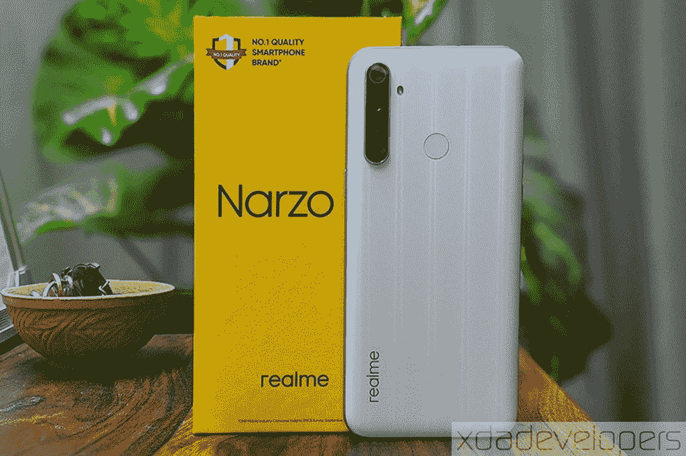

# Realme Narzo 10 (Realme 6i)回顾:最佳预算游戏手机？

> 原文：<https://www.xda-developers.com/realme-narzo-10-realme-6i-review-pros-cons-mediatek-helio-g80/>

Realme 作为一个独立品牌进入市场仅两年多一点，但它的增长速度超过了我们所知的任何其他受欢迎的智能手机品牌。 [Realme 最初是一个以预算为导向的品牌](https://www.xda-developers.com/oppo-realme-1-official-india-mediatek-helio-p60/)，并在第一年坚持了这一理念。尽管随着几款[专业级](https://www.xda-developers.com/realme-x50-pro-5g-review/) [旗舰杀手](https://www.xda-developers.com/realme-x2-pro-xda-review/)和[强大的中档](https://www.xda-developers.com/realme-x2-review-snapdragon-730g-gaming/)智能手机的推出，Realme 已经冒险走出了这个领域，但它并没有放弃预算市场。 [Realme 本月早些时候在印度发布了 Narzo 系列产品](https://www.xda-developers.com/realme-narzo-10-10a-mediatek-helio-g80-g70/),目标是年轻用户，他们需要手机的性能、相机质量和美学的良好组合，但也要在严格的预算内运营。Realme Narzo 系列的前两款智能手机是 Realme Narzo 10 和 Realme Narzo 10A，这两款手机都采用了[联发科的 G 系列](https://www.xda-developers.com/mediatek-helio-g90-series-hyperengine-game-technology-launched/)芯片组。

 [在 Flipkart (₹11,999)上购买 Realme Narzo 10](https://www.flipkart.com/realme-narzo-10-that-green-128-gb/p/itmfaa990ac54b7a)

以下是 Realme Narzo 10 的规格概要。有趣的是，Realme Narzo 10 是 Realme 6i 的更名版本，Realme 6i 于今年早些时候首先在缅甸推出，然后在欧洲推出。

## Realme Narzo 10 (Realme 6i)规格

### Realme Narzo 10 (Realme 6i)规格

| 

**规格**

 | 

Realme Narzo 10/Realme 6i

 |
| --- | --- |
|  |  |
| **显示** | 

*   6.5 英寸液晶显示器
*   1600 x 720 像素
*   20:9 宽高比

 |
| **SoC** | 

*   联发科 Helio G80
    *   2 个 Arm Cortex-A75 @ 2.0GHz
    *   6 个 Arm Cortex-A55 @ 1.8GHz
*   马里 G52 MC2 GPU @ 950MHz

 |
| **闸板** | 4GB |
| **存储** | 128GB 专用 microSD 插槽 |
| **电池** | 通过 USB Type-C 充电，5000 毫安时，18W |
| **指纹传感器** | 后置的 |
| **后置摄像头** |  |
| **前置摄像头** |  |
| **安卓版本** | 基于 Android 10 的 Realme UI |
| **颜色** | 牛奶，绿茶 |

虽然 Realme 最初计划于 3 月份在印度推出 Narzo 系列，但由于新冠肺炎的原因，该公司被迫推迟了发布时间。在封锁解除后不久，Realme 迅速采取行动，宣布了这两款智能手机。我已经在“白牛奶”中使用 Realme Narzo 10 大约 10 天了，下面是我认为这款智能手机的优点和缺点。

* * *

## 好人

### 性能和游戏

智能手机游戏正以惊人的速度增长，在大多数情况下，硬件限制不会阻止爱好者参与并推动这一趋势。芯片制造商联发科涉足这一潮流，去年推出了以游戏为中心的 G 系列，推出了 Helio G90 和 G90T 移动芯片组。在这些芯片组的基础上，联发科技宣布了 Helio G70 和 G80 芯片组，作为 G 系列的一部分，用于相对更实惠的智能手机。Realme 是最早采用这些芯片组的原始设备制造商之一， [Realme C3(我们的游戏评论)](https://www.xda-developers.com/realme-c3-performance-gaming-review-mediatek-helio-g70/)和 [Helio G70](https://www.xda-developers.com/mediatek-helio-g70-helio-g70t/) 已经在大约三个月前推出。Helio G80 相对较新，Realme 6i 是全球发布的第一款采用该芯片组的设备。

除了在印度将 Realme 6i 重新包装为 Realme Narzo 10 之外，Realme 还因印度首款采用[联发科 Helio G80](https://www.xda-developers.com/mediatek-helio-g80/) 芯片组的手机而赢得了吹嘘的资本。正如我上面提到的，该芯片组旨在为价格在 200 美元左右的经济型设备提供良好的游戏体验；在印度，Realme Narzo 10 的价格约为₹11,999/$160(尽管欧洲的价格在₹16,562/€199.90/~$220 更高)。联发科 Helio G80 是一款 12 纳米芯片组，大尺寸八核 CPU。小配置和一个 Mali-G52 MC2 GPU。该 CPU 具有两个基于 ARM Cortex A75 的 2.0GHz 性能内核和六个基于 Cortex A55 的 1.8GHz 效率内核。

在我们的标准合成基准测试中，我们与其他设备(如 [Redmi Note 7 Pro](https://www.xda-developers.com/xiaomi-redmi-note-7-pro-review/) 和 [Realme 5 Pro](https://www.xda-developers.com/realme-5-pro-review/) )进行了比较，结果喜忧参半。我们还让基于 Helio G70 的 Realme C3 继续参赛，看看这两款芯片组在性能方面有何不同。

#### 极客工作台 5

从 GeekBench 5 开始，联发科在 Realme Narzo 10 上的 Helio G80 芯片组优于在 Realme C3 上的 Helio G70，但落后于分别在高通骁龙 675 和骁龙 712 移动平台上运行的 Redmi Note 7 Pro 和 Realme 5 Pro。联发科的 G 系列芯片采用 12 纳米铸造工艺制造，而骁龙 675 和 712 分别采用 11 纳米和 10 纳米工艺制造，尽管 CPU 设计类似于 Helio G80，但仍能确保更好的性能。

#### CPU 节流测试

智能手机 CPU，特别是在低端和预算部分，不适合密集型任务，因为它们会因内部发热而迅速降低性能。Helio G80 芯片组也是如此，所以为了检查 CPU 的节流程度，我使用了 CPU 节流测试应用程序。Realme UI 允许您在“高性能”模式和“智能性能”模式之间进行选择，前者可在不考虑电池消耗的情况下提供高性能，后者是默认选项，可能会限制性能以获得最佳电池寿命。以下测试在两种模式下运行了 15 分钟，以比较两种情况下的性能和 CPU 调节。

正如你所看到的，在这两种情况下，Realme Narzo 10 的峰值 CPU 性能都降低到了 90%左右。有趣的是，高性能模式不仅具有更高的节流阈值，而且还将性能输出提高了约 14%(基于平均浮点)。

#### PCMark Work 2.0

在 PCMark 的 Work 2.0 测试中，Realme Narzo 10 在每项测试中都以令人印象深刻的成绩超越了竞争对手。这可能表明智能手机倾向于在日常任务中为你提供更好的服务，如照片或视频编辑、网页浏览、笔记等。

#### 3DMark 吊索镜头极限

继续进行图形密集型 3DMark Sling Shot Extreme 基准测试，在 OpenGL ES 3.1 和 Vulkan API 版本的测试中，Realme Narzo 10 的性能优于 Realme C3 和 Redmi Note 7 Pro。然而，Realme Narzo 10 在这两种情况下都远远落后于 Realme 5 Pro。

#### AndroBench 存储基准

就 Realme Narzo 10 上的 eMMC 存储的传输速度而言，其结果可与其他具有 eMMC 存储的设备相媲美。采用 UFS 2.1 存储的 Realme 5 Pro 在顺序读取速度方面具有明显的优势。有趣的是，Realme Narzo 10 的顺序和随机写入速度都比其他所有设备更快。

### Realme Narzo 10 (Realme 6i)游戏体验

虽然基准测试很好地描绘了 Realme Narzo 10 的理论性能，但合成测试无法完全模拟现实生活中的性能。为了测试后者，我在电话上广泛地玩了 PUBG Mobile，并对它的良好表现感到惊讶。首先，我很惊讶地看到手机支持超帧率设置(40fps)，瞬间设定了很高的期望值。

为了测试它能在多大程度上满足这些期望，我在主要的两种图形设置下玩了*PUBG Mobile*—*平衡*图形和*超*帧速率的*平滑*图形——并用[游戏工作台](http://gamebench.net)测试了性能。为了比较这两种情况下的性能，我在*米拉马尔*地图上的同一个地点下车，并向内移动到游戏区。在这两种情况下，Realme Narzo 10 以超过 35fps 的中值帧速率渲染游戏。在这两种情况下，当你挑选库存物品、受到枪击伤害或风景突然改变时，帧率都会有波动。在大约 10 分钟的游戏后，手机确实明显变热，帧速率往往波动更大。虽然这可能会引起职业游戏玩家的关注，但考虑到智能手机的价格，这种性能确实很好。

*Realme Narzo 10 在 PUBG Mobile 中的游戏性能，使用 Gamebench 在平滑图形(左)和平衡图形(右)下进行测量*

平衡图形会话的帧速率可变性指数略高，表明与平滑图形相比，平衡图形的丢帧数(平均)更高。

*感谢 GameBench 为我们提供了记者执照。GameBench 是一套开发工具，用于分析游戏的流畅性、功耗和内存使用情况。GameBench 可以作为谷歌 Play 商店(未上市)的应用程序和桌面应用程序使用。欲了解更多信息，请访问[GameBench.net](https://www.gamebench.net/)。*

* * *

### 预算有限的 4800 万像素摄像头

Realme Narzo 10 配备了 48MP 四摄像头设置，这与我们在 Realme 5s 上看到的相同。有一个 4800 万像素的主摄像头和 4 合 1 像素宁滨，所以默认情况下你可以获得 1200 万像素的图像，尽管也有一个 4800 万像素摄影的专用模式。除了主传感器，还有一个 800 万像素的广角摄像头，一个 200 万像素的定焦宏观摄像头和一个 200 万像素的深度传感器。

就像我们之前评论的所有 Realme 设备一样，Realme Narzo 10/Realme 6i 拍摄的图像具有强烈的色彩和可观的细节。虽然我无法走出去测试 Realme Narzo 10 的相机，但来自爱尔兰的 XDA 资深作家兼视频制作人亚当·康威分享了他用 Realme 6i 设备拍摄的一些相机样本，对于这个价格的手机来说，结果相当令人满意。

我对这些图像的唯一问题是，在某些情况下，饱和度使它们看起来不真实。有绿色植物的图片有一种温暖的暗示，我希望 Realme 能把它调低一点。对于大多数将照片发布到 Instagram 或其他社交媒体平台的用户来说，这种颜色超载应该没有问题。

看看 Adam 用 Realme 6i 拍摄的一些相机样本。

#### 标准 12MP 模式

#### 12MP 对 48MP

#### 标准与超广角

* * *

#### 大电池和 USB-C

Realme Narzo 10 配备了一个 5000 毫安时的大电池，可以轻松承受一整天的苛刻使用。HD+分辨率还可以节省一些电池电量，这意味着您可以全天不间断地观看。该手机的大电池和高清显示屏也提供了长时间的游戏会话。在上面基于 Gamebench 的游戏性能测试中，这款手机的电池获得了五星评级。根据测试，在最高支持的图形设置和接近 100%的亮度下，这款手机可以持续约 12 小时。

除了大电池，Realme Narzo 10 还配有一个 18W 的快速充电器，使用手机的 USB Type-C 端口在大约 2.5 小时内充满电池。

* * *

既然我们已经讨论了使 Realme Narzo 10 成为其价格的最佳选择的功能，这里有几个问题可能会导致智能手机的不愉快体验。

## 坏事

### 回收设计

虽然 Realme 往往在背板的完成方面具有创新性，但整体设计布局却被过度利用了——甚至没有考虑到 Realme Narzo 10 和 Realme 6i 是不同的设备。自 2019 年 8 月推出 [Realme 5](https://www.xda-developers.com/realme-5-pro-quad-cameras-snapdragon-712-india-europe/) 以来，Realme 一直使用这种设计。该设计与 [Realme 5i](https://www.xda-developers.com/realme-5-5i-snapdragon-665/) 和 [Realme 5s](https://www.xda-developers.com/realme-5s-48mp-quad-camera-india-launch/) 进行了重新组合，对 Realme 5 的规格进行了小幅改动。

虽然我喜欢 Realme Narzo 10 的新缎面 y 白色饰面——很明显是在与 [Realme X Master Edition](https://www.xda-developers.com/realme-x-pop-up-camera-in-display-fingerprint-vooc-snapdragon-710/) 相同的生产线上创建的——但与 Realme 5、5i 和 5s 相比，唯一的其他外部变化是新的 USB Type-C 端口。在内部，我们看到的唯一显著变化是新的芯片组，而 Realme Narzo 10 则延续了旧设备的光环。

* * *

### 无 60fps 视频录制

Realme Narzo 10 的 4800 万像素摄像头在价格上是一个令人兴奋的功能，但在视频录制方面，这款手机缺乏主要功能，这是由于芯片组的限制。联发科 Helio G80 最大支持 30fps 的 1080p 视频录制，尽管相机应用程序中有一个选择 60fps 模式的选项。只是澄清一下，Realme 并不支持 60fps 的视频录制，但对我来说，这感觉像是错过了添加有用视频功能的机会，特别是在世界正朝着制作更多视频而不是任何其他形式的内容的方向发展的时候。

* * *

### 没有 5GHz 无线网络

我对 Realme Narzo 10 的最后一个抱怨是相当琐碎的，可能不会影响这个价位的每个买家，那就是它在 Wi-Fi 方面的局限性。该智能手机仅限于 2.4GHz Wi-Fi 频段，不支持 5GHz 频段。根据 Realme 的说法，购买这款或该价格范围内任何其他智能手机的用户都不太可能使用 5GHz Wi-Fi，尤其是在印度。

虽然我同意这种可能性，但 Realme 的理由忽略了一个事实，即许多机构、工作场所或共同工作空间都使用双频 Wi-Fi 路由器。他们还忽略了一个事实，即支持 Realme 5/5i/5s 的高通骁龙 665 移动平台实际上支持两种 Wi-Fi 频段，这使得 Realme Narzo 10 上缺乏支持看起来像是降级。考虑到高通正在推动包括 Wi-Fi 6 在内的最新网络协议，即使是在他们最新的芯片组中最实惠的芯片组上，联发科迫切需要收拾一些烂摊子，像 Realme 这样的制造商——但更重要的是消费者——必须为此付出代价。

* * *

## Realme Narzo 10:不是一个显而易见的

Realme Narzo 10 的价格绝对是一款引人注目的智能手机，特别是如果你正在寻求可靠的性能和游戏技巧。但是正如我上面列出的，这个设备有着同样多的优点和缺点，可以根据你的喜好决定是成功还是失败。在决定是否购买 Realme Narzo 10 之前，你应该考虑几点。

如果你想要一部以游戏和性能为导向的智能手机，那么 Realme Narzo 10 是一个不错的选择，但这种体验可能会因平庸的显示屏而却步。如果你想要更好的显示质量，但也可以接受更小的显示质量，红米 Note 7 Pro 或红米 Note 8 是你可以考虑的选择。然而，除了较小的显示屏，你还会满足于两个设备上较小的 64GB 内部存储，因为两者的 128GB 版本都更贵。Realme Narzo 10 还配备了一个更大的 5,000mAh 电池和一个 18W 充电器。但话说回来，你会失去 4K 或 60fps 录制和双频 Wi-Fi。

总之，如果高清+显示屏不太困扰你，并且你严格受限于大约₹12,000(欧洲€199.90 英镑)的预算，那么 Realme Narzo 10(欧洲 Realme 6i)确实是一个有利可图的选择。但是，如果你能扩大预算，你可能会有更有吸引力的选择。

在印度，你可以通过 Flipkart 购买绿色或黑色的 Realme Narzo 10 (4GB 内存，128GB 存储空间)。在欧洲，你可以通过 Realme.com 购买绿茶或白牛奶色的等效 Realme 6i(也是 4GB 内存和 128GB 存储空间)。Realme 在欧洲将 Realme 6i 运送到比利时、法国、德国、卢森堡、荷兰和葡萄牙，但请检查您所在地区的 Realme 商店，看看该设备是否也适用于您。

**[在 Flipkart 上购买 Realme Narzo 10 在印度(₹11,999)](https://www.flipkart.com/realme-narzo-10-that-green-128-gb/p/itmfaa990ac54b7a)** ||| **[在 Realme.com 上购买 Realme 6i 在欧洲(€199.90)](https://buy.realme.com/eu/goods/139)**