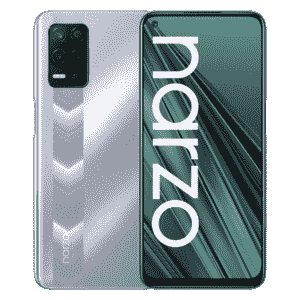
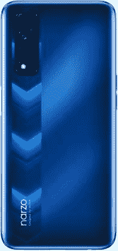

# Realme 推出 Realme Narzo 30 5G、Realme 智能电视和 Buds Q2

> 原文：<https://www.xda-developers.com/realme-narzo-30-5g-realme-smart-tv-buds-q2-india-launch/>

在今天的一次虚拟活动中，Realme 在印度宣布了两款新的智能手机:Realme Narzo 30 和 Narzo 30 5G。新手机将加入今年 2 月推出的 Narzo 30 Pro 和 Narzo 30A T1。

## Realme Narzo 30 和 Narzo 30 5G:规格

| 

规格

 | 

Realme Narzo 30 / 30 5G

 |
| --- | --- |
| **尺寸和重量** | 

*   **纳尔佐 30 5G** :
    *   162.3 x 75.4 x 9.4 毫米
    *   192 克
*   Narzo 30 :
    *   162.5 x 74.8 x 8.5 毫米
    *   185 克

 |
| **显示** | 

*   6.5 英寸 IPS 液晶屏
*   全高清+ (1080 x 2400)
*   90Hz 显示刷新率
*   穿孔显示器

 |
| **SoC** | 

*   **纳尔佐 30:**
    *   联发科 Helio G95
        *   2x ARM Cortex-A78 @ 2.05GHz
        *   6 个 ARM Cortex-A55 @ 2.0GHz
        *   马里-76 国集团 MC4
*   **纳尔佐 30 5G:**
    *   联发科天玑 700
        *   2x ARM Cortex-A76 @ 2.2GHz
        *   6 个 ARM Cortex-A55 @ 2.0GHz
        *   马里-G57 MC2

 |
| **RAM 和存储器** | 

*   纳尔佐 30 :
*   纳尔佐 30 5G
*   MicroSD 卡支持

 |
| **电池&充电** | 

*   5000 毫安时电池
*   **Narzo 30** : 30W 快速充电器
*   **Narzo 30 5G** : 18W 快速充电器

 |
| **后置摄像头** | 

*   主要:4800 万像素四像素 f/1.8
*   辅助:2MP 宏
*   第三级:2MP 散景

 |
| **前置摄像头** |  |
| **端口** | 

*   USB 类端口
*   3.5 毫米耳机插孔

 |
| **连通性** | 

*   4G LTE
*   蓝牙 5.x
*   C 型端口
*   WiFi 802.11 . b/g/n/AC(2.4 GHz+5 GHz)

 |
| **安全** | 侧装式指纹读取器 |
| **软件** | 

*   搭载 Realme UI 2.0 的 Android 11

 |

Realme Narzo 30 是 Narzo 30 Pro 的低调版本，采用 6.5 英寸 90Hz 液晶面板，联发科 Helio G95 SoC，6GB RAM，48MP 主摄像头，5,000mAh 电池，支持 30W 快速充电。

 <picture></picture> 

Narzo 30 5G

另一方面，Realme Narzo 30 5G 是一种价格实惠的 5G 产品。它在大多数方面与香草 Narzo 30 相同，但有一个联发科天玑 700 SoC 和一个较慢的 18W 快速充电器。

 <picture></picture> 

Narzo 30

除了智能手机，该公司还推出了 Realme 智能电视和 Realme Buds Q2。Realme 智能电视全高清尺寸为 32 英寸，采用近乎无边框的设计。它有 24W 四声道立体声扬声器，运行 Android 9，支持谷歌助手。

与此同时，Realme Buds Q2 是一款价格实惠的真正无线耳塞。它具有 10 毫米动态驱动器，并提供触摸感应控制。它们配备了主动噪音消除功能，并提供低延迟游戏模式，带来无延迟的游戏体验。在其他地方，Realme Buds Q2 提供蓝牙 5.2，USB Type C 充电，谷歌快速配对，SBC/AAC 蓝牙编解码器，以及长达 28 小时的总电池寿命。

### 定价和可用性

Realme Narzo 30 的基本 4GB/64GB 型号在₹12,499 的价格是 100 万美元，而 4GB/128GB 型号会让你在₹14,999.花费不少它将于 6 月 29 日在 realme.com Flipkart 和部分线下零售商开始销售。同时，Realme Narzo 30 5G 将在₹15,999.零售它将从 6 月 30 日开始销售。

至于 Realme 全高清智能电视，其定价为₹18,999，将于 6 月 29 日开始销售。最后，Realme Buds Q2 将于 6 月 30 日在₹2,499.上市