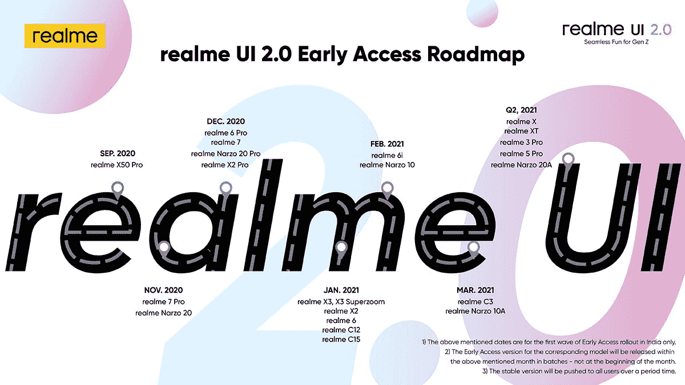

# 基于 Android 11 的 Realme UI 2.0 测试版将于何时推出

> 原文：<https://www.xda-developers.com/realme-ui-2-0-beta-early-access-android-11/>

# 基于 Android 11 的 Realme UI 2.0 测试版将于何时推出

基于 Android 11 的 Realme UI 2.0 测试版即将在多款 Realme 智能手机上推出。这是早期访问更新将推出的时间！

Realme UI 2.0 [最近宣布](https://www.xda-developers.com/realme-ui-2-0-android-11-features-announced/)为 Realme 定制 Android 软件的最新版本。Realme UI 的新版本基于 [ColorOS 11](https://www.xda-developers.com/coloros-11-android-11-oppo-review/) ，这是 OPPO 定制 Android 软件的最新版本，建立在 [Android 11](https://xda-developers.com/tag/android-11) 之上。ColorOS 11 在 Android 11 的基础上增加了几个新功能，例如许多主题化选项和用于翻译的谷歌镜头集成，Realme UI 2.0 也提供了所有这些功能。但是作为一个 Realme 用户，你可能想知道你什么时候能得到更新。令人欣慰的是，Realme 现在已经为该公司产品线中的许多设备发布了“早期接入”计划的路线图。

第一个获得 Realme UI 2.0 早期版本的设备将是 Realme X50 Pro，它实际上计划在本月晚些时候接受测试。然后，我们有 Realme 7 Pro 和新的 [Realme Narzo 20](https://www.xda-developers.com/realme-narzo-20-narzo-20-pro-narzo-20a-launched-india/) ，它们将在 11 月进行更新。Realme 6 Pro、 [7](https://forum.xda-developers.com/realme-7) 、Narzo 20 Pro 和 X2 Pro 都将在 12 月左右更新。在 Q1 和 Q2 2020 年，Realme 当前产品线中的其余设备，包括 Realme X3 SuperZoom、Realme Narzo 10 和 Realme X 等手机，将获得测试版。

完整的早期访问路线图如下:

请记住，上表只是 Realme UI 2.0 *beta* 更新发布的时间表。基于 Android 11 的 Realme UI 2.0 稳定版将在 beta 测试结束后推出。我们可能会预计列表中的一些最老的设备将在 2021 年第三季度左右获得稳定的更新，而 Realme X50 Pro 将在 11 月下旬获得稳定的 Android 11 更新。

 <picture></picture> 

Source: [Realme](https://twitter.com/realmemobiles/status/1309122916185825280)

你对 Realme UI 2.0 感到兴奋吗？