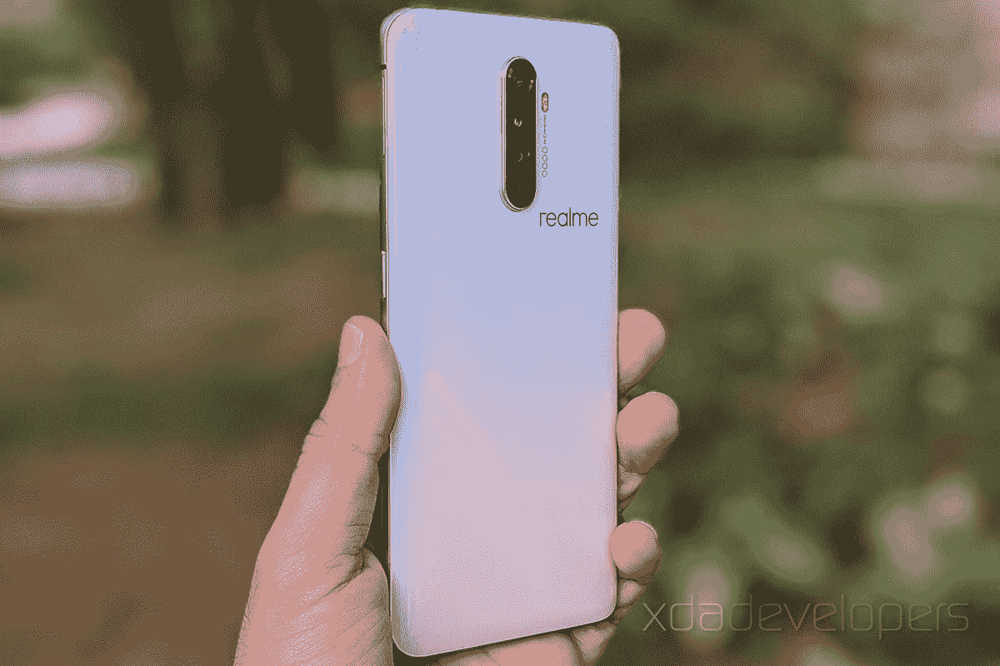

# Realme X2 亲 XDA 评论:致命规格在一个疯狂的价格

> 原文：<https://www.xda-developers.com/realme-x2-pro-xda-review/>

如果不提到智能手机品牌 Realme 的惊人增长，任何关于该品牌的讨论都是不完整的。自去年推出以来，Realme 一飞冲天，从一个迎合 150 美元以下细分市场的失败者发展成为其他品牌的主要威胁。该公司最近宣布了一款令人着迷的新智能手机—[Realme X2 Pro](https://www.xda-developers.com/realme-x2-pro-snapdragon-855-plus-50w-fast-charging-64mp-camera-india-launch/)，这是他们第一款真正的旗舰手机。在定位于较低价格领域后，Realme 希望通过承诺以极具竞争力的价格提供无与伦比的性能，巩固其在平价旗舰产品类别中的地位。

毫无疑问，Realme X2 Pro 是目前价格最好的旗舰产品。此前，这个位置可以说是由[红米 K20 Pro(米 9T Pro)](https://www.xda-developers.com/xiaomi-mi-9t-pro-announced-international-redmi-k20-pro/) 占据，我们甚至在我们的评论中称赞它为[“重新想象”的旗舰杀手](https://www.xda-developers.com/redmi-k20-pro-xiaomi-mi-9t-pro-review-flagship/)。但 Realme X2 专业版凭借升级的芯片组、更快的存储、更好的显示、全方位的高级相机设置和惊人的 50W 充电夺走了它——所有这些都以惊人的价格实现。虽然最后一款是手机中最棒的部分，但 Realme X2 Pro 仍然是价格低于 500 美元、配置最完善的手机之一。

在中国，Realme X2 Pro 的 6GB/64GB 版本起价相当于 380 美元，而顶级型号的售价约为 470 美元。在欧洲，最低和最高版本的价格分别为€399 美元(约 440 美元)和€499 美元(约 550 美元)。这款智能手机最近在印度上市，这里的价格几乎与中国同步。在印度，Realme 只销售 8GB 和 12GB 的 RAM 版本，价格在₹29,999(约 415 美元)和₹33,999(约 475 美元)，不仅是 Redmi K20 Pro 的强劲竞争对手，也是 OnePlus 7T 的强劲竞争对手。

**[Realme X2 Pro XDA 论坛](https://forum.xda-developers.com/realme-x2-pro)购买地点:[亚马逊西班牙(€399 起)](https://www.amazon.es/Realme-Pro-Smartphone-SuperAMOLED-procesador/dp/B07Z5F4X92/)|[realme eu(€399 起)](https://buy.realme.com/eu/goods/121)|[flipkart(₹27,999 起)](https://www.flipkart.com/realme-x2-pro-lunar-white-64-gb/p/itma3203d88190a3)**

**注意:在印度上市前一周，我们收到了 Realme India 的 8GB/128GB 版本的 Realme X2 Pro。以下是在近两周的使用中形成的对手机的观察。**

## Realme X2 专业版规格

| 

**规格**

 | 

**Realme X2 专业版**

 |
| --- | --- |
| **尺寸&重量** |  |
| **显示** |  |
| **SoC** | 高通骁龙 855 Plus

*   1 个 2.96GHz Kryo 485 金
*   3x 2.42GHz Kryo 485 金
*   4x 1.8GHz Kryo 485 银

超频 Adreno 640 GPU |
| **闸板** | 6GB/8GB/12GB |
| **储存** | 64GB/128 GB/256 GB UFS 3.0 无 microSD 插槽 |
| **电池** | 4000mAh，50W SuperVOOC 快速充电 |
| **指纹传感器** | 显示指纹 |
| **后置摄像头** | **照片:**

*   64MP 三星 ISOCELL Bright GW1，f/1.8
*   8MP 115 广角传感器，f/2.2
*   1300 万像素长焦，2 倍光学变焦，f/2.5
*   2MP 深度传感器，f/2.4
*   电化学阻抗谱（Electrochemical Impedance Spectroscopy 的缩写）

**视频:**

*   每秒 60 帧的 4K 视频录制
*   高达 960fps 的慢动作视频
*   实时模糊人像视频

 |
| **前置摄像头** |  |
| **安卓版本** | 基于 Android 9 Pie 的 ColorOS 6.1 |
| **颜色** | 标准:月球白和海王星蓝 Master 版:红砖和混凝土 |

* * *

## 设计和制造质量——安全可靠

Realme 超越了经典的多色渐变，通过每款新智能手机的新 3D 图案不断创新。对于 Realme X2 Pro，该公司选择了比 [Realme 3 Pro](https://www.xda-developers.com/realme-3-pro-first-impressions-hands-on-review/) 和 [Realme XT](https://www.xda-developers.com/realme-xt-video-review/) 更抽象的模式。虽然 Realme X2 Pro 的设计看起来很吸引人，但与之前的设备相比，它并没有那么令人着迷。

Realme 2 Pro 有两种颜色——*月球白*和*海王星蓝*——这两种颜色都以自己独特的方式反射入射光。白色的变化跨越了不同的色调，从乳白色到象牙色，中间还夹杂着淡粉色和冰蓝色。另一方面，蓝色在深浅不同的蓝色之间摇摆。像灯或太阳这样的强光源在背板的宽度上压印出多个弧形图案的折痕。当光源处于极端角度时，背面以模糊、糊状的方式反射，辐射出光滑表面的印象。

长期以来，Realme 通过使用看起来摸起来像玻璃的塑料外壳欺骗了我们对他们所用材料的看法(*至少直到塑料开始磨损*)。但随着 Realme XT 的推出，他们开始追逐玻璃背智能手机的潮流。通过他们的旗舰设备，该公司进一步改善了构建，包括一个“双层”铝合金框架，这比塑料和单层阳极氧化铝都更具抵抗力。Realme 甚至宣称，这一设计决定使金属框架的制造成本翻倍。除此之外，机箱上或机箱内部很少使用塑料。铝合金的一个缺点是，当你玩游戏时，它容易变热，如果你浸泡太久，智能手机的上半部分——特别是框架——可能会变得相当热。随着时间的推移，热量传递到框架下部的速度比传递到玻璃表面的速度快得多，导致明显不均匀的热量分布。

Realme X2 Pro 的手感非常引人注目，尤其是对于那些将重量等同于质量的用户来说。从你第一次将智能手机握在手中开始，Realme X2 Pro 就感觉坚实厚实，但与一加 7T 相比明显更厚。它的背面有一个 3D 曲面玻璃，这使得手机的边缘更薄，更容易握持。然而，弯曲的玻璃无法掩盖它在手中的厚重和宽阔感。这款智能手机重 199 克，比主要竞争对手 Redmi K20 Pro(或小米 Mi 9T Pro)重 8 克，后者由于显示屏较小，占地面积也略小。大尺寸肯定会迫使你用双手操作手机，即使你不打字的时候也是如此。在我使用智能手机的两周时间里，由于手机的重量和玻璃背面，我无法避免单手使用手机时的焦虑感。因此，我大多用双手使用这款手机，甚至在打字时也是如此，但手更大的用户可能不会有同样的困境。

Realme X2 Pro 在风景模式下更方便握持，特别适合那些计划利用智能手机的完整游戏或相机功能的人。回到 Realme X2 Pro 的铝制框架，这个表面沿着长边稍微弯曲，沿着短边变平，与以前的 Realme 手机一致。这种设计选择背后的意图是防止底部的扬声器在智能手机处于横向模式时被手指挡住。保护所有基地，Realme 尚未移除耳机插孔，因为它仍然是任何从中端智能手机迁移的人的宝贵前景。当你使用耳机插孔时，你将不得不旋转手机——即凹口侧在你的右手，而耳机插孔侧在你的左手。在耳机插孔和主扬声器之间，有一个 UBS-C 端口，用于 50W SuperVOOC 充电，通过 USB-C 耳机和 MTP 输出音频。

其余的按钮和控制出现在 Realme X2 专业版的其他边缘。除了 USB-C 端口、耳机插孔和主扬声器格栅，Realme X2 Pro 的主麦克风也位于手机底部。金色油漆点缀的电源按钮和双 SIM 卡托盘位于右侧，而音量增大和减小的独立按钮位于框架的左侧。框架的顶部几乎是空白的，除了一个用于辅助降噪麦克风的微小空腔。值得注意的是，这些按钮的边缘有尖锐的脊，这打破了智能手机主要弯曲设计的连续性。同样的，铝框的上边缘也是削尖成角度的。虽然这些倾斜的表面不会擦伤你的手指，但在一个圆形的手机上，它们肯定会感觉奇怪。你可以通过使用包装盒中的 TPU 盒或者根据自己的喜好再买一个来避免与它们打交道。

尽管它们的形状很前卫，但按钮的触感非常好。我希望按钮更宽一些，至少沿着侧面金属轨道的中心放置，但这似乎没有逃过 Realme 的设计工程师的考虑。他们忽略的另一件事是手机在稍微不平坦的表面上是多么难以置信的光滑。这一点至关重要，因为手机大部分是玻璃的，摔一跤可能会导致心碎。同样，包含的案例可以解决这个棘手的问题。

Realme X2 Pro 上有很多有趣的相机技术，而丰满的相机模块并没有很好地隐藏这些技术。突出的摄像头凸起使得智能手机很难直着放在平坦的表面上。与此同时，四摄像头模块周围有一个金属环，比摄像头玻璃表面略高，可能是为了防止划伤。虽然背面有大猩猩玻璃 5 保护玻璃，但相机玻璃上没有保护层(*至少 Realme* 没有明确提到)。因此，使用保护套来保护相机玻璃不被意外划伤或打碎是非常重要的。摄像头也沿着背板的中心放置，虽然这不会使手机不那么摇晃，但如果你关心的话，它会使手机沿着中心摆动。

虽然 Realme X2 Pro 由于机身中塞满了相机而显得非常笨重和厚，但它感觉起来很坚硬和耐用。这款手机没有任何官方的防尘防水 IP 认证。虽然我不确定内部结构，但 SIM 卡托盘有一个橡胶垫圈，以防止任何灰尘或水分到达主板。我们可以放他们一马，考虑到即使是旗舰杀手派系的中坚分子——比如一加——也在避免为 ip 评级付费。在类似 *JerryRigEverything* 的拆机视频之后，我们可能会在这方面了解更多。

除了重量，我对设计没有任何抱怨，特别是因为 Realme 试图为几乎所有东西分配空间。金属框架和悬垂相机模块的倾斜边缘是整体无缝设计中的一些结，遗憾的是，只有使用盖子或皮肤才能修复。总的来说，Realme X2 Pro 拥有一部定价在₹30,000(约 420 美元)的手机应该拥有的所有基本设计元素，这些元素结合在一起，形成了一部好看——不会称之为最好——而且耐用的旗舰杀手智能手机。

### Realme X2 专业版

在推出 [Realme X](https://www.xda-developers.com/realme-x-review-premium-affordable/) 的同时，该公司与日本工业设计专家深泽直人合作，设计了这款智能手机的两种特殊和限量版。Fukasawa 从我们在现实生活中看到但忽略的物体中借鉴了灵感，这就是 Realme X Master Edition 的洋葱和大蒜变体的构思。Realme 再次与大师合作，这一次，深泽从我们周围的无生命元素中寻找灵感。Realme X2 专业大师版的灵感来自建筑材料，如红砖和混凝土。(*怪异的弯曲，但还好*)Realme X2 Pro 的混凝土和红砖版本在多层玻璃上呈现出颗粒状的哑光表面。

在 X2 Pro 发布会上，Realme 分享了四个不同层如何堆叠在后面板顶部的细节。后玻璃面板上方是 Gorilla Glass 5 保护玻璃，一层粘合剂，一层颜色(根据变体)，最后是一层“透明颗粒”的涂漆玻璃。总的来说，这些玻璃和粘合剂层给 Realme X2 专业版带来了一种砂岩般的表面，而粒状饰面给你的印象是，你实际上是在用手指擦混凝土或砖块。值得注意的是，表面刻有 Realme 标志和深泽直人的签名，给它一种异国情调。

Realme X2 专业大师版变体将仅提供 12GB/256GB 配置，并将在圣诞节前后上市。它在印度的₹1,000 价格将高于通常的 12GB/256GB 版本，我相信对于该公司为创建特别版付出的额外时间和努力来说，这是一个公平的价格。只有时间才能证明用户对主版本的欣赏程度，但 Realme 在制作一些独特的东西方面值得满分。我只花了有限的时间摆弄主版本单元，所以我无法确定额外的层是否会影响散热或性能。敬请关注我们未来的更新，以了解更多关于这些特殊的变种。

* * *

## 显示

Realme X2 Pro 采用了三星制造的 Super AMOLED 显示屏，分辨率为 2400 x 1080 像素，该面板的像素密度为 402ppi。该显示器经认证可播放 HDR10+，这意味着当您观看 20 世纪福克斯、华纳兄弟、维亚康姆等制作公司的视频内容以及亚马逊 Prime Video 上的一些 OTT 内容时，您将在显示器上看到宽动态范围和适当的照明。除此之外，该面板还声称支持 DCI-P3 中 100%的颜色。

显示屏相当亮，虽然我们没有设备来验证 Realme 声称的 1000 尼特最大亮度，但我的主观经验告诉我，它在大多数情况下都很亮，从白天到睡前使用。作为 AMOLED 显示器，再现的颜色已经非常鲜艳，但与 LCD 或谷歌 Pixel 3 等校准更好的显示器相比，白色往往更温暖，更黄。您可以在标准和鲜艳颜色模式之间进行选择，或者使用显示设置中的搓擦器来调整色温。

除了色彩增强功能，这款显示屏还具有 OSIE 视觉效果，可以提高亚马逊 Prime Video 和抖音等以视频为中心的应用程序的色彩饱和度。与该功能的演示动画不同，饱和度只有微小的提高。虽然 OSIE 代表“物体和语义图像以及眼球追踪”，这应该表明它会防止你看着它时显示屏熄灭，但眼球追踪至少在亚马逊 Prime 视频应用中不起作用(我没有尝试其他应用)。

此外，显示屏支持 [DC 调光](https://www.xda-developers.com/oneplus-dc-dimming-optional-feature-future-update/)，以防止您在低亮度下使用智能手机时眼睛疲劳。像 Redmi K20 Pro 一样，当 DC 调光功能关闭时，我们会看到一些亮度不均匀性——主要是在使用灰色背景的应用程序时亮度较低。当谈到视角时，从倾斜的角度看显示器确实感觉更酷，但这是 AMOLED 和 Super AMOLED 面板的常见问题。如果你很容易忽略这一点，那么即使在极端的角度，屏幕上的内容也很容易看到。

由于没有 LED 指示灯，Realme X2 Pro 的 AMOLED 面板可以用来显示时间和未接来电和信息的通知。与 MIUI 不同，它没有花哨的永远在线屏幕，也不支持来自第三方应用的通知。您可以在每次收到新通知时触发屏幕点亮。

### 90Hz——不仅仅是一个流行词

所有这些属性都令人兴奋，但真正成为技术社区和 Realme 粉丝流行语的是 90Hz 的刷新率。更高的刷新率出现在以游戏为中心的设备上，如 [Razer Phone](https://www.xda-developers.com/razer-phone-display-analysis/) 、 [Nubia Red Magic 3](https://www.xda-developers.com/nubia-red-magic-3-gaming-smartphone-90hz-display-snapdragon-855-india/) 等。，这一概念已经由一加 7 Pro 带到了大众面前，这是 2019 年上半年评分最高的智能手机[。从高涨的趋势中我们可以看到，已经没有回头路了。Realme X2 Pro 是该公司的第一款手机，也是印度 sub-₹30,000(约 420 美元)市场中第一款支持高于 60Hz 刷新率的手机。更简单地说，Realme X2 Pro 的 Super AMOLED 显示屏上的像素每秒钟可以关闭和打开 90 次，以刷新内容，这意味着与 60Hz 的显示屏相比，你将拥有更流畅的动画和滚动。不幸的是，这仅限于某些应用程序，在我告诉你为什么之前，这里有一个快速的背景。](https://www.xda-developers.com/oneplus-7-pro-review/)

显示器 90Hz 的刷新率不是由面板控制的，而是由 CPU-GPU、显示处理器和一种名为 DisplayFlinger 的 Android 服务共同控制的。实际应用不仅如此，还依赖于应用程序。从 60Hz——智能手机显示屏的标准刷新率——跳到 90Hz 需要应用程序以 90fps 的速度渲染帧，这快了 1.5 倍(或 50%)。如今，大多数应用程序都没有经过优化来满足这一要求，因此，应用程序的刷新率回落到 60fps。在 Realme X2 Pro 上，90Hz 的刷新率目前仅在 ColorOS UI 和谷歌 Chrome 等网络浏览器中受支持。从显示刷新率设置中，你可以选择可以使用更高刷新率的应用程序，但这些单独的切换是徒劳的，因为只有少数应用程序真正得到支持，遗憾的是，我尝试的游戏都不在列表中。虽然可以使用 [ADB shell 命令来解锁一加 7 Pro/7T/7T Pro](https://www.xda-developers.com/oneplus-7-pro-true-90hz-display-mode/) 上的 90Hz 刷新率模式，但类似的命令在 Realme X2 Pro 上不起作用，让您锁定默认选项。

在他的[对谷歌 Pixel 4 的新 90Hz 显示器](https://www.xda-developers.com/google-pixel-4-4-xl-display-analysis/)的分析中，Dylan 谈到了对可变刷新率的需求，即显示器能够根据输入内容的帧速率调整刷新率(想想 [Nvidia 用于桌面显示器的自适应 V-Sync](https://www.geforce.com/hardware/technology/adaptive-vsync) )。由于具有 90Hz 或更高刷新率的较新智能手机有机发光二极管/AMOLED 面板仅在离散模式下运行，并在 60Hz、90Hz 或更高设置(如 ROG Phone II 上的 [120Hz)之间交替，这些模式中的每一种都有不同的屏幕校准设置，并且刷新率的变化会变得明显，因为刷新率模式改变时会有不同的颜色和对比度。我确实注意到 60Hz 和 90Hz 之间的色彩配置文件有非常小的差异，主要是在低亮度级别，但它没有 Pixel 4 那么明显，对我来说相当小，可以完全忽略。令人高兴的是，Realme X2 Pro 的刷新率不会像 Pixel 4 最初那样在较低的亮度下从 90Hz 回落到 60Hz。](https://www.xda-developers.com/asus-rog-phone-ii-120hz-display-game-list/)

> 虽然 90Hz 的显示屏起初似乎并不罕见，但当你关闭它时，差异立即显而易见，这使人渴望恢复原状。

总的来说，Realme X2 Pro 的显示器感觉生动，对比度很高，非常适合内容消费。不用说，它变得非常明亮，即使在强烈的阳光下也易于阅读。除了喜气洋洋的颜色和出色的亮度，显示器非常清晰，90Hz 的显示确实使动画感觉更流畅。考虑到像 Realme X2 Pro 这样功能强大的手机将会很好地老化，我希望 Realme 能够在未来以更高的刷新率支持游戏，同时游戏开发商将支持 90Hz，120Hz，甚至更高的刷新率超越特定的以游戏为中心的设备。

* * *

## 表演——从失败者到潜在的金并

Realme 已经从一个廉价的智能手机品牌迅速发展起来，我们看到增长惊人的领域之一是智能手机的处理能力。Realme X2 Pro 是他们的第一款合法旗舰设备，在这种情况下，他们从骁龙 730G 直接跳到了骁龙 855 Plus，这是迄今为止最强大的智能手机处理器。这使得 Realme X2 专业版成为最适合骁龙 855 Plus 移动平台的智能手机。

直到去年，高通一直采取每年一个旗舰 SoC 的策略，但随着智能手机行业的快速创新，这家芯片制造商被迫推出他们旗舰芯片组的超频版本。骁龙 855 带来了比骁龙 855 小的性能升级，但这足以成为品牌在其设备上宣传最新技术的话题。骁龙 855 Plus 具有与骁龙 855 相同的 1+3+4 集群，包括一个超级充电的“主”内核、三个“性能”内核和四个“效率”内核。在八个内核中，“Prime”内核的峰值频率从 2.84GHz 增加到 2.96GHz，而其余时钟速度保持不变。因此，三个 Kryo 485 黄金内核的性能主频为 2.42GHz，四个 Kryo 485 白银内核的能效为 1.8GHz。此外，骁龙 855 Plus 上的 Adreno 640 GPU 也已超频，可提供 15%的更好的图形性能。除此之外，SoC 还采用了相同的 Spectra 380 ISP。

如果你认为骁龙 855 Plus 在这个价格点上有着非凡的价值，那么你会更加惊讶地知道，Realme X2 Pro 在内存方面也储备充足，顶配型号采用了 12GB LPDDR4X RAM，频率为 2133MHz，尽管没有在你的口袋里挖一个洞。如果您想要一个实惠的选项，也有 6GB 和 8GB 选项可用。在印度，Realme 只销售 8GB 和 12GB 版本，而 6GB 版本在中国和欧洲有售。

相应的存储选项包括 64GB 和 6GB RAM、128GB 和 8GB RAM 型号以及 256GB 顶级型号。正如我下面提到的，没有存储扩展槽，所以你需要根据这一点选择你想要的版本。无论大小如何，这三种变体都采用 UFS 3.0 存储类型，与 Realme X/XT 上的 UFS 2.1 存储或采用骁龙 71x 系列芯片组的 [Realme 5 Pro](https://www.xda-developers.com/realme-5-pro-review/) 相比，速度快了近 3 倍，将存储传输限制为单通道数据传输。

由于超级强大的 SoC，不存在任何明显的滞后或任何性能问题。这一整套规格不仅是性价比最高的，而且在查看旗舰 Android 设备的通用规格时也是最高的。

> Realme X2 Pro 在硬件方面几乎已经用尽了所有可能的方法。

一加 7T 是 Realme X2 Pro 的表亲(因为一加、OPPO、Realme 和 Vivo 属于同一家母公司)，分享的不仅仅是基本的外观尺寸。从外部和内部来看，大部分组件与一加 7T 相同，因此性能差异预计将非常小。

### 基准

虽然 Realme X2 Pro 的性能在大多数情况下都很优雅和流畅，但其性能的界限是使用合成基准在以下标题下量化的。

首先要考虑的是最近更新的 CPU 基准–geek bench 5。由于最新版本今年 9 月才推出，我们的数据有限。与由骁龙 855 供电的设备相比，增强的 Prime core 预计将在单核和多核得分方面都有所提高。为了进行比较，我们有来自一加 7T、三星 Galaxy Note 10+和红米 K20 Pro 的 GeekBench 5 分数——其中只有一加 7T 由骁龙 855+供电——以及 Realme X2 Pro。尽管有很高的期望，但 Realme X2 Pro 在 GeekBench 5 分数上并没有超越竞争对手，严重落后于一加 7T，仅次于 Redmi K20 和 Galaxy Note 10+。与其他设备一样，Realme X2 Pro 也有热节流功能，表明智能手机性能的基准测试分数随着每次迭代而大幅下降。一个有趣的因素是，当使用内置的游戏空间模式加速时，Realme X2 Pro 在 GeekBench 5 上的得分实际上更高。我会在专门的一节讲这个模式。

PCMark 的 Work 2.0 测试根据智能手机处理日常任务的能力进行评级，如文档、照片或视频编辑、网页浏览或数据处理，Realme X2 Pro 显然是赢家。它超越了一加 7T、一加 7、Redmi K20 Pro，在每项测试中得分都更高。如果你的主要目标是浏览网络和社交媒体，使用 Android 的各种照片和视频编辑工具，甚至只是使用 excel 表格，Realme X2 专业版比任何竞争对手都好。

接下来，来看 GPU 密集型基准测试包，Realme X2 Pro 与竞争对手进行了比较，使用 3DMark 的 Sling Shot Extreme 测试，基于 Vulkan 1.1 和 OpenGL ES 3.1 API。超频的 Adreno 640 GPU 有望提高 GPU 的性能，超过采用骁龙 855 SoC 的设备。将这些分数与 Redmi K20 Pro 进行比较，GPU 输出的改进是显而易见的，red mi K20 Pro 仍然远远落后于 Realme X2 Pro。然而，X2 Pro 落后于一加 7T，三星 Galaxy Note 10+，甚至一加 7。

当我试图测量智能手机的图形功能时，GFXBench 是我的下一站。它是一个“统一的”图形分析工具，具有更多 GPU 密集型测试，其中许多测试使用两种 APIs 传统的 OpenGL 和较新的 Vulkan。Realme X2 Pro 轻松击败了基于骁龙 855 的设备，如一加 7，红米 K20 Pro 和努比亚红色魔法 3，但仍然落后于一加 7T。

Manhattan 3.1 长期性能是热节流对 GPU 影响的一个明确指标，但几次迭代后帧数的下降不到 5%，这表明 Realme X2 不仅适合短跑，也适合马拉松。

> Realme X2 职业版适合短跑和马拉松。

基于 OpenGL 3.2 的高强度测试进行了 30 次，以模拟漫长而紧张的游戏会话。电池百分比、芯片组温度和每次会话渲染的总帧数会被记录下来，并根据时间或迭代次数进行绘制。在我的测试过程中，电池从大约 73%下降到大约 51%，而温度从 25°C 上升到 47°C。此时，由于金属框架，智能手机太热，无法用手拿着。正如您在上面的图表中看到的，每个会话的帧数随着每次迭代而下降，并在性能上出现一些随机和微小的峰值。

Realme X2 Pro 在存储方面也有值得注意的升级。Realme 已经搭上了 UFS 3.0 的顺风车，也成为了搭载更快 NAND 存储的最实惠的智能手机。在 AndroBench 存储基准测试中，Realme X2 专业版的顺序和随机读取速度与一加 7 专业版、一加 7 和 Galaxy Note 10+一致，所有这些都采用了 UFS 3.0 存储。毫无疑问，采用 UFS 2.1 存储的 Redmi K20 Pro 落后了。然而，Realme X2 Pro 上的顺序写入速度远低于一加 7/7 Pro 或 Note 10+，甚至红米 K20 Pro。同时，随机写入速度与 Note 10+一致，比 Redmi K20 Pro 快近 50%，而一加设备的输出要低得多。本质上，这意味着更快的存储 Realme X2 专业版应通过减少应用程序加载时间和文件传输来提高性能，大大超过 UFS 2.1 设备。

### “游戏空间”游戏模式

作为 ColorOS 的一部分，Realme X2 专业版采用了一种称为“游戏空间”的游戏模式。该模式可以帮助设备在性能方面突破极限，但代价是更多的电池消耗或更高的能效。除了优化功耗，游戏空间还可以阻止侵入式通知，并通过为某些应用合并来自 LTE 和 Wi-Fi 的数据流来帮助减少延迟。此外，你可以为消息应用程序打开浮动窗口，如果你使用游戏手柄，可以映射控制按钮，截图，甚至调制你的声音进行秘密的语音聊天。

为了衡量 Realme X2 专业版的峰值性能，我在游戏空间功能中添加了上述基准，结果让我大吃一惊。每种情况下的结果分数不仅比没有提高的分数高，而且非常接近一加 7T。这当然不意味着你应该把所有的应用程序都添加到游戏空间中，因为那样会消耗电池。

说到实际的游戏，我已经沉浸在漫长的 *[PUBG Mobile](https://play.google.com/store/apps/details?id=com.tencent.ig)* 和 [*使命召唤:Mobile*](https://play.google.com/store/apps/details?id=com.activision.callofduty.shooter) 除了一些其他休闲游戏，如 *[【极快】](https://play.google.com/store/apps/details?id=com.pikpok.fr.play)* 、 *[丹其人](https://play.google.com/store/apps/details?id=com.halfbrick.dantheman)* 、 *[快如狐狸](https://play.google.com/store/apps/details?id=com.waybefore.fastlikeafox)* 、 *[杀手狙击手](https://play.google.com/store/apps/details?id=com.squareenixmontreal.hitmansniperandroid)* 、[所有这些游戏都很容易呈现 50+ fps 的平均帧速率，但堡垒之夜(我从来没有习惯玩它)被限制在 30fps。如果你持续玩很长时间，比如说超过两个小时，你肯定会经历一些抖动或口吃，此时，除了你的敌人，你还必须面对来自芯片组的实际热量。](https://play.google.com/store/apps/details?id=com.livezen.retroshooting.free)

手机内部有一个蒸汽室，可以将部分热量从 SoC 散发到智能手机的下部，但这并没有多大帮助。正如在设计部分提到的，在长时间紧张的游戏后，相机周围的部分开始感觉像是狂热的(你可以持续至少两个小时而不用担心)。对我来说，印度新德里的冬天已经来临，所以手机冷却的速度比其他任何季节都要快。不过，它确实需要一些时间来辐射出热量完全和白色的变种，我可能会分担一些责任。

### 90Hz 时不能玩游戏！

尽管有价值的 90Hz 显示屏，但我试用过的任何游戏都不支持它。因此，Realme X2 Pro 上的游戏最高速度为 60fps。我试图将智能手机的全局刷新率设置为 90Hz，但没有成功，因此无法在游戏中强制使用更高的刷新率。作为背景，一加智能手机上强制的 90Hz 刷新率可以在几款游戏上解锁高达 90fps 的游戏体验，我成功地在 [*【奥拓的奥德赛】*](https://play.google.com/store/apps/details?id=com.noodlecake.altosodyssey)*[【萝拉·卡芙特:GO](https://play.google.com/store/apps/details?id=com.squareenixmontreal.lcgo)**[快如狐狸](https://play.google.com/store/apps/details?id=com.waybefore.fastlikeafox)* 和*和平游戏*(PUBG Mobile 的中国版本)上使用了它。我们可以期待 Realme 与游戏开发商合作，在游戏时增加帧率。

### 触觉反馈

Realme X2 Pro 还配备了一个经过大幅改进的振动电机，用于线性触觉反馈。你得到的不是模糊的触觉反应，而是一种短暂而尖锐的轻推。这类似于更多的高端手机，直到去年，它几乎仅限于苹果 iPhone。谷歌去年在 Pixel 3 上改进了触觉技术，一加也在一加 7 Pro 和更新的 7T 上做了同样的事情。虽然振动响应无法与 Pixel 3 甚至一加相提并论，但它比任何以前的 Realme 手机都要好。它也优于该价格段的其他旗舰杀手级设备，即 Redmi K20 Pro 和黑鲨 II。

### 声音的

音频是 Realme X2 Pro 的另一个改进方面。从表面上看，这款智能手机配备了双扬声器设置，耳机作为副扬声器，而主扬声器位于 USB-C 端口旁边。这种基于耳机的扬声器范围较短，主要输出中频和高频。它可能不如双前置扬声器的合法环绕声系统好，但它可以在很大程度上模拟这种效果。

为了让用户在使用耳机时获得最佳的音频体验，Realme 提供了由杜比 Atmos 支持的音频增强功能。您可以从一系列预置中进行选择，或者改变 10 波段均衡器的增益。此外，您还可以选择预先指定的均衡器设置。除了有线 3.5 毫米耳机，该功能还适用于蓝牙和 USB-C 耳机。请注意，为了使用 USB-C 端口进行音频输出，您每次都需要启用 OTG 设置，因为它会在每 10 分钟不活动后关闭。

* * *

## 相机印象

除了配备了一系列令人瞩目的旗舰智能手机功能，Realme X2 Pro 还配备了一个很棒的相机设置。它与 Realme XT 和 X2 共享 [64MP 血统，同时在四摄像头阵列中添加了几个新的传感器。Realme X2 Pro 上的非主摄像头传感器包括一个 1300 万像素的长焦传感器，允许 2 倍的光学和高达 20 倍的混合变焦，一个 800 万像素的广角传感器和 115°的视野，最后是一个 200 万像素的深度传感器。这次没有专用的微距传感器，广角可以用来在超微距模式下拍摄图像。谈到光圈值，主 64MP 传感器使用 6P 镜头，光圈为 f/1.8，而长焦和广角传感器分别为 f/2.5 和 f/2.2。](https://www.xda-developers.com/realme-xt-64mp-camera-comparison-48mp-5-pro/)

考虑中的 64MP 摄像头与我们在 Realme XT 和 [Redmi Note 8 Pro](https://www.xda-developers.com/redmi-note-8-pro-hub-page/) 上看到的[三星 ISOCELL Bright GW1](https://www.xda-developers.com/samsung-64mp-isocell-sensor-smartphones/) 传感器相同。1/1.72 英寸传感器的像素比更小的 1/2 英寸索尼 IMX586 48MP 传感器多 38%。64MP 三星 GW1 传感器的像素尺寸为 0.8μm，支持 4 合 1 像素宁滨。因此，它可以有效地输出像素大小为 1.6μm 的 16MP 图像。您也可以单击完整的 64MP 图像，但输出大小和噪点数量是您必须注意的。

同时，另外两个用途明确的传感器，即长焦和广角传感器，支持 PDAF，这是 Realme XT 相机固定焦距的一个明显优势。至于 200 万像素的深度传感器，Realme 正在宣传一种“新的彩色滤光片”，它比 Realme 设备上以前使用的散景相机允许更多的光线进入。因此，人像图像更明亮、更清晰，对比度也更好。

当然，没有比向您展示相机拍摄的照片更好的方式来强调相机的功能。我可以保证，Realme 的相机新鲜出炉的过饱和且充满活力的图像将会出现在你的社交媒体上。这可能不是每个人都喜欢，特别是因为 Realme 现在以旗舰价格瞄准了一批更有见识的用户。

Realme X2 专业版原生点击的 16MP 图像非常饱和，有一股暖流。图像中的白色往往带有橙色或红色的白色色调，试图解决这一问题可能会导致图像变得嘈杂。如果色调不是你主要关心的，你会被大多数日光场景中大量的阴影和高光所吸引。相比之下，Realme 相机上的 HDR 效果相当激进，可能不是每个人都喜欢。如果你想过度使用饱和度，Realme 的色度提升是一个可行的选择，但结果可能会让任何寻求更接近图像自然颜色的人感到痛苦。

*左边 6400 万图像，右边 1600 万图像*

与 1600 万像素的图像相比，6400 万像素的照片有更好的高光和更多的细节。当点击 6400 万像素的图像时，在几分之一秒内会有明显的快门延迟(尽管快门速度几乎相同)。尽管有这种延迟，图像还是相当清晰，与 16MP 图像相比，你可以很容易地找到更多的细节。另一方面，后者由于像素宁滨而具有更高的亮度和更高的饱和度。

*左边是 6400 万像素的图像，中间是关闭夜景的 1600 万像素图像，右边是关闭夜景的 1600 万像素图像*

在晚上，6400 万像素的图像比 1600 万像素的图像更暗，但后者有更多的细节。Realme 的夜景模式在拍摄图像时看起来比以前的设备更具侵略性，并增加了图像的清晰度，同时略微提升了氛围。

*左侧为标准 1600 万像素，中间为 2 倍光学变焦，右侧为 5X 混合变焦*

Realme X2 Pro 上的长焦传感器可用于数字变焦，是其实际光学变焦能力的 10 倍。因此，当你使用长焦相机进行 10 倍数码变焦时，与主传感器相比，这实际上是 20 倍变焦。高达 1.9 倍的变焦，主要的 6400 万像素摄像头被用于捕捉图像，但一旦你达到 2 倍，传感器就会变成长焦。除此之外，所有的工作都是由长焦相机完成的，没有主相机的参与。像其他智能手机一样，长焦的切换发生在考虑环境光之后，这就是关键词“混合”发挥作用的地方。

*16MP 数码变焦:左边是标准图像，中间是 2 倍数码变焦，右边是 5X 数码变焦*

虽然传感器本身的尺寸比主传感器大，但它的 f/2.5 光圈值低得多，导致图像相对较暗。为了将光线填充到黑暗的画布中，智能手机可能会人工提高这些值，从而导致像素化或噪声。除了光线和细节较低之外，800 万像素的长焦相机拍摄的图像更苍白，有一层黄绿色的覆盖层。

*从左到右:标准、2 倍光学变焦、5X 混合变焦和 20 倍混合变焦*

在 20 倍时，由于数码变焦，图像实际上是模糊的，所以 5 倍是最佳变焦水平。您可以通过点击相机边框内圆圈中的“1X”或按住并拖动手指来更改缩放值。在后一种情况下，每一步都有触觉反馈。

Realme X2 Pro 上的广角摄像头可拍摄高达 115°的广角 FOV。这比 Realme XT 和 5 Pro 少 4 英镑，但旗舰杀手通过这款相机的自动对焦功能来弥补。此外，这款相机还兼作微距相机，您可以在最小 2.5 厘米(1 英寸)的距离拍摄微距图像。与主摄像头相比，较小的光圈会导致较深的阴影和较差的高光，而细节量也比主传感器少得多。尽管如此，这台相机上的颜色与主相机非常相似。

这种活力在微距模式下突出小物体时起着至关重要的作用，而自动对焦则使近距离对焦更容易。

当谈到人像模式时，Realme 关于精确散景的说法证明是相当准确的。此外，人像模糊已经减弱，但如果你愿意，你可以在拍摄图像前改变模糊的强度——遗憾的是，之后你就不能这样做了。在 Spectra 380 ISP 的帮助下，Realme X2 专业版还显示了后置摄像头和自拍的散景预览。除了面部，肖像模式也可以模糊非生物的背景。

与后置摄像头拍摄的图像相比，用 Realme X2 Pro 的 16MP 点击的自拍具有更自然的色调。与后置摄像头相比，自拍中的高光略有膨胀，而阴影较低。即使关闭了美容模式，我的头发和皮肤的纹理也稍微变得平滑了，而肤色似乎被人工编辑过，看起来比实际更白。人像拍摄中的边缘检测很好，但由于相机缺乏自动对焦功能，当前景和背景中有相同的颜色时，散景可能会被打断。

在下面嵌入的 Flickr 图库中查看全分辨率图像。

说到视频，Realme X2 专业版能够以最高 60 fps 的速度捕捉多达 4K 的视频。主摄像头由 EIS 支持，用于稳定视频。

4K 视频中捕捉到的细节被展平，视频上有一点红色。

Realme 增加了一个超级稳定模式，如果你想的话，但这仅限于 1080p，30fps。Realme 表示，你可以使用这种模式来捕捉视频，同时避免因运动而产生的抖动。然而，根据我的经验，这种模式在 Realme 所声称的方面并不是很有效，而且还有很大的改进空间。

此外，其他两个摄像头也支持视频录制。长焦和广角相机都支持 30fps 的最大 1080p，但如果你变焦超过 2 倍，然后在设置中将视频分辨率更改为 60fps 的 4K，你可以使用主相机以相同的变焦水平拍摄视频(但显然是数字变焦而不是混合变焦)。

最后，还有高达 960fps 的慢动作视频录制。除了 960fps，您还可以以 480fps 的速度录制慢动作视频，这两种模式都支持最大 720p 的慢速视频分辨率。如果你想以更高的质量录制，你可以选择 240fps 模式，它以 1080p 录制。

* * *

## 精神错乱是一种保守的说法

性能怪兽和相机发电站 Realme X2 Pro 还具有另一个令人惊叹的功能，那就是它的 50W (5A/10V) SuperVOOC 充电。这是智能手机上最快的充电技术之一，事实上，目前唯一可用的更快充电协议是 OPPO 的 SuperVOOC 2.0，其额定功率更高(65W)，出现在 [Reno Ace](https://www.xda-developers.com/oppo-reno-ace-65w-supervooc-special-gundam-edition-china-launch/) 上。50W 的快速充电确实令人难以置信，令人兴奋。在我所有的测试中，这款智能手机用了不到 30 分钟的时间就将 4000 毫安时的电池从 5%充到了 100%。

> 50W SuperVOOC 有效地消除了与智能手机充电相关的痛苦等待时间，我从未对智能手机电池耗尽感到如此舒适。

如果你想错过刺激、惊喜和欢乐的元素以及有趣的动画，你可以使用低功率充电器。Realme X2 Pro 也可以使用其他 Realme 设备附带的标准 20W VOOC 充电器充电，或使用任何 18W 的 USB-PD 充电砖充电。作为 VOOC 充电器的替代品，你也可以使用一加充电器，因为两者使用相同的底层技术。

使用 20W 充电器，Realme X2 Pro 在近 80 分钟内从 5%充电到 100%，而使用 USB-PD 认证的充电器，需要大约 90 分钟。使用谷歌 Pixel 3 的 15W 充电器，Realme X2 Pro 需要大约 2 个小时才能充满电。有趣的是，尽管有超快的充电技术，Realme X2 Pro 并没有因为充电而发热，给你一种安全感。

当谈到电池的功率输出时，当使用 60Hz 的显示器时，它可以轻松地持续 22-24 小时，SOT 超过 7 小时。在 90Hz 刷新率下，电池消耗仅受到一点影响，导致 6-7 小时的 SOT。在我过去两周的使用中，这些结果是一致的。

更快的充电技术可能会导致对电池的担忧，原因有两个——首先，高压充电往往会减少锂离子电池的充电循环次数；第二，用户倾向于被吸引更频繁地充电，从而耗尽适用于电池的充电周期数。虽然 Realme 没有引用用户需要多久更换一次电池的数据，但我们可以预计它们至少在最初几年是安全的。

* * *

## 连接性和安全性

Realme X2 Pro 配有双 LTE-A 和双频 Wi-Fi。骁龙 855 Plus 支持 LTE 和 Wi-Fi 上的 MIMO，从而允许不间断的游戏和媒体消费，而“双通道网络加速”模式允许用户同时使用 Wi-Fi 和 LTE 中的数据来运行某些应用程序。此外，还有用于连接音频配件和可穿戴设备的蓝牙 5.0。

Realme X2 Pro 在其销售的所有地区都支持广泛的 LTE 频段。此外，它应该支持美国的大多数运营商，但可能不支持他们使用的所有频段，所以在决定购买该设备之前，请确保您检查了支持的频段。Realme X2 专业版支持的 LTE 频段包括:

| 

地区

 | 

LTE TDD

 | 

LTE FDD

 |
| --- | --- | --- |
| 中国/印度/欧洲 |  |  |

在定位技术方面，Realme X2 Pro 配备了 GPS，北斗和通过伽利略的双频 GNSS。双频定位可将精度降至分米级。Realme 尚未指定该功能的频段，但这些频段最有可能是 E1/L1 和 E5/L5。

在安全性方面，Realme X2 pro 配备了 Goodix 指纹扫描仪，与一加 7T 上的相同。Realme 声称其解锁时间为 0.23 秒，但在我的使用中，一加 7T 的解锁速度要快得多——即使你只是点击指纹扫描仪并抬起手指。Realme X2 Pro 不会出现这种情况，你必须将手指放在指纹符号上，直到手机解锁。就像其他 Realme 手机一样，你可以为指纹传感器选择五种不同的动画风格。

此外，还有面部解锁，它几乎使用你的脸的 2D 图像。在设置该特征时，不需要面部的精细 3D 移动，并且该特征可能不是非常安全。然而，与 Pixel 4 不同的是，Realme X2 专业版可以识别你何时闭上眼睛，并在这种情况下限制面部解锁。

除了保护您对智能手机的访问，Realme 还有一系列功能，如隐藏应用程序的 App Vault，使用指纹或面部解锁的应用程序锁定 messengers 和 Gallery 等应用程序，以及确保您的数据安全的安全银行环境。

* * *

## 用户界面- ColorOS 6.1 是唯一的薄弱环节

Realme X2 Pro 震撼了 OPPO 基于 Android 9 Pie 的定制皮肤 ColorOS 6.1。我不是一个真正的用户界面爱好者，因为少年色彩飞溅(*它的名字！*)，以及不规则的图标形状。尽管如此，ColorOS 还是有一些讨人喜欢的功能，比如上面提到的游戏空间，更长待机时间的有效电源管理，以及类似于一加书架的智能助手。

真正让我恼火的一个方面是咄咄逼人的应用商店推荐，它不停地向你发送垃圾通知。OPPO 应用程序商店不仅在推荐新应用程序方面表现出色，甚至在没有明确征求你的任何许可的情况下，也可以自行更新应用程序。除此之外，ColorOS 通过一个定制的启动器和一些像 Nacho Notch 这样的附加组件非常好用。该操作系统与我们在之前的 [Realme 设备上看到的几乎相同。](https://www.xda-developers.com/realme-3-review-a-solid-device-in-a-crowded-market/)

Realme 正在努力推出基于 Android 10 的定制版 [ColorOS 7，体验接近库存](https://www.xda-developers.com/coloros-7-for-realme-phones-will-be-closer-to-stock-android/)。Realme X2 Pro、Realme 3 Pro 和 Realme XT 的测试将于 2019 年 12 月 18 日至 2020 年 2 月在印度进行。不同地区的更新时间表已经公布， [Realme X2 Pro 将在 2020 年 3 月获得稳定的 ColorOS 7 更新](https://www.xda-developers.com/realme-coloros-7-android-10-beta/)。我不确定标准版 [ColorOS 7](https://www.xda-developers.com/oppo-coloros-7-android-10-announced-global-markets/) 的用户界面有什么变化，但我很高兴能了解更多关于近库存的信息。

* * *

## 发展前景

在我们的社区论坛上，Realme 设备因其提供的高性价比受到了广泛关注。为了支持自定义资源的开发，我们已经为 Realme X2 专业版开设了论坛。此外，Realme 已经[提供了内核源代码，并发布了一个引导加载器解锁工具](https://www.xda-developers.com/realme-x2-pro-bootloader-unlock-tool-kernel-source-code-now-available/)。请注意，解锁引导加载程序会使您的手机保修无效，此外，Widevine L1 DRM 级别将重置为 Widevine L3，而 Goodix 指纹扫描仪将停止工作。

至于目前的发展状况，这款手机已经[收到了 TWRP 官方打造的](https://www.xda-developers.com/twrp-supports-redmi-note-8-8t-xiaomi-mi-9-realme-x2-pro/)。

* * *

## Realme X2 亲:新的旗舰杀手杀死其他旗舰杀手

考虑到这个价格提供的规格，Realme X2 专业版是一个游戏规则的改变者。这款设备背后的基本概念是，它超越了其他旗舰杀手智能手机设定的界限。这甚至可以被看作是对“永不满足”哲学的一种负担得起的改编，在这种哲学中，Realme 可能已经满足于稍微不那么吸引人的软件体验。对于这个价格来说，其他东西都太好了。

**[Realme X2 职业 XDA 论坛](https://forum.xda-developers.com/realme-x2-pro)**

Realme X2 Pro 拥有坚固耐用的外形，配备了壮观的显示屏，可靠的相机库存，同样可靠的性能和令人惊叹的充电速度。唯一稍微令人担忧的方面是智能手机的重量，随着时间的推移，你可以习惯它，以及热节流，只有在长时间大量使用后才会出现。Realme X2 Pro 排挤了 Redmi K20 Pro 等竞争对手，如果小米在中国以外推出配备 12GB 内存、骁龙 855 Plus 和 512GB 存储空间的 K20 Pro 高级版，竞争可能会变得更加激烈和有趣。在那之前，Realme X2 Pro 是一个很好的选择，特别是如果一加 7T 的价格对你来说有点过高的话。

在印度，Realme X2 专业版是在只有邀请的基础上推出的，但现在似乎可以通过 Flipkart 公开销售。

**购买地点:[亚马逊西班牙(€399 起)](https://www.amazon.es/Realme-Pro-Smartphone-SuperAMOLED-procesador/dp/B07Z5F4X92/)|[realme eu(€399 起)](https://buy.realme.com/eu/goods/121)|[flipkart(₹27,999 起)](https://www.flipkart.com/realme-x2-pro-lunar-white-64-gb/p/itma3203d88190a3)**