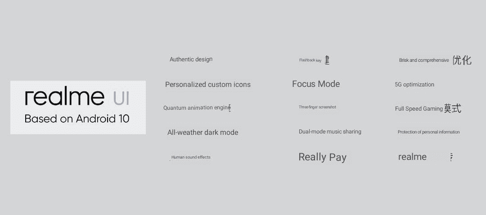
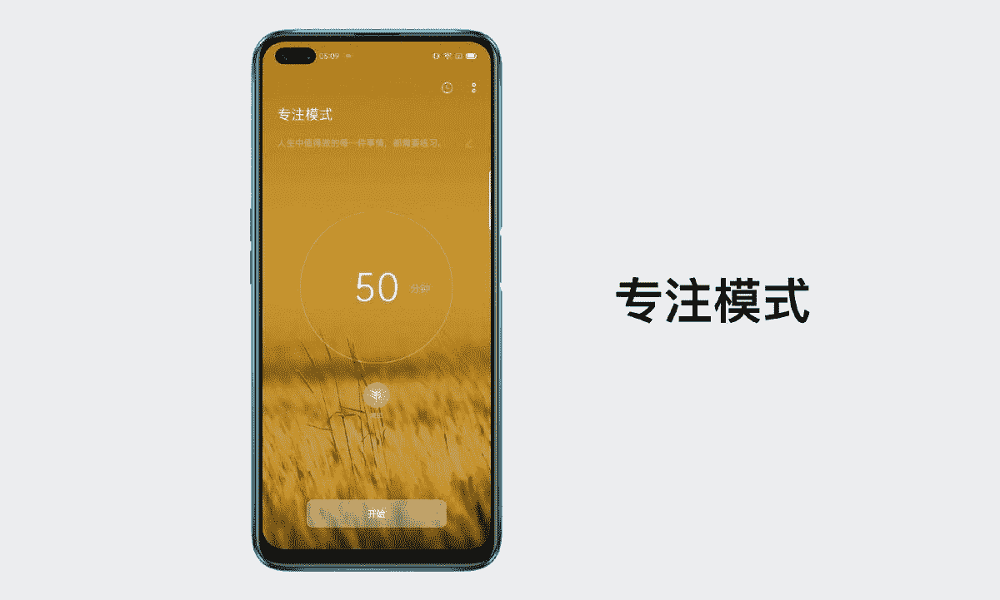

# 配备 120 赫兹显示屏的 Realme X50 5G，骁龙 765G 上市

> 原文：<https://www.xda-developers.com/realme-x50-5g-snapdragon-765g-120hz-master-edition-ui/>

Realme 一直在走下坡路的智能手机行业中前行。它因性价比高的手机而广受欢迎，实现这一点的方法是淡化利润率，甚至低于小米声称的运营利润率。Realme 在过去一年的多倍增长表明，该品牌在世界各地的市场上受到了很多关注，而他们的产品组合也发生了重大变化，从仅仅是中端手机发展到在每个价格段都有选择。该公司以高调结束了这一年，推出了以游戏为中心的 Realme X2 ( [我们的游戏评论](https://www.xda-developers.com/realme-x2-review-snapdragon-730g-gaming/))，旗舰杀手 Realme X2 专业版([我们的评论](https://www.xda-developers.com/realme-x2-pro-xda-review/)，以及他们进入生活方式产品市场的门票，即一对真正的无线立体声耳塞。今天，Realme 宣布推出首款 5G 手机——Realme X50 5G，配有打孔显示屏、四摄像头等。

Realme 官方对 Realme X50 5G 的爆料到现在已经一个多月了。在一系列预告中，[公司披露了智能手机](https://www.xda-developers.com/realme-x50-will-be-realmes-first-smartphone-with-5g/)的关键规格，包括其设计和处理器的全面披露。与此同时，中国监管机构 TENAA 网站上最近的一份清单也披露了关于这款智能手机的许多细节，所有这些都得到了官方声明的证实。

## Realme X50 5G:规格

| **规格** | **Realme X50 5G** |
| --- | --- |
| **尺寸&重量** |  |
| **显示** |  |
| **SoC** |  |
| **闸板&存放** |  |
| **存储类型** | 未知的 |
| **电池** |  |
| **指纹传感器** | 侧装指纹 |
| **后置摄像头** |  |
| **前置摄像头** |  |
| **安卓版本** | 基于 Android 10 的 Realme UI |

Realme X50 配备了 6.57 英寸的液晶显示屏，刷新率高达 120 赫兹，比它在 Realme X2 Pro 上推出的 90 赫兹有了重大飞跃。该显示器还采用了打孔设计，在左上角分配了两个自拍相机的空间。它的长宽比为 20:9，受大猩猩玻璃 5 保护。此外，还有一个侧装式指纹扫描仪，就像 [Redmi K30 5G](https://www.xda-developers.com/xiaomi-redmi-k30-5g-4g-120hz-display-snapdragon-765g-64mp-sony-imx686-china-launch/) 一样。

Realme X50 有两种颜色，灵感来自冰和海水。这两种颜色都带有 3D 全息背面设计，可以随着光线强度的变化而改变颜色。

谈到 5G 支持，板载高通骁龙 765G 移动平台支持非独立(NSA)和独立(SA) 5G 网络。该手机支持 SA 的 N1 和 N41 5G NR 频段以及 NSA 的 N78 和 N79 频段。它还配备了双频 GPS，以提高定位精度，以及 NFC。

Realme 预计 5G 是在线智能手机游戏的一个重要因素，除了新的芯片组，Realme 还与网易云游戏(NetEase Cloud Games)合作，网易云游戏是一家提供基于云的移动游戏的公司，可以通过一个应用程序玩游戏，而无需单独下载每个游戏。目前，它的投资组合主要是手机游戏，但[的网站](https://cg.163.com/#/mobile)有一个 PC 游戏部分，这表明我们可能会在未来看到类似于谷歌 Stadia 的服务。请记住，这可能是中国独有的功能，因为今天的发布活动只针对中国市场。

此外，该公司还升级了其游戏增强功能，以改善游戏，这也将使 GPU 渲染与显示器的刷新率同步，以防止游戏时出现任何抖动或抖动。此外，还有一个 8 毫米的铜导管，用于将热量从主板上传导出去。

谈到 Realme X50 5G 上的摄像头，Realme 一直在取笑四摄像头设置。 [TENAA 列表](http://shouji.tenaa.com.cn/mobile/MobileDetail.aspx?code=pVLX%2bPPtlH93PBQjBfq%2bSZwOglEDeeZe)也揭示了各种传感器的分辨率，但官方声明澄清了每个传感器的用途。有一个 [64MP 三星 ISOCELL Bright GW1](https://www.xda-developers.com/xiaomi-redmi-64mp-samsung-isocell-gw1-108mp-camera-sensor/) 作为主要传感器，一个具有 2 倍变焦的 12MP 长焦相机，一个 8MP 广角相机，以及一个用于微距摄影的 2MP 相机。这款相机还配备了先进的夜间模式，并支持原始摄影。正面的双摄像头包括一个 16MP 索尼 IMX471 主传感器和一个 8MP 广角传感器。

Realme X50 5G 上的 4,200mAh 电池有 30W VOOC 4.0 充电。这有助于电池在大约 30 分钟内充电 70%。

Realme X50 有三种型号–8GB/128 GB、6GB/256GB、12GB/256GB。RAM/存储配置似乎不寻常，但定价证实这是有意为之。

* * *

## Realme X50 5G 大师版

Realme 再次与日本工业设计师 Naota Fukusawa 合作，后者曾设计过 Realme X 和 Realme X2 Pro 的主版本。这一次，这位设计大师从光滑的金属表面上反射的光线中汲取灵感。Realme X50 5G 的 Master Edition 中有两种新的变体——一种是复制从亮到暗金属表面渐变的条纹网格，随着入射光的角度改变亮度，而另一种是由圆盘网格组成，每个圆盘上都有突出的同心圆，使每个圆盘看起来像乙烯基。

* * *

## Realme UI

Realme 还宣布了其新的 Realme UI，该 UI 基于母公司 OPPO 的 [ColorOS 7](https://www.xda-developers.com/oppo-coloros-7-review/) 。在舞台上，该公司的营销负责人徐琪·蔡斯说，这些图标已经重新设计，保持了形状的一致性。黄金比例的原则(基于斐波那契数列)被用来在图标的网格上放置关键的视觉元素。

 <picture></picture> 

Realme UI features (translated using Google Lens)

Realme UI 基于 Android 10，还附带了 Realme Pay 等新应用。此外，Realme 声称应用程序的启动速度提高了约 25%，电池寿命提高了 10%，游戏性能提高了 20%。此外，触摸响应时间缩短了 35%。

 <picture></picture> 

Realme Focus Mode

此外，Realme UI 还带有一个聚焦模式，可以帮助您从数字世界断开连接，并与物理世界重新连接。

Realme X50 5G 是该公司第一款开箱即用的 Realme UI 智能手机。随着即将到来的 [Android 10 更新](https://www.xda-developers.com/realme-coloros-7-android-10-beta/)，其他手机预计也会收到这个。

* * *

## Realme 物联网生态系统

在将自己定位为生活方式品牌后，Realme 准备推出自己的人工智能物联网设备生态系统。未来几个月，Realme 将推出一款智能电视、可穿戴设备和更多音频产品——可能会内置自己的人工智能助手。

* * *

## Realme Buds Air 特别版

该公司已经宣布了 Realme Buds Air TWS 耳塞，但在中国的发布会上看到了 Realme Buds Air 外壳的特殊颜色变体。这包括看起来像橡胶涂层的东西，以及散布在整个表面的 Realme 的“R/r”标志。这个盒子还有一个环，这样你就可以把它挂在钥匙链上。

* * *

## 价格和可用性

Realme X50 5G 的三种型号定价如下:

*   8GB/128 GB——CNY 2499 美元(约 360 美元)
*   6GB/256 GB——CNY 2699 英镑(约 390 美元)
*   12GB/256 GB——CNY 2999 美元(约 430 美元)
*   12GB/256GB 大师版——CNY 3099(约 450 美元)

Realme Buds Air 耳塞在 CNY 的定价为 399 英镑(约 60 美元)，但最初将在 CNY 上市，价格为 369 英镑(约 55 美元)。

Realme X50 5G 将于今天(即 1 月 7 日)开始通过各种在线渠道进行预售，并将于 1 月 14 日开始销售。