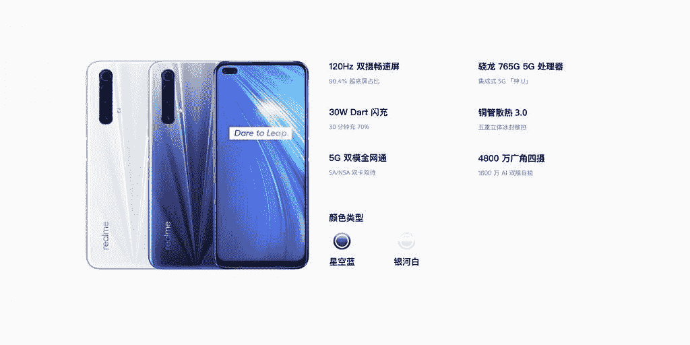

# 配备 120Hz 显示屏的 Realme X50m 5G 和骁龙 765G 在中国上市

> 原文：<https://www.xda-developers.com/realme-x50m-5g-120hz-display-snapdragon-765g-launched-china/>

今年 1 月早些时候，Realme [推出了其首款支持 5G 的手机](https://www.xda-developers.com/realme-x50-5g-snapdragon-765g-120hz-master-edition-ui/)——Realme X50 5G——采用高通的中端骁龙 765G 芯片。此后不久，该公司[推出了 Realme X50 Pro](https://www.xda-developers.com/realme-x50-pro-snapdragon-865-65w-fast-charging-90hz-display/) ，这是一款成熟的[骁龙 865](https://www.xda-developers.com/qualcomm-snapdragon-865-processor-specifications-features/) 动力旗舰产品，具有 90Hz 显示屏和 65W 快速充电功能。除此之外，Realme 现在还推出了另一款支持 5G 的智能手机，作为其 X50 系列的一部分 Realme X50m 5G。

## Realme X50m 5G 规格

| **规格** | **Realme X50m 5G** |
| --- | --- |
| **尺寸&重量** |  |
| **显示** |  |
| **SoC** |  |
| **闸板&存放** |  |
| **存储类型** | UFS 2.1 |
| **电池** |  |
| **指纹传感器** | 侧装指纹 |
| **后置摄像头** |  |
| **前置摄像头** |  |
| **安卓版本** | 基于 Android 10 的 Realme UI |

全新的 Realme X50m 5G 看起来只是今年早些时候的 Realme X50 5G，相机设置略有不同。它的特点是一样的

[Snapdragon 765G SoC](https://www.xda-developers.com/qualcomm-snapdragon-765-processor-specifications-features/)

，6.57 英寸 FHD+双打孔显示屏，刷新率为 120Hz，4，200mAh 电池，支持 30W 快速充电，侧面安装指纹扫描仪。与其前代产品非常相似，该设备也运行基于 Android 10 的 Realme UI。

在相机部门，Realme 现在包含了一个 48MP 主传感器，而不是 64MP 主传感器。虽然 800 万像素广角摄像头和 200 万像素微距摄像头保持不变，但 Realme X50 上的 1200 万像素长焦摄像头已被 Realme X50m 上的 200 万像素单色传感器取代。在正面，主要的 1600 万像素索尼 IMX471 保持不变，而 800 万像素的广角摄像头已被 200 万像素的深度感知传感器取代。

## 定价和可用性

Realme X50m 5G 的 6GB 内存版本在 CNY 的定价为 1999 英镑(约 282 美元)，而 8GB 内存版本在 CNY 的定价为 2299 英镑(约 324 美元)。该设备将有两种颜色可供选择——银河白和星空蓝——并将于 4 月 29 日开始在中国销售。截至目前，Realme 尚未透露任何有关 Realme X50m 5G 在全球其他地区推出和上市的细节。