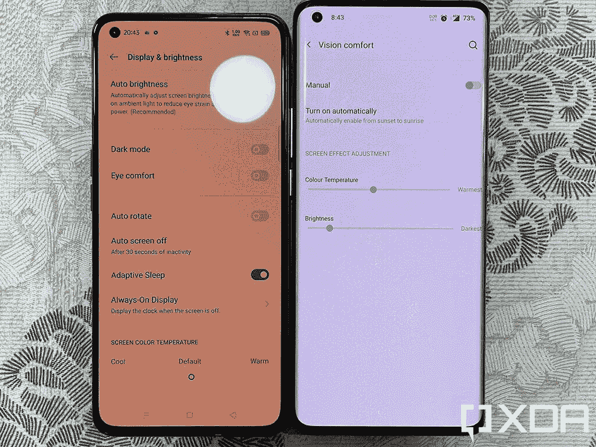

# Realme X7 Pro 上手:不要睡在联发科旗舰上

> 原文：<https://www.xda-developers.com/realme-x7-pro-hands-on/>

Realme 几年前进入智能手机领域，但在过去几年里，它在全球范围内取得了一些非凡的增长。虽然 Realme 的大部分智能手机都面向经济型和中端智能手机，但它也经常涉足制造平价旗舰和中端智能手机。Realme X7 Pro 去年在中国推出，但现在该公司已经[将这款手机带到印度市场](https://www.xda-developers.com/realme-x7-realme-x7-pro-mediatek-dimensity-india/)，让我们有机会尝试这款由联发科天玑 1000+ SoC 驱动的平价旗舰产品。

## Realme X7 Pro:规格

| 

规格

 | 

Realme X7 Pro

 |
| --- | --- |
| **建造** | 

*   聚碳酸酯中框
*   正面为大猩猩玻璃 5
*   玻璃背面

 |
| **尺寸&重量** | 

*   160.8 x 75.2 x 8.5mm 毫米
*   184 克

 |
| **显示** | 

*   6.55 英寸 FHD+ Super AMOLED (2400 x 1080)
*   120 赫兹刷新率
*   240Hz 触摸采样率
*   91.6%的屏幕与机身比例
*   1200 尼特峰值亮度
*   100% DCI-P3 覆盖率，103% NTSC 覆盖率

 |
| **SoC** | 联发科天玑 1000+:

*   4x ARM Cortex-A77 @ 2.6GHz +
*   4x ARM Cortex-A55 @ 2GHz
*   7 纳米工艺

ARM Mali-G77 MC9 GPU |
| **内存&存储** | 

*   8GB LPDDR4x + 128GB UFS 2.1

 |
| **电池&充电** | 

*   4500 毫安时
*   65W 快速有线充电(含 65W 充电器)

 |
| **安全** | 显示指纹扫描仪 |
| **后置摄像头** | 

*   **主:** 64MP 索尼 IMX686，f/1.8
*   **次要:**800 万像素超宽摄像头，f/2.25，119 FoV
*   **三级:** 2MP B & W 人像相机，f/2.4
*   **四元:** 2MP 微距相机，f/2.4

 |
| **前置摄像头** | 32MP 自拍相机，f/2.45 |
| **端口** | USB 类型-C |
| **连通性** | 

*   802.11 a/b/g 双频 Wi-Fi(支持 Wi-Fi 6)
*   蓝牙 5.0
*   GPS/GLONASS/北斗/伽利略/QZSS
*   双卡双待 5G

 |
| **软件** | 基于 Android 10 的 Realme UI |

***关于本次评测:** Realme 印度借给我们 Realme X7 Pro 进行评测。这篇文章使用了五天。Realme 在这篇文章中没有任何投入。*

* * *

## Realme X7 Pro:设计

玻璃平板智能手机在市场上一毛钱一打，我们现在很难让一款手机脱颖而出。OEM 可以尝试一些 CMF(颜色、材料和表面处理)组合，但最终，选择就这么多了。Realme X7 Pro 忠于其公司品牌，敢于在玻璃背面印刷醒目的品牌。在营销材料中,“敢于飞跃”这几个字几乎在手机的整个长度上尖叫，紧接着在另一边是相对柔和但突出的“真实”。但当我拿起手中的手机时，这种可见的效果比我真实预期的要柔和得多。

Realme X7 Pro 的梦幻色彩变体具有光滑的哑光玻璃背面，根据光线照射到背面的角度，以不同的色调反射光线。结果，你会得到不同深浅的黄色、橙色、粉色、海绿色和浅蓝色，当你扭动和转动手机时，它们会闪闪发光。品牌区域是没有相同颜色效果的负面区域，因此很容易忘记那些大字母确实存在于背面。当我看到营销材料上的品牌时，我真的很固执己见，但现在实际的手机摆在我面前，我承认它没有我想象的那么突出。我仍然希望手机没有它，Realme 只是坚持玩颜色。但我周围的其他人喜欢这种整体效果，所以 Realme 的信念飞跃可能会有回报。

握持和操作 Realme X7 Pro 是一种舒适的体验，尤其是对于习惯了握持一加 8 Pro 的人来说。这是一款更小更轻的手机，配有平板显示屏，这三项都是受欢迎的变化。Realme X7 Pro 有一个聚碳酸酯中框，其表面处理类似于一加诺德-如果你不密切关注，你会误认为它是金属。

Realme X7 Pro 的中框没有任何惊喜，我很遗憾地说，它也没有任何可扩展内存插槽或 3.5 毫米耳机插孔。这款手机的盒子里确实有一个 Type-C 到 3.5 毫米的适配器，这稍微减轻了失去插孔的打击。还有一个加固角的透明外壳，一个 65W 的 SuperDart 快速充电器，一根 C 型到 C 型电缆，以及一个 SIM 卡弹出工具。这款手机还配有一个预先应用的屏幕保护器，你可以很容易地将其移除。

120Hz 刷新率显示屏带来流畅流畅的体验

手机正面有 6.55 英寸 FHD+ Super AMOLED 显示屏，刷新率为 120Hz，触摸采样率为 240Hz。这是一个大而亮的显示器，峰值亮度为 1200 尼特，到目前为止，我对硬件没有任何抱怨(对软件的一些抱怨在这个第一印象的后面部分提到)。左边的打孔并不显眼，手机上的平面显示屏加强了我对智能手机曲面显示屏的厌恶。虽然刷新率是不可变的，并且只能在 120Hz 和 60Hz 模式之间切换，但总体体验就像人们希望的那样流畅和平滑。

我对设计和制造唯一真正的抱怨是振动马达和物理按钮。这款手机的振动马达不是很好，电源按钮也有些软。我被我使用一加 8 Pro 和 iPhone 12 的经历宠坏了，我现在经常使用它们已经有一段时间了。诚然，这两款手机都比 Realme X7 Pro 贵得多，但糟糕的触觉反馈和模糊的按钮是平价手机中常见的妥协之处。

总体来说，我对 Realme X7 Pro 还是比较满意的。是的，有改进的余地。例如，金属中框将是聚碳酸酯的理想升级。但是这里使用的聚碳酸酯非常好，没有内在的廉价或轻薄感。当你考虑到这款设备确实有一个非常好的 120Hz FHD+ Super AMOLED 显示屏，所以聚碳酸酯中框更容易消化时，这种妥协就更有意义了。

* * *

## Realme X7 Pro:硬件

支持 Realme X7 Pro 的是联发科天玑 1000 Plus SoC，这是首款采用该 SoC 的设备。Dimensity 1000 Plus 是 dimension ty 1000 的轻微升级，很可能联发科刚刚淘汰了 dimension ty 1000 常规变体。无论哪种方式，你都可以获得 4 个主频为 2.6GHz 的 ARM Cortex-A77 大核和 4 个主频为 2GHz 的 ARM Cortex-A55 小核，它们都是基于 TSMC 的 7 纳米工艺制造的。至于 GPU，SoC 采用 ARM Mali-G77 MC9，这是 Exynos 990 中采用的同一 GPU 的 9 核变体。您还可以获得 8GB 的 LPDDR4x 内存和 128GB 的 UFS 2.1 内部存储。

我只拥有这款设备很短一段时间，这几天我的使用仅限于我平时的工作和娱乐应用。也就是说，Realme X7 Pro 的实际性能非常好，没有观察到真正的滞后或口吃。暂时忽略基准数据，在日常应用中使用 Realme X7 Pro 的体验类似于一加 8 Pro，唯一的区别是 OxygenOS 上更快更快的动画给人一种“更快”的印象。如果你是一个对基准测试不感兴趣的普通消费者，那么 Realme X7 Pro 将非常适合你。

在基准测试中，Realme X7 Pro 的 CPU 性能和 GPU 性能均低于骁龙 865。但这并不完全是一件坏事，因为尺寸为 1000 以上的设备的目标价格段，我们通常会看到像骁龙 765G 这样的 SOC。与骁龙 765G 相比，Dimensity 1000 Plus 遥遥领先，成为对性能感兴趣但无法获得骁龙旗舰产品的客户的可行选择。

Realme X7 Pro 上的游戏继续保持良好势头。游戏在中等设置下运行良好，但更高的设置开始将手机推向极限。Realme 宣传了一种“电竞级蒸汽冷却系统”，具有五级散热系统，以我在 [Genshin Impact](https://www.xda-developers.com/genshin-impact-tips-tricks-beginners/) 中碾压敌军的短暂经历来看，这款手机似乎没有节流。几分钟后，相机模块旁边的表面区域确实开始预热，但我还没有发现一部手机在 Genshin Impact 中不这样做。如果冷却系统能够散热并防止节流，那么它实际上是在工作，为此，Realme X7 Pro 取得了成功，因为手机在这个过程中没有变得不舒服，也没有显示出任何明显的节流迹象。

Realme X7 Pro 上的摄像头与以前的 Realme 手机相比并不特别突出。到目前为止，这是该公司屡试不爽的公式，64MP 索尼 IMX686 在这款设备上占据了中心位置。IMX686 实际上是与 IMX682 相同的传感器，区别在于前者是 4K 60fps，而后者是 4K 30fps。我试用这款相机的机会非常有限，对于我迄今为止体验过的 IMX686 来说，结果并不是很寻常。我对 2MP 单色相机和 2MP 微距相机的感觉更强烈，在我看来，这两种相机都可以完全省略，以实现更注重价值的封装，因为它们在多功能性方面几乎没有带来什么。

* * *

## Realme X7 Pro:电池和充电

Realme X7 Pro 配备了 4500 毫安时的电池，对于配备 FHD+显示屏的手机来说，这是一个不错的电池。然而，该设备更大的卖点是它的 65W SuperDart 充电。这是这款设备让我震惊的一个方面，即使在使用 Realme 7 Pro 短暂体验过同样的情况之后。从 0%充电到 50%以上需要 15-20 分钟，而 0-95%的充电只需 35 分钟。Realme 承诺在 35 分钟内充满 100%的电量，而我的测试结果是 40 分钟——这两个数字本身就令人震惊。

65W 快充让人兴奋不已，你需要亲身体验才能真正体会到它有多快

你需要体验 65W 充电才能真正体会到它有多快，Realme 为将该技术降低到更多价位所做的努力值得赞赏。请注意，这些速度只能通过包装盒中的专有充电器来实现，理想的未来应该是通过通用标准安全地实现这些速度。

* * *

## 基于 Android 10 的 Realme UI

Realme X7 Pro 运行在基于 Android 10 的 Realme UI 上。基本 Android 版本可能是这款其他方面都不错的设备中最令人失望的一个方面。2021 年推出的中端手机开箱即用的 Android 10 有点令人失望，除非该公司承诺提供三个版本的升级，否则 Android 10 的存在会影响你未来在该设备上接收 Android 13 的能力。考虑到设备的价格和 Android 11 已经存在一段时间的事实，我预期会更好。

Realme UI 在其他方面是一个非常好的体验。如果你喜欢像 MIUI 这样厚重的 UX 皮肤，那么 Realme UI 会让你感觉很舒服。有一堆的定制，我个人不介意切换到其他 UX 皮肤。Realme UX 的动画有时确实有点华而不实，比如快速充电动画很酷，但很快就过时了，但我总的来说很喜欢与 UX 在一起的时光。除了两个主要问题。

首先，Realme X7 Pro 上有点垃圾邮件和膨胀软件的情况。像 HeyFun 这样的应用程序是预装的，除了默认的浏览器应用程序，即使你一次都没有打开这些应用程序，你也会整天收到一堆垃圾通知！其中一些还会推送 NSFW 边缘的内容(对工作来说不安全)，如果你不是一个人的话，你肯定不想无意中点击这些内容。诚然，我在印度销售的其他智能手机上目睹了更具侵略性的推送通知/广告和货币化行为，但这并不意味着 Realme 也可以这样做。

我对 Realme UI 的第二个抱怨有点微妙。如果你曾经在 Google Pixel 或 Android One 等接近库存的设备上登录 Google 帐户，然后设置 Digital Wellbeing 及其放松工具设置，以便在日落和日出之间自动启用夜间照明，这些设置最终会同步到你的 Google 帐户。Realme UI 做错的是，当它恢复你所有与账户相关的谷歌设置时，它不会重置这些夜灯和风力设置。Realme UI 也有自己的夜灯实现，因此与 AOSP 实现相关的设置在 UX 内不再可用。这一切的最终结果是什么？夜灯(来自 AOSP)最终在日落和日出之间自动开启，没有办法真正关闭它。如果你在此基础上切换 Realme 的夜灯实现，你会得到一个重度橙色(而不仅仅是黄色)的显示器。

 <picture></picture> 

A comparison of the Realme X7 Pro with the night light bug and the OnePlus 8 Pro. Note that the night light bug can be fixed with simple ADB commands.

请注意，这不是硬件缺陷。我在 Realme 7 Pro 上也遇到了同样的问题，当时，我认为我最终得到了一个有缺陷的单元。当该问题在 Realme X7 Pro 上重复出现时，我们发现该问题与从 Google 备份中保存和恢复的值之间的冲突有关。XDA 的亚当·康威(Adam Conway)在一款搭载 MIUI 的小米设备上遇到了这个问题，因此这个问题大体上围绕着原始设备制造商如何处理用户迁移时的这些价值——显然，三星和一加在这方面做得更好。

如果你被一个不能关闭的夜灯过滤器卡住了，试试这些 ADB 命令:

```
 adb shell settings put secure night_display_auto_mode 0
adb shell settings put secure night_display_activated 0 
```

这应该可以解决问题。在 Realme 手机上，您可能需要在开发者选项中切换“禁用权限监控”设置，以允许执行上述命令。我们已经通知了 Realme 这个错误，并提供了相关的日志信息，以帮助他们在未来的软件版本中修复它。

Realme 还有另一个问题需要解决:设备内核源代码。该公司在这方面已经作出了不少承诺，但兑现承诺的情况还有待改进。发布的内核源代码通常对应于旧的 Realme UI 版本，更不用说它忽略了新版本上组件的驱动程序。该公司还倾向于[大量转储源代码](https://github.com/realme-kernel-opensource/realmeC3-kernel-source/commit/30a20ed68052eff41489bd55cb30e40ace47b3c2),而不是提供适当的提交和作者身份，这使得跟踪变化非常困难。与此相关的是，在发布特定于设备的引导程序解锁应用程序时也会有一些延迟。如果你关心售后市场的发展，那么 Realme 和联发科的结合很难推荐。

* * *

## 结论:Realme X7 Pro 是一款不错的手机，只是有一些怪癖

我用 Realme X7 Pro 的短暂时间让我得出了一个有趣的结论:联发科旗舰没有以前那么差了。我这么说是因为我是骁龙旗舰手机的长期用户，也是因为我也使用过像联发科 Helio X10“旗舰”SOC 这样的 SOC，这些 SOC 在当时相当糟糕。搭载联发科天玑 1000 Plus 的 Realme X7 Pro 是一款令人惊讶的好产品，我没想到会有这么好的表现。抛开对性能指标评测的痴迷，我使用手机的一周非常平静(除了夜灯故障)，我没有遇到过错过我的一加 8 Pro 性能的情况。

我能现实地认为 Realme X7 Pro 落后的唯一情况是在游戏中——但在 Genshin Impact 中，我曾经在一加 8 Pro 上以中等设置运行游戏(为了节省一些电量，以最低的热量保持更长时间的游戏)，所以我在这里也没有被 Dimensity 1000 Plus 所困扰。至少可以说，65W SuperDart 充电也令人兴奋，它只是改变了你使用手机的方式——我发现自己更频繁地进行更短时间的快速充电，而不是更长的充电周期。我承认，我没有广泛使用这些相机，所以我可能没有遇到它的一些怪癖，当你在一加 8 Pro 旁边观察它时，显示屏明显不同。但当作为日常司机使用时，Realme X7 Pro 为我完成了任务，没有让我错过我通常的骁龙 865 旗舰。

这就把我们带到了一个问题，你应该买 Realme X7 Pro 吗？如果你是一个普通用户，不打算参与开发活动，也不痴迷于规格表或基准测试数据，并且对开箱即用的 Android 10 很满意，Realme X7 Pro 确实是一个不错的选择。我可以看到我的父母甚至我的弟弟毫无问题地使用这款手机，这证明了非高端旗舰手机变得越来越好，以至于它们能够很好地服务于普通用户。

Realme X7 Pro 绝对不是一款定价过高的手机

但对于₹29,999 的价格(约 411 美元)，Realme X7 Pro 在发布时引起了定价过高的反应。对于这些我说，手机上的体验接近价格标签，我个人不会把手机归类为“价格过高”。这可能不是你过去已经习惯的 Realme 的价值主张，但这本身并不意味着它是一个糟糕的价值持有者。Realme 也可能犯了一个错误，没有推出 RAM 和存储更少的低价版本，因为这在一定程度上转移了发布后的话题。该公司还习惯于在不同价格之间混合和匹配规格，因此像 65W 快速充电这样的功能在这种特定设备上不再引起相同的“哇”反应，因为你可以在像 Realme 7 Pro 这样便宜得多的设备上获得它。此外，它还可以开箱即用地运行 Android 10。

 <picture></picture> 

Realme X7 Pro

##### Realme X7 Pro

Realme X7 Pro 以优惠的价格提供了 Dimensity 1000 Plus SoC，这使得它成为 2021 年中端智能手机的一个不错的购买选择。这款手机提供了一个全面的包，包括 120Hz Super AMOLED 显示屏，64MP 索尼 IMX686 和 65W SuperDart 充电。

Realme X7 Pro 进入印度市场的价格是我们通常看到的[一加诺德](https://www.xda-developers.com/oneplus-nord-review/)的价格。与 Nord 相比，Realme X7 Pro 脱颖而出，拥有许多+1，使其成为一款优秀的产品。但是花上几千卢比，你会发现自己正与拥有骁龙 865 和更加实用和多功能相机设置的[小米 10T](https://www.xda-developers.com/xiaomi-mi-10t-pro-performance-gaming-review/) 竞争。在我使用 Realme X7 Pro 的短暂时间里，我认为该公司已经提供了另一款可以很好地服务于大多数用户的好产品。