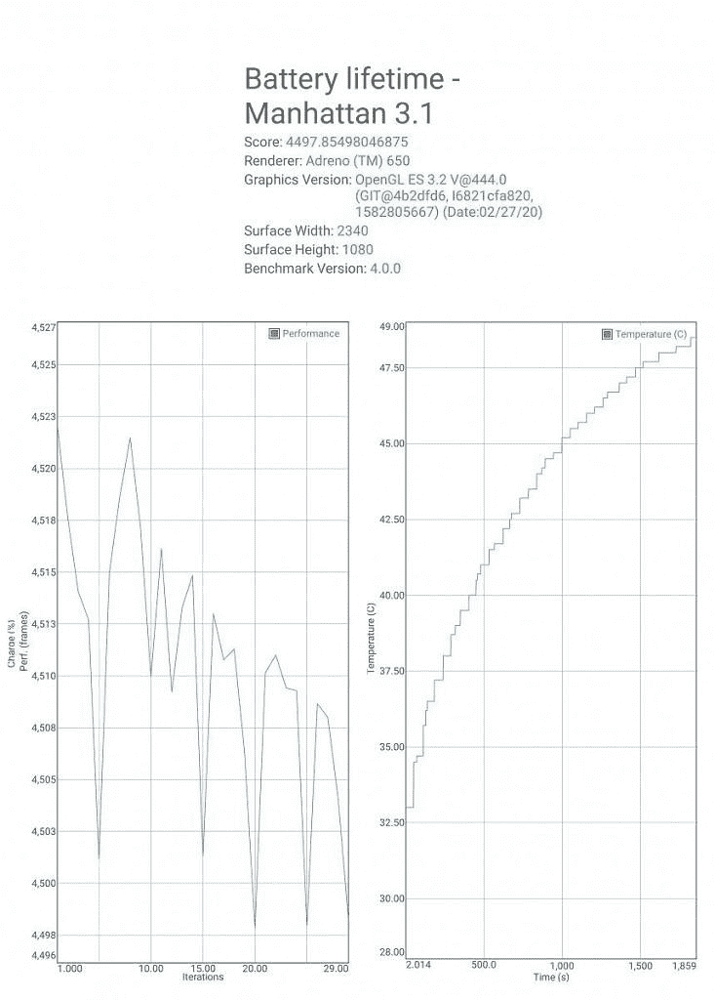
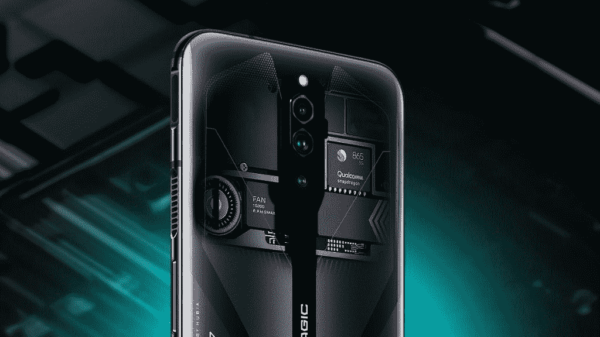

# Red Magic 5G 游戏评论:游戏从未如此流畅

> 原文：<https://www.xda-developers.com/red-magic-5g-gaming-review/>

不久前，在智能手机上玩游戏还只是一件休闲的事情。像《愤怒的小鸟》或《糖果粉碎》这样需要基本输入的简单游戏正主导着市场。如果你想玩有更复杂的机制和玩法的游戏，你要么给自己买一台像样的台式机，要么买一台游戏机。

然而现在，情况大不相同了。虽然休闲游戏仍然是一个很大的事情，但智能手机实际上也可以运行较重的游戏，如《上古卷轴:刀锋战士》、《PUBG》和《堡垒之夜》。我们也有专为游戏设计的手机。2017 年末的 Razer 手机开创了“游戏”智能手机的子类别:从头开始制造的手机，以游戏为目的。

努比亚的红色魔法子品牌也推出了一些非常吸引人的产品。今年的 [Red Magic 5G](https://www.xda-developers.com/nubia-red-magic-5g-144hz-display-active-cooling-fan/) 是最新的一款，它在智能手机显示屏上有史以来最高的刷新率，为 144Hz。这只是这款手机包含的众多面向游戏的新功能之一。它显然还配备了骁龙 865，因为它的胆量和其他功能，但与其他 2020 年的旗舰相比，它们真的有所不同吗？我们已经拿到了 Red Magic 5G，我们已经对它实际上有多好做了一个概述，主要关注游戏部门。

| 

规格

 | 

努比亚红魔 5G

 |
| --- | --- |
| **尺寸和重量** | 

*   168.56 x 78 x 9.75 毫米
*   218 克

 |
| **显示** | 

*   6.65 寸 FHD+AMOLED；
*   19.5:9 宽高比
*   144Hz 高刷新率
*   240Hz 触摸采样率
*   显示屏内指纹传感器

 |
| **SoC** | 高通骁龙 865Adreno 650 |
| **RAM 和存储器** | 

*   8GB LPDDR5 + 128GB UFS 3.0
*   12GB + 128GB
*   12GB + 256GB
*   16GB + 256GB

 |
| **电池&充电** | 

*   4，500 毫安时电池
*   55W 快速充电
*   兼容快速充电 4.0 和电力传输 3.0

 |
| **后置摄像头** | 

*   **主:** 64MP 索尼 IMX686 传感器，f/1.8
*   **辅助:**800 万像素，广角摄像头
*   **三级:** 2MP，宏

 |
| **前置摄像头** | 800 万像素 |
| **其他特性** | 

*   通过手机内的旋转风扇进行主动冷却
*   3.5 毫米耳机插孔
*   低延迟游戏截屏
*   触摸感应肩部按钮
*   WiFi 6
*   双频全球定位系统
*   用于进一步对接的侧销

 |
| **安卓版本** | 基于 Android 10 的红色魔法操作系统 |

*关于本次评测:努比亚借给我们一台 Red Magic 5G，用于评测用途。本文所有观点完全是我们自己的。Nubia 在这篇评论发表之前无法获得它。*

**[红魔 5G 论坛](https://forum.xda-developers.com/nubia-red-magic-5g)**

## 红色魔法 5G:设计

过去几年，玻璃夹层智能手机已经成为决定性趋势。尽管最近，一些手机试图通过渐变或折射效果的形式来区分自己。不要误会我的意思，它们仍然很酷，而且每隔一段时间我们就会看到新的、令人敬畏的效果，比如 Galaxy Note 10 上的光环发光和一加 8 上的星际发光。Red Magic 5G 在这里做的事情有所不同，无论是好是坏。

与其他智能手机相比，Red Magic 5G 具有务实、独特的风格。背面仍然是玻璃，但不是平淡无奇的渐变，而是更加复杂的设计，大声喊出了这款手机的真实本质:这款设备专注于游戏，从里到外。在黑色的变体上仍然有一种渐变效果，但是我们之前提到的主要设计特征仍然是最突出和引人注目的。我们在三后置摄像头设置下方有非常明显的红色魔法标记，它采用了 IMX686 传感器。其他游戏手机经常过度使用其“游戏”品牌——而 Red Magic 5G 似乎走了中间道路。

预先，显示器没有任何类型的凹口或打孔相机。相反，显示屏的顶部和底部有两个小挡板，在时尚上更类似于 18:9 手机，尽管显示屏是 19.5:9。在这样的手机上，这是有意义的:对显示屏的任何干扰都会扰乱手机的游戏体验。小挡板也有助于横着玩时握杆，所以我们不会抱怨。

在设备的两侧，与其他手机类似:我们有常见的电源按钮和音量摇杆，但我们也有压力敏感的肩部触发按钮。我们将在后面详细讨论这些，但可以说，它们在演奏时确实有所不同。还有一个用于切换游戏模式的专用按钮，需要将风扇启动。

* * *

## 红色魔法 5G:性能

对于绩效评估，我们将从两个部分开始。首先，我们有一个“基准”部分，它将允许我们以原始数据衡量 Red Magic 5G 的能力，使我们能够更容易地比较它与其他智能手机的对比。但当然，基准只是一个原始指标，并不一定能让我们准确了解这款手机的性能，因此接下来将进行实际的游戏性能测试。

### 基准

我们为此次评测测试了三款不同的基准测试应用: [Geekbench 5](https://play.google.com/store/apps/details?id=com.primatelabs.geekbench5) 、 [PCMark Work 2.0](https://play.google.com/store/apps/details?id=com.futuremark.pcmark.android.benchmark) 和 [3DMark](https://play.google.com/store/apps/details?id=com.futuremark.dmandroid.application) 。我们正在将 Red Magic 5G 与一加 8 Pro(另一款骁龙 865 智能手机)、华为 P40 Pro(采用麒麟 990 SoC)、三星 Galaxy S20+(采用 Exynos 990)以及基于骁龙 855+处理器的老款一加 7T 进行比较。这将使我们能够粗略地衡量该设备与其他高端智能手机相比的表现。

Red Magic 5G 相对于列表中的所有其他智能手机都有一个优势，那就是显示器的刷新率:144Hz。一加 8 Pro 和 Galaxy S20+的显示屏为 120 赫兹，而 P40 Pro 和一加 7T 的显示屏为 90 赫兹。因此，在这种情况下，看看更高的刷新率对整体性能的影响会有多大将会很有意思。

Geekbench 5 给我们的单核分数是 908，多核分数是 3041。相比之下，该榜单中最接近的设备一加 8 Pro 在单核方面的表现大致相同(897)，在多核方面的表现略好(3339)。这可能是由于 Nubia 上较差的软件优化，144Hz 需要更高的 CPU 负载等原因造成的。不过，它比榜单上的其他手机都要好，包括基于 Exynos 990 的 Galaxy S20+和基于麒麟 990 的华为 P40 Pro，显然还有一加 7T。

PCMark 给了我们一个稍微不同的全景，因为这款手机在 Work 2.0 整体测试中获得了 12891 分。Galaxy S20+以 11962 的成绩排在第二位，而列表中所有其他智能手机的表现都略低于这个数字。然而奇怪的是，这款设备的得分比一加 8 Pro 高得多，后者配备了相同的片上系统。

最后，3DMark Sling Shot 测试显示，Red Magic 5G 的得分为 7305，与一加 8 Pro 的得分相似，远远高于 P40 Pro 等其他智能手机的 6058 分。

### 游戏性能

至于实际游戏性能部分，我们在本次评测中试用了 6 款不同的游戏，它们都可以在谷歌 Play 商店上获得:

*   真实赛车 3
*   PUBG 移动
*   子弹力
*   齿轮。俱乐部
*   死亡触发器 2
*   虚荣

这些是目前谷歌 Play 商店上最受欢迎的游戏，这也是我们挑选它们的原因。红魔 5G 有 1080p 的分辨率，1080p 的游戏相比 1440p 的游戏自己渲染也没那么难。然而，我们在这里有一个 144 赫兹的显示屏，这是第一个手机，所以看看游戏在这里运行得如何会很有趣。令我们惊讶的是，这款手机丝毫没有让我们失望。

感谢 GameBench 为我们提供了记者执照。GameBench 是一套开发工具，用于分析游戏的流畅性、功耗和内存使用情况。GameBench 是 Google Play 上的一款应用，也是一款桌面应用。欲了解更多信息，请访问[GameBench.net](https://www.gamebench.net/)。

**真实赛车 3**

由电子艺界发行的《真实赛车 3》是安卓手机上最受欢迎的赛车游戏之一，安装量达到 5 亿次，而且就目前情况来看，它也是资源密集型的。然而，这对于 Red Magic 5G 来说不是问题，它成功实现了 145 fps 的中值，这是手机显示屏允许的最高值，稳定性为 95%，这意味着游戏在大多数时间里运行流畅，偶尔会出现非常罕见的小帧丢失。

**PUBG 移动**

[PUBG Mobile](https://play.google.com/store/apps/details?id=com.tencent.ig) 是一款你们大多数人可能都很熟悉的游戏:它最初是在 PC 上推出的，并与堡垒之夜一起帮助推广了皇室战争类型。它也进入了安卓手机。然而，就性能而言，游戏运行得尽可能好:它的上限是 60 fps，所以即使手机允许，它也不会超过这个速度。然而，由于具有完美的 100%稳定性，在这个领域中完全不存在丢帧现象。

**子弹力**

子弹力量是谷歌 Play 商店上另一款受欢迎的射击游戏，安装量达到 1000 万。虽然不像其他射击游戏那样受欢迎，但这款游戏确实比其他游戏有优势，这就是游戏可以在手机 144Hz 显示屏的全部功能下运行的事实。这款手机的中值为 145 fps，稳定性为 98%，可以轻松应对游戏，这是迄今为止其他安卓手机无法做到的。

**齿轮。俱乐部**

[齿轮。Club](https://play.google.com/store/apps/details?id=com.edengames.GTSpirit) 是另一款没有沥青 9 和真实赛车 3(我们之前也测试过)那么受欢迎的赛车游戏，但它也是我们想要测试的一款比真实赛车 3 更激烈的游戏。尽管如此，对于红魔 5G 来说，依然不是什么大任务。这款游戏的上限也是 60fps，所以我们得到了与 PUBG 中相似的数字:中值 60 fps，93%的稳定性，这意味着丢帧现象确实存在，但非常罕见。很想看看游戏如何在手机的最高帧率下运行。

**死扳机 2**

【应用盒子 Google play com。疯狂手指游戏。死触发器 2]

《死亡扳机 2》是一款为 Android 设备开发的生存恐怖游戏，也是一款非常受欢迎的游戏:它的安装量超过了 1.1 亿。然而，它不是 Red Magic 5G 的对手。这款游戏充分利用了 144Hz 的显示屏，再次实现了 145 fps 的中值和 98%的近乎完美的稳定性。

**虚荣**

最后，我们有[虚荣](https://play.google.com/store/apps/details?id=com.superevilmegacorp.game)，这是另一个受欢迎的游戏，利用了设备无与伦比的高刷新率。我们平均获得 145 fps，稳定性为 95%，这意味着它大部分时间都在全速运行。

* * *

## 红色魔法 5G:相机

在相机方面，这款设备远不是最强大的，但如果你需要快速拍摄一些东西，它仍然不会令人失望。即使你专门为游戏购买这款手机，你也会想要一个像样的相机。这款手机有一个 64MP IMX686 传感器作为主传感器，它还配有一个辅助超宽 8MP 镜头和一个 2MP 微距镜头，可以满足您的所有微距拍摄需求。

不幸的是，鉴于正在进行的新冠肺炎疫情迫使我们所有人都呆在家里，我们无法做我们想要做的那么多相机测试。但从我们有限的测试来看，我们发现 Red Magic 5G 虽然没有成为相机冠军(尽管就其价格而言仍然相当不错)，但在良好的照明条件下，能够提供一般的相机体验。它不会让你太失望，但也不会让你大吃一惊。

*努比亚红魔 5G 相机样片。*

颜色看起来很准确，你可能会在某些镜头中遇到一些过饱和，但在这里没有什么会破坏效果。毕竟，这款手机的全部意义并不在于它的摄像头，而是最前沿的游戏体验。

单个 800 万像素传感器满足了自拍需求，这也是一个普通的选择，不会引人注目或令人失望。它还具有基于人工智能的人像模式，该模式基于人脸检测，并模糊你身后的背景。

* * *

## 红色魔法 5G:电池寿命和充电

Nubia Red Magic 5G 配备了 4500 毫安时的电池。这种容量的电池已经能够为多种智能手机提供出色的电池寿命。然而，在这种情况下，Red Magic 5G 具有 144Hz 显示屏以及其他功能，如专用风扇，与其他传统智能手机相比，它可以并将会消耗一点电池。例如，一加 8 Pro 的电池容量非常相似，准确地说是 4510 毫安，事实证明，在 120 赫兹模式下使用手机会延长电池寿命。我们在这方面的结果也是好坏参半，因为 5G 连接也可以消耗电池。

如果电池寿命不足，手机支持超快充电:它支持超快 55W 充电(55W 快速充电器单独出售)。我们无法测试快速充电器，因为它是单独出售的，但它应该能够在破纪录的时间内充满手机的电池。开箱即用，Nubia Red Magic 5G 配有 18W 充电器，但如果你有支持的充电电缆和适配器，也支持高通快速充电 4+ (27W)充电。在我们的测试中，我们发现使用随附的 18W 充电器将 Red Magic 5G 从 0 充电到 100%大约需要 1 小时 26 分钟。

为了测试真实世界的电池寿命，我们使用了 PCMark 的 Work 2.0 电池寿命基准测试。PCMark 的 Work 2.0 电池基准测试重复了标准的 Work 2.0 基准测试(该测试通过一系列模拟真实世界活动的任务来运行设备，如网页浏览、图像编辑或文档阅读)。不幸的是，我们不断得到一个错误，没有让基准运行完成(即。从 100%下降到 0%)。然而，当测试自行结束时，在测试运行 8 小时 38 分钟后，我们的设备的电池寿命还剩 18%。这是最大亮度水平的一半，所以我们可以预计红色 Magic 5G 在日常使用中会持续相当长的时间。

但是游戏时的电池寿命呢？为了测试这一点，我们使用了 GFXBench 的曼哈顿电池寿命基准测试，该测试通过曼哈顿 3.1 OpenGLES 3.1 测试的多次迭代来运行设备，这是一个图形密集型基准测试。当测试结束时，GFXBench 估计我们的 Red Magic 5G 将持续 177.4 分钟的连续播放时间。当然，曼哈顿 3.1 并不是一个真正的游戏，所以这个数字只是一个持续玩超级图形密集型游戏时设备*应该*持续多长时间的估计。

此外，详细的 GFXBench 结果显示，Red Magic 5G 几乎没有节流。事实上，在整个 30 次迭代测试中，曼哈顿 3.1 分数仅在 4498-4523 之间波动。我们可以看到电池温度从大约 33°C 上升到大约 49°C。最后，我们应该注意到 GFXBench 会自动将亮度设置为最大值(100%)，因此 177 分钟的游戏时间意味着您应该可以在手机的最大亮度下玩近 3 个小时的游戏。最大亮度对许多用户来说有点多，所以你可以通过降低亮度来获得更长的播放时间。

 <picture></picture> 

Detailed performance and battery temperature over time results from GFXBench's Manhattan 3.1 battery benchmark.

(我们还在游戏模式下运行了 GFXBench Manhattan 3.1 OpenGLES 电池基准测试。虽然最终的电池续航时间结果没有太大改善——gfx bench 认为这款手机将持续 179.7 分钟，改善了 2.3 分钟——但性能波动较小，它达到的最高电池温度也稍低，在风扇运转时达到约 45°C，而不是不运转时的约 49°C。在 GFXBench 完成后，我们还使用温度读取器测量了器件的最终表面温度，发现温度接近 46°c。)

* * *

## 5G 连接

当然，这款手机有一个骁龙 865 处理器，因此，我们在这里看到的一个头条功能是支持 5G 连接。然而，这种 5G 连接对美国用户来说并不真正有用。它没有为美国使用的大多数网络频段提供广泛的覆盖，5G 频段也几乎是不可能的。在亚洲/欧洲市场，您的里程数可能会有所不同，您可能会做得更好。

* * *

在这款手机针对游戏玩家的最令人兴奋的功能中，你可以找到“肩部触发器”，这是一种位于手机两侧的触敏按钮，可以将你的游戏体验提升到另一个水平。这些肩部触发器可以更容易地接触到屏幕的最边缘，而不会让你在玩屏幕与 Red Magic 5G 一样大的手机时遇到尴尬的情况。

*红色 Magic 5G 的肩部触发更详细的细节。*

在手机的游戏空间 2.1 中，你可以为你玩的每一个游戏定制这些按钮的工作方式。例如，在玩《使命召唤:手机》时，你可以让它们像 PlayStation 4 的 DualShock 4 控制器上的 L2 和 R2 按钮一样指向并射击。这是一个很容易的功能，可以让你的游戏体验更好，因为这些肩膀触发器取代了某些游戏的屏幕按钮，可以提供更流畅的体验。

你可以在 Nubia Red Magic 5G 上找到的另一个功能是 Nubia 的第三代涡轮风扇技术，该技术集成了内部风扇和先进的液体冷却系统，试图在大部分时间保持手机处于足够的温度。在游戏空间 2.1 中，你可以决定打开或关闭风扇，尽管它默认是关闭的。

 <picture></picture> 

The Red Magic 5G's internal fan sits to the left of the phone.

我们在检查这个功能时发现的结果是…不冷不热，因为没有更好的词。当手机发热时，启用它并不能真正帮助手机变冷。然而，在给手机施加压力之前打开手机有助于减缓温度的上升。手机的热性能以及涡轮风扇的有效性会受到多种因素的影响，例如环境和环境温度。虽然在功能上，它只是一个噱头，但它可能有助于延长游戏时间，以避免手机迅速变热。

* * *

## 结论

Red Magic 5G 手机的核心是服务于一个狭窄的市场:希望从设备中获得最大性能的铁杆游戏玩家。这不是一款普通的旗舰手机:虽然这款手机中的一些功能很可能会应用到其他消费智能手机上，并达到一定的目的，例如 144Hz 的显示屏，但它可能不会很好地适应更普通的客户:摄像头最多是普通的，不是每个人都喜欢这款手机的设计，显示屏有可见的边框。此外，这些游戏功能中的大部分也可能只是 sp，e 用户的噱头。如果你关心这些事情中的任何一件，那么你可能应该把目光从这部手机上移开。

然而，如果你优先考虑的是性能和充分利用你的设备，那么这是一部出色的智能手机。它有一个骁龙 865，所以你得到了目前市场上最好的性能。它拥有高达 16 GB 的内存和 256 GB 的存储空间，因此它将能够处理你扔给它的一切，并且它有大量的功能可以大大增强你的游戏体验。毕竟，这款手机的全部存在都围绕着游戏。肩部触发器对于一些触摸界面可能不太适用的游戏非常有用，例如《堡垒之夜》和《使命召唤:手机》。集成风扇在说明书上比在现实生活中更好，但如果你正确使用它，它可以帮助保持高温更长时间。

**[红魔 5G 论坛](https://forum.xda-developers.com/nubia-red-magic-5g)**

**[向 RedMagic.gg](https://www.redmagic.gg/)** 购买红色魔法 5G

如果你是一个铁杆游戏玩家，正在寻找一部可以跟上你的手机，那么这可能值得一试。

由 Arol Wright 和 Mishaal Rahman 提供了许多信息。