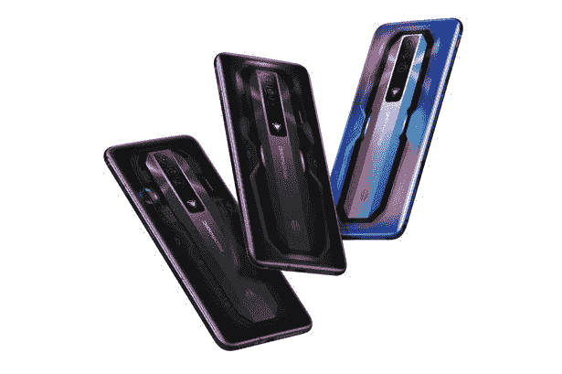

# RedMagic 7 评论:终极智能手机硬件，有一个重大妥协

> 原文：<https://www.xda-developers.com/redmagic-7-review/>

总的来说，即使是旗舰智能手机市场也充满了妥协。如果你想买一部业内最好的智能手机，通常你会放弃另一个用户可能认为是交易破坏者的东西。对于一些人来说，是缺少耳机插孔，对于一些游戏玩家来说，是缺少游戏相关的设计选择，对于一些发烧友来说，是在性能上做出的妥协。如果我告诉你，RedMagic 7 是终极智能手机，而且几乎不偷工减料，会怎么样？

作为背景，RedMagic 是一个以游戏为导向的智能手机品牌，旨在制造市场上最好的游戏手机，RedMagic 7 是它的下一个版本，由[高通骁龙 8 代 1](https://www.xda-developers.com/qualcomm-snapdragon-8-gen-1/) 驱动整个设置。它内置了一个风扇，肩膀触发器可以映射到屏幕上，它甚至在巨大的 6.8 英寸 165 赫兹屏幕上有一个耳机插孔。

这款手机看起来真的什么都有，但是有什么问题呢？正如 RedMagic 手机的典型情况一样，它是软件质量和软件更新的结合。如果你不在乎这些事情中的任何一件(有时很难真正克服挫败感)，那么老实说，我真的不认为这有什么大不了的。世界上大多数主要市场也缺乏实体零售分销系统，但你应该可以从网上商店购买手机，并在全球范围内发货。

 <picture></picture> 

RedMagic 7

##### 红色魔法 7

RedMagic 7 是 RedMagic 的最新游戏手机，它包含了您所期望的所有顶级游戏硬件。

* * *

## 红色魔法 7:规格

| 

规格

 | 

红色魔法 7

 |
| --- | --- |
| **尺寸和重量** | 

*   170.6 x 78.3 x 9.5mm 毫米
*   215 克

 |
| **显示** | 

*   6.8 英寸 AMOLED (2400 x 1080)
*   165 赫兹刷新率
*   高达 720Hz 的触摸采样率
*   10 位颜色支持
*   100% DCI-P3 宽色域覆盖
*   DC 调光
*   大猩猩玻璃 5

 |
| **SoC** | 

*   骁龙 8 代 1
    *   1x ARM Cortex-X2 @ 3.0GHz
    *   3 个 ARM Cortex-A710 @ 2.50GHz
    *   4x ARM Cortex-A510 @ 1.80GHz
*   Adreno 730 GPU
*   4 纳米工艺

 |
| **RAM 和存储器** | 

*   12GB/16GB/18GB 内存
*   128GB/256GB UFS 3.1 闪存存储

 |
| **电池&充电** | 

*   4，500 毫安时电池
*   65W 快速充电器(包装盒内)

 |
| **后置摄像头** | 

*   **主要:** 64MP
*   **次要:** 8MP 超宽
*   第三级: 2MP 宏

 |
| **前置摄像头** | 800 万像素 |
| **其他特性** | 

*   双立体声扬声器
*   内置主动冷却风扇
*   ICE 8.0 多维冷却系统
*   三个麦克风
*   双肩触发按钮
*   DTS 声音

 |
| **连通性** | 

*   5G NR
*   蓝牙 5.2
*   国家足球联盟
*   WiFi 6
*   2×2 MIMO
*   3.5 毫米音频插孔
*   USB-C

 |
| **安全** | 显示不足的指纹扫描仪 |
| **软件** | 搭载 RedMagic OS 5.0 的 Android 12 |

***关于本次评审**:2022 年 1 月 26 日收到公司的 RedMagic 7 进行评审。RedMagic 没有对本评论的内容提供任何意见。*

* * *

## 红色魔法 7:展示

*   大而明亮的 AMOLED 显示屏
*   165 赫兹刷新率
*   没有缺口，没有穿孔

RedMagic 7 采用全高清 165Hz 6.8 英寸 AMOLED 面板，而且是*巨型*。它完全不受缺口或穿孔的阻碍，而且非常明亮。由于它的尺寸和没有任何东西占用显示屏的事实，它非常适合游戏或媒体消费，但真的很难表达它有多大。不过，这对于一款游戏手机来说完全说得通。

RedMagic 7 非常适合游戏或媒体消费，这要归功于它的尺寸和不占用显示屏的事实

至于显示质量本身，这是我第一次体验 165Hz，即使是 144Hz 的显示器，差异也很明显。随着刷新率的增加，肯定有收益递减的因素，但 165Hz 本身就很棒。还有多个选项可供选择，您可以选择 165 赫兹、120 赫兹、90 赫兹或 60 赫兹，以降低功耗。

显示屏周围是最小的边框，有少量空间用于自拍相机，显示屏底部有少量空间。它也是一个完全平坦的面板，并带有预先应用的屏幕保护器。

* * *

## 红色魔法 7:设计

*   耳机插孔
*   肩部触发器
*   内置风扇

RedMagic 7 基本上包含了游戏智能手机的所有功能。顶部有一个耳机插孔，右手边的顶部和底部有一个肩部触发器，左上角有一个滑块，可以让你的手机进入游戏模式。背面采用非常 RGB 重的人造透明设计，同时还显示多条营销信息。

我是 RedMagic 7 设计的忠实粉丝

我是 RedMagic 7 设计的忠实粉丝，但我绝对可以理解这是一个两极分化的设计。三个摄像头与手机弯曲的背面成一直线，这样就不会突出来，这是一个优点，而且手机不会在桌子上晃动。

我对这款手机设计的一个问题是，如果手机放在桌子上，手机背面的风扇进气口仍然会被挡住。不过，不可否认的是，你不太可能在玩游戏的时候不把手机竖着。风扇的存在也意味着手机没有防水或防尘的 IP 等级，这可能是人们考虑市场上几款智能手机将防水作为营销功能的一个障碍。

* * *

## 红色魔法 7:性能

*   最新的高通骁龙 8 第 1 代芯片组
*   出色的持续表现

红色魔法 7 包最新和最伟大的高通骁龙 8 代 1，这是我们期望在游戏手机中看到的。它具有超越其前辈的所有代次飞跃和 4 纳米节点尺寸，可在不大幅增加功耗的情况下获得更好的性能。骁龙 8 Gen 1 保留了高通已经运行了一段时间的 1+3+4 配置，单个 Prime 内核基于 ARM 的新 Cortex-X2。

RedMagic 7 中的骁龙 8 Gen 1 的性能与您预期的一样好

Kryo 内核基于 ARMv9 架构。使用新技术的第一批 CPU 设计是 Cortex-X2、Cortex-A710 和 Cortex-A510，这些正是构成高通 Kryo 芯片基础的 CPU 设计。Cortex-A710 承诺比其前身 A78 的效率提高 30%，性能提升 10%。Cortex-A710 内核的主频为 2.5GHz。至于三个 Kryo 效率内核，它们基于新的 Cortex-A510 设计。去年对骁龙 888 的效率核心的主要批评围绕着使用老化的 Cortex-A55 核心，所以现在我们应该看到今年的效率有了很大的提高。Cortex-A510 的性能比 A55 提高了 35%,效率也提高了 20%。这些内核的时钟频率为 1.79GHz。

我们将在以后的文章中更详细地分析高通骁龙 8 Gen 1 的性能。然而，RedMagic 7 中的骁龙 8 Gen 1 表现正如你所预期的一样好，我发现它在游戏中的表现(包括通过 [AetherSX2](https://www.xda-developers.com/aethersx2-playstation-emulator/) 和 Dolphin Emulator 进行的仿真)非常出色。

### 基准测试:Geekbench 5 和 AndroBench

RedMagic 7 在存储速度和 Geekbench 5 上都表现不错。存储速度对于游戏来说非常重要，因为它可以确保游戏中快速、一致的加载时间，因为较慢的存储速度将成为瓶颈。

至于 Geekbench 5 的结果，根据我们在高通参考设备上运行的[基准测试，它们完全符合我们对骁龙 8 Gen 1 的预期。](https://www.xda-developers.com/qualcomm-snapdragon-8-gen-1-benchmarks/)

### 持续性能

持续性能是使用游戏智能手机时需要注意的最重要指标之一。如果持续的表现很差，那么在可能很短的一段时间后，你的表现会大大降低。我使用谷歌 Play 商店上的 CPU 节流测试应用程序进行了半个小时的测试，测试了 RedMagic 7 上的热节流，结果给我留下了深刻的印象。我运行了两次测试；一个关着风扇，一个开着风扇。

两个结果都相当不错，尤其是在风扇开启的情况下。唯一的问题是，我发现在测试快结束时，手机变得太热，无法触摸。这不是你想从游戏手机中得到的，即使考虑到手机内部的长期健康状况，特别是电池，这也是非常令人担忧的。

* * *

## 红色魔法 7:软件

*   不良软件
*   婴儿车
*   糟糕的翻译

RedMagic 设备上的软件是他们真正失败的地方，这也不例外。从某种意义上来说，它还有很多不足之处，真的，它只是一次糟糕的经历。不准确或奇怪的翻译困扰着操作系统，有时使它成为一种有趣的体验，而且操作系统的许多设计也非常“游戏化”。此外，谷歌支付不起作用，因为它在运行安全网检查时未能通过谷歌的兼容性测试套件。

RedMagic 7 上的软件还有许多不足之处

尽管如此，我并不介意 RedMagic OS 的许多 UX 设计，如果它不是如此漏洞百出，我会更舒服。启动器太可怕了(而且我也找不到办法设置一个自己的自定义启动器)，我经常在解锁手机后无法实际阅读通知(它说通知是隐藏的，就像我在锁屏上一样)，只是感觉非常不打磨。

可悲的是，这是我在 RedMagic 7 中找到的最大的妥协。我真诚地喜欢这部手机的所有其他方面，但不知何故，它完全被软件搞砸了。我无法在拨号器中导入我的联系人(它告诉我“在存储器中找不到 vCard 文件”)，并且永远打开的显示屏不能设置为“永远打开”——你需要选择开始时间和结束时间，可以设置为相隔一分钟。

我能给这款软件的唯一褒奖是它很流畅，游戏运行良好，但这也是这款手机的全部意义所在。大多数工作显然已经被放入该公司的游戏空间，只需轻触左上方的红色开关即可进入。

### RedMagic OS 游戏空间

虽然它仍然充满了不可靠的翻译(和偶尔的错误)，但 RedMagic 的游戏空间比这款手机的其他任何东西都要好得多。它通常有许多有用的功能和对细节的关注，这是你真正想从游戏手机中寻找的东西。

RedMagic 7 上的游戏空间是我在智能手机上见过的最好的游戏模式之一

完美吗？没有，但这是我在智能手机上见过的最好的游戏模式之一。当你进入游戏时，它会自动启用你手机上的粉丝，并且在你玩游戏时有许多功能可以使用和尝试。配置肩部触发器也是一个非常简单的过程，特别要注意帮助 PUBG Mobile 用户。

* * *

## RedMagic 7 值你的钱吗？

软件问题是 RedMagic 7 的最大问题，我不只是指我上面概述的问题。该公司在持续更新智能手机方面有一段艰难的历史，所以你应该根据手机目前的状况来判断，而不是根据一两次软件更新后它会变成什么样。你几乎肯定会得到一些更新，但是我也担心会有更多的错误和其他问题被引入，这是不可能恢复的。在一个公司打磨 UX 并承诺多达四代 Android 更新的时代，获得你在 RedMagic 7 上获得的体验是一种失望。

因此，除非你是铁杆游戏玩家，否则这款手机很难推荐。它是终极的手机硬件——在这一点上，它将几乎所有的东西和厨房水槽打包成一个坚固的包——但它不是终极的手机，因为那个*分钟*的细节，软件是一个完全糟糕的体验。如果你认为你可以克服这一点，你想要的是一个相对便宜的游戏手机，那么无论如何，RedMagic 7 可能很值得你的钱。

 <picture></picture> 

RedMagic 7

##### 红色魔法 7

RedMagic 7 是 RedMagic 的最新游戏手机，它包含了您所期望的所有顶级游戏硬件。

RedMagic 7 将于 3 月 10 日在努比亚的[全球网站](https://na.redmagic.gg/)开始销售。它将有三种颜色可供选择:黑曜石、脉冲星和超新星。基本 12GB/128GB 型号的价格为 629 美元/ €629 / 529，而 16GB/256GB 型号的价格为 729 美元/ €729 / 619。最后，配有 18GB 内存和 256GB 内存的顶级型号将零售 799 美元/ €799 / 679。努比亚表示，计划于 2022 年在 Q2 全球推出 RedMagic 7 Pro。对于€629 来说，如果你能通过这个软件，这将是一笔不错的交易，但这是一个合理的要求。