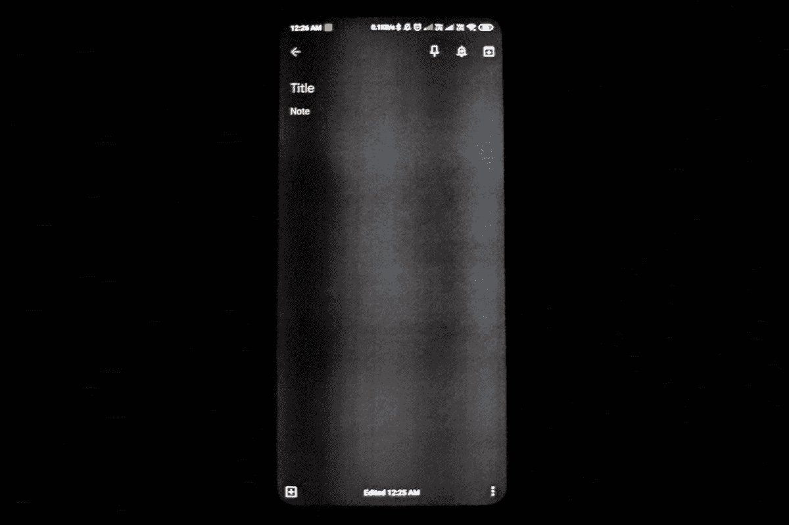
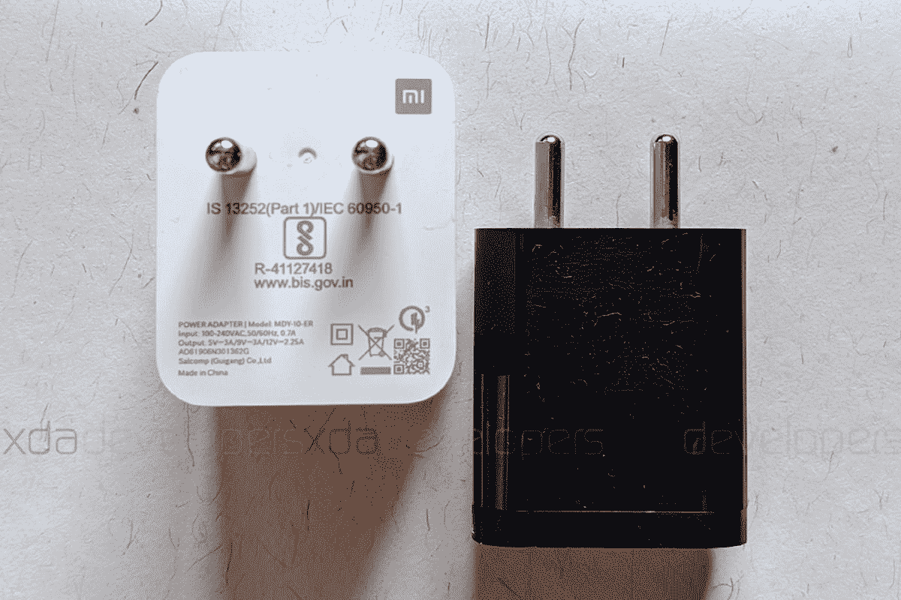

# 红米 K20 Pro/小米米 9T Pro 评测:‘旗舰黑仔’重新定义

> 原文：<https://www.xda-developers.com/redmi-k20-pro-xiaomi-mi-9t-pro-review-flagship/>

大约五年前，“负担得起”这个词不会和“旗舰智能手机”这个词在同一个歌词中唱出。但是，在当代智能手机市场上，这两个形容词经常被冠以“平价旗舰”的统称。这个短语非常明确地描述了外观和感觉都像旗舰产品，但价格远低于经典旗舰产品的智能手机。多亏了一加和小米这样的公司，这个概念已经变成了现实。随着价格低廉和高端功能的交叉，这些廉价的旗舰产品——就像最近推出的[red mi K20 Pro](https://www.xda-developers.com/xiaomi-redmi-k20-pro-launch-india/)——具有巨大的大众吸引力，可以[比实际的高端设备驱动更多的用户](https://www.xda-developers.com/oneplus-6t-top-premium-smartphone-india-samsung-top-spot/)。这款智能手机以小米 9T Pro 的名字在国际上推出[，其目标市场包括欧洲。](https://www.xda-developers.com/xiaomi-mi-9t-pro-announced-international-redmi-k20-pro/)

Redmi 已经跃入高端市场，超越了其平价和低价智能手机的谱系。其母公司小米通过其积极的营销活动推动了红米 K20 Pro 成为无敌的平价旗舰产品的说法。虽然小米在过去几年中推出了几款旗舰产品，但它将高端智能手机激进化的旅程始于去年，推出了第一款“旗舰黑仔”，即 POCO F1。红米 K20 Pro/米 9T Pro 继承了这一传统，在标题后添加了后缀 2.0。

虽然在 POCO F1 之后，小米是否有资格延续其旗舰黑仔血统仍有争议，但小米已经在[快速飙升的](https://www.xda-developers.com/oneplus-6t-top-premium-smartphone-india-samsung-top-spot/)高端细分市场与一加展开了较量。小米有信心 Redmi K20 Pro 将在该领域击败竞争对手；因此，决定将智能手机称为“阿尔法旗舰”高通骁龙 855 移动平台是红米 K20 Pro/小米 9T Pro 成为强大智能手机的主要原因之一。但与 POCO F1 不同的是，Redmi K20 Pro 以一种优质而刺激的玻璃设计超越了这一前提，POCO F1 是硬核原始规格的大杂烩，与乏味的聚碳酸酯设计联系在一起。除了主要的 4800 万像素的拍摄装置之外，这还辅以一个 AMOLED 显示屏，没有阻碍设备对称性的凹口，一个由弹出机制穿梭的自拍相机，一个背面带有专用传感器的相机三联体，用于光学变焦和超宽摄影。

凭借这款更高端的新产品，小米进入了印度₹30,000 价格点划定的领域。Redmi K20 Pro/Mi 9T Pro 迷人又有吸引力，但如果你需要更多的浮华，还有一款限量版镀金镶钻款，价格是普通 K20 Pro 的近 15 倍。

**[红米 K20 Pro/小米 Mi 9T Pro XDA 论坛](https://forum.xda-developers.com/k20-pro)**

我已经将 Redmi K20 Pro 作为我的主要设备使用了近一个月，并逐渐形成了关于哪些方面会影响您购买智能手机的决定的看法。

***注:**小米印度借给我们一台 8GB/256GB 版本的 Redmi K20 Pro 和一台 27W 涡轮充电器，用于评测。*

## 红米 K20 Pro/小米米 9T Pro 规格

| 

规范

 | 

红米 K20 Pro/小米米 9T Pro

 |
| --- | --- |
| **尺寸&重量** |  |
| **显示** |  |
| **SoC** | 高通骁龙 855:

*   1 个 2.84GHz Kryo 485
*   3 个 2.42GHz Kryo 485
*   4 个 1.8GHz Kryo 485

 |
| **RAM &存储** |  |
| **电池** | 4000 毫安时 |
| **指纹传感器** | 光学显示 |
| **后置摄像头** |  |
| **前置摄像头** |  |
| **安卓版本** | [基于 Android 9 派的 MIUI](https://www.xda-developers.com/tag/miui/) 10 |
| **颜色** | 火焰红、冰川蓝、碳纤维黑 |

就规格而言，K20 Pro 显得高大而坚固，但就其所提供的功能而言，它是否有所突破？希望在这篇评论结束时，你会有所领悟。我们先从智能手机上的设计说起。

## 设计

从小米第一次挑逗开始，红米 K20 和 K20 Pro/米 9T Pro 的设计就非常耐人寻味。为了提升其优质游戏，智能手机采用了玻璃夹层设计，两侧都有大猩猩玻璃 5 保护。Redmi 在火焰红和冰川蓝两种变体上展现了令人着迷的 3D 渐变趋势，这使得智能手机非常有吸引力和独特。甚至在连续盯着图案看了几分钟后，我感觉自己对迷人的反光表面充满了敬畏。

*底层图案随着入射光的变化而移动*

在我对 Redmi K20 Pro 的[第一印象](https://www.xda-developers.com/redmi-k20-pro-first-impressions-masterpiece-xiaomi/)中，我谈到了设计中各种元素的基本布局，因此这一部分将更加关键，并围绕值得赞赏和谨慎的方面。

首先，我很珍惜红米 K20 Pro/小米米 9T Pro 是如何依偎在掌心的，尤其是考虑到我的手并不是很大。玻璃背面的曲率增加了握持感，使手机感觉稍微轻一些，尽管它的重量略高于 190 克。Redmi 在盒子里增加了一个薄而柔韧的塑料盒，供那些喜欢遮盖易碎手机的人使用。说到易碎性，玻璃夹层设计可能会让一些用户紧张，即使 K20 Pro 感觉不太滑。对于玻璃设计的耐用性，两侧都有 Gorilla Glass 5，这可能会打消用户对 Redmi K20 Pro 采用最新版本保护玻璃的期望。通过错误地把智能手机和我的钥匙放在同一个口袋里，我已经能够在手机的正面或背面都留下厚厚的凹槽。因此，如果你已经决定购买 Redmi K20 Pro，请安排一个屏幕保护装置以及智能手机的外壳或外壳。

Redmi K20 Pro 的显示屏不像它的背部那样弯曲，这是我很重视的一点。根据我们在第一印象中收到的评论，许多人似乎将曲面屏等同于高端智能手机，在我看来，这种倾向是三星推出曲面屏高端手机产品组合的副作用。随着一加 7 Pro T1 的推出，最初的旗舰杀手品牌——一加——用这一招让智能手机看起来更有吸引力。然而，就我个人而言，我更喜欢平板显示器，因为这不仅可以更容易地在向外的按键上打字，还可以更容易地使用 MIUI 手势，特别是背面手势，这涉及到从两边向内滑动。

显示屏的对角线尺寸为 6.39 英寸，这与小米 MIX 3 相同， [Max](https://www.xda-developers.com/author/mweinbach/) 发现小米最高端的设备之一[。Redmi K20 Pro 开始了获得类似声誉的旅程，显示屏确实有助于它成为一款高端设备，其薄边框环绕所有边缘，形成了一个吸引人的外观。](https://www.xda-developers.com/xiaomi-mi-mix-3-review-proof-that-xiaomi-can-do-premium-too/)

> 通过 Redmi K20 Pro，小米展示了其制作精美智能手机的能力。

尽管加入了与高端智能手机相同的联盟，但 Redmi K20 Pro/Mi 9T Pro 保留了一个耳机插孔，这一周到的步骤为长期使用特定耳机的用户提供了一个令人信服的论据。在一个软件狗普遍存在的时代，3.5 毫米插孔的存在仍有争议。值得称赞的是，Redmi 成功地在 Redmi K20 Pro 的超薄外形中塞进了一个耳机插孔。然而，这确实是以红外发射器为代价的，遗憾的是，红外发射器在这款智能手机上没有一席之地。此外，我开始喜欢上了弹出式自拍相机两侧的灯光。当自拍相机因视频通话或面部认证而升起时，这尤其有用。

然而，在我的整个使用过程中，我见证了自拍相机的一个问题(感谢 Twitter 用户 [F.T.L.O.G.](https://twitter.com/FTLOG4/status/1154395535932968961) 首先让我注意到这一点)。光线从弹出式相机腔前面闪亮的金属区域反射回来，当有强光源时，这会导致闪光。在大多数情况下，这种闪光是微不足道的，除非智能手机与光源保持一定的角度，但它确实会让你一直担心要避开它。这并不是 Redmi K20 Pro 独有的，也可以在包括 Realme X 在内的设备上看到，遮盖反射金属部分的外壳应该可以解决这个问题。这段视频应该能帮助你理解这个问题。

Redmi K20 Pro 的整体设计非常引人注目，特别是由于背面不那么微妙的图案，可以将其比作任何东西，从炽热的火焰到木星上不断移动的云带，再到分形图案。这个设计非常迷人，足以让你惊叹不已。包围弹出式照相机的反射金属表面仍然是一个令人关注的问题。你可能想要使用一个清晰的外壳(我个人最喜欢的是₹1,199 的[ringke fusion-x](https://www.amazon.in/Ringke-Fusion-X-Ergonomic-Transparent-Protection/dp/B07T2F6DLK/?tag=xdaportalin-21))，它既不会完全脱离背部的非凡设计，也不会导致前置摄像头闪光。K20 Pro 的帅气外观和令人放心的外形让它赢得了你作为一款耐用智能手机的信心，而 Gorilla Glass 5 则让你对耐用性有了一些信心。

* * *

## 显示

小米在 Redmi K20 Pro/Mi 9T Pro 上选择显示屏，开始了打造一款有价值的旗舰产品或至少是一款旗舰杀手级设备的步伐。这款智能手机使用三星制造的 AMOLED 显示屏。该显示器的峰值亮度为 600 尼特，支持约 104%的 NTSC 色域。值得注意的是，这与小米今年早些时候宣布的旗舰产品小米 9 是同一款 AMOLED 面板，但顶部没有凹口，这使得 Redmi 旗舰产品的屏幕与机身之比略高。小米是否会发明 Redmi K20 Pro 作为 POCO F1 的继任者，我们将在今年晚些时候感受到，但 AMOLED 显示屏确实为小米的旗舰杀手 DNA 添加了一个新的组件。显示屏带有圆角，与 POCO F1 不同，小米这次注意到了对称性。显示屏的四个边缘都被薄边框包围，包括略宽的下巴，比其他三个侧面略宽。Redmi 使用了一个有趣的名字——“地平线”显示屏，位于容易避免的挡板后面。

按照 AMOLED 面板，Redmi K20 Pro 的显示屏具有丰富的对比度和生动的色彩。黄色泛音掩盖了显示屏，但这可以使用 MIUI 显示设置中的自动对比度或高对比度选项来纠正。就像运行这种 Android 皮肤的其他设备一样，你可以根据自己的需要改变色调。这不是一个超级 AMOLED 显示器，与某些其他设备相比，可能会感觉亮度有限。然而，只有当 Redmi K20 Pro 与另一款配备 Super AMOLED 显示屏的智能手机并排放置时，这种差异才会让你感到厌烦。

由于持续关注 AMOLED 显示器因在低环境中使用而可能产生的有害影响，Redmi 为 K20 Pro 添加了 DC 调光模式。对于肉眼来说，DC 调光增加了一点亮度，但它防止低亮度水平的脉动光束对你的眼睛造成任何伤害。奇怪的是，在低亮度水平下，显示屏的亮度在整个面板上看起来并不均匀，当使用暗主题/模式的应用程序时，会出现亮灰色和深灰色的可见列。Dylan 证实这个问题是轻微的，因为它困扰着几乎所有的中档有机发光二极管面板。

 <picture></picture> 

Bands caused due to uneven illumination under the panel. The issue is common on mid-range AMOLED displays and is not unique to the Redmi K20 Pro

关于这款显示器的质量，我使用 Braintrapp 的免费版显示器测试应用程序进行了一些快速测试。

一开始，AMOLED 面板没有显示出任何老化的迹象，这听起来像是一个不错的开价。它支持多达 10 个点的同时多点触摸，这也是一种标准但令人愉快的东西。Redmi K20 Pro 在条带化、对比度和饱和度测试中顺利通过，仅在色域的极端情况下，即在条带化测试中过暗或过亮的颜色下，才显得不自然。此外，在对比度测试方面，该显示器仅略差一点点。不过，非常坦率地说，除非你把这款设备放在一部显示屏更好的智能手机旁边，否则你不太可能注意到这些缺点。

值得注意的是，当两个或更多手指停留在屏幕上时，在平行于一条假想线的路径上移动第三个手指会导致其他两个点轻微移动，下面的模拟视频应该可以说明我想说的内容。众所周知，这个问题会影响其他(非超级)AMOLED 显示器，因此小米在这种情况下并不真正受到指责。话虽如此，我在 Redmi K20 Pro 上玩游戏时没有遇到任何问题，特别是在 PUBG Mobile 和 Shadowgun Legends 这样的 FPS 游戏中。

然而，困扰许多 POCO F1 用户的与三指截屏手势相关的[幽灵触摸问题也在这款设备上持续存在。当然，禁用手势选项是解决这一问题的理想方式，但我希望小米在用户近一年的煽动后解决这个问题。另外，它基本上使 MIUI 中的有效手势变得无用。目前还没有软件修复这个漏洞的承诺，但我希望小米继续接受用户的反馈。](http://en.miui.com/thread-5693478-1-1.html)

总的来说，虽然超级 AMOLED 显示屏将受到高度赞赏，但 AMOLED 面板的选择是以智能手机的经济性为前提的。尽管亮度低于 Super AMOLED，但即使在室内和室外的强光源下，Redmi K20 Pro 的显示屏的可读性也保持不变，除非它直接反射阳光，这使得人们很容易忽略这些缺陷。

最后，XDA 论坛上虔诚的开发者创造了一种将 [Redmi K20 Pro 显示器的刷新率超频到 75Hz](https://www.xda-developers.com/xiaomi-mi-9t-redmi-k20-pro-75hz-display-mod/) 的方法，如果你想让显示器有更好的性能，这是值得一试的。不过，一定要记住这一举措的相关风险。

* * *

## 表演

Redmi K20 Pro 在整体构造和显示屏方面符合高端智能手机的预期，并展示了一套适合旗舰级性能的设备。高通骁龙 855 移动平台以及高达 8GB 的内存是 K20 Pro 性能动力的主要驱动力。移动平台的八核由八个 7 纳米 Kyro 485 内核组成，分为三个不同的集群。其中包括一个 2.84GHz 的高性能核心，三个 2.42GHz 的核心，四个 1.8GHz 的高效核心。这种设置与我们在小米今年的早期旗舰产品上看到的相同——小米 9，该产品在他的评论中被 [Adam](https://www.xda-developers.com/author/adamconway/) 誉为“ [*大师级的*](https://www.xda-developers.com/xiaomi-mi-9-review/) ”表演者。然而，自 Mi 9 推出以来，近 6 个月已经过去了，这使得许多其他公司能够在该领域与他们的旗舰竞争对手进行竞争。

毫无疑问，Redmi K20 Pro 表现出的肌肉力量是旗舰级的。小米表示，MIUI 中的底层 AI 预加载优化了解用户的偏好。使用机器学习，这种算法可以预测你可能会打开哪个应用程序，并在你实际打开之前提前几微秒预加载它。毫无疑问，Redmi K20 Pro 永远不会让你渴望更多的权力，总有充足的供应。我们用于评测的评测单元有 8GB 内存和 256GB，这是小米在这款智能手机上提供的最大内存。一个月来，我一直在使用这款设备，没有遇到一次卡顿或延迟的情况，同样的情况也可能发生在 6GB RAM 的版本上。

> 毫无疑问，Redmi K20 Pro 永远不会让你渴望更多的权力，总有充足的供应。

尽管 Redmi K20 Pro 的可量化性能不太可能与 Mi 9 有太大不同，但我运行了一些常见的综合基准测试，以正确看待它。

请注意，基准测试与 Redmi K20 Pro 的 8GB RAM 版本相对应。由于欧洲设备只有 6GB RAM，结果可能比这里显示的要低。

### 安图图

首先从 AnTuTu 开始，K20 Pro 突破了 350k 大关，接近(尽管还不到)其他采用相同芯片组的智能手机。尽管与 Mi 9 的配置相同，但我们的 K20 Pro 评测单元以近 20，000 分的明显差距略微落后。下图对比了 K20 Pro 与小米 Mi 9、[努比亚红魔 3](https://www.xda-developers.com/nubia-red-magic-3-review/) 、一加 7 Pro 的 AnTuTu 评分。

### 极客工作台

转到 GeekBench 4，这是最简单、使用最广泛的综合基准测试之一。看到任何设备跨越某个阈值总是令人兴奋的，在这种情况下，Redmi K20 Pro 的多核分数超过了 10，000，这对于一部刚刚进入高端市场的智能手机来说是一个不小的成就。在这次测试中，Redmi K20 Pro 似乎击败了 Nubia Red Magic 3，并接近[一加 7](https://www.xda-developers.com/oneplus-7-review/) ，但仍低于 Mi 9。

K20 Pro 的连续 Geekbench 分数有明显的变化，随着智能手机变热，这些分数往往会下降，这意味着在这种情况下可能会有一些热量节流。与 POCO F1 不同，它有一个基于液体的散热器，K20 Pro 在主板周围有多层石墨来散热。为了公平比较，我使用三个分数的平均值。这里有一个比较图表:

### PCMark Work 2.0

在录制 red mi“Alpha”性能的过程中，下一步是根据 PCMark 的 Work 2.0 性能基准比较分数。PCMark Work 2.o 测量智能手机运行日常任务的能力，如网页浏览、照片和视频编辑，以及通过使用 Android 中的 API 打开、查看、编辑和保存文档。Redmi K20 Pro 在这些任务中公然击败了一加 7，这可能是由于后者更快的存储技术。以下是 Redmi K20 Pro 与一加 7 在 PCMark Work 2.0 分数方面的比较。

### 3D 标记

K20 Pro 上的骁龙 855 移动平台配备了 Adreno 640 GPU，与去年的旗舰芯片组骁龙 845 中集成的 Adreno 630 相比，可能会提供 20%的图形性能提升。在运行 3D Mark 这一图形密集型基准测试时，我看到了智能手机性能方面一些令人困惑的趋势。它不仅低于骁龙 855 的大多数其他智能手机，而且也低于骁龙 845 的其他设备，包括[一加 6T](https://www.xda-developers.com/oneplus-6t-review/) 。这令人不安，因为小米在印度的发布会上花了很长时间抛出“Vulkan”等流行语，这是一种跨平台的 API，允许图形密集型应用程序——尤其是游戏——而不是图形驱动程序来控制 GPU，以优化每个应用程序的 GPU 线程和内存分配。

奇怪的是，在使用 Vulkan 和 OpenGL API 的测试中，K20 Pro 无法支持其他设备。这可能是因为我的单位是预生产，但没有明确的解释，这支支吾吾。以下是比较分数，供您查看:

我运行了 GFXBench，这是另一个要求苛刻的图形相关任务的基准，我可以观察到一个类似的趋势，在每个测试中得分都低于竞争对手。在每项测试中，与一加 7 和红色魔术 3 相比，K20 Pro 的帧速率最低。看看红米 K20 Pro、一加 7、努比亚红魔 3 的评分对比:

### 存储基准

Redmi K20 Pro 配备了 UFS 2.1 双通道 NAND 存储。虽然 UFS 2.1 被视为许多设备的标准，但一加 7 领先于最新的 UFS 3.0 存储，这使得它在日常使用中明显更快。我们可以放 Redmi K20 Pro 一马，因为它比一加 7 更有活力。有趣的是， [Idrees](https://www.xda-developers.com/author/idrees-patel/) 在[一加 7 评测](https://www.xda-developers.com/oneplus-7-review/)中发现，尽管 USF 3.0 存储速度更快，但实际生活中并没有实质性的差异。此外，与 UFS 3.0 设备(我们目前只有一加 7 和 7 Pro)相比，另一个有趣的趋势是，与 UFS 2.1 设备相比，这些设备上的顺序读写和随机读取速度更高，而一加设备上的随机写入速度则低得多。

使用 Androbench 计算的内置存储器的传输速率如下:

### 赌博

说到游戏，Redmi K20 Pro 的性能是它所能得到的最好的。就像大多数休闲智能手机游戏玩家一样，我喜欢 FPS 游戏，K20 Pro 可以很好地处理 PUBG Mobile、堡垒之夜和 ShadowGun Legends 等热门游戏。鉴于规格，当然，不应该有任何疑问的游戏性能。我们在上面的基准测试中看到的较低的 GPU 性能可能需要思考几秒钟，但在现实生活中，我在最高设置下玩我在设备上测试的每个游戏时，都没有遇到任何延迟或丢帧。例如，PUBG Mobile 运行在超帧速率和 HDR(跟随[最新更新](https://www.xda-developers.com/download-pubg-mobile-0-13-5-beta-adds-a-high-frame-rate-mode-on-hdr-quality-new-smg-and-seasonal-upgrades/))下，并且开启了抗锯齿功能；虽然堡垒之夜不支持米 9 支持的 60fps 游戏，但它运行起来没有任何障碍。

我在 Redmi K20 Pro 上运行的其他一些游戏也很喜欢，包括 Real Racing 3、F1 Mobile Racing、Hitman Sniper、Dragon Hills 2、Oddman、Monument Valley 等。这款智能手机还获得了小米的游戏增强选项，让你在密集的会话中避免中断，提高游戏性能和图形。

> 说到游戏，Redmi K20 Pro 的性能是它所能得到的最好的。

不幸的是，我无法授予 GameBench 的访问权限——无论是免费版还是专业版——以便能够更准确地分析智能手机在游戏方面能产生什么。在与 Gamebench 的耐心工程师进行了几个小时的故障排除后，我被告知在我的设备上运行的 MIUI 版本缺少游戏基准工具运行所需的某些库。(*未来的行动包括在 K20 Pro 设备上刷新 MIUI 的最新版本，以便将来可以更新本文。虽然重新安装系统应该有助于澄清智能手机应对图形相关挑战的能力，但根据实际经验，我对其整体游戏性能非常有信心。*

* * *

## 声音的

虽然 red Mi K20 Pro/小米 Mi 9T Pro 不可否认地在性能和多媒体体验方面表现出色，但由于令人印象深刻的硬件——包括其显示屏，你也可以在智能手机的音频功能方面获得丰富的体验。虽然 K20 Pro 抛弃了我们在 POCO F1 上看到的替代耳机扬声器，但主扬声器非常响亮清晰。当我被限制在一堵墙内的时候，我更喜欢降低声音。通过单个扬声器播放音乐也很好，但对较高的频率更激进(通常用扬声器)。虽然 Redmi 的包装盒内没有耳机，但您可以通过 MIUI 中的设置使用各种耳机效果来自定义声音质量。

* * *

## 生物测定学

有两种方法可以解锁 Redmi K20 Pro 显示指纹扫描仪和面部解锁功能。要使用面部解锁功能解锁智能手机，弹出式摄像头必须缩回，这需要几乎一秒钟的时间，因此，我更喜欢使用指纹扫描仪。这是一个光学扫描仪，正如我们在大多数智能手机上看到的那样，采用了显示下指纹技术(三星的最新旗舰产品有超声波指纹扫描仪)。指纹扫描仪和面部认证都非常可靠，前者在 95%的情况下都能准确工作。可能会有一些抖动，但这主要是由于拇指/手指没有与传感器对齐。

* * *

## 照相机

就相机的规格和实用性而言，Redmi K20 Pro/Mi 9T Pro 的设置与小米 Mi 9 相似(尽管不完全相同)。该设置包括用于主相机的 48MP 索尼 IMX586 传感器，其使用的镜头具有 f/1.75 的光圈。这是一个 8MP 长焦传感器，使用 f/2.4 光圈镜头，支持 2 倍变焦。除此之外，作为后置摄像头设置的一部分，还有一个 1300 万像素的广角传感器和一个 f/2.4 镜头，它可以捕捉 125°的宽视野。后置摄像头还配有自动对焦激光，这两个可见点位于主传感器和广角传感器之间。同时，弹出式相机包含一个 200 万像素的自拍相机，配有 f/2.2 光圈镜头。

> 在我使用 K20 Pro 的这段时间里，我很欣赏这款相机的性能。

在我对 Redmi K20 Pro 的第一印象中，我对这款相机的性能非常满意，这种情绪已经持续了近一个月，我已经用了这部智能手机。相机 UI 类似于我们在小米和红米其他运行 MIUI 的智能手机上看到的。在我使用 K20 Pro/Mi 9T Pro 的这段时间里，我很欣赏这款相机的性能。首先，这款相机功能多样，其次，非常可靠。几乎没有任何快门延迟，你可以在不同模式之间无缝切换。除了高达 48MP 的摄影能力，这款智能手机还能够以 60fps 的速度录制 4K 视频，这显然是摄像爱好者会喜欢的东西。该相机还支持小米的人工智能场景检测和优化选项，但我的评测中拍摄的图像没有人工智能选项。

此外，Redmi K20 也配备了相同的相机设置，因此您可以随意使用它作为这两款设备的相机评测。为了便于分析，我将 K20 Pro 的相机性能分为以下几个部分:

### 主摄像头 1200 万像素

从 Redmi K20 Pro/Mi 9T Pro 的照片模式开始，48MP 索尼传感器支持的 4 合 1 像素宁滨让用户可以拍摄有效分辨率为 12MP 的图像。由于这些图像是由四个像素合并成一个像素而形成的，因此图像看起来明亮而清晰。就颜色而言，Redmi K20 Pro 拍摄的图像非常鲜艳，但一些用户可能会发现它们更饱和——或者这些图像在智能手机 AMOLED 显示屏上可能至少看起来非常饱和。这可能需要一些编辑，但总的来说，这些图像可能符合大多数用户的要求。该相机唯一有趣的一点是，图像的 ISO 值通常超过 100，这可能会导致意想不到的噪声。

### 12MP 对 48MP

与 Redmi Note 7 Pro 不同，K20 Pro/Mi 9T Pro 获得了专用的 48MP 模式，用于高分辨率图像。骁龙 855 SoC 上的 ISP 允许 Redmi K20 Pro 的处理延迟比 Note 7 Pro 短得多，尽管这两款设备上的传感器相同。正如所料，K20 Pro 上的 4800 万像素照片似乎比标准型号拍摄的照片有更多的光线和饱和度。虽然传统上认为高分辨率图像比 1200 万像素的图像有更多的细节，但这取决于光线的数量。如果 4800 万像素的图像获得了不错的氛围，输出的照片实际上比 1200 万像素的照片有更多的细节，但在没有足够光线的情况下，我们会看到更多的噪声和更少的细节。

此外，在夜间或光线较暗的情况下，48MP 图像具有较高的 ISO 值，因此图像中的光学和色彩噪声较大。看看下面的例子。

### 传真电报

利用 Redmi K20 Pro 上的第二个摄像头，您可以以 2 倍光学变焦拍摄图像。K20 Pro 上的长焦镜头支持自动对焦，并以 800 万像素的分辨率输出图像。虽然长焦相机捕捉的图像细节丰富，但色彩明显不够鲜明。这可能会给人一种图像更亮的错觉，但事实并非如此。

值得注意的是，智能手机只有在光线充足的情况下才会切换到长焦传感器，因为这款相机的镜头孔径较小，为 f/2.4。在光线较暗的情况下，主传感器会数码变焦到 2 倍，以复制远摄效果。虽然这很容易影响细节，但我更喜欢在某些情况下使用这种方法，例如拍摄微距镜头，而不是真正靠近主体。

### 广角的

13MP 广角传感器红米 K20 Pro/小米米 9T Pro 可拍摄 125°宽视场。由于与主相机相比，f/2.4 光圈较小，图像的曝光度较低，在细节方面落后于后者。此功能的实际应用包括捕捉更广阔的风景以及捕捉大群人。由于亮度较低，广角图像似乎比主相机拍摄的图像具有更好的对比度。

### 夜间模式

谷歌的夜视系统为数字增强的夜间摄影树立了标杆，红米/小米旗舰产品紧随其后，推出了一系列内置夜间模式的设备。除了像素宁滨技术，Redmi K20 Pro 上的摄像头可以在弱光场景下捕捉大量细节。除了增加曝光量，K20 Pro/Mi 9T Pro 上的夜间模式也有助于改善弱光下的细节，但这是以 ISO 值的明显增加为代价的。

### 人像模式

Redmi K20 Pro 没有专用的深度传感器，长焦相机用于拍摄人像或具有散景效果的图像。当光线充足时，该功能的输出是明显的，但当背景和前景具有匹配的颜色时，智能手机可能会经常错过。然而，如果你试图拍摄一群站在不同距离的人的肖像照，智能手机可能表现不佳。

小米的 MIUI 允许你改变散景拍摄的焦点，也允许你改变效果的深度，使其看起来尽可能真实。

### 自拍

Redmi K20 Pro/Mi 9T Pro 上的 20 MP 摄像头给人的感觉是强大而可靠的。它捕捉了大量的细节，但它对面部有明显的平滑效果。这是一款定焦相机，由于 f/2.2 的小光圈，主要焦点是正确捕捉面部细节。在很多情况下，这可能会导致背景被洗掉，这让我很恼火。考虑到后置摄像头令人印象深刻的性能，我确实觉得 Redmi 旗舰应该有一个更好的自拍摄像头。

该相机在拍摄人像自拍时表现明显良好。边缘检测是 on point，你可以从 MIUI 提供的各种舞台灯光效果中进行选择。

### 录像

如前所述，Redmi K20 Pro/Mi 9T Pro 能够以 60fps 的速度捕捉 4K 视频。POCO F1 的用户对这一功能有很高的要求，它的加入表明小米积极听取用户的反馈。4K 视频的质量与该系列中的其他设备不相上下。除此之外，智能手机还支持在主麦克风和副麦克风的帮助下捕捉立体声音频。尽管智能手机上有电子图像稳定功能，但视频确实会出现抖动。

看看使用 K20 Pro 录制的 4K 60fps 样本。

Redmi K20 Pro 拍摄的视频对于价格这么高的智能手机来说，色彩和细节都很好。从相机应用程序的设置中，用户可以选择 H.264 和 H.265 编解码器进行视频录制。

除了主摄像头，长焦传感器还支持 4K 视频拍摄，支持高达 60fps 的帧速率。然而，EIS 似乎正在努力保持视频在 2 倍数码变焦下的稳定性。

Redmi K20 Pro 拍摄的视频对于价格这么高的智能手机来说，色彩和细节都很好。从相机应用程序的设置中，用户可以选择 H.264 和 H.265 编解码器进行视频录制。

广角镜头也支持 4K 视频录制，但帧速率被限制在 30fps。由于帧被缩小，视频看起来相当稳定。这里有一个例子:

除了 4K 录制，Redmi K20 Pro 还可以捕捉 120fps 和 240fps 以及 960fps 的慢动作视频。虽然前两个似乎有效地降低了帧速率，但 960fps 的视频是抖动的，这可能是因为外推。虽然 120fps 和 240fps 的录制时间没有限制，但 960fps 的视频被限制在 10 秒内。由于视频被放慢到 32 倍，它记录了不到一秒钟的真实事件，你必须非常精确地捕捉到正确的时刻。此外，虽然您可以以 120fps 和 240fps 的速度修剪视频的慢速部分，但在 960fps 的视频中没有修剪选项。以下是 Redmi K20 Pro 的慢动作视频样本:

除了 4K 录制，Redmi K20 Pro 还可以捕捉 120fps 和 240fps 以及 960fps 的慢动作视频。虽然前两个似乎有效地降低了帧速率，但 960fps 的视频是抖动的，这可能是因为外推。虽然 120fps 和 240fps 的录制时间没有限制，但 960fps 的视频被限制在 10 秒内。由于视频被放慢到 32 倍，它记录了不到一秒钟的真实事件，你必须非常精确地捕捉到正确的时刻。此外，虽然您可以以 120fps 和 240fps 的速度修剪视频的慢速部分，但在 960fps 的视频中没有修剪选项。以下是 Redmi K20 Pro 的慢动作视频样本:

天空替换

除了众多功能之外，MIUI 还在 MIUI Gallery 中提供了天空替换滤镜，使用它可以改变几乎每张光线充足的图片中的天空。该功能可以直观地感知图片中的天空，并让您更改颜色，添加或删除彩虹、云彩和日落等元素。除此之外，该功能还优化了图像的整体配色方案，使其他元素与天空保持一致。该功能的工作原理如下:

### 天空替换

除了众多功能之外，MIUI 还在 MIUI Gallery 中提供了天空替换滤镜，使用它可以改变几乎每张光线充足的图片中的天空。该功能可以直观地感知图片中的天空，并让您更改颜色，添加或删除彩虹、云彩和日落等元素。除此之外，该功能还优化了图像的整体配色方案，使其他元素与天空保持一致。该功能的工作原理如下:

电池

* * *

Redmi K20 Pro 的电池是其主要优势之一。智能手机内置 4000 毫安时电池，性能惊人。

## 如果你是特别喜欢榨干智能手机电池最后一滴能量的用户，你会发现 Redmi K20 Pro 的性能值得称赞。

在大量使用的情况下，我可以很容易地每次充电获得几乎一天的电池使用价值。更令人印象深刻的是，我已经能够获得每天近 6 个小时的屏幕打开时间，包括多个游戏时段。如果你是特别喜欢榨干智能手机电池最后一滴能量的用户，你会发现 Redmi K20 Pro 的性能值得称赞。

> 说到充电，智能手机通过骁龙 855 获得了对高通[快速充电 4+](https://www.qualcomm.com/media/documents/files/quick-charge-device-list.pdf) 的内在支持。此外，智能手机支持 USB-PD，这意味着它可以使用任何支持该技术的充电器充电。在 Redmi K20 Pro 的包装盒内，您可以获得一个支持快速充电 3.0 的 18W 充电器。这款充电器从 10%充到 90%大约需要 100 分钟，充电速度最终会减慢到 100%。

由于智能手机支持最高 27W 的充电功率，你可以单独购买[小米的 SonicCharger 适配器](https://store.mi.com/in/item/3192900008)，这是 Redmi K20 Pro 支持的最高充电速率。使用这个充电器，电池可以在大约 75 分钟内充满 10%到 90%,但如果你想充满它，你需要多花将近 15-20 分钟。这是因为手机在电池电量较高时有加热保护机制。值得注意的是，这款充电器也基于快速充电 3.0 协议运行，你可能会遇到智能手机或充电砖发热的情况。

此外，对 USB-PD 的支持允许您使用充电解决方案，包括笔记本电脑充电器。使用 65W 的 MacBook Pro 充电器只比标准的 18W 充电器多花几分钟时间，可以肯定它可能以大约 15W 的功率充电。它可以是一个有用的补充，特别是当你旅行时，不想为每台设备携带单独的充电器。

 <picture></picture> 

Xiaomi 27W SonicCharge Adapter (left) and 18W standard charger (right)

最后，我还没有在智能手机上尝试过快速充电 4+充电器，而且这款设备不支持无线充电。

此外，对 USB-PD 的支持允许您使用充电解决方案，包括笔记本电脑充电器。使用 65W 的 MacBook Pro 充电器只比标准的 18W 充电器多花几分钟时间，可以肯定它可能以大约 15W 的功率充电。它可以是一个有用的补充，特别是当你旅行时，不想为每台设备携带单独的充电器。

连通性

* * *

Redmi K20 Pro 为可能从中端智能手机转向的用户提供了极大的灵活性，保留了耳机插孔，在这个价位上可以被视为奢侈品。从米 8 开始，小米的旗舰系列被剥夺了一个耳机孔，所以看到红米 K20/米 9T 系列容纳一个，令人耳目一新。此外，MIUI 允许用户通过进入设置中的“耳机和音频效果”选项来干预系统范围的均衡器设置。

## 除了耳机插孔，智能手机上的 USB Type-C 端口除了充电和数据传输外，还支持音频播放。此外，Redmi 还擅自从 K20 Pro 上移除了 IR blaster，理由是现在许多人都倾向于使用 Wi-Fi 或蓝牙。虽然我不依赖 IR blaster 来无线控制设备，但您的使用案例可能会有所不同。此外，虽然 Redmi K20 和 Redmi K20 Pro 的中国版本以及小米 Mi 9T 和 Mi 9T Pro 都有 NFC 功能，但印度的手机没有 NFC 功能，这可能是因为印度没有采用非接触式支付方式。

Redmi K20 Pro 配有双频 GPS，可更好地接收信号，从而实现更精确的定位。与精度为 5 米的传统单频 GPS 相比，双频 GPS 的精度降至 0.1 米，这是惊人的。这个功能帮助我在平行道路上无缝导航，甚至在德里狭窄的小巷中行走。这是我希望在印度的更多设备上看到的。

在网络连接方面，智能手机配备了 LTE-Advanced，理论上支持载波聚合。在印度，我尝试使用支持运营商聚合的两个网络，即 Airtel 和 Reliance Jio，虽然网络状态显示为“4G+”，但我没有看到该功能在网络速度方面的任何实际优势。与此同时，K20 Pro 支持双频 Wi-FI，也可以用作中继器，这是我们在几款 Redmi 设备上看到的已经有一段时间了。

red Mi K20 Pro/小米 Mi 9T Pro 支持以下跨不同地区的 LTE 频段:

区域/设备

LTE TDD

| 

LTE FDD

 | 

中国，红米 K20 Pro

 | 

LTE FDD

 |
| --- | --- | --- |
| B34 | B38

*   B39
*   B40
*   b41(2535–2655 120 兆赫)
*   B40
*   印度，Redmi K20 Pro

 |  |
| B38 | B40

*   b41(2535–2655 120 兆赫)
*   B40
*   欧洲，米 9T Pro

 |  |
| 欧洲，米 9T Pro |  | 红米 K20 Pro/小米米 9T Pro:极致实惠的旗舰体验 |

* * *

Redmi K20 Pro 体现了小米在工艺方面的专长。尽管美丽是一个模糊的概念，但如果你喜欢刺激高性能，K20 Pro/Mi 9T Pro 将满足你的味蕾。对称的 AMOLED 显示屏不仅可以在几乎所有形式的内容中呈现丰富的色彩，还可以帮助您避开一个缺口，这是我个人还不喜欢的。Redmi K20 无论如何都是一款出色的设备，从任何意义上来说都是令人惊喜的。尽管综合基准测试显示，它可能无法与一加 7 和小米 9 等其他设备相提并论，但其相对实惠的价格和所有令人兴奋的功能的总和，即。它的扩展显示屏，弹出式自拍相机，三倍-更重要的是-有用的相机胜过任何对滞后性能的担忧。

## 红米 K20 Pro/小米米 9T Pro:极致实惠的旗舰体验

**[红米 K20 Pro/小米 Mi 9T Pro XDA 论坛](https://forum.xda-developers.com/k20-pro)**

在印度，小米似乎受益于规模经济。在进入印度的最后五年里，小米已经超过了三星，现在在印度有四个主要的制造中心。这也有助于它与一加相比保持较低的价格，根据最近的一篇报道，后者一直在使用姐妹公司 OPPO 的制造厂组装其设备。

与此同时，小米和红米一直在进行疯狂的创新，如 108MP 摄像头和 T2 100 w 快充相机，这些很可能会塑造这两个品牌黑仔 Flasghsip 系列的未来。目前，Redmi K20 Pro 感觉娴熟，装备精良，准备充分，不仅可以杀死竞争对手，还可以对竞争对手构成强大的对手。Redmi K20 Pro 是一加担心的一个很好的理由，不仅在印度和中国，而且在欧洲等市场，智能手机[很快将作为 Mi 9T Pr](https://www.xda-developers.com/redmi-k20-pro-xiaomi-mi-9t-pro-india-china/) o 推出。

在印度，小米似乎受益于规模经济。在进入印度的最后五年里，小米已经超过了三星，现在在印度有四个主要的制造中心。这也有助于它与一加相比保持较低的价格，根据最近的一篇报道，后者一直在使用姐妹公司 OPPO 的制造厂组装其设备。

*在印度提供其他颜色选择*

在印度，红米 K20 Pro 的 6GB/128GB 版本可以在₹27,999 买到(约 405 美元)，而 8GB/256GB 版本可以在₹30,999 买到(约 450 美元)。你也可以在₹999 额外购买 27W 的充电器(约 15 美元)。这款智能手机可以通过 Flipkart 和[Mi.com](https://www.mi.com/in/redmi-k20-pro/)购买，你将不再需要等待闪购才能买到。小米 Redmi K20 Pro 也作为[小米 Mi 9T Pro](https://www.xda-developers.com/redmi-k20-pro-xiaomi-mi-9t-pro-india-china/) 在欧洲地区推出。

在欧洲，小米 9T Pro 有两种型号——6GB/64GB 的价格为€399 英镑(约 445 美元),而 6GB/128GB 的型号为€449 英镑(500 美元)。

在印度，红米 K20 Pro 的 6GB/128GB 版本可以在₹27,999 买到(约 405 美元)，而 8GB/256GB 版本可以在₹30,999 买到(约 450 美元)。你也可以在₹999 额外购买 27W 的充电器(约 15 美元)。这款智能手机可以通过 Flipkart 和[Mi.com](https://www.mi.com/in/redmi-k20-pro/)购买，你再也不用等着闪购了。小米 Redmi K20 Pro 也作为[小米 Mi 9T Pro](https://www.xda-developers.com/redmi-k20-pro-xiaomi-mi-9t-pro-india-china/) 在欧洲地区推出。

在欧洲，小米 9T Pro 有两种型号——6GB/64GB 的价格为€399 英镑(约 445 美元),而 6GB/128GB 的型号为€449 英镑(500 美元)。