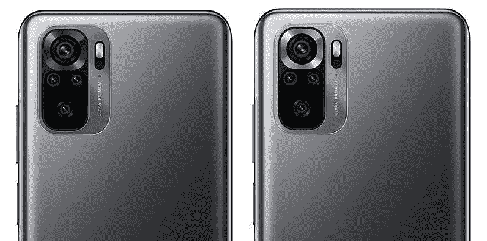
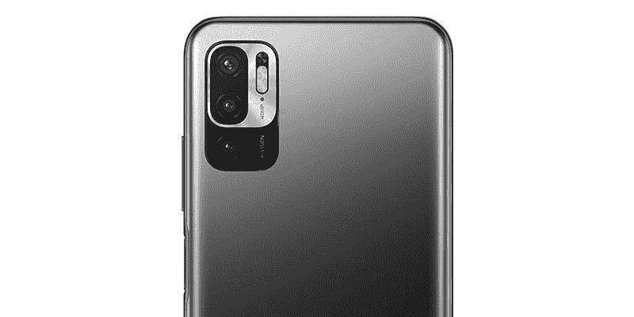

# Redmi Note 10 系列:销售、价格、规格和可用性

> 原文：<https://www.xda-developers.com/redmi-note-10/>

小米的 Redmi Note 10 系列到现在已经有一段时间了。事实上，我们甚至听说一个潜在的红米 Note 11 系列即将在中国发布。预算友好的 Note 10 阵容包括一系列设备，从普通的 Redmi Note 10 开始，一直到 Redmi Note 10 Pro/Pro Max。与去年的 Redmi Note 9 系列相比，这些设备带来了几项重大升级，包括[高刷新率 AMOLED 显示屏](https://www.xda-developers.com/xiaomi-redmi-note-10-series-super-amoled/)，高级相机硬件，以及 5G 支持。

如果你在过去几个月一直关注我们对红米 Note 10 系列的报道，你应该已经熟悉该系列中一些设备的[设计和规格](https://www.xda-developers.com/xiaomi-redmi-note-10-4g-spotted-tenaa-china/)。但如果你还没有，这里有你需要知道的关于 Redmi 最新的经济型设备的一切。

## 小米红米 Note 10 系列:变种

在我们谈论设计和规格之前，我们先来快速浏览一下 Redmi Note 10 系列的所有型号，以清除小米[复杂的命名方案造成的任何混乱。](https://www.xda-developers.com/opinion-smartphone-branding-out-of-control/#gallery-1:~:text=The%20worst%20offenders%20here%20are%20Xiaomi%E2%80%99s,which%20explains%20the%20similarities%20in%20devices.)

香草红米 Note 10 是所有产品中最稳定的。它在所有地区都是相同的设备，没有任何硬件或设计变化。Redmi Note 10S 在外观上与 Redmi Note 10 几乎相同，但它采用了不同的 SoC、主摄像头和 RAM/存储变体。它在印度市场也有售，但印度版本有不同的配色方案，并且缺乏 NFC 支持。

Redmi Note 10 5G 完全是一只完全不同的野兽，它提供了中端和入门级硬件的奇怪组合。你可能从它的名字就能看出，这款设备支持 5G。这将导致一些人认为这是一个比普通红米 Note 10 更好的设备。但事实绝对不是这样。虽然它确实提供了支持 AdaptiveSync 的高刷新率面板，但它不像该系列中的其他型号那样采用 AMOLED。因此，它提供了较差的对比度、峰值亮度和色彩准确度。最重要的是，这款设备不具备与该系列其他设备相同的快速充电能力。

Redmi Note 10 Pro 是另一个令人惊叹的产品，因为小米为两款略有不同的设备使用了这个名字。全球推出的 Redmi Note 10 Pro 是顶级型号，采用高刷新率 AMOLED 显示屏和 108MP 主摄像头。但该型号已在印度推出，名为 Redmi Note 10 Pro Max。在印度推出的 Redmi Note 10 Pro 与在全球推出的 Redmi Note 10 Pro 几乎相同，但配备了 6400 万像素的主摄像头。

如果你仍然感到困惑，或者你没有仔细阅读我们上面提到的所有内容，请查看下面的流程图进行快速浏览。

## 小米红米 Note 10 系列:规格

| 

规格

 | 

红米 Note 10

 | 

红米 Note 10S(仅限全球)

 | 

Redmi Note 10S(仅限印度)

 | 

红米 Note 10 5G(仅限全球)

 | 

红米 Note 10 Pro(仅限印度)

 | 

红米 Note 10 Pro(全球)/红米 Note 10 Pro Max(印度)

 |
| --- | --- | --- | --- | --- | --- | --- |
| **尺寸&重量** | 

*   160.46 x 74.5 x 8.29mm 毫米
*   178.8 克

 | 

*   160.46 x 74.5 x 8.29mm 毫米
*   178.8 克

 | 

*   160.46 x 74.5 x 8.29mm 毫米
*   178.8 克

 | 

*   161.81 x 75.34 x 8.92mm 毫米
*   190 克

 |  |  |
| **显示** | 

*   6.43 英寸 AMOLED 点显示器
*   2400 x 1080 像素
*   4500000:1 对比度
*   1，100 尼特峰值亮度
*   100% DCI-P3 覆盖率
*   SGS 认证的低蓝光
*   康宁大猩猩玻璃 3

 | 

*   6.43 英寸 AMOLED 点显示器
*   2400 x 1080 像素
*   4500000:1 对比度
*   1，100 尼特峰值亮度
*   100% DCI-P3 覆盖率
*   SGS 认证的低蓝光
*   康宁大猩猩玻璃 3

 | 

*   6.43 英寸 AMOLED 点显示器
*   2400 x 1080 像素
*   4500000:1 对比度
*   1，100 尼特峰值亮度
*   100% DCI-P3 覆盖率
*   SGS 认证的低蓝光
*   康宁大猩猩玻璃 3

 | 

*   6.5 英寸液晶点阵显示屏
*   自适应同步(30 赫兹/50 赫兹/60 赫兹/90 赫兹)
*   2400 x 1080 像素
*   1，500:1 对比度
*   500 尼特峰值亮度
*   康宁大猩猩玻璃 3

 | 

*   6.67 英寸 AMOLED 点显示器
*   2400 x 1080 像素
*   120 赫兹刷新率
*   240Hz 触摸采样率
*   4500000:1 对比度
*   1，200 尼特峰值亮度
*   100% DCI-P3 覆盖率
*   HDR10 认证
*   SGS 眼部护理显示器认证
*   康宁大猩猩玻璃 5

 | 

*   6.67 英寸 AMOLED 点显示器
*   2400 x 1080 像素
*   120 赫兹刷新率
*   240Hz 触摸采样率
*   4500000:1 对比度
*   1，200 尼特峰值亮度
*   100% DCI-P3 覆盖率
*   HDR10 认证
*   SGS 眼部护理显示器认证
*   康宁大猩猩玻璃 5

 |
| **SoC** | 

*   高通骁龙 678
*   肾上腺素 612

 | 

*   联发科 Helio G95
*   马里-76 国集团

 | 

*   联发科 Helio G95
*   马里-76 国集团

 | 

*   联发科天玑 700
*   马里-G57

 | 

*   高通骁龙 732G
*   肾上腺素 618

 | 

*   高通骁龙 732G
*   肾上腺素 618

 |
| **内存&存储** | 

*   4GB LPDDR4x + 64GB UFS 2.2
*   4GB + 128GB
*   6GB + 128GB
*   最高可扩展至 512GB(专用 microSD 卡插槽)

 | 

*   6GB LPDDR4x + 64GB UFS 2.2
*   6GB + 128GB
*   8GB + 128GB
*   最高可扩展至 512GB(专用 microSD 卡插槽)

 | 

*   6GB LPDDR4x +64GB UFS 2.2
*   6GB LPDDR4x + 128GB UFS 2.2
*   专用 microSD 卡插槽

 | 

*   4GB LPDDR4x + 64GB UFS 2.2
*   4GB + 128GB
*   6GB + 128GB

 | 

*   6GB LPDDR4x + 64GB UFS 2.2
*   6GB + 128GB
*   8GB + 128GB
*   最高可扩展至 512GB(专用 microSD 卡插槽)

 | 

*   6GB LPDDR4x + 64GB UFS 2.2
*   6GB + 128GB
*   8GB + 128GB
*   最高可扩展至 512GB(专用 microSD 卡插槽)

 |
| **电池&充电** | 

*   5000 毫安时
*   33W 有线快速充电
*   含 33W 充电器

 | 

*   5000 毫安时
*   33W 有线快速充电
*   含 33W 充电器

 | 

*   5000 毫安时
*   33W 有线快速充电
*   含 33W 充电器

 | 

*   5000 毫安时
*   18W 有线快速充电
*   含 22.5 瓦充电器

 | 

*   5020 毫安时
*   33W 有线快速充电
*   含 33W 充电器

 | 

*   5020 毫安时
*   33W 有线快速充电
*   含 33W 充电器

 |
| **安全** | 侧装式指纹扫描仪 | 侧装式指纹扫描仪 | 侧装式指纹扫描仪 | 侧装式指纹扫描仪 | 侧装式指纹扫描仪 | 侧装式指纹扫描仪 |
| **后置摄像头** | 

*   **初级:** 48MP，f/1.79，0.8μm
*   **次要:** 8MP 超宽，f/2.2，118 FoV
*   **第三级:** 2MP 宏，f/2.4
*   **四元:** 2MP 深度传感器，f/2.4

 | 

*   **初级:** 64MP，f/1.79，0.7μm
*   **次要:** 8MP 超宽，f/2.2，118 FoV
*   **第三级:** 2MP 宏，f/2.4
*   **四元:** 2MP 深度传感器，f/2.4

 | 

*   **初级:** 64MP，f/1.79，0.7μm
*   **次要:** 8MP 超宽，f/2.2，118 FoV
*   **第三级:** 2MP 宏，f/2.4
*   **四元:** 2MP 深度传感器，f/2.4

 | 

*   **初级:** 48MP，f/1.79，0.8μm
*   **二级:** 2MP 宏，f/2.4
*   **第三级:** 2MP 深度传感器，f/2.4

 | 

*   **初级:** 64MP，f/1.79，0.7μm
*   **次要:** 8MP 超宽，f/2.2，118 FoV
*   **第三级:** 5MP telemacro，f/2.4 (AF)
*   **四元:** 2MP 深度传感器，f/2.4

 | 

*   **主:** 108MP，f/1.9，2.1μm，9 合 1 像素宁滨
*   **次要:** 8MP 超宽，f/2.2，118 FoV
*   **第三级:** 5MP telemacro，f/2.4 (AF)
*   **四元:** 2MP 深度传感器，f/2.4

 |
| **前置摄像头** | 130 万像素，f/2.45 | 130 万像素，f/2.45 | 130 万像素，f/2.45 | 800 万像素 f/2.0 | 16MP，f/2.45 | 16MP，f/2.45 |
| **端口** | 

*   USB 类型-C
*   3.5 毫米耳机插孔

 | 

*   USB 类型-C
*   3.5 毫米耳机插孔

 | 

*   USB 类端口
*   3.5 毫米耳机插孔

 | 

*   USB 类型-C
*   3.5 毫米耳机插孔

 | 

*   USB 类型-C
*   3.5 毫米耳机插孔

 | 

*   USB 类型-C
*   3.5 毫米耳机插孔

 |
| **音频** | 

*   双扬声器
*   高分辨率音频认证

 | 

*   双扬声器
*   高分辨率音频认证

 | 

*   高分辨率音频认证

 | — | 

*   双扬声器
*   高分辨率音频认证

 | 

*   双扬声器
*   高分辨率音频认证

 |
| **连通性** | 

*   双卡(4G)
*   无线保真
*   蓝牙

 | 

*   双卡(4G)
*   无线保真
*   蓝牙
*   国家足球联盟

 | 

*   双卡(4G)
*   C 型端口
*   WiFi 802.11 . b/g/n/AC(2.4 GHz+5 GHz)

 | 

*   双 SIM 卡
*   5G SA/NSA
*   无线保真
*   蓝牙
*   国家足球联盟

 | 

*   双卡(4G)
*   无线保真
*   蓝牙

 | 

*   双卡(4G)
*   无线保真
*   蓝牙
*   NFC(在印度版本中不可用)

 |
| **软件** | 基于 Android 11 的 MIUI 12 | 基于 Android 11 的 MIUI 12.5 | 基于 Android 11 的 MIUI 12.5 | 基于 Android 11 的 MIUI 12 | 基于 Android 11 的 MIUI 12 | 基于 Android 11 的 MIUI 12 |
| **其他特征** | 

*   IP53 防溅
*   红外线增强器
*   z 轴线性振动电机

 | 

*   IP53 防溅
*   红外线增强器
*   z 轴线性振动电机

 |  |  | 

*   IP53 防溅
*   红外线增强器
*   z 轴线性振动电机

 | 

*   IP53 防溅
*   红外线增强器
*   z 轴线性振动电机

 |
| **颜色** | 

*   缟玛瑙灰(全球)
*   卵石白(全球)
*   湖绿色(全球)
*   黑色阴影(印度)
*   霜白(印度)
*   水绿色(印度)

 | 

*   海洋蓝
*   缟玛瑙灰
*   卵石白色

 | 

*   阴影黑色
*   霜白色
*   深海蓝

 | 

*   铬银
*   石墨灰色
*   夜间蓝色
*   极光绿

 | 

*   复古青铜
*   冰川蓝
*   黑夜

 | 

*   缟玛瑙灰(全球)
*   冰川蓝(全球)
*   渐变青铜色(全球)
*   复古青铜色(印度)
*   冰蓝色(印度)
*   黑夜(印度)

 |

* * *

## 设计

尽管小米今年没有做出任何努力来改进命名方案，但该公司已经做出了一些设计上的改变，让 Redmi Note 10 的阵容看起来更加一致。可能有点太一致了。与 Redmi Note 9 系列不同，所有新设备都采用了左对齐的矩形摄像头模块设计，尺寸变化不大。背板上的 Redmi 品牌也更加统一。但是，有一些细微的差别将有助于您区分该系列中的设备。

例如，Redmi Note 10 和 Note 10S 看起来几乎相同，但后者背面的主摄像头周围有一个银环，这将有助于你区分这两者。这个银环扩展到吞没了 Redmi Note 10 5G 上的两个摄像头模块，这将有助于你将其与其他两个模块区分开来，以防你碰巧忘记它有完全不同的背板和三摄像头设置。红米 Note 10S 的印度版本也采用了同样的设计，但它有三种不同的配色——阴影黑、霜白、深海蓝。

 <picture></picture> 

Redmi Note 10 5G

红米 Note 10 Pro 的国际版和印度版都在相机模块周围配备了前述的银环，尽管设备略有不同。但是红米 Note 10 Pro Max 没有，尽管它和国际上的红米 Note 10 Pro 是同一款手机。这使得仅仅通过观察来区分这两个顶级模型变得更加困难。尽管如此，红米 Note 10 系列的所有设备看起来都很不错。

 <picture></picture> 

Redmi Note 10 Pro (Global)

就其他设计选择和制造材料而言，所有手机都有一个侧装指纹扫描仪，集成在右边缘的电源按钮中，它的正上方有一个音量摇杆，底部有一个 USB Type-C 端口。Redmi Note 10 5G 是该系列中唯一一款没有 Z 轴振动电机、双立体声扬声器和高分辨率音频认证以及 IP53 等级的设备。但所有手机都配有 3.5 毫米耳机插孔和红外发射器。最顶级的红米 Note 10 Pro Max/红米 Note 10 Pro(全球)也采用了磨砂玻璃背面。

## 显示

### 红米 Note 10 & Note 10S

Redmi Note 10 和 Note 10S 采用相同的 6.43 英寸 AMOLED 点显示器，分辨率为 2400 x 1080 像素，刷新率为 60Hz。该显示器具有一个用于自拍相机的居中打孔切口，峰值亮度为 1，100 尼特，对比度为 4，500，000:1。它还提供了 100%的 DCI-P3 覆盖、Gorilla Glass 3 保护以及所有侧面的最小挡板。Redmi Note 10S 的印度版本也采用了相同的显示屏。

### 红米 Note 10 5G

另一方面，Redmi Note 10 5G 具有 6.5 英寸的点显示器，分辨率为 2400 x 1080 像素，自适应刷新率高达 90Hz (30Hz/50Hz/60Hz/90Hz)，对比度为 1500:1。与该系列中的其他设备不同，它的峰值亮度仅为 500 尼特。然而，它确实包括一个用于自拍相机和大猩猩玻璃 3 保护的居中打孔切口。

### 红米 Note 10 Pro & Note 10 Pro Max

Redmi Note 10 Pro(印度/全球)和 Note 10 Pro Max 采用相同的 6.67 英寸 AMOLED DotDisplay，为自拍相机提供了居中的打孔切口。该显示器的分辨率为 2400 x 1080 像素，刷新率为 120Hz，触摸采样率为 240Hz，对比度为 4，500，000:1。它的峰值亮度为 1200 尼特，提供 100%的 DCI-P3 覆盖，甚至通过了 HDR10 认证。最重要的是，该显示器具有 SGS 护眼显示器认证和 Gorilla Glass 5 保护。

## SoC、RAM 和存储

vanilla Redmi Note 10 由高通的骁龙 678 芯片驱动，该芯片装有 Adreno 612 GPU。该 SoC 与高达 6GB 的 LPDDR4x RAM 和高达 128GB 的 UFS 2.2 存储相结合。虽然 Redmi Note 10S 在外观上与普通 Note 10 完全相同，但在内部却不一样。该设备装有联发科 Helio G95 芯片和 Mali-G76 GPU，而不是骁龙 SoC。它还配备了更高的 RAM 和存储，从 6GB/64GB 开始，一直到 8GB/128GB。红米 Note 10S 的印度版本采用了相同的 SoC，但它只有 6GB/64GB 和 6GB/128GB 两种版本。

红米 Note 10 5G 再次成为一个异类。它封装了联发科的 Dimensity 700 芯片，该芯片采用了 Mali-G57 GPU。它提供三种 RAM/存储配置，从 4GB/64GB 到 6GB/128GB 不等。Redmi Note 10 Pro 和 Note 10 Pro Max 采用相同的骁龙 732G SoC，与地区无关。该 SoC 装有 Adreno 618 GPU，并配有高达 8GB 的 RAM 和高达 128GB 的板载存储。这些设备将提供三种存储版本，起价为 6GB/64GB。

小米已经证实，在印度推出的 Redmi Note 10 系列设备采用了三重 SIM 卡托盘，带有专用的 microSD 卡插槽，用于扩展。这三款设备都支持最大 512GB 的 microSD 卡。

## 摄像机

Redmi Note 10 系列中的所有手机都在背面设置了四摄像头，除了 Redmi Note 10 5G。这款支持 5G 的设备采用了三摄像头设置。虽然所有设备上的摄像头设置都有一些相似之处，但我们最好还是分别查看，以免混淆。

 <picture></picture> 

L: Redmi Note 10, R: Redmi Note 10S

先说红米 Note 10。它有一个 48MP f/1.79 主摄像头，一个 8MP f/2.2 超宽摄像头，具有 188 FoV，一个 2MP f/2.4 微距摄像头和一个 2MP f/2.4 深度传感器。Redmi Note 10S 装有 64MP 三星 ISOCELL GW3 f/1.79 主摄像头，但它与普通型号具有相同的 8MP+2MP+2MP 设置。小米没有对印度版红米 Note 10S 的摄像头进行任何更改。红米 Note 10 5G 配备了 48MP f/1.79 主摄像头、2MP f/2.4 微距摄像头和 2MP f/2.4 深度传感器。

 <picture></picture> 

Redmi Note 10 5G

Redmi Note 10 Pro 的印度版本具有 64MP 三星 ISOCELL GW3 f/1.79 主摄像头，8MP 超宽摄像头，118 FoV，5MP f/2.4 远距微距摄像头，自动对焦和 2 倍变焦，以及 2MP f/2.4 深度传感器。Redmi Note 10 Pro 的国际版本在印度被称为 Redmi Note 10 Pro Max，它包含一个 108MP 三星 ISOCELL HM2 f/1.9 主摄像头，具有 9 合 1 像素宁滨，一个 8MP 超宽摄像头，具有 118 FoV，一个 5MP f/2.4 远程微距摄像头，具有自动对焦和 2 倍变焦，以及一个 2MP f/2.4 深度传感器。

从正面来看，设备上的相机设置之间的差异并不令人困惑。红米 Note 10 和 Note 10S 采用 13MP f/2.45 自拍相机，红米 Note 10 5G 采用 8MP f/2.0 传感器，红米 Note 10 Pro/Pro Max 采用 16MP f/2.45 传感器。

## 电池和充电

Redmi Note 10 阵容上的电池容量和快速充电能力也相当一致，Note 10 5G 是唯一的异常值。Redmi Note 10 和 Redmi Note 10S 都装有 5,000mAh 电池，支持 33W 有线快速充电，带有随附的充电器。面向印度的 Redmi Note 10S 提供了相同的电池和充电功能。Redmi Note 10 Pro 和 Note 10 Pro Max 采用 5，020mAh 电池，通过随附的充电器提供相同的 33W 快速充电能力。

然而，Redmi Note 10 5G 采用了 5,000mAh 电池，仅支持 18W 有线快速充电。盒子里自带 22.5W 快速充电器。小米声称，使用随附的 33W 快速充电器，用户可以在 30 分钟内将 Redmi Note 10 设备充电至 50%。正如你所料，这并不适用于红米 Note 10 5G。

## 连通性

就连接选项而言，该系列中的所有手机都配有 USB Type-C 端口、3.5 毫米耳机插孔和 IR blaster。除了香草红米 Note 10 和红米 Note 10S(印度)之外，所有设备都配有 NFC。然而，在印度推出的车型中没有一款包含这一功能。这些设备还配有双 SIM 卡托盘，Note 10 5G 提供 5G (SA/NSA)双待机功能，其余仅限于 4G。这些手机还具有 Wi-Fi 和蓝牙功能。

## MIUI

红米 Note 10 阵容中的所有手机都开箱运行 Android 11，但只有红米 Note 10S 配备了小米最新的 MIUI 12.5 更新。其余的仍然限于 MIUI 12，但小米已经确认他们的 MIUI 12.5 更新已经在工作中，应该会在未来几周内到达用户。如果你不熟悉 MIUI 12.5，请查看以下部分，了解最新 MIUI 版本中所有新内容的详细变更日志:

### MIUI 12.5 变更日志

*   系统:
    *   新:对手势的反应现在是即时的
    *   新功能:渲染能力提高了 20 倍，现在您在屏幕上看到的内容几乎没有限制。
    *   新:通过定制设备型号调整，任何手机在升级后都变得更快。
    *   优化:MIUI 变得更轻、更快、更耐用。
*   系统动画:
    *   新:一个新的动画框架渲染运动更加真实。
    *   新:新的用户界面设计侧重于可视化，并使您与设备的互动更加逼真。
*   系统声音:
    *   新:自然混合是一个新的令人兴奋的方式来创建自己的通知声音系统。
    *   新:数百个系统声音，代表来自世界各地的动物。
    *   新:立体声系统声音。
*   超级壁纸:
    *   新:四姑娘山超级壁纸。
*   隐私保护:
    *   新:现在你可以看到什么应用程序访问你的剪贴板和控制访问。
    *   新:使用近似位置为隐私保护加分。
    *   新:你现在可以独立管理敏感权限和相关的应用程序行为。
    *   新:网页的行为现在也被跟踪，这有助于您阻止不想要的和恶意的行动。
    *   新:现在由你决定谁和什么时候可以跟踪你的在线行为。
    *   新:现在所有的应用程序都有 GetApps 的安全声明。
    *   新:隐私风险扫描器。
    *   新功能:控制哪些应用程序可以访问和删除图库中的项目。
    *   新:对所有敏感权限的全面概述。
    *   新功能:每当使用高风险权限时，您都会收到通知，并能够阻止相应的操作。
    *   优化:一个全新的隐私保护页面。
*   注意事项:
    *   新:用复杂的结构组成思维导图。
    *   新:涂鸦和素描的新工具。
    *   新增:按住草图以自动调整笔划。
    *   新:手势快捷方式现在允许你在任何地方创建笔记、任务和摘录。
    *   新:摘录保存文本，网址和图像笔记在几个简单的点击。
    *   新:Dynamix 布局使 Notes 的排版达到了一个新的水平。
    *   全新的笔记。
*   MIUI+:
    *   你可以把你的电话和电脑合并成一个工作站。
    *   您可以在电脑上查看 MIUI 通知和打开手机应用程序。
    *   你手机上的应用程序可以转移到电脑上。
    *   手机上复制的内容现在可以粘贴到电脑上，反之亦然。
    *   移动设备上的照片和截图可以立即在电脑上使用。
    *   网页可以无缝地从一个设备传递到另一个设备。
    *   您可以使用电脑上的“MIUI+”面板将文件传输到移动设备。
    *   新的电脑“文件管理器”和“笔记”。
*   浮动窗口:
    *   新:即时信使现在支持浮动窗口。
    *   新:浮动窗口可以很快被全屏版本的应用程序所取代。
    *   新:当应用程序显示为浮动窗口时，应用程序抽认卡显示关键信息。
    *   在“特殊功能”中了解更多新功能。
*   小米健康:
    *   新:你现在可以用相机测量你的心率了。
    *   新功能:开始手动记录跑步、步行和自行车训练，并享受大量在线训练课程。
    *   优化:自动训练识别现在更加准确。
*   主屏幕:
    *   新:下载应用程序的“涟漪”动画。
    *   新:卸载应用程序的“爆发”动画。
    *   新:应用程序文件夹的新设计。
    *   新:最近的垂直布局。
*   铸造:
    *   新:宽高比自动调整到外部显示器在铸造过程中。
    *   新:应用程序的音频在一个浮动窗口中播放，与其他音频分开。
*   小米云:
    *   新:密码管理器允许你在云中存储密码。
    *   新功能:您可以与家人共享群组中的其他人共享设备位置。
    *   新:位置信息可以在设备关机前自动记录。
    *   新增:将图像转换为 PDF。
*   Mi 运营商服务:
    *   新:你现在可以管理多个 SIM 卡。
*   IME:
    *   新:一种更方便的使用滚动条移动光标的方式。
    *   新:功能按钮支持语言和键盘之间的切换。
    *   新功能:您可以按住功能按钮来访问更多功能。
    *   新:自定义键盘主题。
*   主题:
    *   新:第三方字体的字体粗细调整选项。
    *   优化:系统壁纸、动画和声音的个性化功能。
*   浏览器:
    *   新:在建兴模式下定制壁纸。
    *   优化:重新设计的隐姓埋名模式。
    *   优化:现在页面加载速度快多了。
*   米家:
    *   新:你现在可以管理多个 SIM 卡。
    *   优化:改进设备控制中心。
*   搜索:
    *   优化:本地搜索结果现在自动排序。
    *   优化:全新设计。

除了上述变化，小米还宣布，它正在为印度市场进行额外的改进。随着这些即将到来的变化，小米计划减少货币化活动和预装的膨胀软件，这一直是印度用户关注的一个主要问题。

尽管红米 Note 10 系列的 MIUI 将配备小米常用的应用程序，但该公司最终会让用户卸载非必要的应用程序，如股票天气、计算器和日历应用程序。

## 第三方开发

在推出新的红米 Note 10 阵容后不久，小米[发布了香草红米 Note 10 的内核源代码](https://www.xda-developers.com/xiaomi-releases-kernel-sources-redmi-note-10-mi-10t-lite-mi-10i/)。您可以从下面的链接查看和下载内核源代码。

**[红米 Note 10 内核源代码](https://github.com/MiCode/Xiaomi_Kernel_OpenSource/tree/mojito-r-oss)**

我们为 Redmi Note 10 和 Redmi Note 10 Pro 开放了论坛，以促进对这些设备的讨论和第三方开发。你可以点击下面的链接进入论坛，了解最新的发展动态。

**[红米 Note 10 XDA 论坛](https://forum.xda-developers.com/f/redmi-note-10.12197/) || [红米 Note 10 Pro XDA 论坛](https://forum.xda-developers.com/f/redmi-note-10-pro.12117/)**

如果你不是 MIUI 粉丝，你会很高兴地知道，我们论坛上的开发者已经发布了第一个基于 AOSP 的 Redmi Note 10 定制 ROM。你可以通过点击[链接](https://www.xda-developers.com/redmi-note-10-first-aosp-rom/)了解更多关于定制 ROM 的信息。

## 小米红米 Note 10 系列:定价与供货

小米 Redmi Note 10 系列定价如下:

| 

没有。

 | 

设备

 | 

中国

 | 

全球的

 | 

印度

 |
| --- | --- | --- | --- | --- |
| **1。** | **红米 Note 10:**

*   国际:
    *   缟玛瑙灰
    *   卵石白色
    *   湖绿色
*   印度:
    *   阴影黑色
    *   霜白色
    *   水绿色

 |  |  |  |
| 1.1. | 4GB + 64GB | - | $199 | ₹11,999(~$165) |
| 1.2. | 4GB + 128GB | - | $229 | - |
| 1.3. | 6GB + 128GB | - | - | ₹13,999(~$193) |
|  |  |  |  |  |
| **2。** | 红米 Note 10S:

*   国际:
    *   海洋蓝
    *   缟玛瑙灰
    *   卵石白色
*   印度:
    *   阴影黑色
    *   霜白色
    *   深海蓝

 |  |  |  |
| 2.1. | 6GB + 64GB | - | $229 | ₹14,999 (~$203) |
| 2.2. | 6GB + 128GB | - | $249 | ₹15,999 (~$216) |
| 2.3. | 8GB + 128GB | - | $279 | - |
|  |  |  |  |  |
| **3。** | **红米 Note 10 5G:**

*   国际:
    *   铬银
    *   石墨灰色
    *   夜间绿色
    *   极光绿

 |  |  |  |
| 3.1. | 4GB + 64GB | - | $199 | - |
| 3.2. | 4GB + 128GB | - | $229 | - |
|  |  |  |  |  |
| **4。** | **红米 Note 10 Pro:**

*   印度:
    *   复古青铜
    *   冰川蓝
    *   黑夜

 |  |  |  |
| 4.1. | 6GB + 64GB | - | - | ₹15,999(~$220) |
| 4.2. | 6GB + 128GB | - | - | ₹16,999(~$234) |
| 4.3. | 8GB + 128GB | - | - | ₹18,999(~$261) |
|  |  |  |  |  |
| **5。** | **红米 Note 10 Pro(全球):**

*   缟玛瑙灰
*   冰川蓝
*   渐变青铜

**红米 Note 10 Pro Max(印度):**

*   复古青铜
*   冰川蓝
*   黑夜

 |  |  |  |
| 5.1. | 6GB + 64GB | - | $279 | ₹18,999(~$261) |
| 5.2. | 6GB + 128GB | - | $299 | ₹19,999(~$275) |
| 5.3. | 8GB + 128GB | - | $329 | ₹21,999(~$303) |

在印度，Redmi Note 10 将有三种配色——阴影黑、霜白和水绿——并将于 3 月 16 日开始通过小米网站、亚马逊网站和其他线下零售商销售。Note 10 Pro 还将有三种配色——复古古铜色、冰蓝和黑夜——并将于 3 月 17 日开始通过相同渠道销售。

最后，Redmi Note 10 Pro Max 将于 3 月 18 日开始通过小米网站、亚马逊和其他线下零售商上市销售。它还将有三种颜色可供选择——复古青铜色、冰蓝色和黑夜色。

**[小米 Redmi Note 10 Pro 点评:为大众带来 120Hz 显示屏和 108MP 摄像头](https://www.xda-developers.com/xiaomi-redmi-note-10-pro-review/)**

早期买家将有资格获得一系列发布优惠——你可以在小米的[网站](https://www.mi.com/in/index.html?utm_source=google&utm_medium=cpc&utm_campaign=%5BA_BR%5BSEM_B%5BXiaomiBRAND_S%5D20190102%5D&gclid=Cj0KCQiAhP2BBhDdARIsAJEzXlFh0S2lhshI7EvLmv9IdS4M_XNy0_YiNib_Yh3HmDjEdsalr1KIz6AaAigqEALw_wcB)上找到更多关于它们的细节。除了这些设备，小米还推出了一款钢化玻璃屏幕保护器，名为 Mi Protective Glass。小米将在未来几天通过其区域社交媒体渠道宣布红米 Note 10 系列在欧洲的上市细节。不过，该公司透露，Redmi Note 10 和 Note 10 Pro(全球)将于 3 月 8 日和 3 月 9 日通过速卖通以折扣价出售。红米 Note 10S 于 5 月 18 日在印度上市，可通过小米网站、亚马逊网站、小米之家商店以及全国各地的精选零售连锁店购买。

正如预期的那样，小米在印度推出了 [Redmi Note 10 5G，名为 POCO M3 Pro 5G](https://www.xda-developers.com/poco-m3-pro-5g-arrvies-in-india-with-a-mediatek-dimesnsity-700-chip/) 。这款设备的设计略有更新，但它的硬件与 Redmi 型号相同。

 <picture></picture> 

Redmi Note 10

##### 小米 Redmi Note 10

红米 Note 10 是小米广受欢迎的红米 Note 系列中最新的经济型产品。它配备了 6.43 英寸的 FHD+ AMOLED 显示屏，4800 万像素的四摄像头设置，以及高通的骁龙 678 芯片。它还配备了 5000 毫安时的大电池，并运行基于 Android 11 的 MIUI 12。

 <picture></picture> 

Redmi Note 10 Pro / Pro Max

##### 小米红米 Note 10 Pro

Redmi Note 10 Pro 是 vanilla Redmi Note 10 的一个稍微更强大的版本，具有更大的 6.67 英寸 AMOLED 显示屏，64MP 四摄像头设置，以及高通的骁龙 732G 芯片。它还配有一块 5，020 毫安时的大电池，开箱即可运行基于 Android 11 的 MIUI 12。

 <picture></picture> 

Redmi Note 10 Pro Max

##### 红米 Note 10 Pro Max

Redmi Note 10 Pro Max 是新 Redmi Note 10 系列中功能最丰富的设备。它配备了 108MP 四摄像头设置，一个出色的 6.67 英寸 AMOLED 显示屏，以及高通的骁龙 732G 芯片。它还装有 5020 毫安时电池，开箱即可运行 MIUI 12。