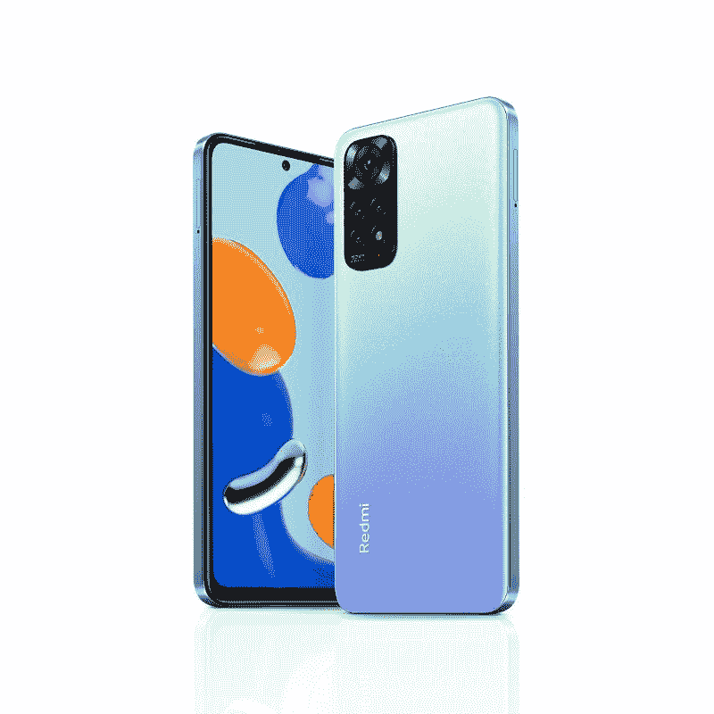

# 红米 Note 11 上手体验:这个价格标签让人很难挑剔

> 原文：<https://www.xda-developers.com/redmi-note-11-hands-on/>

在我开始评估红米 Note 11(T1)之前，这是小米刚刚宣布的四款手机系列的基础型号，我必须承认:对我来说，评估 T2 中端手机(T3)很难。我一生中的大部分时间都是一个特权小工具爱好者，这意味着即使在我以测试智能手机为生之前，我已经只使用旗舰手机了。因此，对于像我这样经常接触最新的[可折叠手机](https://www.xda-developers.com/best-foldable-phones)或最前沿的玻璃板的人来说，当测试显然没有使用最新最好组件的手机时，我自然会感到有点无聊。

因此，我使用红米 Note 11 的第一个小时充满了失望。开箱后，我发现深灰色非常暗淡，更糟糕的是，这款手机的触觉引擎很弱——模糊不清且不精确，这与我最近测试过的每一款小米手机都有明显的不同，这些手机都有出色的*可以说是同类最佳的*触觉，甚至是去年 279 美元[的红米 Note 10 Pro](https://www.xda-developers.com/xiaomi-redmi-note-10-pro-review/) 。90Hz 的刷新率也比 Note 10 Pro 的 120Hz 屏幕低了一步。*什么鬼，为什么 Note 11 比去年降级了？*我以为。

然后我意识到这是因为我在测试 Note 11 系列的绝对最低层，这是一款预算手机，而不是一款中档手机。我去年测试的中端 Note 10 Pro 的实际继任者将是 Note 11 **Pro** 。事实上，我之前从未测试过非专业的 Redmi 设备。更糟糕的是，小米可能拥有目前智能手机领域最令人困惑的品牌阵容，这使得即使是经验丰富的科技记者也很难跟踪他们的手机。

然后我看了 Redmi 的发布会，当价格公布时，这款手机的一切都变得更有意义了。我正在测试的这款基本款 Redmi Note 11 将在欧洲和亚洲其他地区零售，起价相当于 179 美元(美元数字仅供参考，因为这款手机实际上不会在美国正式销售)，一些市场将获得早鸟折扣，使手机价格再降低 20 美元。

这使得 Redmi Note 11 的售价低至 159 美元。一旦我理解了这个价格标签，那么我对手机的所有抱怨几乎都烟消云散了(我仍然觉得我的手机色彩很单调)。这是知名品牌新发布的功能性智能手机的最低价格。

### 红米 Note 11 系列(全球)规格:点击展开

| 

规格

 | 

红米 Note 11

 | 

红米 Note 11S

 | 

红米 Note 11 Pro

 | 

红米 Note 11 Pro 5G

 |
| --- | --- | --- | --- | --- |
| **建造** | 

*   IP53 防溅
*   康宁大猩猩玻璃 3 正面

 | 

*   IP53 防溅
*   康宁大猩猩玻璃 3 正面

 | 

*   IP53 防溅
*   康宁大猩猩玻璃 5 正面

 | 

*   IP53 防溅
*   康宁大猩猩玻璃 5 正面

 |
| **尺寸&重量** | 

*   159.867 x 73.87 x 8.09mm 毫米
*   179 克

 | 

*   159.867 x 73.87 x 8.09mm 毫米
*   179 克

 | 

*   164.19 x 76.1 x 8.12mm 毫米
*   202 克

 | 

*   164.19 x 76.1 x 8.12mm 毫米
*   202 克

 |
| **显示** | 

*   6.43 英寸 FHD+ AMOLED
*   2400 x 1080
*   90Hz 刷新率
*   180Hz 触摸采样速率
*   DCI-P3 宽色域
*   1000 尼特峰值亮度

 | 

*   6.43 英寸 FHD+ AMOLED
*   2400 x 1080
*   90Hz 刷新率
*   180Hz 触摸采样速率
*   DCI-P3 宽色域
*   1000 尼特峰值亮度

 | 

*   6.67 英寸 FHD+ AMOLED
*   2400 x 1080
*   120 赫兹刷新率
*   360Hz 触摸采样率
*   DCI-P3 宽色域
*   1200 尼特峰值亮度

 | 

*   6.67 英寸 FHD+ AMOLED
*   2400 x 1080
*   120 赫兹刷新率
*   360Hz 触摸采样率
*   DCI-P3 宽色域
*   1200 尼特峰值亮度

 |
| **SoC** | 

*   高通骁龙 680
*   Adreno 610 GPU

 | 

*   联发科 Helio G96
*   ARM Mali-G57 MC2 GPU

 | 

*   联发科 Helio G96
*   ARM Mali-G57 MC2 GPU

 | 

*   高通骁龙 695
*   Adreno 619 GPU

 |
| **内存&存储** | 

*   4GB LPDDR4x + 64GB UFS 2.2
*   4GB + 128GB
*   6GB + 128GB

 | 

*   6GB LPDDR4x + 64GB UFS 2.2
*   6GB + 128GB
*   8GB + 128GB

 | 

*   6GB LPDDR4x + 64GB UFS 2.2
*   6GB + 128GB
*   8GB + 128GB

 | 

*   6GB LPDDR4x + 64GB UFS 2.2
*   6GB + 128GB
*   8GB + 128GB

 |
| **电池&充电** | 

*   5000 毫安时
*   33W 快速充电支持
*   含 33W 充电器

 | 

*   5000 毫安时
*   33W 快速充电支持
*   含 33W 充电器

 | 

*   5000 毫安时
*   67W 快速充电支持
*   含 67W 充电器

 | 

*   5000 毫安时
*   67W 快速充电支持
*   含 67W 充电器

 |
| **安全** | 侧装式指纹扫描仪 | 侧装式指纹扫描仪 | 侧装式指纹扫描仪 | 侧装式指纹扫描仪 |
| **后置摄像头** | 

*   初级:50MP f/1.8
*   超宽:800 万像素 f/2.2，118 FoV
*   宏:2MP f/2.4
*   深度:2MP f/2.4

 | 

*   主要:108MP 三星 HM2 f/1.9
*   超宽:800 万像素 f/2.2，118 FoV
*   宏:2MP f/2.4
*   深度:2MP f/2.4

 | 

*   主要:108MP 三星 HM2 f/1.9
*   超宽:800 万像素 f/2.2，118 FoV
*   宏:2MP f/2.4
*   深度:2MP f/2.4

 | 

*   主要:108MP 三星 HM2 f/1.9
*   超宽:800 万像素 f/2.2，118 FoV
*   宏:2MP f/2.4
*   深度:2MP f/2.4

 |
| **前置摄像头** | 1300 万像素 f/2.4 | 1600 万像素 f/2.4 | 1600 万像素 f/2.4 | 1600 万像素 f/2.4 |
| **端口** | 

*   USB 类型-C
*   3.5 毫米耳机插孔

 | 

*   USB 类型-C
*   3.5 毫米耳机插孔

 | 

*   USB 类型-C
*   3.5 毫米耳机插孔

 | 

*   USB 类型-C
*   3.5 毫米耳机插孔

 |
| **音频** | 双扬声器 | 双扬声器 | 双扬声器 | 双扬声器 |
| **连通性** | 

*   双 SIM +专用 microSD 卡插槽
*   802.11 无线网络
*   蓝牙 5.0

 | 

*   双 SIM +专用 microSD 卡插槽
*   802.11 无线网络
*   蓝牙 5.0

 | 

*   双 SIM +混合 microSD 卡插槽
*   802.11 无线网络
*   蓝牙 5.1

 | 

*   双 SIM +混合 microSD 卡插槽
*   802.11 无线网络
*   蓝牙 5.1

 |
| **软件** | 基于 Android 11 的 MIUI 13 | 基于 Android 11 的 MIUI 13 | 基于 Android 11 的 MIUI 13 | 基于 Android 11 的 MIUI 13 |
| **其他特征** | 

*   NFC(有限的区域可用性)
*   红外线增强器

 | 

*   NFC(有限的区域可用性)
*   z 轴直线电机
*   红外线增强器

 | 

*   国家足球联盟
*   z 轴直线电机
*   红外线增强器

 | 

*   国家足球联盟
*   z 轴直线电机
*   红外线增强器

 |

***关于这次动手:**小米提供了一台红米 Note 11 进行测试和评测。它在这一条中没有任何投入。*

## 红米 Note 11:硬件

好吧，所以我以批评 Redmi Note 11 的触觉和颜色开始这篇文章。前者是没办法的(但考虑到价格标签，可以原谅)，但后者是可以解决的:你可以选择另一种颜色。Redmi Note 11 有多种颜色，从渲染图来看，其他颜色在我看来要好得多。

值得小米称赞的是，Redmi Note 11 的构造非常坚固:按钮坚固而有弹性，背面材料是塑料，但涂有类似玻璃的涂层，令人信服。聚碳酸酯中框也有扁平的侧面，尽管与一些报道相反，侧面不像 [iPhone 13](https://www.xda-developers.com/apple-iphone-13-review/) 系列(或 [Vivo V23](https://www.xda-developers.com/vivo-v23-pro-hands-on/) )那样*坚硬且有棱角*；边缘被倒角了。手机背面也有微妙的弯曲，而不是像 iPhone 那样坚硬平坦的侧面。红米 Note 11 感觉不是以那种 iPhone 13 的外观为目标的；其实小米去年就已经[用上了这个设计](https://www.xda-developers.com/xiaomi-mi-11-lite-5g-preview/)。

是的，这是你在上面的照片中看到的耳机插孔，以及手机顶部和底部突出的扬声器格栅。当设备处于风景模式时，Redmi Note 11 具有出色的外向扬声器。在框架的右侧是音量摇杆和一个兼作指纹传感器的电源按钮。

我提到，最初，在使用的第一个小时，我对红米 Note 11 的 90Hz 显示感到失望。当时我认为这款手机的价格在 275-300 美元之间，将其范围扩大到了早期的中档领域。既然我们知道这款手机的价格远低于 200 美元，我没什么可抱怨的。你得到了一个 FHD+ OLED 面板，90Hz 仍然相当平滑，颜色和视角在视觉上很有吸引力。屏幕达到了 1000 尼特的最大亮度，这与我一直使用的旗舰产品相比并不出色，但对于一款经济型手机来说呢？很好，即使在阳光明亮的大窗户旁边使用，我也能看到屏幕。

### **摄像机**

打孔机装有一个 1300 万像素的自拍相机，而主相机系统由一个“四摄像头”设置组成。我使用引号，因为其中两个是 2MP 传感器，不会做太多。这更像是一个双摄像头系统，50MP，f/1.8 主镜头，8MP，f/2.2 超宽。

如果光线条件最佳，您可以使用 50MP 主摄像头获得一些立体图像。当近距离拍摄物体时，它实际上会产生令人满意的散景效果，颜色也很准确——尽管动态范围不够。在下面的例子中，同样的场景从看起来相对清晰和动态变得有点沉闷，因为太阳移动了，阴影覆盖了更多的城市街道。

显然，超宽相机的表现不佳，如果拍摄明亮的光线，曝光不佳，看起来一般都很柔和。晚上问题更严重。

对于夜拍来说，超宽实际上是无法使用的，因为 Redmi Note 11 甚至无法使用夜间模式来修复一些硬件缺点(在超宽模式下根本无法使用夜间模式)。这是一个遗憾，因为小米的夜间模式相当好，可以修复主摄像头的故障。

视频录制最高可达 1080p/60，而且没有任何稳定效果，所以任何行走和谈话的镜头都不稳定。自拍在理想的光线条件下很好，但逆光拍摄，它根本无法正确曝光。

### 处理器和内存

Redmi Note 11 运行在[高通骁龙 680](https://www.xda-developers.com/qualcomm-778g-plus-695-680-480-plus-announced/) 上，这是一款相对较新的预算高通 SoC，具有 8 个内核，基于 6 纳米架构。有 4GB 或 6GB 的 LPDDR4x 内存和 128GB 的 UFS 2.2 存储。这些显然不是最高端的组件，但我在我的 6GB RAM 型号上的基本智能手机性能没有问题；事实上，Note 11 处理像*漫威冠军赛*和 *32 秒*这样的游戏没有任何明显的性能滞后或帧丢失。Redmi Note 11 在 Geekbench 的多核和单核测试中分别获得了 1，670 和 388 的成绩。

作为一款廉价手机，Redmi Note 11 拥有令人印象深刻的立体声扬声器，以及 IP53 防水溅等级。屏幕也涂有大猩猩玻璃 3。

最后，包裹硬件包装的是一块 5,000 mAh 的电池，可以以 33W 的速度快速充电，充电砖包含在包装中。我只测试了这款手机一天，我一直被困在酒店房间的隔离区，所以我没有真正测试电池寿命，但请放心，有了 5000 毫安时的电池和 90Hz 的屏幕，这应该很容易成为一整天的手机。

## 红米 Note 11:软件

红米 Note 11 搭载的 [MIUI 13](https://www.xda-developers.com/miui-13/) 超过安卓 11。MIUI 13 理应带来很多性能提升，如更流畅的动画和更好的电池和内存管理，但在我的短时间测试中，我没有注意到任何重大升级——这不是一件坏事，因为我在过去几年中没有遇到 MIUI 性能的问题。视觉上，它看起来非常类似于 MIUI 12.5，在我短暂的时间里，我唯一能发现的新功能是新的指纹传感器快捷手势，允许双击传感器来启动应用程序。这个功能显然不会与小米的旗舰产品一起使用，因为它们使用了内置指纹传感器。

开箱即用，MIUI 13 将传统的 Android 下拉通知面板分为两部分:一个是通知面板，另一个是快捷切换按钮面板。访问这些按钮的方式与 iOS 类似，通过拖动屏幕右上角的快捷切换按钮可以访问这些按钮。我*讨厌*这种设置，好消息是 MIUI 允许我变回传统的 Android 方法。所以小米用这个覆盖了它的基地。

## Redmi Note 11:早期印象

我说过，我必须学会抛开个人感情和特权去测试红米 Note 11。因为例如，作为一个测试所有[最新旗舰相机](https://www.xda-developers.com/best-smartphone-cameras/)的人，红米 Note 11 的相机绝对不可能给我留下深刻印象。当我看到 Redmi Note 11 的超广角镜头在晚上看起来有多糟糕时，我实际上嘲笑了我。

但我被自己拥有的使用 1000 美元(见鬼，甚至 2700 美元)手机的特权宠坏了。如果我退一步，从目标人群的角度来看红米 Note 11:那些不能或不愿支付超过几百美元的人，那么红米 Note 11 提供了很多。您可以获得身临其境的屏幕、全天电池续航时间、物超所值的良好构建质量、可以承受更昂贵手机的出色扬声器，以及流畅且反应灵敏的软件。有足够的处理能力来运行重要的日常应用程序，不会出现任何问题。

您可以获得身临其境的屏幕、全天电池续航时间、物超所值的良好构建质量、可以承受更昂贵手机的出色扬声器，以及流畅且反应灵敏的软件。

当然，如果你不看起来像是从楼梯上摔下来，你就无法拍摄行走和谈话视频，晚上的超宽照片看起来像是印象派绘画，但 180 美元的价格只能合理地期待这么多。对于不想支付超过 200 美元的人来说，红米 Note 11 是他们能得到的最好的东西。

 <picture></picture> 

Redmi Note 11

##### 红米 Note 11

Redmi Note 11 是一款价格非常实惠的智能手机，售价不到 180 美元，提供大电池、身临其境的 90Hz 屏幕和稳定的性能。