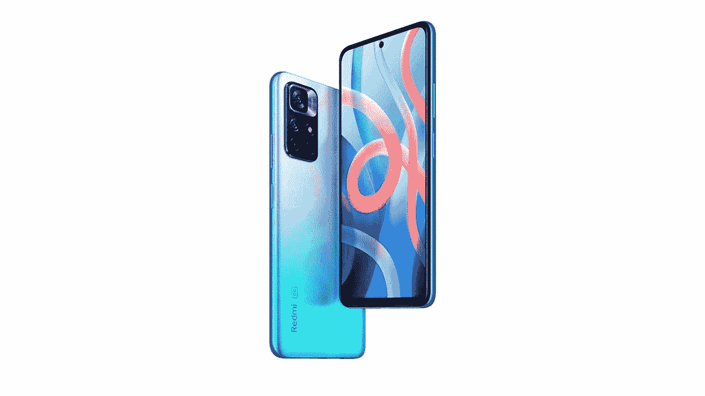

# 红米 Note 11T 5G 回顾:2021 年成功扛起 5G 重担

> 原文：<https://www.xda-developers.com/redmi-note-11t-5g-review/>

一般来说，我通过围绕有问题的产品建立一些背景来开始评论。这一次，我决定从判决开始。Redmi Note 11T 是 2021 年的一款典型的中端 5G 手机。它有一个支持 5G 的功能强大的芯片组，一个大电池，一个像样的显示屏和一组普通的摄像头。到目前为止，这是这个细分市场中几乎每款 5G 手机的故事。事实是， *5G* 标签品牌所追求的是有代价的，这种负担在 2021 年的印度是完全可以避免的。

鉴于 5G 仍然是一项相对较新的技术，集成 5G 调制解调器的芯片组并不便宜。全球芯片短缺加剧了这种痛苦。为了适应处理器价格的上涨，品牌不得不在其他地方偷工减料。这就是为什么你看到一个液晶显示器而不是有机发光二极管，劣质相机，以及其他一些妥协。如果你仍然坚持购买这个价位的 5G 手机，你最好的选择是选择一款使*妥协最少的*。红米 Note 11T 就是其中之一。让我告诉你为什么。

***关于这篇评测:**小米印度给我们发来了红米 Note 11T 5G，在写这篇评测之前，该设备使用了一周的时间。该品牌没有对此次审查的内容提出任何意见。*

## 红米 Note 11T 5G:规格

| 

规格

 | 

红米 Note 11T 5G

 |
| --- | --- |
| **构建** | 聚碳酸酯框架+背面 |
| **尺寸&重量** | 

*   163.6 x 75.8 x 8.8 毫米
*   195 克

 |
| **显示** | 

*   6.6 英寸 IPS 液晶屏
*   90Hz 刷新率
*   450 尼特峰值亮度
*   1080 x 2400 分辨率
*   20:9 宽高比
*   大猩猩玻璃 3 保护

 |
| **SoC** | 

*   联发科天玑 810
    *   2 个 2.4GHz Cortex-A76
    *   6 个 2.0GHz Cortex-A55
*   6 纳米
*   马里 G-57 MC2 GPU

 |
| **闸板&存放** | 

*   6/8GB 内存
*   64/128GB 内部存储
*   微型 SD 卡插槽

 |
| **电池&充电** | 

*   5000 毫安时电池
*   33W 快速充电

 |
| **安全** | 侧装式指纹扫描仪 |
| **后置摄像头** | 

*   小学:50MP，f/1.8，PDAF
*   超宽:800 万像素，f/2.2

 |
| **前置摄像头** | 16MP，f/2.5 |
| **端口** |  |
| **音频** | 

*   3.5 毫米音频插孔
*   立体声扬声器

 |
| **连通性** | 

*   Wi-Fi 802.11 a/b/g/n/ac
*   蓝牙 5.1
*   5G
*   双卡
*   全球定位系统、A-GPS、GLONASS、伽利略、BDS

 |
| **软件** |  |
| **其他特性** | 

*   IP53 等级
*   预装屏幕保护器
*   盒子里的盒子

 |

* * *

## 建造和设计

Redmi Note 11T 5G 看起来与该细分市场中的任何其他智能手机都相似。它有一个聚碳酸酯框架和哑光质地的背面。虽然我不会说该品牌在手机的外观和手感上有所妥协，但今年早些时候的 Redmi Note 10 Pro 手感要好得多。手机感觉挺厚重的，背面感觉也不是很溢价。

不过它的防护等级是 IP53，所以偶尔溅出或溅入应该没问题。后置摄像头模块遵循与前代 Note 设备相同的设计语言。从远处看，相机阵列似乎有四个镜头。但仔细观察，你会发现这款手机只有两个摄像头和一个 LED 闪光灯。带有红点和 *AI* 商标的两个额外的环是不必要的，只是为了给人一种四摄像头设置的错觉。

小米在侧装式指纹扫描仪方面做得非常出色。速度非常快。

小米做得非常出色的地方是侧装式指纹扫描仪。它既快又可靠。十有八九，当我把手机从口袋里拿出来的时候，手机已经解锁了。然而，从口袋里拿出来后，由于显示屏的巨大尺寸，我每次都必须用双手来使用这款设备。小米在盒子里放了一个保护套，虽然它可以保护手机，但 TPU 材料使它非常滑。

如前所述，这一细分市场的 4G 手机通常制造得更好，或者握持和使用起来感觉更好。Redmi Note 10 Pro 更薄更轻，并且有一个玻璃背板。Realme 8 很紧凑，单手操作也很方便。

* * *

## 显示

不可否认，印度是一个规格驱动的市场。任何手机规格表上的 *AMOLED* 字样都会自动吸引比 IPS LCD 显示屏手机更多的眼球。各品牌也注意到了这一点，今年推出了采用 AMOLED 显示屏的手机，甚至在 sub-₹20k 的价格区间也是如此。Redmi Note 10 系列和 Realme 8 系列都有有机发光二极管面板，小米更进一步，为 Note 10 Pro 和 Pro Max 提供了 120Hz 的刷新率。

当然，随着 5G 芯片组带来的价格上涨，有机发光二极管显示器在这个价格区间是不可能的。这就是为什么所有 5G 手机都选择价格低于₹20,000.的 LCD 显示屏红米 Note 11T 还有一个 90Hz 刷新率的 LCD 显示屏。使用的面板具有可变刷新率，这意味着显示器可以从 30Hz 一直到 90Hz。

平滑的刷新率无疑改善了滚动列表和社交媒体源的体验。

平滑的刷新率无疑改善了滚动列表和社交媒体源的体验。然而，有时，我确实注意到快速滚动时有轻微的口吃。这是我过去在小米的一些手机上观察到的，这些手机有可变刷新率的 LCD 显示屏，即 Mi 10i 和 Poco X3。虽然这并不是很频繁，但并不影响使用手机的整体体验。

刷新率只是显示器的一个重要方面。最重要的是面板本身的质量。小米已经提供了不错的 IPS 液晶面板，全高清+分辨率。显示屏中央有一个用于自拍相机的穿孔。显示器在室内变得足够亮，但在阳光直射下，你可能很难理解屏幕上的内容。我个人欣赏的另一件事是显示器周围的边框，尤其是下巴上的边框非常小。

这是中端 5G 手机上较好的显示面板之一。

如果你在智能手机上观看大量内容，你会对红米 note 11T 上的显示感到满意。当然，它没有有机发光二极管显示器的深黑色和强烈的色彩，但无论如何，在这个大屏幕上看电影和表演肯定是令人愉快的。我想说这是你在中端 5G 手机上找到的更好的显示面板之一。如果你想要一个更亮，显示更好的颜色，在这个细分市场有更高的刷新率的更好的显示器，你现在必须放弃 5G。

* * *

## 性能和软件

让我们先把规格说清楚。Redmi Note 11T 配备了支持 5G 的联发科天玑 810 SoC。该芯片组基于 6 纳米制造节点，考虑到手机的价位，这一点令人印象深刻。然而，在现实生活的实际表现中，这些都无关紧要。重要的是芯片组的性能如何，能完成什么样的任务。由于这是一个相对较新的芯片组，相对于一个流行的和大多数人熟悉的芯片来描述这个芯片的能力是有意义的。按照这种逻辑，Dimensity 810 在实际性能和基准测试分数方面都与骁龙 750G 相似。

对于追求原始性能的人来说，这确实是个好消息。Dimensity 810 实际上是该价格范围内最强大的芯片组之一，当您使用它时，这一点非常明显。应用程序打开迅速，多任务处理一如既往地流畅，甚至在这款设备上玩游戏也是一种令人惊讶的好体验。对于那些感兴趣的人，你可以在 Redmi Note 11T 上以*平滑+超*设置运行 BGMI，我设法在大多数情况下获得了 40fps 的恒定帧速率。这里和那里都有轻微的延迟，但这是这个范围内所有手机的共性。我还运行了一个 CPU 节流测试，在 15 分钟的最大使用时间内，处理器节流到其最大性能的 80%，温度不超过 50 摄氏度。好东西。

红米 Note 11T 在性能方面得分很高。

我没有真正的方法来测试设备的 5G 功能，因为印度还没有 5G 网络(这是在购买中档手机时不考虑 5G 的另一个原因)。该设备支持七个 5G 频段(n1，n3，n5，n8，n28，n40，n78)，这似乎很有希望。红米 Note 11T 在性能方面得分很高。一切都感觉很快，尤其是结合 90Hz 的刷新率。这无疑是这款手机最强的方面，也是你支付额外费用的原因。

红米 Note 11T 5G 就不用说了，运行的是小米的定制界面——MIUI。你得到的是基于 Android 11 的开箱即用的 MIUI 12.5。对于过去使用过 MIUI 的人来说，这款手机的体验是一样的。MIUI 上有很多有用的功能，比如应用锁定、第二空间、游戏模式、手势等等。不过，它也有自己的一套怪癖。

*   首先，有一些预装的膨胀软件可以被卸载。
*   小米自己的应用商店 GetApps 发送了大量不必要的通知。
*   默认键盘是我不信任的表情键盘。默认情况下，Gboard 是禁用的，我建议您启用并设置为默认值。
*   在设置手机时，小米默认勾选了 Facemoji 条款和条件旁边的复选框。这是不必要的，如果你不使用这项服务，我强烈建议你取消选择。
*   小米还推动你在设置手机时使用 *Glance* ，这是一项锁屏服务，众所周知，它会不时显示广告。
*   每次从 Play Store 安装应用程序时，默认情况下都会弹出一个安全检查窗口。这可以禁用，也没有必要，因为 Google Play Protect 已经扫描了 Play Store 上的所有应用程序。

值得称赞的是，小米已经取消了用户界面中的广告。在 MIUI 浏览器应用程序在中国被禁止之前，我也没有遇到过任何属于 MIUI 的低俗通知。我个人喜欢 MIUI 的外观和所有有用的功能。如果你在设置设备时很小心，并且知道要卸载/禁用什么，你会有一个很好的体验，而不需要经历重重困难。

* * *

## 摄像机

每次一个品牌推出四摄像头手机，其中两个是 200 万像素的传感器来满足规格表，我们媒体人都有一个共同的要求——去掉两个没有真正用途的摄像头，给我们一对两个好摄像头。虽然小米听到了请求的前半部分，但我不完全确定他们是否处理了后半部分。Redmi Note 11T 的主要拍摄者是一个 50MP 传感器，小米声称它从多家供应商那里采购。尽管像素很高，但在日光下拍摄的图像似乎缺乏细节。当你放大这部手机点击的图像的某些部分时，你可以观察到一点水彩效果。

虽然花朵和树叶等物体的颜色看起来很自然，但该软件似乎以不自然的方式处理了天空的颜色。当我点击这些照片的时候，是班加卢鲁的一个多云的早晨，但是天空当然不像图片显示的那样灰暗。8MP 超宽相机也是如此。不过，小米值得称赞，因为它至少包含了一个超广角摄像头，因为它比微距或深度传感器有用得多。虽然它不是非常详细，而且照片看起来相当沉闷。然而，有了良好的照明和一个照片编辑器，你应该能拍出一些有用的照片。

在这个价格范围内，我肯定用过相机设置更好的手机。

当光线下降时，相机的性能或多或少保持相似。更多的细节丢失了，尤其是在角落。夜间模式确实很方便，但有几次，手机在使用夜间模式时很难锁定附近的物体。光线不足时，阴影会变得模糊不清。总的来说，后置摄像头是可用的。在这个价格范围内，我肯定使用过相机设置更好的手机，这让我意识到，这是另一个你不得不满足于劣质硬件而青睐 5G 的领域。

 <picture></picture> 

Out of focus shot on the Redmi Note 11T

不过自拍相机看起来不错。它对我的肤色以及背景和面部的曝光都做得很好。即使阳光从后面直射进来，画框也暴露得很好，没有什么东西完全被吹掉。肖像模式下的边缘检测似乎也很到位。如果你用前置摄像头自拍或制作简短的内容，你会对这款手机非常满意。

在视频方面，后置摄像头最高可拍摄 1080 60fps，而自拍摄像头最高可拍摄 1080p 30fps。

* * *

## 电池寿命和充电

在适度使用的情况下，你应该可以看到 Redmi Note 11T 的屏幕打开时间约为 7-8 小时。

众所周知，5G 网络比 4G 网络耗电更多，这就是为什么品牌通常在 5G 设备上安装大电池的原因。随着 5G 网络在该国尚未可用，额外的电池肯定会派上用场，因为 4G 的续航能力会变得更好。Redmi Note 11T 的 5,000mAh 电池在社交媒体、流媒体视频、浏览、发短信以及大约一个小时的视频通话中使用一天都没有问题。如果玩重度游戏，电池自然会消耗的更快。在适度使用的情况下，你应该可以看到 Redmi Note 11T 的屏幕打开时间约为 7-8 小时。

即使当你电量耗尽时，盒子中的 33W 快速充电器也可以确保你不必停留太久而不使用手机。小米没有像其他品牌一样在 5G 手机领域妥协的另一个领域。充满电大约需要 1 小时 20 分钟，这对于 5000 毫安时的电池来说似乎不错。

* * *

## 杂项功能

这是迄今为止我在这个价格区间的手机上体验过的最好的触觉。

当我在一开始说 Redmi note 11T 是妥协最少的中端 5G 设备之一时，四个主要因素在做出这一声明时发挥了很大作用。其中两个因素是良好的性能和快速充电。另外两个属于这个细分市场。首先，Redmi Note 11T 拥有立体声扬声器，可以大大改善您的媒体消费体验。对我来说，主要的区别因素是触觉。这是迄今为止我在这个价格区间的手机上体验过的最好的触觉。像这样的小事很重要。

除此之外，这款手机有一个标准的混合 SIM 卡托盘，如果你仍然喜欢有线音频，还有一个耳机插孔。在典型的小米时尚中，顶部有一个红外发射器，可以让你控制电视或空调等电器。这款手机还通过了 L1 wide vine 认证，因此可以在网飞和 Prime Video 上进行高清播放。

* * *

## 判决:该不该买红米 Note 11T？

老实说，我有点惊讶 Redmi 决定用 Redmi Note 11T 在印度推出 Note 11 系列。毕竟，新的 Redmi Note 发布会是印度最大的发布会之一，所以首先推出 Redmi Note 10 Pro 和 Note 10 Pro Max 的继任者会更有意义，因为人们预计它们会是优秀的设备。我的观点是，Redmi Note 11T 似乎有点乏味，无法开始一个新系列，因为它就像这个细分市场中任何其他典型的 5G 手机一样。

然而，它有几个优点，如果 5G 对你来说是绝对必要的，它是更好的选择之一。性能优秀，充电快，有立体声扬声器，触觉电机是细分市场最好的。当然，选择 4G 手机会给你带来更好的显示屏、更好的摄像头和更好的设计。由你来决定什么对你更重要。

在 2021 年末甚至 2022 年初获得 4G 手机仍然更有意义。

我会说，在 2021 年底甚至 2022 年初获得 4G 手机仍然更有意义。5G 甚至还没有在印度推出，也没有确定的时间框架。见鬼，频谱甚至还没有拍卖给电信公司。即使最终到来，5G 也将比 4G 贵得多，而且只能在某些地区使用。5G 网络在全国范围内的采用至少还需要 2 年，更现实的是 3-4 年，这还很遥远。到那时，你很可能会得到一部 5G 的新手机，价格也会更低，因为到那时这项技术已经标准化了。

 <picture></picture> 

Redmi Note 11T 5G

##### 红米 Note 11T 5G

Redmi Note 11T 是小米的一款 5G 智能手机，位于中端市场。这是印度第一款属于新红米 note 11 系列的手机。

如果你想买一部新的中端智能手机，我会说等到小米推出标准的红米 Note 11 及其其他变种。如果你马上想要一部手机，Redmi Note 10 Pro 仍然是一款出色的设备，与 Redmi Note 11T 相比，它将为你提供更好的整体包装。如果你特别想要一部 5G 手机，并且对这篇评论中提到的所有缺点都满意，那么 Redmi Note 11T 是你可以考虑的更好的选择之一。即使只是为了触觉。