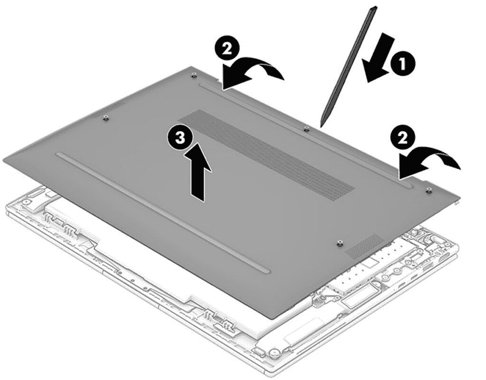
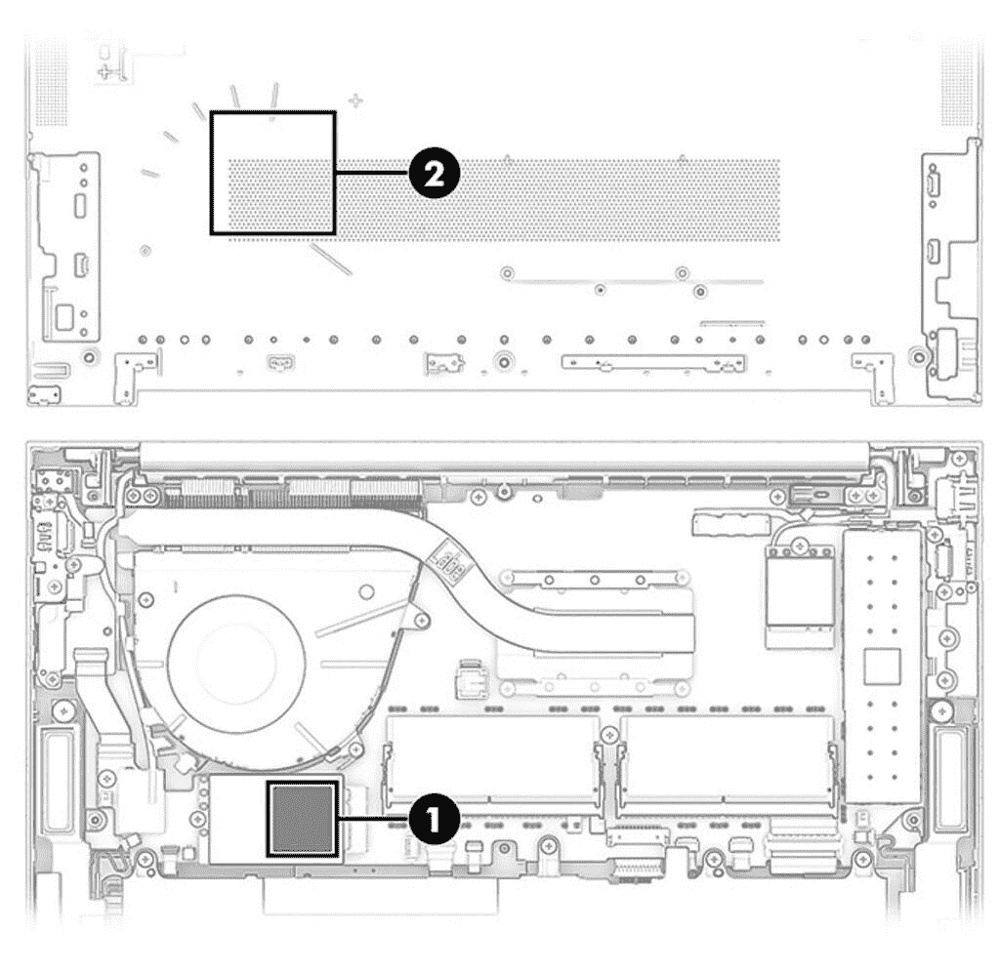

# 惠普 EliteBook 840 G9 可以更换电池吗？

> 原文：<https://www.xda-developers.com/replace-battery-hp-elitebook-840-g9/>

HP EliteBook 840 G9 是一款出色的[商务笔记本电脑](https://www.xda-developers.com/best-business-laptops/)，采用英特尔第 12 代酷睿处理器，特别是 P 系列处理器。这些都是快速的 CPU，实际上，你今天购买的任何笔记本电脑都可能在未来几年内足够快，所以通常你暂时不需要升级。然而，有时我们被迫升级，因为笔记本电脑的第一件东西就是电池。值得庆幸的是，一些笔记本电脑允许您更换电池，从而节省时间和金钱——HP elite book 840 G9 就是其中之一。

惠普表示，你应该去授权服务提供商更换任何内部组件，但如果你觉得勇敢，你当然可以自己做。更换 HP EliteBook 840 G9 上的电池并不困难，只要你有一个真正的替换电池放在那里。让我们来看看你需要做什么。

## 你需要什么

如果你打算在笔记本电脑里工作，你需要一些设备。你家里可能已经有一些这样的东西了，但是其他的东西并不常见。首先，你需要一把十字螺丝刀。你还需要一个不导电的撬开工具来打开笔记本电脑。获得这两者的一个好方法是[iFixit Essential Electronics Toolkit](https://www.amazon.com/iFixit-Essential-Electronics-Toolkit-Smartphone/dp/B0964G2Y7S/?tag=xda-4ecq34a-20&ascsubtag=UUxdaUeUpU43545&asc_refurl=https%3A%2F%2Fwww.xda-developers.com%2Freplace-battery-hp-elitebook-840-g9%2F&asc_campaign=Evergreen)，它包括各种螺丝刀头和其他工具来帮助你修理你的电子设备。你还需要一个[防静电腕带](https://www.amazon.com/Wristband-Bracelet-Grounding-Alligator-Extendable/dp/B08CXQN86W?tag=xda-4ecq34a-20&ascsubtag=UUxdaUeUpU43545&asc_refurl=https%3A%2F%2Fwww.xda-developers.com%2Freplace-battery-hp-elitebook-840-g9%2F&asc_campaign=Evergreen)，防止你在笔记本电脑内工作时放电损坏它。

当然，要更换 HP EliteBook 840 G9 上的电池，您需要一块电池。这款笔记本电脑有两种尺寸可供选择，一种是 38 瓦时电池(部件号 M73468-005)，另一种是更大的 51 瓦时电池(部件号 M73466-005)。您可以使用这些零件号尝试从可靠的经销商处找到替换电池。你只需要其中一个，这只是你想要多少容量，你想要花多少钱的问题。

最后，如果您的笔记本电脑版本具有蜂窝连接(WWAN)，您可能还需要购买一个[散热垫](https://www.amazon.com/Gelid-Solutions-GP-Extreme-2-0mm-Thermal/dp/B07BSPZTNV?tag=xda-4ecq34a-20&ascsubtag=UUxdaUeUpU43545&asc_refurl=https%3A%2F%2Fwww.xda-developers.com%2Freplace-battery-hp-elitebook-840-g9%2F&asc_campaign=Evergreen)，因为惠普建议每当您移除笔记本电脑的底盖时，都要更换 WWAN 模块上使用的散热垫。

## 如何更换 HP EliteBook 840 G9 中的电池

一旦你有了所有你需要的工具，你就可以开始更换程序。首先，确保您已经完全关闭计算机，并从交流电源上拔下插头。同时断开您可能插入的任何外部设备。然后，按照以下步骤操作:

1.  放下笔记本电脑，让底盖朝上，转轴背向您
2.  拆下固定盖子的五颗十字螺丝。
3.  从笔记本电脑转轴附近开始，使用撬动工具将底盖与机箱的其余部分分开。<picture></picture>

    图片来源:HP

4.  电池将暴露在笔记本电脑的下半部分。断开连接到主板的电池电缆。
5.  卸下固定电池的四颗飞利浦螺丝，然后提起电池背面，将其从笔记本电脑上卸下。<picture></picture>

    图片来源:HP

6.  将新电池插入与原电池相同的位置。你要以一个角度把它滑进去，然后把背面按到位。
7.  拧紧螺钉以将电池固定到位(注意不要拧得过紧)，并将电池电缆连接到主板。
8.  **如果您的型号有 WWAN 模块**，从 WWAN 模块上取下旧的导热垫，并取下底盖上与之对齐的部分。此图显示了保温垫的位置。<picture></picture>

    图片来源:惠普

    在重新组装笔记本电脑之前，请使用新的散热垫。
9.  将笔记本电脑的底盖弹回到原来的位置，然后拧紧五颗飞利浦螺丝将其固定到位。

仅此而已。现在你的笔记本电脑里应该有一块全新的电池了，它应该可以再用几年。放入新电池后，确保在开机前给笔记本电脑充满电，但之后，你就可以开始工作了。

如果你还没有，你可以使用下面的链接购买惠普 EliteBook 840 G9，但是如果你想要一些不同的东西，请查看[最佳惠普笔记本电脑](https://www.xda-developers.com/best-hp-laptops/)。对于更普通的消费者来说，有一些很好的选择，例如 HP Spectre x360 系列。如果这些不适合你，我们有一个[最好的笔记本电脑列表](https://www.xda-developers.com/best-laptops/)，总体来说你可能想看看。

 <picture></picture> 

HP EliteBook 840 G9

##### 惠普 EliteBook 840 G9

HP EliteBook 840 G9 是一款出色的高端商务笔记本电脑。像大多数商用笔记本电脑一样，它也相对容易维修。