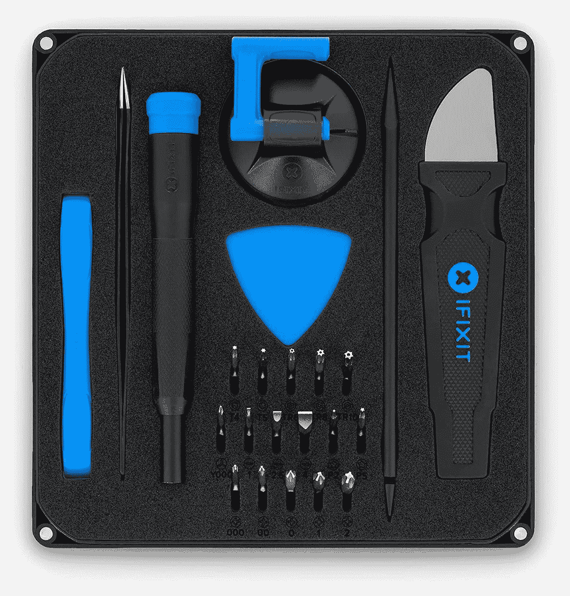

# 联想 Yoga 7i (2022)可以更换电池吗？

> 原文：<https://www.xda-developers.com/replace-battery-lenovo-yoga-7i-2022/>

联想 Yoga 7i (2022)的电池续航时间很长，我们评测时长达 7 小时——但如果你想更换电池呢？也许你没有得到你希望的长电池寿命？很久以前，在[联想笔记本电脑](https://www.xda-developers.com/best-lenovo-laptops/)上更换电池就像拉开拉环，从笔记本电脑底部取出电池一样简单。不幸的是，Yoga 7i 的情况并非如此。尽管技术上你可以(谢天谢地)更换电池，但这是一个漫长而复杂的过程，不适合新手用户。

然而，如果你是技术型的，有维修笔记本电脑的经验，你可以通过几个步骤更换电池。你必须卸下笔记本电脑的底部外壳，拔掉几根电缆，然后开始工作。联想有一份技术指南，告诉你如何为 [14 英寸联想 Yoga 7i](https://download.lenovo.com/consumer/mobiles_pub/yoga_7i_14_7_hmm.pdf) 和 [16 英寸联想 Yoga 7i](https://download.lenovo.com/consumer/mobiles_pub/yoga_7i_16_7_hmm.pdf) 这样做。说明从下载的 PDF 的第 34 页开始，如果您选择打印完整的指南，则从第 28 页开始。

## 更换 Yoga 7i (2022)电池需要什么

要更换 Yoga 7i (2022)上的电池，您需要一些工具。第一个是梅花螺丝刀，第二个是防静电腕带。当您在 Yoga 7i 内部工作时，此腕带可防止静电释放。我们在下面为您提供了一些建议。

在你开始研究你的设备之前，你需要关掉 Yoga 7i 的电源，把它翻过来，去掉电源适配器。在你掌握了这些基础知识之后，你可以继续阅读本指南。

*   ##### iFixit 防静电腕带

    这款防静电腕带可以在您使用 Yoga 7i 等电子产品时为您提供保护。

*   <picture></picture>

    iFixit Essential Electronics Toolkit

    ##### iFixit 基本电子工具包

    这款 iFixit toolkit 包括 16 个精密钻头、一个定位钻、吸盘和更多工具，帮助您将笔记本电脑和其他电子设备放入其中。

## 更换 Yoga 7i (2022)的电池

在 Yoga 7i (2022)中更换面糊只需要几个步骤。你必须把笔记本电脑翻过来，卸下固定底盖的螺丝，撬起底盖，断开电池，然后拧上螺丝。这是一个循序渐进的指南。

1.  将**笔记本电脑放在一个平面**上，铰链背向你。
2.  使用梅花螺丝刀拆下底壳上的七颗螺钉**和**。有四个螺丝正对着你，三个在靠近铰链的顶部。
3.  撬起插销并**移除下壳体**。有四个安全的地方可以用你的指甲或信用卡去撬:前面，后面的通风口，左右两边。
4.  **用指甲将电池组电缆**从系统板上拔下。不要拉电缆。
5.  拆下固定电池的五颗**螺丝**。
6.  取出电池，**将新电池放入**中。
7.  把它拧回原位。
8.  插回**电池组电缆**。
9.  将**下盖罩**放回原位。
10.  拧入您原来取出的七个螺钉。

当你把你的 Yoga 7i 组装好后，你可以把充电器插入系统，等待新电池充满电。你的瑜伽 7i 二合一现在应该可以正常工作了。这是我们能想到的价格在 1000 美元以下的最好的笔记本电脑之一，所以如果你还没有，你可以使用下面的链接。

*   <picture></picture>

    联想 Yoga 7i

    ##### 联想 Yoga 7i (14 英寸)

    14 英寸型号的联想 Yoga 7i 包括第 12 代英特尔酷睿 U 系列处理器和 2.2K IPS 显示屏，在时尚的机箱中提供了性能和电池续航时间的完美平衡。

*   <picture></picture>

    联想 Yoga 7i (16 英寸)带弧形显卡

    ##### 联想 Yoga 7i 二合一(16 英寸)

    联想 Yoga 7i 是一款出色的可转换笔记本电脑，拥有强大的处理能力和出色的 GPU，可用于轻度游戏以及照片和视频编辑。

*   ##### 联想 Yoga 7i (16 寸英特尔 Arc)

    这款 16 寸联想 Yoga 7i 采用英特尔 Arc，该公司首款专用显卡。它为想要玩轻度游戏和编辑照片的用户提供了巨大的推动力。

    T34