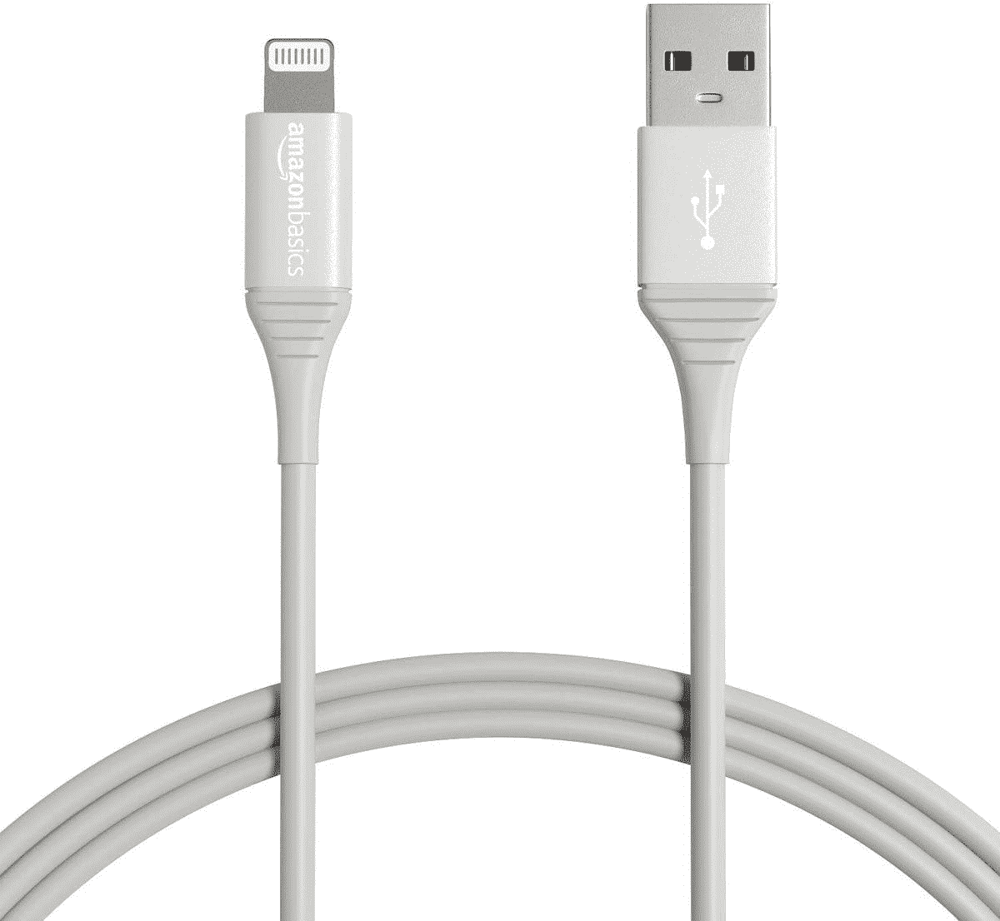

# 用这条 6 英尺长的电线替换你坏掉的苹果闪电线，只需 7 美元

> 原文：<https://www.xda-developers.com/replace-your-broken-apple-lightning-cable-with-this-6-foot-cord-for-7/>

# 用这条 6 英尺长的电线替换你坏掉的苹果闪电线，只需 7 美元

这种电缆比通常价格低 6 美元，额定弯曲次数高达 20，000 次。

苹果公司随其产品捆绑的闪电充电线通常很糟糕，以至于在正常使用时经常会散架。如果你的任何一根避雷线处于引发电气火灾的边缘，或者你出于任何原因需要更多的避雷线，AmazonBasics 6 英尺避雷线现在以 6.99 美元的价格出售。这比通常价格低 6 美元。

一根线缆 7 美元确实有点贵，但这种线缆有两个重要特点。首先，它有 6 英尺长，所以它非常适合插座可能不在方便位置的情况(比如后座没有充电插头的汽车)。第二，这种电缆具有耐用的设计，其末端额定弯曲 20，000 次，因此它应该可以使用很长时间。也是苹果 MFi 认证的。

 <picture></picture> 

AmazonBasics Lightning Cable

##### 亚马逊基础闪电电缆

这种 6 英尺的 USB Type-A to Lightning 电缆应该比苹果公司在其产品中包含的电缆耐用得多。亚马逊 Prime 用户享受免费送货服务。

主要问题是，这是一条 USB A 型到 Lightning 电缆，而不是 USB C 型到 Lighting 软线。这意味着它可以与你可能已经有的墙上适配器一起工作，但它不会像 USB Type-C 墙上适配器和电缆那样快地为新 iPhones 充电。如果你追求的是更快的充电速度，那就买[这根电缆](https://www.amazon.com/AmazonBasics-Braided-Lightning-Certified-Charger/dp/B07XLCDFSV?tag=xda-6iv4uno-20&ascsubtag=UUxdaUeUpU3658&asc_refurl=https%3A%2F%2Fwww.xda-developers.com%2Freplace-your-broken-apple-lightning-cable-with-this-6-foot-cord-for-7%2F&asc_campaign=Short-Term)(如果需要的话，买[这个墙壁适配器](https://www.amazon.com/Charger-Anker-Adapter-PowerPort-iPhone/dp/B07WRKXQ8W?tag=xda-6iv4uno-20&ascsubtag=UUxdaUeUpU3658&asc_refurl=https%3A%2F%2Fwww.xda-developers.com%2Freplace-your-broken-apple-lightning-cable-with-this-6-foot-cord-for-7%2F&asc_campaign=Short-Term))。