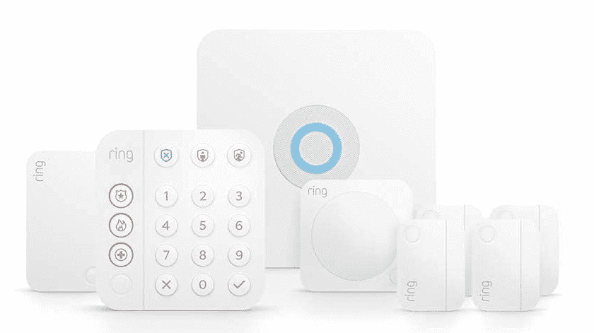

# 在这个杀手的黄金日早期交易中，从响铃警报中获得 100 美元

> 原文：<https://www.xda-developers.com/ring-alarm-early-prime-day-deal/>

随着 Prime Day 的快速临近，亚马逊已经开始在自己的硬件上推出这些交易。尤其是智能家居，它得到了很好的迎合，早期最大的交易之一就是敲响警钟。

从现在起到 7 月 12 日至 13 日的 Prime Day，购买 Ring Alarm(第二代)可以节省高达 100 美元，无论是单独购买还是与其他 Ring 或 Amazon 产品捆绑销售。

该 8 件套目前只需 150 美元，并配有你开始使用所需的一切。Ring 表示，这非常适合一个或两个卧室的家庭，包括键盘、基站、范围扩展器和一系列运动和接触传感器。

 <picture></picture> 

Ring Alarm (2nd Gen)

##### 响铃报警(第二代)

Ring 的模块化系统可以与 Alexa 和其他亚马逊产品无缝集成，为您的家庭警报添加一些智能。

响铃报警器的设置非常简单，由于其模块化设计，您可以根据需要添加任意多种不同的传感器。它连接到您的家庭 Wi-Fi 网络，通过 iOS 或 Android 上的移动应用程序进行访问。但作为亚马逊拥有的设备，铃声警报当然可以连接到 Alexa。有了这个，你可以使用亚马逊 Echo 或其他 Alexa [智能扬声器](https://www.xda-developers.com/best-smart-speakers/)来启动和解除你的警报系统。或者您可以检查系统的状态，或将其与 Alexa Guard 配对，以便在您离开时更加安心。

Alexa 集成很好，但主要控制来自应用程序。响铃警报支持各种设置，包括一种模式，您可以禁用内部传感器，同时保持外部传感器武装。Ring Protect Pro 提供了额外的保护，它的额外福利包括 24/7 紧急响应。

除了基本系统之外，Prime Day 早期交易还包括捆绑包。这些可以包括回声扬声器，回声显示，环形摄像机或视频门铃。易于使用，再加上大幅折扣，这使得它成为 Prime Day 的最佳选择。