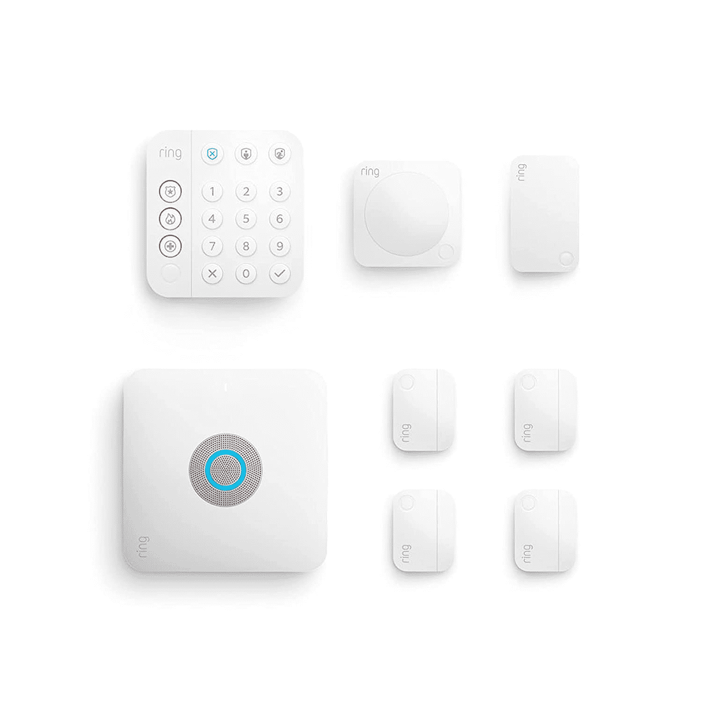

# 亚马逊的 Ring Alarm Pro 是环形摄像机和 Eero Wi-Fi 6 一体机的枢纽

> 原文：<https://www.xda-developers.com/ring-alarm-pro-announced/>

亚马逊在今年的年度设备和服务活动上推出了许多产品，其中一个产品是全新的 Ring Alarm Pro。这是一个集环形摄像头和 Eero Wi-Fi 6 路由器于一体的枢纽。它还具有 24/7 互联网备份和环形摄像机的本地处理和存储，并通过内置的环形报警器主要用作物理家庭安全。然而，它还可以通过 Eero 提供的网络安全功能(如广告拦截和内容过滤)来帮助您实现数字安全。

除了 Ring Alarm Pro，亚马逊还宣布了新的 Ring Protect Pro 订阅，每月费用为 20 美元。您的连接设备可以通过 24/7 备份互联网保持在线，使您的设备(如笔记本电脑和安全摄像头)通过蜂窝数据保持在线。当您的互联网消失时，您的铃声警报专业版将切换到 3GB 的蜂窝数据。这些数据可以在笔记本电脑上记录大约 300 个铃声视频、1.5 小时的视频流或 2 小时的视频通话。额外的数据也可以以每 GB 3 美元的价格购买。最后，它还支持在断电时连接多达四个环形电源组。

使用 Eero 的大多数安全功能，如专业监控、威胁防护、广告拦截和内容过滤，也需要订购 Ring Protect Pro。

Ring Alarm Pro 的最大变化之一是能够使用 Ring Edge 在本地存储和处理来自某些设备的环形视频，只要您拥有 Ring Protect 订阅。将 microSD 卡插入您的 Ring Alarm Pro，然后选择您想要连接的摄像头。一旦连接，64GB 的 microSD 卡可以存储大约 47 小时的环形视频剪辑。

Ring Alarm Pro 的基站起价为 249.99 美元，或者正如 [*The Verge*](https://www.theverge.com/2021/9/28/22692073/ring-alarm-pro-amazon-event-release-date-specs-price-features) 报道的那样，你可以以 299.99 美元的价格升级到八件套安全套件。该安全套件配有接触传感器、运动探测器、键盘和 Z-wave 范围扩展器。Ring 还表示，您现有的第二代 Ring Alarm 基站可以更换，而无需重新连接您的所有设备。在美国，Ring Alarm Pro 从今天开始在[接受预购，并将于 11 月 3 日开始发货。如果你不需要任何新的附加功能，第二代铃声闹钟仍然可以以 199 美元的价格购买五件套。](https://www.amazon.com/Ring-Alarm-Pro-8-piece-kit/dp/B08HSTJPM5/?tag=xda-926tlrf-20&ascsubtag=UUxdaUeUpU5439&asc_refurl=https%3A%2F%2Fwww.xda-developers.com%2Fring-alarm-pro-announced%2F&asc_campaign=Short-Term)

 <picture></picture> 

Ring Alarm Pro

##### 专业响铃闹钟

Ring Alarm Pro 是一款一体化的家庭监控解决方案，还可以兼作 Wi-Fi 6 路由器。