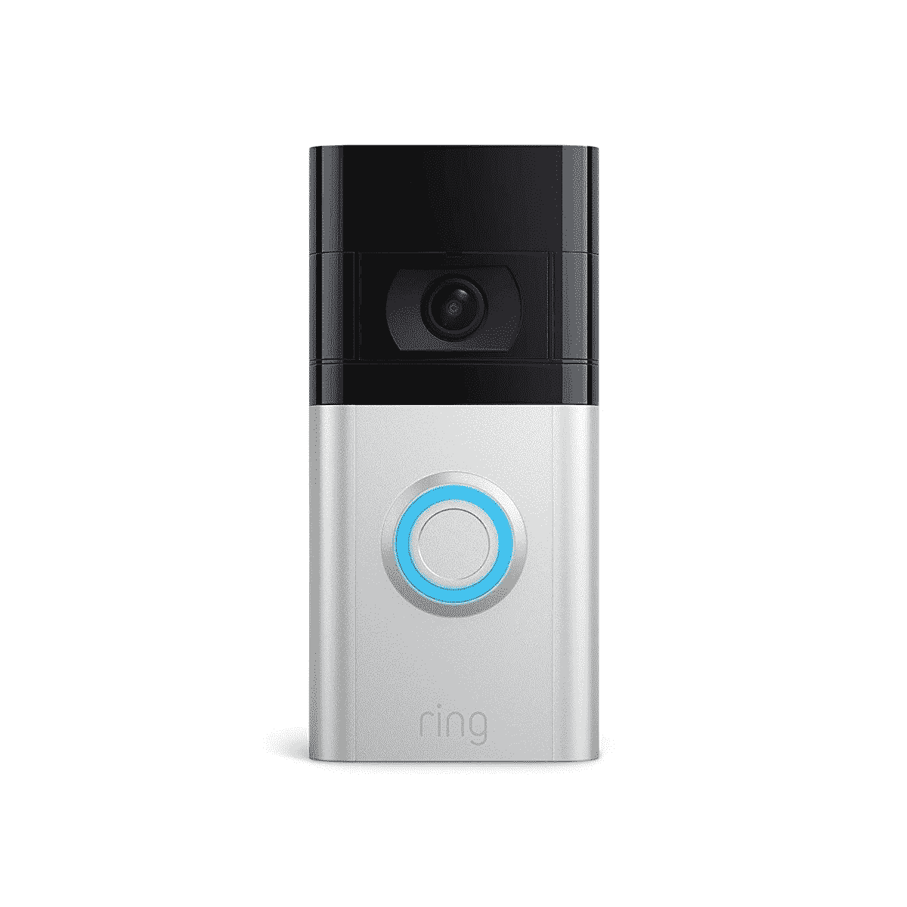

# 门铃和摄像头支持苹果 HomeKit 吗？

> 原文：<https://www.xda-developers.com/ring-doorbell-camera-homekit-support/>

智能家居正变得越来越流行。当你可以对着 Siri 或最近的[智能扬声器](https://www.xda-developers.com/best-smart-speakers/)尖叫并让它为你做这件事时，为什么要起床并手动打开咖啡机？我们的手机正在成为我们生活中一切事物的中枢。它不再仅仅是社交媒体、发短信、打电话和拍照。手机现在存储我们的银行卡、病历、某些地区的身份证、房子和汽车钥匙等等。

对于那些建造智能房屋的人来说，苹果 HomeKit 是从一个应用程序控制智能设备的一种方式。Home 应用程序允许您控制兼容的配件、创建场景和设置自动化。如果你有一个 HomeKit 集线器，如 Apple TV 或 HomePod，你甚至可以在户外控制你的兼容设备。那么门铃和摄像头支持苹果 HomeKit 吗？以下是你应该知道的。

## 门铃和 Apple HomeKit 支持

Ring 已经至少承诺过一次，它将在其门铃设备上引入 Apple HomeKit 支持。然而不幸的是，这仍然是一个未兑现的承诺。你可以通过该公司维护的专用应用程序来控制你的门铃。

如果你正在寻找 HomeKit 集成，你可以看看其他制造商的类似产品。有一些非官方的解决方案可以在这些戒指产品上触发 HomeKit 支持。然而，它们工作起来并不可靠，设置它们也不是一个简单的过程。

考虑到苹果 HomeKit 只会随着每次更新变得更好，我们只希望 ring 开始支持这个平台。就我个人而言，我会避免缺乏 HomeKit 支持的智能家电。我敢肯定，其他一些与苹果生态系统密切相关的用户也有同样的感受。由于拒绝支持这一标准，Ring 可能会失去潜在客户。

房间里的另一头大象是 Matter，即将到来的智能家居设备标准。亚马逊已经承诺将 Matter 集成到其硬件中，苹果也将 HomeKit 集成到其中。但是到目前为止，Ring 仍然坚持自己的立场，并试图保持其围墙花园的做法。最终，希望亚马逊能迫使改变，但现在这是戒指的方式或没有办法。

 <picture></picture> 

Ring Video Doorbell 4

##### 响视频门铃 4

门铃 4 有一个 1080p 的摄像头。它支持电池和直接的有线电源。

*你会买门铃吗，还是缺少 HomeKit 支持会影响你的交易？请在下面的评论区告诉我们。*