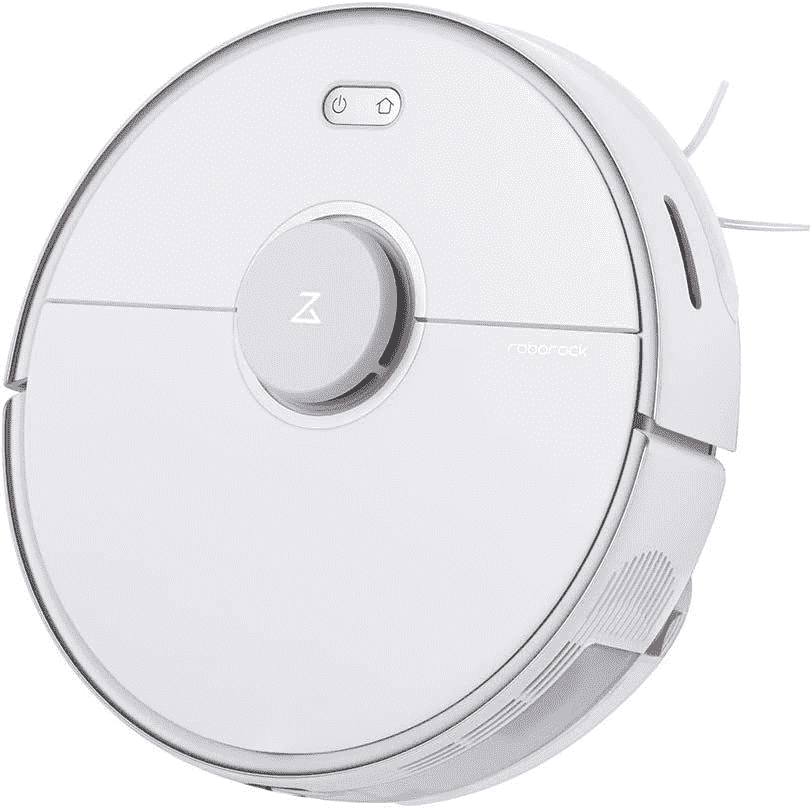

# Roborock 凭借 robo vacs 的 Prime Day 优惠大卖

> 原文：<https://www.xda-developers.com/roborock-prime-day-deals/>

自己用吸尘器打扫已经是过去十年的事了，保持房子干净的最好方法是用机器人吸尘器。那么，多么巧合的是，[黄金日](https://www.xda-developers.com/amazon-prime-day/)正在发生，而且有一些机器人吸尘器的明星交易。其中，Roborock 是一个值得你关注的品牌，它在一些最好的 robo vacs 上有一些**大**折扣。

总共有六个选项，从预算到保险费以及两者之间的每一步。其中一大亮点就是 S5 Max。这款机器人真空吸尘器拥有自我充电和激光雷达，精确测绘，长达 180 分钟的运行时间，以及语音或应用程序控制。它支持 Alexa 和谷歌助手集成到你现有的智能家居设置中，它有一个漂亮的功能，允许你设置禁区，让它完全忽略。

通常情况下，Roborock S5 Max 的价格相当昂贵，为 550 美元，但 Prime Day 见证了 200 美元的惊人降价，降至 350 美元。这使得它太好了，不容忽视，这是 Roborock 对这种型号提供的最大折扣。

 <picture></picture> 

Roborock.S5 Max ($200 off)

##### 机器人洛克。S5 最大值(优惠 200 美元)

这款 robovac 配备了先进的功能、智能家居集成和自充电功能，可以节省大量费用，这样您就可以把脚放起来，再也不用担心吸尘了。

Roborock 还提供一系列其他机器人吸尘器。以下是完整列表:

即使是入门级型号 E5，也配备了各种出色的功能。它也兼容 Alexa 和谷歌助手的声控吸尘功能。这个还有一个可选的水箱，可以把你的机器人吸尘器变成机器人拖把。因为也没人想拖地板，不是吗？

Roborock 系列代表了你在机器人真空吸尘器中可以获得的一些最佳产品，这些黄金日折扣将价格降低到每个人都有东西可买的程度。来吧，把你的脚抬起来。你应得的。