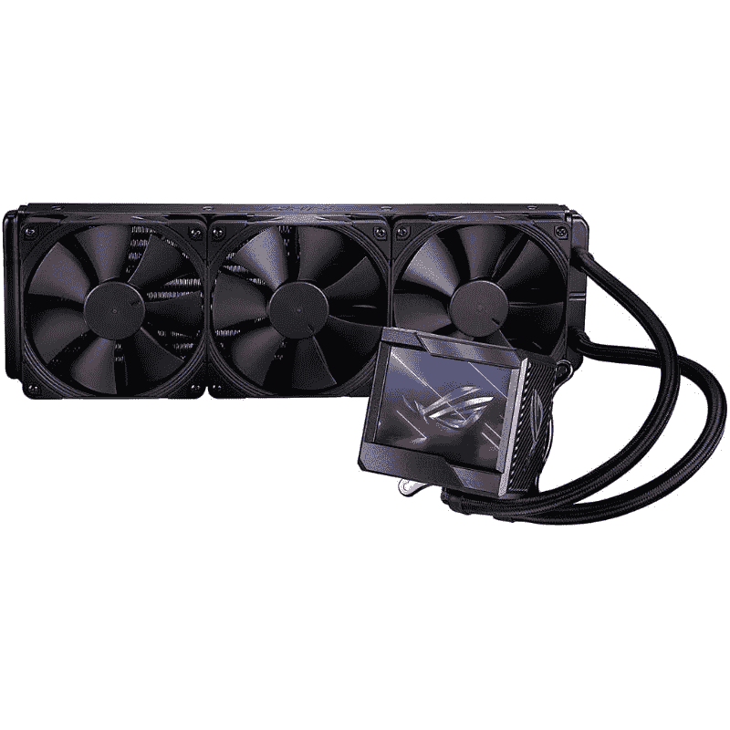

# 华硕 ROG Ryujin II 360 AIO 评论:高端 CPU 的高级冷却器

> 原文：<https://www.xda-developers.com/rog-ryujin-2-aio-cooler-review/>

在我使用 ROG Ryujin II 360 与英特尔酷睿 i9-12900K 和 RTX 2080 Super 进行主要构建后，我可以有把握地说，这款 AIO 提供了出色的冷却性能。我能够毫无问题地完成最苛刻的工作负载，工作温度也在可接受的范围内。CPU 在 25°C 左右空闲，在 80°C 以下舒适地工作，即使在重负载下也是如此。

除了可靠的冷却性能，Ryujin II 360 还提供了许多其他令人兴奋的功能，值得一试。正如您所看到的，CPU water block 顶部的 3.5 英寸显示屏可以配置为显示自定义动画、有用的 CPU 指标等。值得注意的是，你还可以获得三个高品质的 Noctua 风扇安静的运行。这些风扇有助于将整体噪音输出保持在最低水平，尽管当 CPU 被推到极限时，冷却器往往会有点吵。

添加一个 RGB 控制器以及 6 年保修，您将看到一个高度可靠的 AIO，提供令人印象深刻的性能和良好的定制。如果你觉得这些听起来不错，那么我强烈建议你继续阅读，详细了解 Ryujin II 360 AIO 的性能和功能。但长话短说，我认为华硕 ROG Ryujin II 360 将是一个很好的选择，以冷却高端发烧友 PC 内的高性能 CPU。

 <picture></picture> 

ASUS ROG Ryujin II 360 AIO

##### 华硕 ROG 龙津二代 360 AIO

华硕 ROG Ryujin II 360 是一款出色的 AIO，提供令人印象深刻的冷却性能和大量良好的功能。它有点贵，所以我们认为它更适合高端发烧友版本。

* * *

**浏览此评论:**

## 华硕 ROG Ryujin II 360 AIO:价格和可用性

*   华硕 ROG Ryujin II 360 现在可以购买，价格约为 310 美元。

华硕 ROG Ryujin II 360 与第一批解锁的阿尔德湖台式机部件一起推出。这款特别的 AIO 目前在市场上售价约为 310 美元。你可以点击我们的购买链接，立即在网上找到最优惠的价格。华硕还有一款更小的 240 毫米版 AIO，名为 Ryujin II 240。这更适合功能稍弱的芯片，但更小的外形将适合更多的 PC 外壳。更不用说，更小的冷却器也会让你花费更少。如果我们要使用其他一些 Alder Lake 芯片，比如 12600K、12700 或更多，Ryujin II 240 将是我们的选择。

## 华硕 ROG Ryujin II 360 AIO:规格

在我们详细了解冷却器本身及其提供的所有功能之前，让我们快速浏览一下规格:

| 

规格

 | 

华硕 ROG 龙津 II 360 AIO

 |
| --- | --- |
| CPU 插座 | 

*   英特尔:LGA 1700，1200，115x，2011，2011-3，2066
*   AMD: AM4、TR4

 |
| 液晶显示器 | 3.5 英寸全彩液晶显示器 |
| 散热器 | 360 毫米 |
| 散热器尺寸 | 121 x 394 x 27 毫米 |
| 水封尺寸 | 78.15 x 87.5 x 81 毫米 |
| 风扇 | 

*   Noctua NF-F12 感应式 lPPC 2000 PWM 风扇
*   3 个风扇插槽(120 毫米)
*   120 x 120 x 25 毫米
*   450 - 2000 转/分+/- 10%
*   3.94 毫米水柱
*   71.6 CFM / 121.8 m3h
*   29.7 分贝(安)
*   脉宽调制/ DC

 |
| 保证 | 6 年 |

从规格来看，我认为可以肯定地说，捆绑的 Noctua 风扇套件使这款冷却器在竞争中脱颖而出。完全可定制的 3.5 英寸液晶面板也是一个很好的补充。在这篇综述的稍后部分，我们将更多地讨论这两个问题。关于这个特别的 AIO，另一件需要注意的事情是，它与第 12 代英特尔 Alder Lake CPUs 的新 LGA1700 CPU 插槽兼容。值得注意的是，你还可以获得 6 年的制造商保修，这也太棒了。

* * *

## 华硕 ROG Ryujin II 360 AIO:设计和制造质量

*   配有完全可定制的 3.5 英寸液晶显示器。
*   支持 LGA1700 CPU 插座，附带安装套件。
*   附带一个预先应用的热粘贴(我们的审查单位是使用样本，所以它没有它)。

说到设计，我认为 CPU 防水块使它在 AIO 空间看起来非常独特。事实上，它有一个 3.5 英寸的液晶显示器，这使得它比其他许多 AIO 冷却器更好。技嘉沃特福德 X360 冷却器，我们审查不久前，也有一个完全可定制的显示器。然而，相比之下，那一个还是很小的。这种显示器更大，让你浏览更多的信息，并允许你用你选择的图像和 gif 来自定义它。

您可以使用华硕军械库板条箱软件轻松定制此面板。我几乎不费吹灰之力就能让冷却器显示这个整洁的小 GIF 图像。您还可以选择一组预设图像或显示一些重要指标，包括 CPU 温度。但我想强调的一点是，它有一个巨大的水块。它绝对比市面上的许多其他 Asetek 7 一体机大得多。虽然我没有任何间隙问题，但您在主板上安装它时可能会遇到一些问题。我建议在尝试安装冷却器之前，移除 RAM 模块以临时腾出一些空间。

否则，安装 AIO 是一项相当简单的任务。在华硕 TUF 游戏 Z690-Plus WiFi D4 主板上运行时，我没有遇到任何问题。这些管子也足够灵活，可以根据阻水块的方向进行调整。管子的长度对于大多数个人电脑来说也是足够的。只要确保您选择的 PC 机箱有空间安装 360 毫米散热器，最好是在顶部。如果你正在处理一个小型迷你 ITX 箱，我不建议你买这个 AIO。华硕还生产了这种冷却器的 240 毫米版本，我认为这可能更适合 SFF 外壳。

正如我前面提到的，华硕 ROG Ryujin II 360 AIO 捆绑了三个高质量的 NOC tua NF-F12 inductrialpcp 2000 PWM 风扇。这些 120 毫米的风扇负责推动空气通过散热器来调节温度。值得指出的是，这些不是支持 RGB 的风扇，所以你必须为你的电脑外壳找到其他 RGB 光源。华硕还捆绑了 ROG 风扇控制器，让你更容易安装所有的风扇。如果你不知道的话，Noctua 以其冷却解决方案而闻名，这些解决方案提供了令人印象深刻的结果，同时保持了较低的整体噪声输出。这些粉丝绝对没有辜负我的期望，在我使用的过程中他们通常都很安静。我要说他们比捆绑在 X360·AIO 身上的球迷更安静。

* * *

## 华硕 ROG Ryujin II 360 AIO:冷却性能

*   提供出色的整体冷却性能。
*   这是高端钻机的一个很好的选择，例如，岩心 i9-12900K。

为了测试 ROG Ryujin II 360 AIO，我将它与英特尔酷睿 i9-12900K 进行了配对。我还用英特尔酷睿 i7-12700 测试了它，不过为了能够与我们之前的一次测试进行比较，我在这次评测中只添加了用 12900K 记录的基准测试数据。我使用 HWInfo64 来跟踪实时内核温度读数、CPU 速度和一些读数，以查看 CPU 在任何给定时间点的表现。

华硕 ROG Ryujin II 360 设法保持 12900K 有时很酷。我能够记录到大约 25°C 的闲置温度，这正是你对高端冷却器的预期。即使在重负载下，Ryujin II 360 也设法将 12900K 保持在 85°c 以下。我记录了游戏和运行一些基准测试应用程序时的 CPU 温度。例如，在玩游戏时，CPU 的平均温度约为 45℃至 50℃

下面是我在运行一些压力测试时快速查看的 CPU 温度图:

即使在超频的情况下，Core i9-12900K 在游戏时的峰值为 56°C，因此可以肯定地说，Ryujin II 360 能够保持高端 Alder Lake 部分的热输出。下面快速浏览一下温度读数，让您更好地了解这款 AIO 的性能:

| 

试验

 | 

记录的峰值核心温度(ROG 龙津 II 360)

 | 

记录的峰值核心温度(千兆字节 X360 沃特福德)

 |
| --- | --- | --- |
| **空闲** | 25 摄氏度 | 23 摄氏度 |
| **博彩** | 46 摄氏度 | 43 摄氏度 |
| **游戏(超频)** | 56 摄氏度 | 54 摄氏度 |
| **压力** | 86 摄氏度 | 79 摄氏度 |

* * *

## 华硕 ROG Ryujin II 360 AIO:值得购买吗？

如果你是在市场上购买 AIO 冷却器为您的新的高端游戏 PC 建设，那么你很可能会偶然发现华硕 ROG Ryujin II 360 AIO。如果你打算用这个 AIO 来冷却一些高性能芯片，如酷睿 i9-12900K 或 AMD 锐龙 5950X，那么你不会失望。Ryujin II 360 是一款出色的 AIO，可以轻松控制这些高端芯片的热量输出。

### 谁应该购买 ROG Ryujin II 360 AIO？

*   那些正在为高端 CPU 寻找可靠冷却器的人
*   想用图片，gif 等自定义 CPU 水块的。

### 谁不应该购买 ROG 龙津 II 360 AIO？

*   如果你使用的是没有足够空间放置 360 毫米散热器的小型电脑机箱，就不要购买它。
*   不要为中档 CPU 购买这款 AIO。考虑购买较小的 240 毫米版本的 AIO。

好了，这就结束了我的审查华硕 ROG 龙津二 360 AIO。如果你正在寻找替代品，那么你也可以考虑购买千兆奥鲁斯沃特福德 X360 AIO 稍微更实惠。你可以查看我们的 [Aorus Waterforce X360 评论](https://www.xda-developers.com/gigabyte-aorus-waterforce-x360-review/)来了解更多关于其他冷却器的信息，并看看它与 Ryujin II 360 在功能集方面的比较。市场上不缺少 AIO 冷却器，你可以在我们收集的[最佳液体冷却器](https://www.xda-developers.com/best-liquid-coolers/)中找到更多选择。

 <picture></picture> 

ASUS ROG Ryujin II 360 AIO

##### 华硕 ROG 龙津二代 360 AIO

华硕 ROG Ryujin II 360 是一款出色的 AIO，提供令人印象深刻的冷却性能和大量良好的功能。它有点贵，所以我们认为它更适合高端发烧友版本。