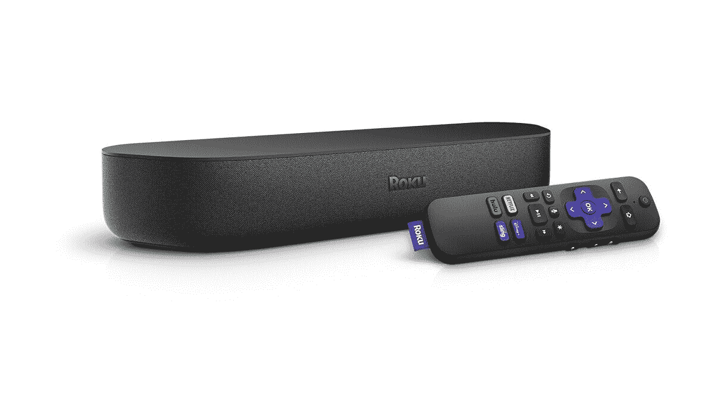
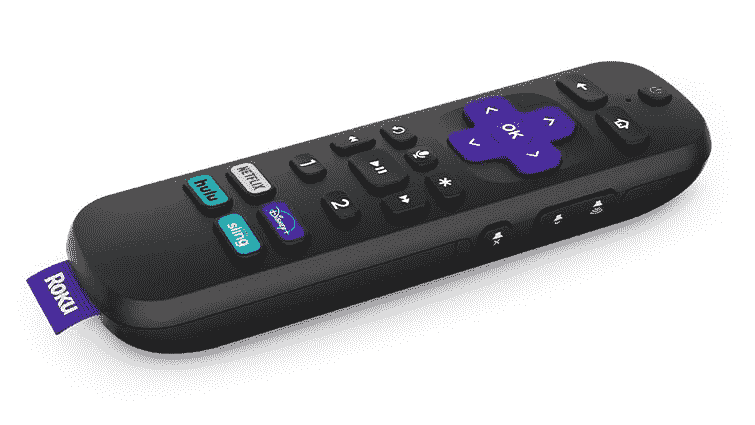

# Roku 推出了 Express 4K+，Streambar Pro 和 Roku OS 10

> 原文：<https://www.xda-developers.com/roku-express-4k-streambar-pro-voice-remote-pro-roku-os-10/>

Roku 是流媒体盒子市场的第一品牌之一，直到今天它还在继续推出电视硬件。该公司在去年年底发布了新的 Roku Ultra 和‘stream bar’[，现在还有更多新产品在路上。Roku OS 10 也将很快开始推出，为该公司的整个产品阵容带来新功能。](https://www.xda-developers.com/roku-ultra-media-streamer-2-in-1-roku-streambar-roku-os-9-4-roku-channel-mobile-app/)

## Roku 快递 4K+

Roku 出售几种不同的流媒体设备，功能和价格都有所重叠，但 [Roku Express 4K+](https://newsroom.roku.com/news/2021/04/roku-introduces-powerful-roku-express-4k-and-rechargeable/ltagg-h2-1618319457) 似乎是新的中间选择。它支持 HDR 10+4K 视频播放、语音命令和遥控器上的电视控制、双频 Wi-Fi 和以太网(带适配器)。Roku Express 4K+有一个盒子形状的因素，而不是棒状的设计，所以你需要使用随附的 HDMI 电缆将其插入你的电视。

 <picture></picture> 

Roku Express 4K+

Roku 表示，Express 4K+的售价将为 39.99 美元，并将搭载该公司最新的 Roku OS 10。这比配备谷歌电视的[chrome cast](https://www.xda-developers.com/google-chromecast-with-google-tv-streaming/)和 [Fire 电视棒 4K](https://www.amazon.com/Fire-TV-Stick-4K-with-Alexa-Voice-Remote/dp/B079QHML21?tag=xda-704aamr-20&ascsubtag=UUxdaUeUpU1796&asc_refurl=https%3A%2F%2Fwww.xda-developers.com%2Froku-express-4k-streambar-pro-voice-remote-pro-roku-os-10%2F&asc_campaign=Short-Term) 便宜 10 美元。然而，这将是沃尔玛在美国的独家业务。

## Roku Streambar Pro

最初的 Roku Streambar 于去年发布，它将 14 英寸的条形音箱、蓝牙扬声器和流媒体播放器集成在一个设备中。它收到了[普遍](https://www.cnet.com/reviews/roku-streambar-review/) [正面](https://www.engadget.com/roku-streambar-review-133013675.html) [评论](https://gizmodo.com/roku-streambar-review-big-sound-in-a-tiny-streaming-de-1845443627)，现在 Roku 正在发布稍微好一点的版本，价格稍微高一点。

 <picture></picture> 

Roku Streambar

新的 [Roku Streambar Pro](https://newsroom.roku.com/news/2021/04/roku-introduces-powerful-roku-express-4k-and-rechargeable/ltagg-h2-1618319457) (这款显然只针对专业人士)有一个升级的遥控器，可以选择插入耳机进行私人聆听。它还具有新的虚拟声音功能，可以“创造宽敞的声音，在房间内移动，增强音频体验。”作为 Roku OS 10 更新的一部分，该功能也将推广到非专业的 Streambar。

你可以在“五月中旬”以 179.99 美元的价格购买 Streambar Pro。

## Roku 语音遥控专业版

如果你有一个现有的 Roku 产品，并且想要一些像 Streambar Pro 和 Express 4K+这样的产品中的更新的远程功能，你很幸运。新的 Roku Voice Remote Pro 与“所有 Roku 电视型号、音频设备和精选流媒体播放器”兼容，包括可充电电池、远程查找(丢失时可以发出钟声)、电视控制、私人收听，甚至免提模式。如果不想让遥控器的麦克风一直开着，可以切换到按键通话。

 <picture></picture> 

Roku Voice Remote Pro

Roku Voice Remote Pro 今天在 Roku.com 上市，售价 19.99 美元，并将很快在其他零售商处上市。令人恼火的是，它似乎仍然有与特定流媒体服务相关的硬件按钮，就像 Roku 的其他遥控器一样。

## Roku OS 10

最后，Roku 推出了新的操作系统更新。该公司在[的公告](https://newsroom.roku.com/news/2021/04/roku-os-10-makes-streaming-easier-with-quicker-access-to/s6l2sca2-1618319762)中表示，“Roku OS 10 引入了各种新功能，让用户更快地获得内容，改善网络和输入配置，提供定制体验和性能增强的新方法。”

Roku OS 10 包括与苹果 AirPlay 2 和 HomeKit 的完全兼容，所以如果你主要生活在苹果生态系统中，你的 Roku 设备会有一点点家的感觉。你将能够用 Siri 或 iOS 上的 Home 应用程序控制 Roku 设备，并从兼容的应用程序向 Roku 设备发送内容。然而，HomeKit 和 AirPlay 2 并不能在所有设备上运行。

另一个新功能是即时恢复，它可以保存频道关闭时的状态，所以以后打开它不会花太长时间。然而，这似乎是每个频道都必须实现的东西——Roku 表示，美国电话电报公司电视台、FilmRise、福克斯商业网、福克斯新闻频道、富博体育网、HappyKids 电视台、Plex.tv、STARZ 和 Roku 频道是第一批增加支持的。

其他变化包括可定制的直播电视频道指南、新 Wi-Fi 网络提示、自动游戏控制台检测、某些屏幕键盘的语音输入、HDR10+支持以及搜索结果的改进。Roku OS 10 已经开始推出，应该会在“未来几周”登陆所有兼容设备。

*免责声明:本文作者拥有 Roku 的股票。这并不影响这里陈述的观点。*