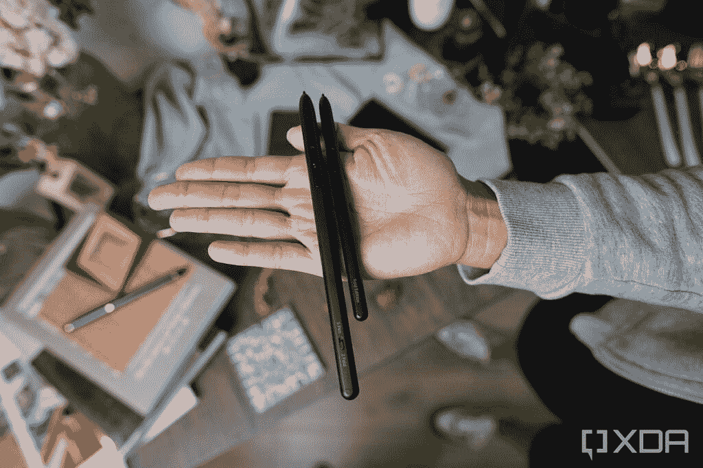
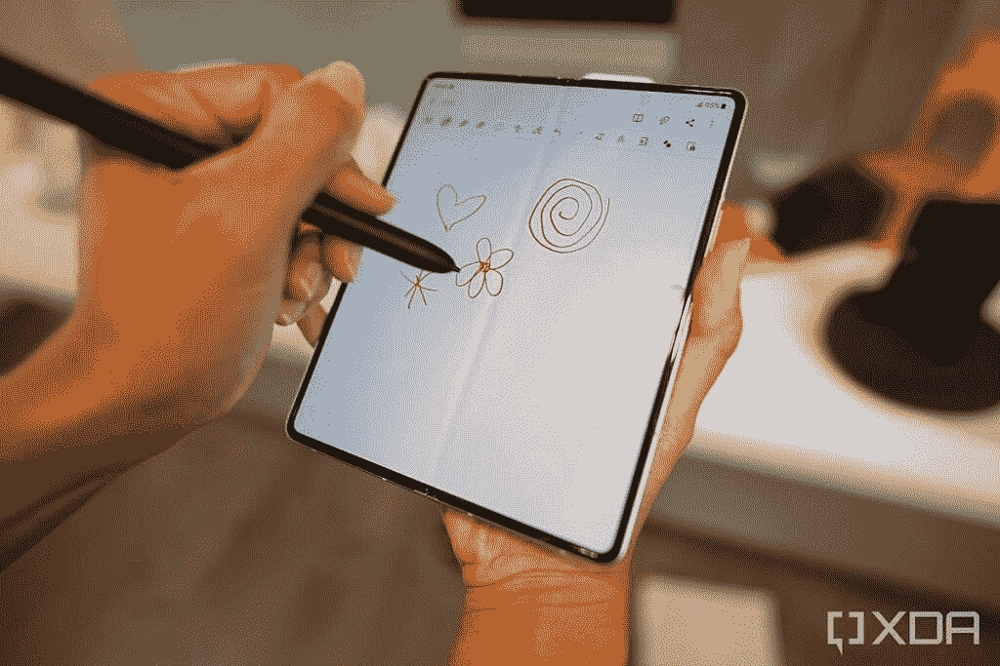

# 三星 S Pen Pro vs S Pen Fold 版:有什么区别？

> 原文：<https://www.xda-developers.com/s-pen-pro-vs-s-pen-fold/>

三星 Galaxy S21 Ultra 成为今年早些时候第一款获得 S Pen 支持的 Galaxy S 系列智能手机。现在，三星已经将 S Pen 支持带到了 [Galaxy Z Fold 3](https://www.xda-developers.com/samsung-galaxy-z-fold-3/) ，这是第一款获得它的可折叠产品。该公司已与 Wacom 合作，在设备的主屏幕上启用手写笔支持。在三星的 S Pen 中，Galaxy Z Fold 3 可以与不止一种而是两种 S Pen 型号配合使用——T2 的 S Pen Pro 和 S Pen Fold Edition。

虽然三星在 Galaxy S21 Ultra 发布会上展示了 S Pen Pro，但该公司没有分享关于触控笔的所有细节。但是现在，我们有了信息。另一方面，S Pen Fold Edition 是一款全新的触控笔，它将与 Galaxy Z Fold 3 一起首次亮相。

在本文中，我们将讨论这两种 S Pen 型号之间的确切区别。

## S Pen Pro vs S Pen Fold Edition:硬件、充电和笔尖

 <picture></picture> 

S Pen Pro (left) and S Pen Fold Edition (right)

S Pen Fold 版类似于三星之前的无动力 S Pen 机型。它比 S Pen Pro 更小更紧凑，将适合三星的特殊 [Z Fold 3 外壳](https://www.xda-developers.com/best-samsung-galaxy-z-fold-3-cases/)。另一方面，S Pen Pro 更大，更符合常规的铅笔或钢笔。不会有官方的 Galaxy Z Fold 3 外壳来容纳 Pro 手写笔。这种大小差异在这两种触控笔的重量上也是可见的。S Pen Fold 版仅重 6.7 克，而 S Pen Pro 重 13.8 克。

如前所述，S Pen Fold 版不需要充电，但 S Pen Pro 会需要电量。该公司在笔尖上包括了一个 USB Type-C 端口，你可以插入一根电缆来充电。充电 50 分钟，电池寿命可长达 16 天。

在其他功能方面，S Pen Fold Edition 和 S Pen Pro 都配备了可伸缩的橡胶 Pro 笔尖，采用了力度限制技术，这意味着笔尖会在力度过大时自动缩回 S Pen 的笔管中，以避免损坏屏幕。如果需要的话，顶端还可以吸收震动。可折叠屏幕比传统智能手机屏幕更脆弱，因此拥有一个橡胶自动伸缩笔尖非常有意义。如果你在 Z Fold 3 上使用任何其他手写笔，手机会警告你不要使用它，因为它可能会损坏屏幕。

 <picture></picture> 

S-Pen Pro hardware switch

S Pen Pro 包括蓝牙支持，并有一个硬件开关，用于在折叠兼容性和其他 S Pen 支持的设备之间切换。如果您有多部兼容 S Pen 的手机或其他三星设备，您将能够使用所有这些设备在 S Pen Pro 上进行切换，并通过硬件按钮进行无缝切换。它向后兼容所有支持 S Pen 的设备，但是，Fold Edition 只能与 Z Fold 3 一起使用。

### 与 S Pen Pro 兼容的三星设备列表。单击以展开

以下是兼容设备的列表:

*   银河 Z 折 3
*   银河 S21 Ultra
*   银河笔记系列
*   Galaxy Tab S7 FE
*   Galaxy Tab S7/7+版本
*   Galaxy Tab S6 Lite
*   银河 Tab S6
*   银河标签 S4
*   银河标签 S3
*   Galaxy Tab Active Pro
*   Galaxy Tab Active 3
*   Galaxy Tab Active 2
*   银河标签激活
*   Galaxy Tab A 8.0 2019 带 S Pen
*   Galaxy Tab A 10.1 2016 带 S Pen
*   Galaxy Tab A 9.7 带 S Pen
*   Galaxy Tab A 8.0 2015 带 S Pen
*   银河笔记 Pro - 12.2
*   Galaxy Note 8.0
*   Galaxy Note 10.1 2012/2014
*   Galaxy Book Pro 360
*   Galaxy Book Flex 2
*   Galaxy Book Flex S Pen
*   Galaxy Book 柔性 5G
*   Galaxy Book Flex α S 笔
*   银河之书 10.6
*   银河之书 12.0
*   Chromebook 加 V2
*   Chromebook Pro
*   笔记本 7 旋转
*   笔记本 S51 笔
*   笔记本 9 支笔
*   笔记本 9 专业版

## S Pen Pro vs S Pen Fold Edition:功能

 <picture></picture> 

S Pen Pro in action on the Galaxy Z Fold 3

S Pen Fold Edition 功能集更接近 Galaxy S21 Ultra 的 S Pen。消费者可以用它在 Galaxy Z Fold 3 上写字、素描、画画。它还将支持三星的 Air Command 功能，让您可以轻松访问各种 S Pen 选项。将 S Pen 悬停在 Z Fold 3 屏幕上方，并单击其按钮来触发 Air Command。的笔选项包括智能选择、屏幕书写、在 Samsung Notes 中写笔记、创建实时消息等。

S Pen Pro 是一款远比 S Pen Fold Edition 和其他 S Pen 型号更先进的触控笔。它能做 S Pen Fold 版能做的一切，然后更进一步。你可以用它通过手势和板载按钮来控制手机的摄像头、音量、大多数媒体应用程序、画廊等。这些设备控制手势(又名空中动作)将仅在运行 One UI 3.1 或更高版本的三星设备上可用。

此外，S Pen Pro 还允许您将内容从一台三星设备复制并粘贴到另一台设备。还可以使用 SmartThings 应用程序跟踪手写笔，以防您无法访问它。

 <picture></picture> 

S-Pen Pro (middle) and S-Pen Fold Edition (bottom)

* * *

正如你所看到的，这两个 S Pen 型号有很多不同之处。S Pen Fold 版面向不需要增强功能或 S Pen 跨设备访问的普通消费者。使用折叠版，他们仍然可以画画、画草图、做笔记、标记文档等等。另一方面，S Pen Pro 是为专业人士设计的，具有高级功能。也比折叠版手写笔贵。三星销售的 S Pen 折叠版售价为 49.99 美元，而 S Pen Pro 的零售价为 99.99 美元。

 <picture></picture> 

Samsung Galaxy Z Fold 3

##### 三星 Galaxy Z Fold 3

Galaxy Z Fold 3 是三星最新的旗舰可折叠智能手机。它由高通骁龙 888 SoC 驱动，运行在 Android 11 上，只有一个用户界面。

 <picture></picture> 

Samsung S Pen Pro

##### 三星 S Pen Pro

S Pen Pro 是三星的一款通用手写笔，适用于迄今推出的所有 S Pen 兼容设备。它支持蓝牙，需要充电。

 <picture></picture> 

S Pen Fold Edition

##### 三星钢笔折叠版

S Pen Fold Edition 是三星 Galaxy Z Fold 3 专属的触控笔。它不需要电力来操作，并且具有自动伸缩的尖端。

您打算为您的 Galaxy Z Fold 3 购买两款 S Pen 中的哪一款？请在评论区告诉我们。与此同时，如果你对三星的另一款新的可折叠手机 [Galaxy Z Flip 3](https://www.xda-developers.com/samsung-galaxy-z-flip-3/) 感到好奇，我们在这款手机上有详细的指南。