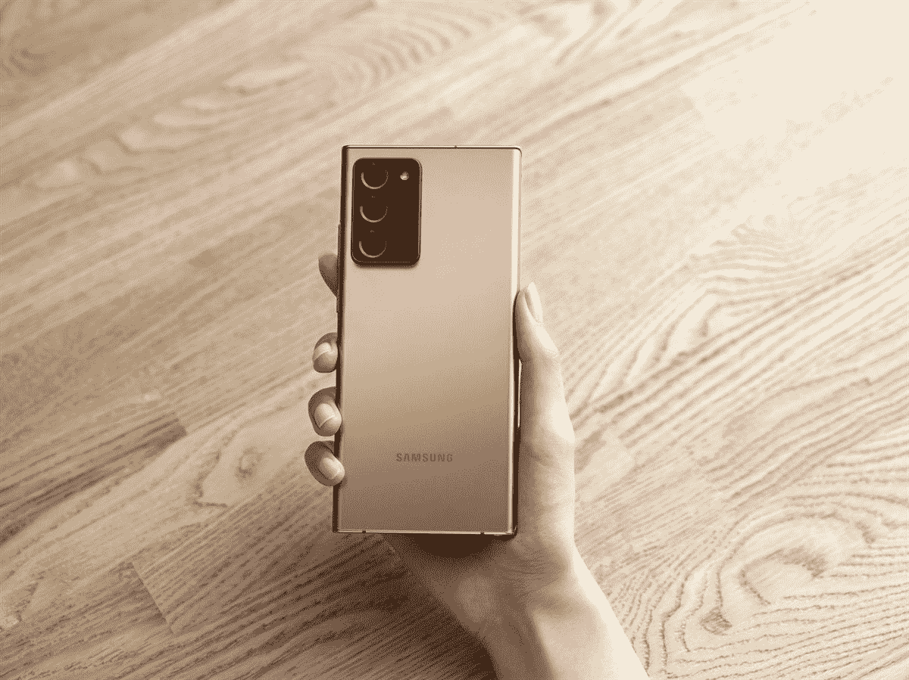

# 三星 2022 年回顾:成熟、精致和一些突出

> 原文：<https://www.xda-developers.com/samsung-2022-year-in-review/>

2022 年是相对繁忙的一年，不同类别的产品层出不穷。对于大多数制造商来说，这可能是智能手机升级的一年，但我们看到了业内一些大公司和小公司的佼佼者。特别是三星，由于该公司向其产品组合中添加了大量新设备，并对其现有产品和服务进行了大量更新，因此日程排得很满。

但由于现在是 12 月，这意味着你可以听到整个月的科技新闻，这是一个很好的时间来回顾韩国最大的财阀的一些值得注意的发展。从轰动一时的产品发布会到你可能没注意到的鲜为人知的更新，让我们快速浏览一下三星在 2022 年发布的所有产品。

## 三星 Galaxy S22 和 Galaxy S22 Plus:默认安卓旗舰

Galaxy S22 和 Galaxy S22+可能不是最强大的旗舰产品，但它们有很多优点，非常容易推荐，即使在上市近一年后也是如此。事实上，我在 Galaxy S22 内部还保留着我的二级 SIM 卡，它是我今年使用最多的智能手机。它并不是没有缺陷，但我不断回来，因为它的形式因素。

Galaxy S22 是 Galaxy S22 系列中最小的成员，但它仍然充满了强大的冲击力，并与其他许多顶级旗舰产品展开了激烈的竞争。正如我在我的 [extended Galaxy S22 评测](https://www.xda-developers.com/samsung-galaxy-s22-long-term-review/)中提到的，紧凑型手机往往不如大型手机强大。但除了 3，700 毫安时的小电池，如果你不想花很多钱或

需要一款可以放入口袋的设备。它在假期可以以折扣价买到，所以在我写这篇文章的时候，它甚至是一个更好的价值。

同样，对于那些想要比普通 Galaxy S22 更大的手机的人来说，Galaxy S22+也是一款出色的手机。XDA 主编 Rich Woods，[在今年早些时候评论 Galaxy S22+](https://www.xda-developers.com/samsung-galaxy-s22-plus-review/) 时，称其为主流消费者的最佳 Android 旗舰产品，具有体面的电池寿命，良好的综合性能，以及全面的生态系统。他在评论中提到的所有观点仍然有效，它仍然是 2022 年你可以买到的最好的智能手机之一。如果有什么不同的话，Galaxy S22 和 Galaxy S22 Plus 现在只会随着最新的软件更新和显著的价格下降而变得更好。

## 三星 Galaxy S22 Ultra:一部智能手机搞定一切

如果有一款智能手机真正配得上“超级”的名字，那就是 Galaxy S22 Ultra。1200 美元，你买的不仅仅是一部比 Galaxy S22 和 Galaxy S22+还大的手机。相反，你正在为自己准备至少几年的 2022 年最全面的手机。我仍然向那些想购买顶级 Android 旗舰的人推荐这款手机。

S22 Ultra 配备了一个华丽的 6.8 英寸 OLED 面板，刷新率高达 120Hz，拥有不少于 5 个摄像头，内置 S Pen 以满足 Note 系列爱好者的需求，并拥有足够的电量来处理任何应用程序或游戏。Galaxy S22 Ultra 独树一帜，它无疑是三星有史以来发布的最好的智能手机之一。

## 银河笔记系列的终结...或者是？

 <picture></picture> 

Samsung Galaxy Note 20 and Note 20 Ultra

Galaxy S22 系列亮相后不久，一名三星高管正式[确认 Note 阵容](https://www.xda-developers.com/galaxy-note-officially-dead/)结束。该公司智能手机首席执行官卢泰愚在 MWC 2022 大会上回答一名记者的问题时说，“从现在开始，Galaxy Note 每年都会以‘超’的形式推出。”

然而，三星并不认为 Galaxy S22 Ultra 的到来是 Note 系列的死亡。相反，它认为这是 Galaxy Note 和 Galaxy S 系列的合并。这很有意义，因为 Galaxy S22 Ultra 可以说是一款笔记本设备。它可能没有官方的“Note”名称，但它的外观和行为都像是 Note 系列的旗舰产品。用户还可以通过三星 Galaxy Z Fold 4 获得 Note 的感觉，这是 Galaxy Note 爱好者的可靠选择。说到三星折叠式手机...

## 三星 Galaxy Z Fold 4:你在美国能买到的最好的可折叠手机

就像市场上的其他可折叠手机一样， [Galaxy Z Fold 4](https://www.xda-developers.com/samsung-galaxy-z-fold-4-review/) 也有一个更大的屏幕，可以变得更小以适合你的口袋。但 Galaxy Z Fold 4 的特别之处在于，它比以往任何时候都更可靠，它可以在各种外形之间变形，而不会让你觉得你要把它掰成两半。三星也花了很大力气让 Galaxy Z Fold 4 成为一款圆润的可折叠手机。它的外部显示屏现在足够宽，可以让它更接近传统的平板手机，它的内部显示屏——加上一些简洁的软件功能——使它成为平板电脑的可靠替代品。不再是那个尴尬的老二，他俩都不完美。Galaxy Z Fold 4 还可以兼作一个很好的记事本，这要归功于 S Pen 的支持，或者是一台内置 Dex 模式的休闲用户的体面计算机。

Galaxy Z Fold 4 远不是一款完美的折叠手机，但也很接近了，我迫不及待地想知道三星打算对其继任者做些什么。同样值得注意的是，三星制造了美国唯一一款可折叠手机。是的，Z Fold 4 1，800 美元的价格对大多数人来说太贵了。不过，由于折价促销和其他折扣，你还是可以以相当低的价格买到一台。

## 三星 Galaxy Z Flip 4:增量但令人印象深刻

三星的另一款可折叠手机 [Galaxy Z Flip 4](https://www.xda-developers.com/samsung-galaxy-z-flip-4-review/) 是今年三星手机中升级幅度最大的一款，但这并不影响它仍然是一款有趣而时尚的手机。它的 6.7 英寸屏幕对折，成为最便携的手机之一。

三星没有花很大的力气去改变 Galaxy Z Flip 4，但升级仍然是很好的补充。例如，Flip 4 的内部屏幕现在由更坚固的超薄玻璃保护，其用户不可更换的屏幕保护器也带有更强的粘合剂。肯定有一些改进的空间，但 Galaxy Z Flip 4 不可否认地很有趣，它是 2022 年你可以买到的独特手机之一。

## 三星令人印象深刻的 2022 年可穿戴设备阵容

三星在可穿戴领域的年度更新以新的 Galaxy Watch 5 智能手表和新的 Galaxy Buds 的形式出现。Galaxy Watch 5 和 Galaxy Watch 5 Pro 都提供了熟悉但升级的硬件，以保持智能手表市场的一些领先地位。Galaxy Watch 5 本质上只是 Galaxy Watch 4 的升级版，但 Galaxy Watch 5 Pro 是迎合高级用户的新机型。你可以阅读我们的 [Galaxy Watch 5](https://www.xda-developers.com/samsung-galaxy-watch-5-review/) 和 [Watch 5 Pro 评测](https://www.xda-developers.com/samsung-galaxy-watch-5-pro-review/)来了解这些手表的更多信息，但是 TL；DR 是 Galaxy Watch 5 Pro 是上级机型，更耐用，续航更好。

三星还在 2022 年首次推出了 Galaxy Buds 2 Pro，与上一代机型相比，这款产品佩戴更舒适，声音更好，并改善了主动噪音消除功能。几个月前，XDA 的高级编辑 Ben Sin [查看了这些耳塞](http://www.xda-developers.com/samsung-galaxy-buds-2-pro-review/)，他对它们的功能印象深刻，尤其是透明模式。这些耳塞与他们的前辈没有明显的不同，但即使是渐进的改进也使他们成为三星迄今为止最好的耳塞。

## 新的平板电脑和笔记本电脑

三星还升级了 Galaxy Tab S 和 Galaxy Book Pro 阵容。该公司分别为其 Galaxy Tab S 和 Galaxy Book 2 系列增加了三款新平板电脑和四款新笔记本电脑。 [Galaxy Tab S8 Ultra](https://www.xda-developers.com/samsung-galaxy-tab-s8-ultra-review/) 是 Tab S8 系列中脱颖而出的一款。它确实很突出，因为它很大，但它是一个伟大的工作任务和娱乐的机器。也就是说，普通的 Galaxy Tab S8 和 Tab S8+对其前代产品进行了有意义的升级。

同样， [Galaxy Book 2 系列](https://www.xda-developers.com/samsung-galaxy-book-2-series-now-available/)中的所有新型号都比它们的前辈带来了重大且急需的升级。它们现在都采用 AMOLED 屏幕，所以你不必再选择高级型号来获得更好的显示效果。新的笔记本电脑还采用了英特尔第 12 代酷睿处理器，这意味着它们比前代产品更快、更节能。但是，更新的机器比上一代笔记本电脑更好的是它们的适应性和装饰性。这些不仅是你现在能买到的最好看的笔记本电脑，而且也是最轻的。Galaxy Book 系列中更新的笔记本电脑今年吸引了大量眼球，这可能是该公司需要更多关注其计算部门并与其他玩家展开角力的原因。

## 三星 One UI 5 首次亮相

基于 Android 13 的三星 [One UI 5](https://www.xda-developers.com/samsung-one-ui-5-open-beta-hands-on/) 于 2022 年 10 月公开测试，并开始为 Galaxy S22 系列及其最新的可折叠手机推出。软件更新的推出听起来可能不足以成为年终亮点，但它巩固了三星在 Android 领域的头把交椅。它仍然是除谷歌之外第一批向用户推送一致可靠的更新的制造商之一。三星还出色地将 One UI 的稳定版本分发到了 2022 年的旗舰产品之外。许多老款三星手机也收到了更新，而许多其他制造商仍在制定类似的路线图。

## SmartThings 现已通过物质认证

三星是首批获得该认证的制造商之一。该公司在 Matter 于 10 月推出后仅一周就收到了它，并宣布 [Matter 支持](https://www.xda-developers.com/samsung-smartthings-platform-matter-support/)将于当月晚些时候推出到其平台上。

对于外行人来说，Matter 是一种新的智能家居标准，它为智能家居设备之间的通信提供了一种通用语言，而无需依赖基于云的解决方案。它使智能家居设备更加安全可靠，是智能传感器、照明、开关等所有互联家居设备的发展方向。三星和其他几家制造商已经将其兼容的集线器更新为物质控制器，你可以期待更多的平台很快加入这个列表。

## 三星奥德赛方舟:消费电子展的亮点

三星奥德赛方舟值得用来替换你现在的显示器吗？大概不会。但它是否足够酷，足以被纳入三星的年终综述？绝对的！奥德赛方舟无疑是 2022 年宣布的最雄心勃勃的产品之一。这是一款巨大的 55 英寸曲面游戏显示器，拥有游戏显示器所需的一切，包括带有迷你 LED 背光的 VA 面板，可提供更亮的视觉效果和出色的对比度，以及可以 165Hz 刷新率输出 4K 分辨率的 HDR10 Plus 显示器，可帮助您充分利用下一代游戏机。

然而，奥德赛方舟的特别之处在于，你可以将它置于驾驶舱模式，将多达三个 31 英寸的显示器堆叠在一起。这就是为什么三星认为你会为它支付 2500 美元。看，奥德赛方舟听起来就像奥德赛 Neo G9 在 2019 年首次宣布时一样荒谬。但三星后来发布了几款价格实惠的 Neo G9 显示器，所以我希望奥德赛方舟在 2023 年及以后也能得到类似的待遇。

## 三星 Home Hub 怎么了？

三星在 CES 2022 上展示的众多东西之一是这款名为[家庭中枢](https://www.xda-developers.com/samsung-home-hub-access-smart-home-devices-one-screen/)的新型智能家居控制器。这是一款便携式 8.4 英寸触摸屏平板电脑，垂直放置在充电底座上，内置三星的 Bixby 语音助手。它旨在成为家庭中的中央枢纽，以控制和监控 SmartThings 兼容设备，它甚至有两个麦克风和两个扬声器，以接受语音命令并做出响应。它看起来像是运行了一个放大版的三星 SamrtThings 智能手机应用程序，让你可以控制所有的智能家居设备，所以它可能非常适合那些寻求专用智能家居界面的人。三星表示，它将于 2022 年 3 月在韩国推出 Home Hub，随后将在全球推出，但现在还看不到它的踪影。

三星似乎暂时搁置了这款特别的平板电脑。事实上，它在发布时只是被美化为 SmartThings 智能手机应用程序的硬件，这引发了一些问题。三星承诺未来将通过允许其控制第三方智能家居设备来改善这一点，但我们不知道这一点将于何时实现。我明白为什么用户可能很难看到一款只预装了该公司 SmartThings 应用程序的平板电脑的吸引力。能够将它用作控制其他智能设备的中枢，有点像 Echo Show 显示器，会使它变得更好。

也有可能三星正在等待推出 Matter 来帮助 hub 连接其他制造商的设备。三星和其他一些大牌公司已经承诺支持 Matter 标准，我们看到该公司的第一阶段推出只是时间问题(没有双关语)。我们可能会在 CES 2023 上再次听到更多关于 Home Hub 的消息。

## 2023 年及以后:更多未来

可以肯定地说，2022 年是三星取得不同成功的一年。该公司最终推出了很多我们在这里没有提到的产品，包括 [Galaxy A53](https://www.xda-developers.com/samsung-galaxy-a53-5g-hands-on/) 手机、[自由式投影仪](https://www.xda-developers.com/samsung-the-freestyle-review/)等等。这一切都表明了三星如何在不同领域与众多对手较量。该公司推出了比我希望的更多的迭代产品，但这只是一个日益成熟的市场的反映。有一个合理的说法是，由于缺乏真正的竞争，三星正在谨慎行事。尽管如此，其他制造商的各种旗舰也遵循了类似的趋势。整个行业的购买周期越来越长，因为制造商正在努力为每一代新产品提供真正与众不同的功能。

三星会在 2023 年发布更多出色的产品还是双倍增加增量更新？我对三星下一代可折叠手机的更大变化抱有希望，但我不认为它会对 [Galaxy S23 阵容](https://www.xda-developers.com/samsung-galaxy-s23/)产生影响，除非每年进行几次升级，否则预计不会带来任何重大变化。同样，我们今年也看到了三星的一些不错的可穿戴设备，我希望看到更多同样的设备，只是同比有所改进。像往常一样，我为惊喜敞开大门，我们一定会在 XDA 这里广泛报道它们！