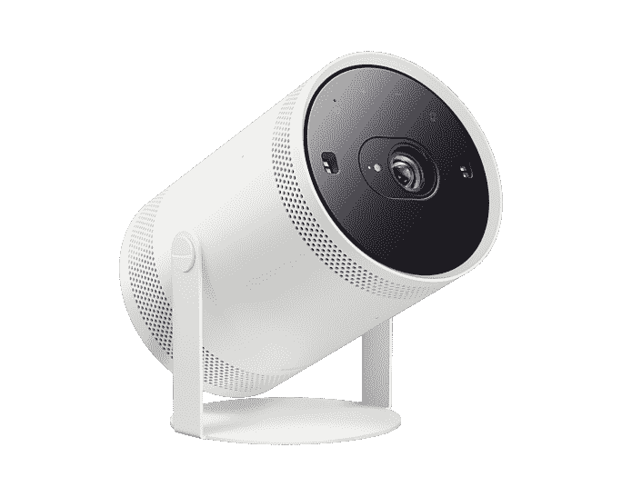

# 三星庆祝其 53 周年纪念日，在智能手机、显示器、电视等产品上提供巨大折扣

> 原文：<https://www.xda-developers.com/samsung-53rd-anniversary-sale-day-1/>

本周，三星正在举行促销活动庆祝其成立 53 周年，其网站上的大量产品，包括流行的智能手机、显示器和电视，都获得了巨大的折扣。销售将持续到 11 月 1 日，所以如果你一直在关注三星的产品，请确保查看所有产品类别，因为每个人都有适合的产品。除了所有在售的产品，三星每天都将重点展示某些设备，作为其“今日交易”活动的一部分。虽然我们不能列出所有的东西，但这些只是目前正在打折的大量商品中的一些亮点。

## 三星 Galaxy Z Fold 4

Galaxy Z Fold 4 带回了 Fold 3 的所有优点，外加一个更好的相机系统，一个稍宽的外部屏幕和更智能的软件。

如果你错过了 Galaxy Z Fold 4 之前的各种优惠，三星最新的促销活动可能就是为你准备的。今天，你可以以 400 美元的价格从当前的 MSRP 中买到 512GB 版本的 Galaxy Z Fold 4。如果你想让事情更上一层楼，你可以利用三星的以旧换新交易，提供巨大的激励，如果你愿意以现有的三星智能手机进行交易的话。信用额度会有所不同，但三星手机的最低额度是 300 美元，最高额度是 1000 美元。如果你对这款手机有一点点好奇，那就有必要看看折价价值。

## 三星自由式

 <picture></picture> 

Samsung The Freestyle with Battery Base

##### 三星自由式便携式投影仪

三星的投影仪很小，更侧重于便携性和易用性，以瞄准首次购买者。

[Samsung The Freestyle](https://www.xda-developers.com/samsung-the-freestyle-review/) 是一款光滑时尚的投影仪，不仅外观漂亮，而且还能以低廉的价格提供许多功能。在其销售活动中，三星将从目前 799.99 美元的零售价格中减去 200 美元。该投影仪提供了与一些最受欢迎的流媒体应用程序的连接，180 度的设计允许您将设备指向您需要的地方，以及一个从各个角度产生强劲声音的扬声器。投影仪还提供智能校准功能，允许其自动调整以适应大多数环境。此外，您还可以使用兼容电池或三星灯泡适配器为其供电，使其功能更加丰富。

## 三星 S95UA 49 寸超宽曲面显示器

三星 S95UA 是一款超宽 QHD 显示器，提供清晰的图像和流行的色彩。超宽显示器也是为了实现最高的工作效率而设置的，允许在一个屏幕上设置双显示器。

三星 S95UA 是一款巨大的 49 英寸超宽屏显示器，提供了两个世界的最佳选择，出色的图像质量和最高的工作效率。它可以通过一台显示器实现这一切，允许用户只使用一台显示器进行双屏设置。它支持 HDR，并有一个 USB-C 端口，可提供高达 90W 的功率，这意味着你可以插入笔记本电脑，直接从显示器上充电。如果这还不够，它还内置了 KVM 开关、各种输入和内置立体声扬声器。三星现在对 S95UA 打折近 400 美元，这意味着你可以买到一台很棒的显示器。

## 三星 QN90B Neo QLED 电视

##### 三星 QN90B Neo QLED 电视

三星 QN90B 凭借其量子矩阵技术提供了出色的图像质量，该技术由量子迷你 led 组成，可提供单独的光区来精确照亮显示屏。

QN90D QLED 电视提供令人惊叹的画质和绚丽的色彩。它能够实现这一目标要归功于其 Neo QLED 超精密迷你 LED。此外，该电视还支持杜比全景声，无需额外的扬声器，即可提供身临其境的 3D 声音。凭借其智能校准功能，您可以在几分钟内获得最佳图像质量。在销售期间，三星将 65 英寸机型降价 1000 美元，这是一笔不小的交易。

请记住，这只是目前在售产品的一小部分样品。虽然其中一些只限于一天，但有更多的项目可以浏览。拍卖将从 10 月 24 日持续到 11 月 1 日。

* * *

**来源** : [三星](https://shop-links.co/link/?exclusive=1&publisher_slug=xda&article_name=Samsung+celebrates+its+53rd+anniversary+with+huge+discounts+on+smartphones%2C+monitors%2C+TVs%2C+and+more&article_url=https%3A%2F%2Fwww.xda-developers.com%2Fsamsung-53rd-anniversary-sale-day-1%2F&u1=UUxdaUeUpU1000083&url=https%3A%2F%2Fwww.samsung.com%2Fus%2Fshop%2Fall-deals%2F%23weeklongdeals)