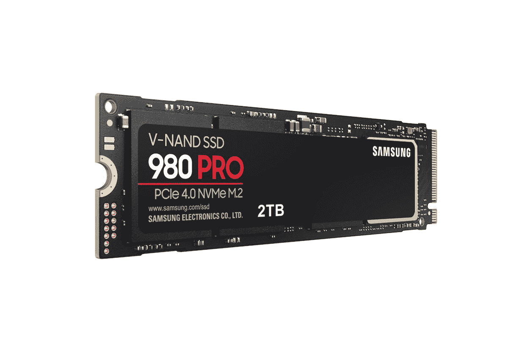

# 三星 980 Pro M.2 2TB 固态硬盘以 350 美元的低价出售

> 原文：<https://www.xda-developers.com/samsung-980-pro-ssd-discount/>

# 三星 980 Pro M.2 2TB 固态硬盘的折扣价为 350 美元

三星 980 Pro M.2 PCIe Gen4 2TB 固态硬盘目前以 80 美元的折扣出售，价格降至 350 美元。

三星去年推出了速度最快的 M.2 固态硬盘 980 Pro，目前正在打折销售顶级型号。你可以从亚马逊[或 Samsung.com](https://www.amazon.com/SAMSUNG-Internal-Gaming-MZ-V8P2T0B-AM/dp/B08RK2SR23/?tag=xda-79uj1u9-20&ascsubtag=UUxdaUeUpU2011&asc_refurl=https%3A%2F%2Fwww.xda-developers.com%2Fsamsung-980-pro-ssd-discount%2F&asc_campaign=Short-Term)以 350 美元的价格买到 2TB 的型号，低于原价 430 美元，这实际上为你节省了 80 美元，这是一笔很有价值的交易。

980 Pro 应该是您的选择，尤其是如果您正在升级或构建一台全新的 PC。该驱动器采用新的 PCIe Gen4 标准，从技术上讲，它比大多数 M.2 固态硬盘快 10 倍，比上一代 970 Pro 快两倍左右。基于带有 V-NAND 3 位 MLC 的 NVMe 1.3c 接口和封装在 M.2 (2280)外形中的三星 Elpis 控制器，三星声称 980 Pro 可以提供高达 7,000MBps 的顺序读取速度和高达 5,100MBps 的顺序写入速度。

该公司还确保热量得到控制，因为固态硬盘的控制器上有镍涂层，固态硬盘背面有散热器标签，而不是外部铜散热器。固态硬盘还采用了三星的动态热防护技术，有助于最大限度地降低性能波动。

 <picture></picture> 

Samsung 980 Pro 2TB

##### 三星 980 Pro

三星 980 Pro 配备了最新的 PCIe 第四代支持，使其经得起未来考验，是市场上最快的固态硬盘之一。

我们认为，980 Pro 适合处理高质量 4K 和 8K 视频内容的专业人士，以及喜欢高分辨率和更快加载速度的游戏玩家。980 Pro 提供 250GB、500GB 和 1TB 存储型号，目前价格分别为 80 美元、119 美元和 200 美元。2TB 型号是唯一一款售价低于三星最初发布价格的型号。请注意，PCIe 第四代目前由 AMD 的锐龙 4000 和[锐龙 5000 系列](https://www.xda-developers.com/amd-ryzen-5000-mobile-7nm-zen-3/)处理器支持，如果你是蓝队，只有新的[第 11 代 CPU](https://www.xda-developers.com/intel-11th-gen-rocket-lake-s-desktop-processors-launch/)提供对新的 PCI Express I/O 规范的支持。建议您在购买前仔细检查您的系统。