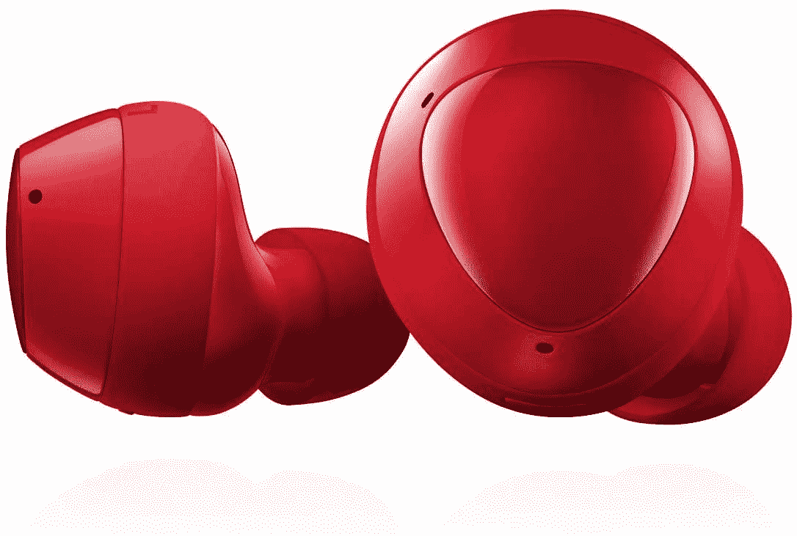
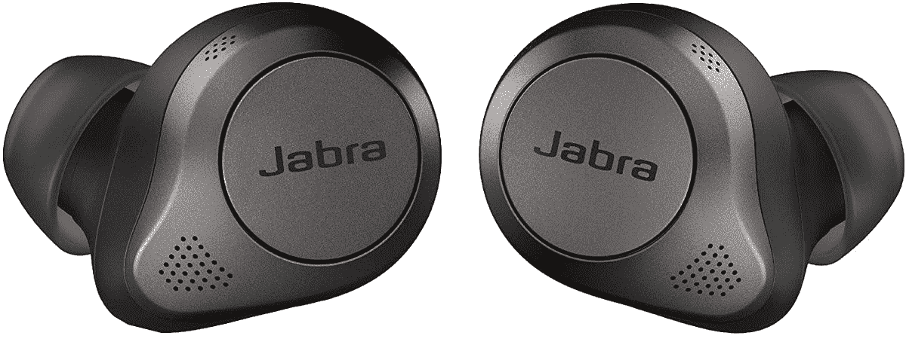

# 三星 Galaxy Buds+，Buds Live，苹果 AirPods Pro，Jabra Elite 85T 在 Prime Day 获得折扣

> 原文：<https://www.xda-developers.com/samsung-apple-jabra-tws-deals-prime-day-2021/>

TWS 最近风靡一时。虽然行业确实感受到了 3.5 毫米耳机插孔的损失，但 TWS 的越来越多的采用刺激了制造商创新和发布伟大的 TWS 选项。对于大多数用户来说，蓝牙 TWS 耳塞将提供极大的便利。现在，由于 2021 年黄金日，我们在三星、Jabra 和苹果的领先 TWS 期权上有了一些很好的交易。

## 三星 Galaxy Buds+售价 85 美元

三星 Galaxy Buds+是我最喜欢的一副耳机，自从我的评测以来，我每天都在使用它们。虽然它们没有主动噪音消除，但它们在各方面都表现出色，足以让我作为日常司机使用。这些耳塞上的麦克风和电池性能也很好，这意味着我可以毫不费力地完成通话和视频通话。Galaxy Buds+最初售价为 149 美元，但你现在可以以 85 美元的价格购买，在我看来，这是一笔不错的交易。

 <picture></picture> 

Samsung Galaxy Buds+

##### 三星 Galaxy Buds+

三星 Galaxy Buds+没有主动噪音消除功能，但它们是一对出色的 TWS 耳塞，在这些折扣下变得更加甜美。

## 三星 Galaxy Buds Live 售价 110 美元

如果主动噪音消除对您来说是一个高度优先事项，您可能会对 Galaxy Buds Live 感兴趣。[在我的评论](https://www.xda-developers.com/samsung-galaxy-buds-live-review/)中，我注意到主动噪音消除功能确实有效，但由于耳塞的形状，没有主动密封，因此净消除效果相当微弱。它的形状有一点点不确定，但对我来说，我发现它们非常合身，而且它们保持得相当好。音质也很棒。如果你想要比 Galaxy Buds+更新的东西，Galaxy Buds Live 是一个不错的选择，特别是考虑到它们最初以 170 美元的价格上市，但现在可以以 110 美元的价格购买。

 <picture></picture> 

Samsung Galaxy Buds Live

##### 三星 Galaxy Buds 直播

三星 Galaxy Buds Live 具有主动降噪功能和独特的外形。这使它们成为人们谈论的话题，您也可以期待出色的声音和超长的电池寿命。

## 苹果 AirPods Pro 售价 190 美元

苹果 AirPods Pro 是基准 TWS，仅仅是因为它们与 iPhones 的兼容性以及苹果在背后的营销推动。对于苹果用户来说，它们是最好的 TWS 选择，而且它们也被普遍认为是非常好的，尽管是苹果的经典价格。如果你以前喜欢它们，但价格标签吓走了你，这是第二次机会，因为耳塞现在售价 190 美元，而不是通常的 230 美元。你还可以为 AirPods Pro 的保护套(是的，一个保护套)挑选一个[保护套，让你的 TWS 与众不同。](https://www.xda-developers.com/best-airpods-pro-cases/)

 <picture></picture> 

Apple AirPods Pro

##### 苹果 AirPods Pro

苹果 AirPods Pro 是苹果用户推荐的 TWS 解决方案，具有出色的 ANC、声音和语音性能。

## Jabra Elite 85t 售价 170 美元

如果你想要比品牌和名字更实用的东西，Jabra Elite 85t 是不二之选。这些 TWS 耳塞具有出色的 ANC、出色的麦克风性能和超长的电池寿命。这些耳塞的形状和配合也非常好，对于那些看起来不会在简单的点头时滑出的耳塞来说，这是一个非常好的选择。Jabra Elite 85t 的标价为 230 美元，但通常只需 180 美元，在 Prime Day 2021 期间只需 170 美元。

 <picture></picture> 

Jabra Elite 85T

##### Jabra Elite 85t

如果你想超越三星和苹果，Jabra Elite 85T 是一个很好的选择。这是一对功能强大的耳塞，具有 ANC、超长电池续航时间和不错的麦克风性能等特性。