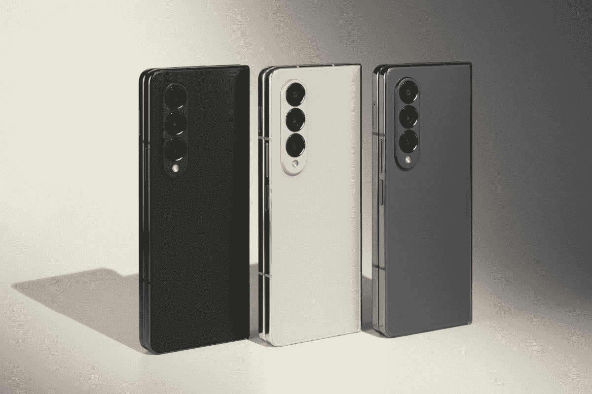
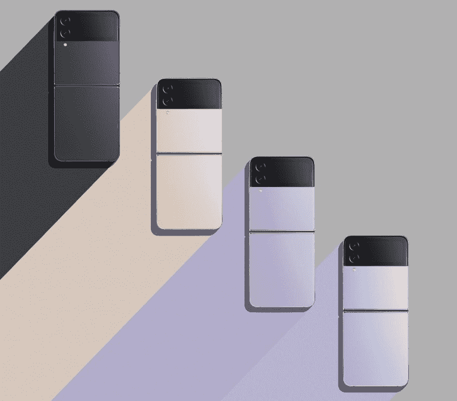
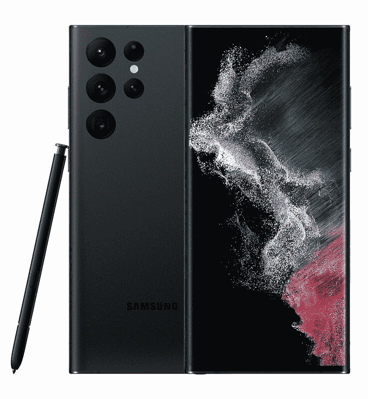

# 三星不想让你买 iPhones，所以你可以从它的可折叠手机和旗舰手机上获得更多优惠

> 原文：<https://www.xda-developers.com/samsung-deals-on-foldables-and-flagships/>

未来几天，三星将为其最令人垂涎的智能手机提供一些优惠，如 Galaxy Z Fold 4、Galaxy Z Flip 4 和 Galaxy S22 Ultra。这些是市场上最棒的可折叠智能手机和 T2 最好的安卓手机。因此，如果你一直在考虑购买一部新的智能手机，现在可能是时候了。

## 银河 Z 折叠 4

Galaxy Z Fold 4 是市场上最好的可折叠智能手机之一。它由高通最新的骁龙 8 Plus 第 1 代处理器驱动，提供 120Hz 的大规模多任务显示，甚至支持手写笔。此外，Galaxy Z Fold 4 利用康宁的大猩猩玻璃 Victus Plus 来保护外部和内部显示器。现在，在有限的时间内，三星将该设备的价格降低了 200 美元，降至 1599.99 美元。此外，它还提供免费存储升级到 512GB，并免费赠送一个手写笔盒。

 <picture></picture> 

Samsung Galaxy Z Fold 4

Galaxy Z Fold 4 采用了高通骁龙 8 加 Gen 1，并配有 512GB 的内部存储。

## 银河 Z Flip 4

Galaxy Z Flip 4 是最实惠的可折叠智能手机之一。这款手机拥有时尚的设计和紧凑的风格，但其高通骁龙 8 Plus 第 1 代处理器也具有强大的功能。此外，这款手机有多种颜色可供选择，甚至还有定制版，可以根据您的喜好进行定制。三星在有限的时间内将该设备打折 100 美元，并将存储容量翻倍，这是相当便宜的。

 <picture></picture> 

Samsung Galaxy Z Flip 4

Galaxy Z Flip 4 采用了高通骁龙 8 Plus Gen 1，并配有 256GB 的内部存储空间。

## Galaxy S22 Ultra

三星 Galaxy S22 Ultra 是一款功能强大的智能手机，设计优雅。这款手机有一个 6.8 英寸的 120Hz 大显示屏，一个强大的处理器和 108MP 主摄像头。这款智能手机还支持手写笔，允许你在旅途中随意记笔记。此外，它提供全天电池寿命，并可以通过其超级快速充电功能立即充电。三星现在将零售价下调 150 美元，并为你的二手手机提供高达 850 美元的折价积分。

 <picture></picture> 

Samsung Galaxy S22 Ultra

Galaxy S22 Ultra 采用了高通骁龙 8 Gen 1 处理器和 108MP 主摄像头。

虽然上述销售将在 9 月 18 日之前有效，但三星将在美国东部时间 9 月 16 日下午 3 点至 6 点举行额外的限时快闪销售。在此期间，三星将对 Galaxy Z Fold 3 进行特别促销，将手机价格降低 750 美元。无论你选择哪一款手机，现在都是获得一些可折叠智能手机的绝佳机会。