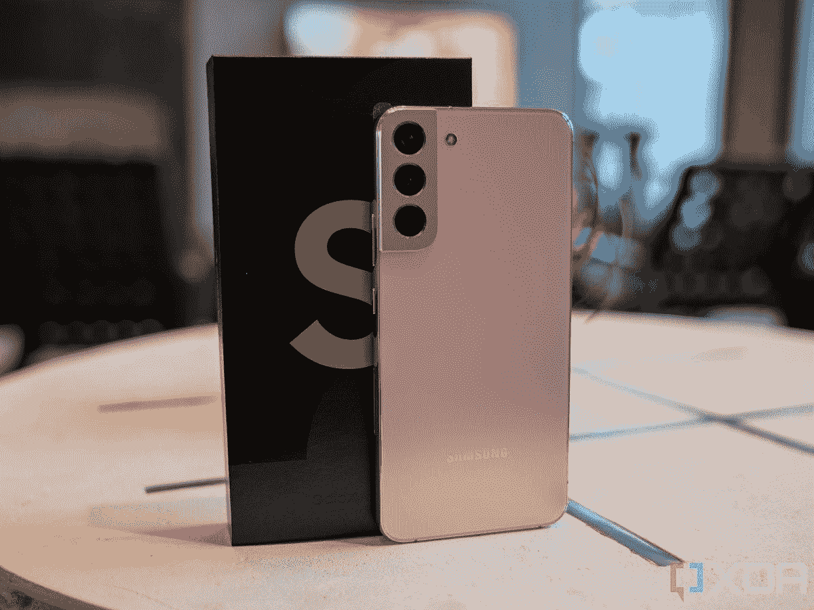

# Galaxy S24 系列可能不包括“Plus”型号

> 原文：<https://www.xda-developers.com/samsung-drop-galaxy-s24-plus-rumor/>

经过几个月的泄露和传言，三星最近证实，它将于 2 月 1 日举办今年的首次 Galaxy Unpacked 活动。该公司将在活动上宣布备受期待的 [Galaxy S23 系列](https://www.xda-developers.com/samsung-galaxy-s23/)，其中将包括三款新设备——Galaxy S23、Galaxy S23 Plus 和 Galaxy S23 Ultra。然而，这可能是三星最后一次将三款手机作为旗舰产品系列的一部分。

据报道，由于销量不佳，三星计划从明年开始放弃“Plus”变种。熟悉该公司计划的业内人士告诉 *The Elec* ，Galaxy S24 系列将只包括两款手机，普通 Galaxy S24 和 Galaxy S24 Ultra。该出版物指出，三星目前有两个开发项目，DM1 和 DM3，在工程中。这些指的是基本和超变种。虽然它最初计划发布三款手机，但在最近的一次讨论后，DM2 开发项目可能会被放弃。

 <picture></picture> 

Samsung Galaxy S22 Plus

三星可能是在 Galaxy S22 Plus 销量不佳后做出这一决定的。根据市场研究公司 GfK 的数据，Plus 变种仅占去年 Galaxy S22 总出货量的 17%。另一方面，普通和超变型分别占出货量的 38%和 45%。

放弃旗舰产品 Galaxy S 系列的“Plus”型号可能会在多个方面让三星受益。除了节省公司在开发上的资源，此举还可以通过推动想要更大显示屏的买家转向昂贵的 Ultra variant 来产生更多收入。

该报告进一步补充说，三星也可能放弃即将推出的 Galaxy A7x 系列和 Galaxy A2x 系列设备，以简化其产品组合。然而，在跳过 Galaxy S22 FE 之后，它可能会复活其平价旗舰产品的粉丝版阵容。目前，尚不清楚三星是否计划推出即将推出的 Galaxy S23 系列的粉丝版。一旦我们有更多的细节，我们会让你知道。

* * *

**来源:** [电子元件](https://www.thelec.kr/news/articleView.html?idxno=19433)