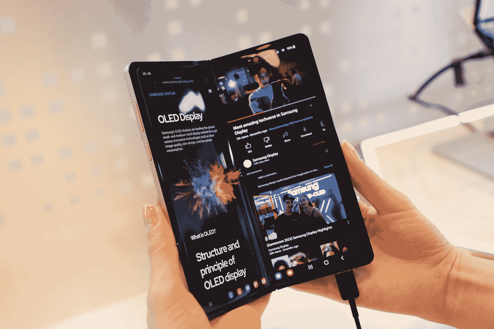
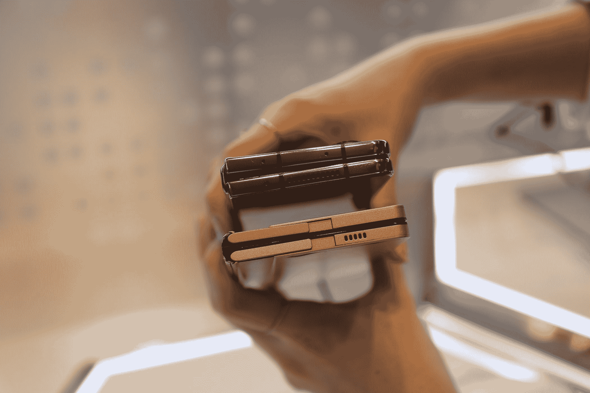

# 三星新的可折叠铰链可以 360 度旋转

> 原文：<https://www.xda-developers.com/samsung-foldable-hinge-360-degree-prototype/>

# 三星新的可折叠铰链可以 360 度旋转

它可能会在今年晚些时候与 Galaxy Z Fold 5 一起亮相

三星显示在今年的 CES 上展示了一些很酷的显示器原型，包括一款 [Flex 混合模型](https://www.xda-developers.com/samsung-flex-hybrid-prototype-ces-2023/)，它将最好的可折叠和可滚动显示器结合到了一个设备中。此外，该公司还在活动中演示了一种新型的可折叠铰链，这似乎已经在雷达下飞行。三星显示现在透露了更多关于独特铰链的细节，以及一个可以折叠 360 度的新原型显示器。

三星显示与 *The Verge* 分享了关于新的“伸缩进出”显示器的细节，展示了一个向内和向外折叠的令人难以置信的原型。为了实现这一壮举，该设备采用了一种新的“水滴铰链”设计，通过允许显示器弯曲成更宽松的形状，创建了一个明显不太明显的折痕。

 <picture></picture> 

Image credit: The Verge

最近有传言称，三星[可能会在 Galaxy Z Fold 5](https://www.xda-developers.com/samsungs-galaxy-z-fold-5-waterdrop-hinge-and-waterproof/) 上提供这种水滴铰链，这可以通过允许它折叠起来，中间几乎没有间隙，从而显著减少其厚度。三星目前的可折叠手机使用 U 形铰链，在显示屏上产生明显的折痕，不会折叠平整。

 <picture></picture> 

Image credit: The Verge

如果三星在即将推出的可折叠手机上使用新的铰链设计，这可能是过去几年中该系列产品最大的设计变化。但由于 Galaxy Z Fold 5 的发布还有几个月的时间，我们必须等待一段时间才能确定。

目前，三星正在准备推出备受期待的 [Galaxy S23](https://www.xda-developers.com/samsung-galaxy-s23/) 系列。它将在 2 月 1 日的 Galaxy Unpacked 活动中推出这些设备。如果您有兴趣购买其中一款新机型，您可以通过下面的链接注册您的兴趣，并获得高达 100 美元的信用点数。

* * *

**Via:** [濒临绝境](https://www.theverge.com/2023/1/19/23562651/samsung-360-display-prototype-z-fold-5-smartphone)