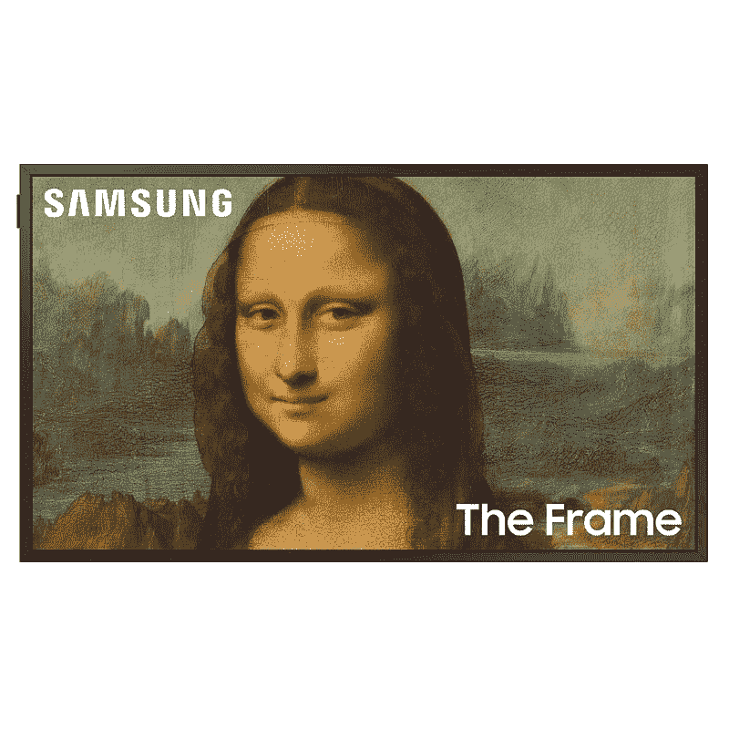

# 在亚马逊和三星网站上购买三星标志性的框架电视，最高可节省 800 美元

> 原文：<https://www.xda-developers.com/samsung-frame-tv-amazon-prime-day-deal/>

除了三星的可折叠耳机和 T2 耳机的惊人优惠外，亚马逊的 Prime Early Access 销售对这家韩国巨头的智能电视有很大的折扣。如果你想买一台高端电视，目前购买三星标志性的框架电视可以节省 800 美元，购买 Neo QLED 8K 智能电视可以节省 500 美元。

你现在可以在亚马逊上以 1598 美元的价格买到 65 英寸的三星框架电视，而 75 英寸和 85 英寸的型号分别要花费 2198 美元和 3498 美元。但这个价格不包括专家壁挂安装服务，65 英寸的型号需要额外支付 150 美元，另外两种型号需要 200 美元。有趣的是，三星也在其网站上提供类似的折扣，三种型号的价格都比亚马逊高出一美元。然而，三星的安装服务更实惠，三种型号都是 120 美元。

 <picture></picture> 

Samsung Frame TV

##### 三星框架电视

亚马逊和三星为后者标志性的框架电视提供高达 800 美元的价格。但是亚马逊的壁挂服务比三星的要贵一点。

如果你打算自己安装电视，你可以从亚马逊订购，这样送货速度会更快。但是，如果您更愿意让专家来处理安装过程，您应该通过三星的网站订购电视。请注意，在购买电视之前，您必须手动添加安装服务。

与 Frame TV 一样，亚马逊和三星也在为后者的 Neo QLED 8K 电视提供折扣。正如你可能已经猜到的，价格并没有太大的不同，但三星的专业安装服务更加实惠。不幸的是，电视没有壁挂支架，所以如果你从亚马逊购买，你必须单独购买一个。不过，在三星的网站上，你可以花很少的钱购买一个兼容的壁挂支架，从而避免这种麻烦。

 <picture></picture> 

Samsung Neo QLED 8K TV

##### 三星 Neo QLED 8K 电视

与 Frame TV 一样，亚马逊和三星对优质的 Neo QLED 8K 电视提供高达 500 美元的折扣。不过三星的壁挂安装服务就实惠多了。

三星 Neo QLED 8K 电视的 65 英寸版本在亚马逊上的售价为 3798 美元，而 75 英寸和 85 英寸的型号可以分别为 4798 美元和 5998 美元。三星的网站上列出了所有三种型号，只需额外支付一美元。

*你会从三星的网站订购这些三星电视并节省安装费用，还是会从亚马逊购买并自己安装？请在下面的评论区告诉我们。*