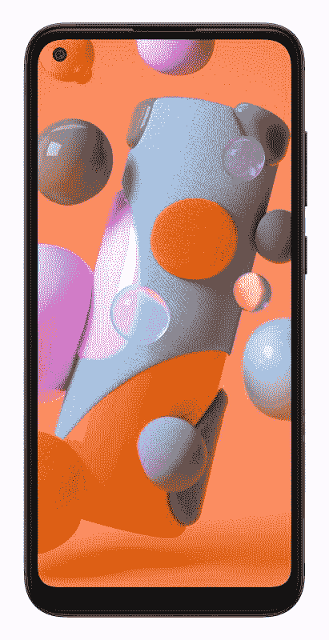

# 三星 Galaxy A11 是一款配备三个后置摄像头的经济型智能手机

> 原文：<https://www.xda-developers.com/samsung-galaxy-a11-budget-smartphone-triple-rear-cameras-announcement/>

# 三星发布带有三个后置摄像头的经济型 Galaxy A11 智能手机

三星悄悄宣布了 Galaxy A11 的预算，规格不高，有三个后置摄像头。请继续阅读，了解更多关于手机的信息！

廉价智能手机市场利润微薄，生存的理念是“最大馅饼中的最小一块”。这一领域的原始设备制造商依赖于实现大规模生产，因此毫不奇怪，2019 年一些最畅销的 Android 智能手机来自预算阵容。三星的 Galaxy A 系列在这一领域表现出色，根据一份报告，Galaxy A10 是去年最畅销的安卓智能手机。现在，三星已经悄悄地以[新三星 Galaxy A11](https://www.samsungmobilepress.com/mediaresources/galaxy_a11/techspecs) 的形式推出了 Galaxy A10 的继任者。

## 三星 Galaxy A11:规格

| 

规格

 | 

三星 Galaxy A11

 |
| --- | --- |
| **尺寸和重量** | 

*   161.4 x 76.3 x 8.0 毫米
*   177 克

 |
| **显示** | 

*   6.4”高清+ TFT 液晶屏；
*   穿孔显示(Infinity-O)

 |
| **SoC** | 八核 1.8GHz |
| **RAM 和存储器** | 可通过 microSD 卡插槽扩展 |
| **电池&充电** | 

*   4000 毫安时电池
*   15W 快速充电

 |
| **后置摄像头** | 

*   **主要:** 13MP，f/1.8
*   **辅助:** 2MP，深度传感器，f/2.4
*   第三代:500 万像素，广角摄像头，f/2.2

 |
| **前置摄像头** | 800 万像素 f/2.0 |
| **其他特性** | 

*   3.5 毫米耳机插孔
*   后置指纹传感器

 |
| **安卓版本** | - |

三星 Galaxy A11 是一款不起眼的智能手机，这正是目标受众所需要的。虽然拥有额外的功能总是好的，但三星拥有广泛的产品组合，不同价位的不同设备具有不同水平的高端功能。因此，有一些比其他选项更有根据的选项确实是有意义的。在 Galaxy A11 上，很少有引人注目的功能——没有玻璃背板，没有 AMOLED 显示屏，没有显示指纹扫描仪，等等。

 <picture></picture> 

Samsung Galaxy A11

三星甚至没有说明手机上的处理器，RAM 和存储也很简陋。在 plus 上，这款手机确实有一个健康的 4,000 mAh 电池，支持 15W 快速充电，这应该可以很好地转化为现实生活中的电池寿命和充电。板载还有一个三后置摄像头，这应该会为用户提供一些多功能性，尽管我们不会对我们的期望过高。

三星没有透露任何关于这款手机的进一步细节，所以我们不知道这款手机将进入哪些市场，以及价格如何。如果我们不得不猜测，我们可以猜测它将前往 Galaxy A10 正式发售的地区。