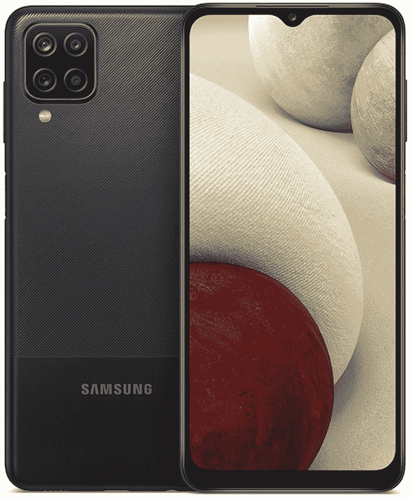

# 三星 Galaxy A12 评论:缓慢和稳定不会赢得这场比赛

> 原文：<https://www.xda-developers.com/samsung-galaxy-a12-review/>

三星在去年[11 月](https://www.xda-developers.com/samsung-galaxy-a12-launch-india/)首次展示了 Galaxy A12 和 Galaxy A02s，在随后的几个月里，逐渐在印度和其他地区[发布。这款手机已经在美国上市有一段时间了，由于我们已经看过了三星的大多数其他美国廉价手机，我们认为现在是尝试 A12 的最佳时机。](https://www.xda-developers.com/samsung-galaxy-a12-launch-india/)

和之前的 Galaxy A11 一样，Galaxy A12 也是一款低端预算手机。理论上看起来不算太差，6.5 英寸显示屏，5,000mAh 电池，但在日常使用中却是一种令人沮丧的体验。我们的完整评论在下面，但是剧透一下——你可能应该买些别的。

## 三星 Galaxy A12:规格

| 

规格

 | 

三星 Galaxy A12

 |
| --- | --- |
| **打造** | 

*   塑料背板/框架
*   无耐水性

 |
| **尺寸&重量** |  |
| **显示** | 

*   6.5 英寸高清+ 1600 x 720(高清+)
*   “无限 V 型”凹槽

 |
| **SoC** | 

*   联发科 MT6765V/CA (Helio P35)
    *   4 个 2.3GHz 内核
    *   4 个 1.8 GHz 内核

 |
| **闸板&存放** | 

*   3GB 内存(在某些非美国型号中为 4-6GB)
*   32GB 存储空间(某些非美国型号为 64-128GB)
*   最高 1TB 的 microSD

 |
| **电池&充电** | 

*   5000 毫安时电池
*   15W 有线充电(含壁式适配器)

 |
| **安全** | 侧装式指纹传感器 |
| **后置摄像头** | 

*   **初选:** 48MP 初选
*   **二级:** 5MP 广角
*   **第三级:** 2MP 宏
*   第四纪: 2MP 深度

 |
| **前置摄像头** | 800 万像素 |
| **端口** | 

*   USB 类端口
*   3.5 毫米耳机插孔

 |
| **音频** | 面向底部的扬声器 |
| **连通性** | 

*   4G LTE
*   蓝牙 5.0
*   C 型端口
*   WiFi 802.11 . b/g/n/AC(2.4 GHz+5 GHz)

 |
| **软件** | Android 10(一个 UI 核心 2.5) |

***关于这篇评测:**我收到了三星美国公司的 Galaxy A52 5G，我已经使用该设备大约一周了。三星没有参与此次审查的任何部分。*

## 设计和建造

Galaxy A12 是一个大型塑料板，高 164 毫米，宽 75.8 毫米。这肯定是一款大型手机，但与普通的现代 Android 手机相差不远。正面有一块 6.5”IPS 屏幕，分辨率为 1600 x 720。较低的分辨率在 6.5 英寸时看起来肯定不太好，但在这个价格范围内没有多少 1080p 手机(至少在美国)。显示屏上方是前置摄像头的凹槽(三星将这种设计称为“Infinity-V”)，屏幕下方是一个小边框。

手机的两侧和后部覆盖着相同的塑料材料，但 Galaxy A12 的后上部增加了一种纹理。比起许多其他廉价手机上的光滑塑料外壳，我肯定更喜欢哑光塑料(例如三星自己的 [Galaxy A42](https://www.xda-developers.com/samsung-galaxy-a42-5g-review/) )，所以我在这里没有任何抱怨。它仍然是塑料的，但它是不容易被指纹和污迹覆盖的塑料。

手机左侧是 microSD 和 SIM 卡插槽。Galaxy A12 支持最大 1TB 的 SD 卡，但请记住[三星在其所有手机上关闭了 Android 的可采用存储功能](https://www.xda-developers.com/adoptable-storage-samsung-android-pie/)，所以你只能使用 SD 卡存储文件——而不是应用程序。移动到右侧，你会看到音量控制和一个指纹传感器，兼作电源按钮。该传感器可以快速检测到我的手指，但如果你左手拿着 Galaxy A12，就很难够到。

最后，手机底部有一个 USB Type-C 连接器，一个 3.5mm 耳机插孔，和一个单扬声器。扬声器听起来很糟糕，正如你可能会在廉价手机上看到的那样。你可以通过 USB Type-C 为 Galaxy A12 充电，最高功率为 15W，三星在包装盒中包括了一个 15W 的墙壁适配器。

## 软件

如果你最近用过三星手机，Galaxy A12 的软件不会让你感到惊讶。它与你在三星其他设备上获得的单一用户界面体验几乎相同，尽管 Galaxy A12 是几款具有略微精简的“单一用户界面核心”体验的设备之一。

一个 UI 内核不支持[好锁](https://www.xda-developers.com/tag/good-lock/)、 [Bixby](https://www.xda-developers.com/tag/bixby/) (含 Bixby 例程)、 [Samsung Pay](https://www.xda-developers.com/samsung-pay/) 、安全文件夹。微软手机应用中的[应用镜像功能也不可用，但你仍可以在 Windows 10 电脑上查看通知。你也不能使用](https://www.xda-developers.com/your-phone-multiple-android-app-support/)[三星 DeX 桌面环境](https://www.xda-developers.com/tag/samsung-dex/)，但这也适用于许多运行标准 One UI 的设备——它需要比 Galaxy A12 更多的处理能力。

然而，人们在三星手机上寻找的大多数功能仍然存在。您可以在浅色和深色主题之间切换(包括自动模式)，在小浮动窗口中打开应用程序，等等。然而，即使 [Android 12](https://www.xda-developers.com/android-12/) 只有几个月的时间，Galaxy A12 仍然运行 Android 10。三星已经开始为 Galaxy A12 [在一些国家](https://www.sammobile.com/news/galaxy-a12-android-11-update-released/)推出 Android 11，但是更新还没有到达美国。

还需要注意的是，三星承诺的三代 Android 升级[目前不包括 A1x 系列](https://www.samsungmobilepress.com/pressreleases/samsung-raises-the-bar-for-mobile-experience-innovation-committing-to-three-generations-of-android-os-upgrades)，因此不能保证 Galaxy A12 将获得多少操作系统更新。三星刚刚开始[推出 Android 11 到去年的 A11](https://www.gsmarena.com/samsung_galaxy_a11_android_11_one_ui_3_1_update-news-49088.php) ，而在此之前的 A10 只收到[一次 Android 10](https://www.xda-developers.com/samsung-galaxy-a10-a20e-xcover-4s-android-10-one-ui-2-0/) 的更新，所以 Android 11 似乎很可能是 Galaxy A12 唯一的重大更新。

## 性能和电池寿命

哦，好家伙。我知道这是一部 180 美元的手机(它经常以 100 美元左右的价格出售)，所以我必须保持我的期望，但 Galaxy A12 使用起来并不有趣。大多数应用程序在几秒钟内打开，但动画和滚动的等待时间太长，以至于大多数时间使用手机都令人沮丧。由于延迟，甚至默认键盘也错过了我的一些按键——切换到 [Gboard](https://play.google.com/store/apps/details?id=com.google.android.inputmethod.latin) 是一个改进。在这个价格范围内，桶底性能并不罕见，但这并没有使这种体验变得不那么令人厌倦。

过去几个月，我一直在研究三星目前的低价手机，从 [Galaxy A52 5G](https://www.xda-developers.com/samsung-galaxy-a52-5g-review/) 开始，一直到 [Galaxy A42 5G](https://www.xda-developers.com/samsung-galaxy-a42-5g-review/) 和 [Galaxy A32 5G](https://www.xda-developers.com/samsung-galaxy-a32-5g-review/) 。Galaxy A12 比所有这些手机都便宜，所以性能较慢是可以预期的，但 Galaxy A32(零售价为 280 美元，但目前正在销售，售价为 205 美元)比 Galaxy A12 的体验好得多。手机的联发科 Helio P35 芯片组和 3GB RAM 就是跟不上。

至少电池寿命是完全可以接受的。对于大多数人来说，5,000mAh 的大电池应该可以正常使用两天左右。因此，如果你每天晚上给手机充电，你可能永远不会降到 40-30%以下。

## 照相机

Galaxy A12 有四个后置摄像头，但其中只有三个可以用来拍摄照片:4800 万像素的主镜头(将像素合并到 1600 万像素)，500 万像素的超宽镜头和 200 万像素的微距镜头。最后一个摄像头是一个 2MP 深度传感器，它应该可以帮助其他镜头。最后，前面有一个 800 万像素的摄像头，用于自拍。

这里的故事与其他廉价手机基本相同——如果你有充足的自然光，你可以用主相机拍出像样的照片。对于一部 170 美元左右的智能手机来说，上面这些灌木丛和建筑物的照片看起来不错，尽管这款手机在室内照片上比较吃力，即使有大量自然光从窗户射进来。

超宽相机有限的 5MP 分辨率产生的照片看起来比主镜头差得多，2MP 微距镜头也是如此。对于偶尔的 Snapchat 或 Instagram 故事来说，它们还过得去，但仅此而已。

## 结论

Galaxy A12 是三星目前销售的最便宜的智能手机之一，所以这款手机速度不快可能并不令人惊讶。然而，这款手机使用起来令人难以置信地令人沮丧，即使以其他廉价智能手机的标准来看。当键盘在初始设置过程中滞后时，你知道你有麻烦了。

这款手机在美国的建议零售价为 179.99 美元，对于一款只能完成基本任务的手机来说，这绝对是*过高的价格。三星和大多数运营商目前的售价为 104.99 美元，这是一个更好的价格，但仍然没有解决 Galaxy A12 的性能问题。你仍然会被 Android 11 作为最终更新所困扰...无论何时到来。*

我*强烈*推荐[购买 Galaxy A32 5G，而不是](https://shop-links.co/1745877354760332407?u1=2de89fe7-974a-4e00-bab0-3647857677d8)，如果你买得起的话，这款手机通常售价 279.99 美元，但经常降价到 205 美元。在这个价格范围内，购买一部[二手 iPhone 8](https://swappa.com/mobile/buy/apple-iphone-8/unlocked) 或 [iPhone X](https://swappa.com/mobile/buy/apple-iphone-x/unlocked) 是另一个可靠的选择——电池寿命可能不会那么好，但你可以在以后更换电池，即使这些旧 iPhone 也比 Galaxy A12 快得多。他们应该还有一些 iOS 更新，因为 iOS 15 仍然支持像 iPhone 6S 一样老的设备。

 <picture></picture> 

Samsung Galaxy A12

##### 三星 Galaxy A12

这款廉价手机可能有一个大显示屏和长电池寿命，但性能是一个持续的问题。