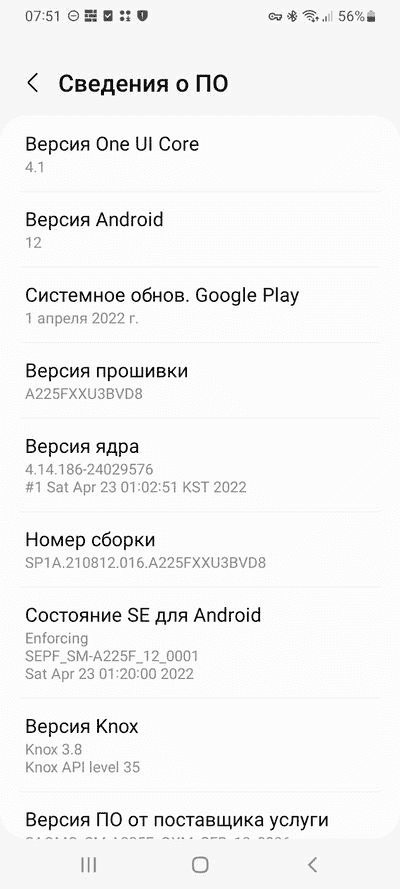

# Galaxy A22 4G 和 Galaxy A41 将进行一次 UI 4.1 更新

> 原文：<https://www.xda-developers.com/samsung-galaxy-a22-4g-a41-one-ui-4-1-android-12/>

在所有关于 Android 13 的讨论中，一些人忘记了原始设备制造商仍在努力将他们的智能手机升级到 Android 12。例如，过去几周，三星已经将一系列 Galaxy 设备升级到 Android 12，并在其上安装了该公司自己的 One UI 4.1 皮肤。现在，又有两款 Galaxy A 系列手机 Galaxy A22 4G 和 Galaxy A41——在部分地区获得了同样的待遇。

## Galaxy A22 4G

联发科 Helio G80 驱动的三星 Galaxy A22 4G 最初是与 Android 11 一起推出的。三星现在以 One UI (Core) 4.1 的形式推出了手机的第一个主要 Android 更新。该版本带来了 2022 年 4 月的安全补丁。

 <picture></picture> 

Screenshot courtesy: 4PDA user W_TG

新的建造分别以软件版本**a 225 FX u3 bvd 8**和 **A225MUBU3BVD8** 的形式提供给 **SM-A225F** 和 **SM-A225M** 两种变体。在报告时，OTA 正在俄罗斯和巴拿马运行。

**[三星 Galaxy A22 4G XDA 论坛](https://forum.xda-developers.com/f/samsung-galaxy-a22-4g.12333/)**

## 银河 A41

Galaxy A41 也开始接收稳定的 One UI 4.1 更新。新软件的内部版本号是 **A415FXXU1DVDB** 。OTA 目前正在 *SER* 地区铺开，这是三星在俄罗斯的代号。底层 Android 安全补丁级别为 2022 年 4 月。

值得注意的是，上述设备跳过了 One UI 4.0 版本，直接跳到了 One UI 4.1。不过，bootloader 版本没有变化，这意味着高级用户仍然可以在需要时恢复到基于 Android 11 的固件。

像往常一样，新的更新正在一波一波地推出，所以它们可能需要一些时间才能到达你的设备。要检查它是否适用于您的手机，请前往*设置* > *软件更新*。如果你想跳过等待队列，你可以直接从三星的固件更新服务器(FUS)获取新版本，并在你的 Galaxy 设备上手动刷新。

*你的 Galaxy A22 4G 或者 Galaxy A41 收到 Android 12 更新了吗？请在下面的评论中告诉我们。*

* * *

**来源:**三星更新服务器( [1](https://doc.samsungmobile.com/SM-A225F/SER/doc.html) ， [2](https://doc.samsungmobile.com/SM-A415F/SER/doc.html) )