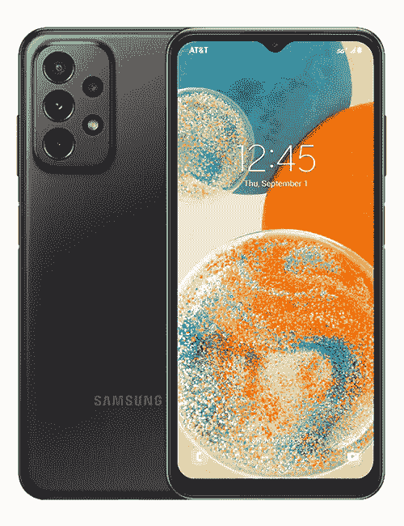

# 三星在美国推出 Galaxy A23 5G，现在售价 299.99 美元

> 原文：<https://www.xda-developers.com/samsung-galaxy-a23-5g-us-launch/>

# 三星在美国推出 Galaxy A23 5G，现在售价 299.99 美元

三星在台湾首次推出 Galaxy A23 5G，现在它正在美国的美国电话电报公司和 T-Mobile 上出售这款手机，售价为 299.99 美元。

今年年初，三星推出了仅支持 LTE 的 Galaxy A23。几个月后，它将推出一款改进的 5G 型号， [Galaxy A23 5G](https://www.xda-developers.com/samsung-galaxy-a23-5g-reveal/) ，仅在台湾销售。现在，这种设备在美国首次亮相，出现在 AT & T 和 T-Mobile 等运营商手中。

三星吹捧 Galaxy A23 5G 是一款包装了“物超所值的最新创新”的手机如果这是你第一次听说 Galaxy A23 5G，这款手机拥有 6.6 英寸 FHD+ infinity-V 液晶显示屏，分辨率为 1080 x 2408 像素。也许这种显示器的一个额外好处是它提供了 120 赫兹的自适应刷新率。这款手机由高通骁龙 695 处理器驱动，并将有 64GB 的内部存储空间。对于一些人来说，64GB 的内部存储可能不够用。谢天谢地，三星已经包括了一个 microSD 插槽，让用户有机会将存储容量扩展到 1TB。

从图片中你可能已经注意到，这款手机装有四个摄像头，主摄像头使用 50MP 传感器。由于传感器具有光学图像稳定功能，它应该可以为照片和视频提供稳定的拍摄。对于自拍的人来说，Galaxy A23 5G 有一个 800 万像素的前置摄像头。至于电池寿命，由于手机的 5000 毫安时电池，你应该有信心度过一天。除了出色的电池寿命，该设备还将提供适当的安全性，这要归功于三星的 Knox 平台，该设备由嵌入电源按钮的指纹读取器保护。

 <picture></picture> 

Samsung Galaxy A23 5G

##### 三星 Galaxy A23 5G

三星 Galaxy A23 5G 是三星最新的廉价设备，以不伤你钱包的价格提供 5G 和全面的体验。

最重要的是，三星 Galaxy A23 5G 的价格具有竞争力，仅售 299.99 美元。该设备将在美国各地的三星体验店出售。它也将在 Samsung.com 推出，并将由无线运营商美国电话电报公司和 T-Mobile 提供。