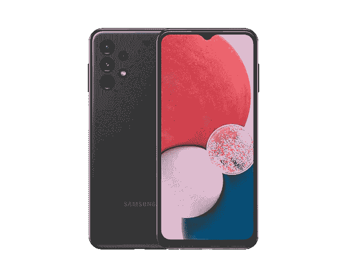

# Galaxy A23 和 Galaxy A13 在印度上市:价格和规格

> 原文：<https://www.xda-developers.com/samsung-galaxy-a23-galaxy-a13-india-launch-pricing-specs-availability/>

在本月早些时候在美国推出 Galaxy A23 和 Galaxy A13 4G 之后，三星终于将其最新的平价智能手机带到了印度。这两款手机现已在中国正式上市，并在预算领域与小米和 Realme 的预算友好型产品直接竞争。Galaxy A23 是 Galaxy A22 的后续产品，而 Galaxy A13 4G 则取代了去年的 Galaxy A12，据报道，Galaxy A12 是 2021 年最受欢迎的智能手机。

## Galaxy A23 和 Galaxy A13 4G 印度定价

Galaxy A23 在印度的起价为₹19,499(约 256 美元)，8GB/128GB 的版本价格则升至₹20,999。它有三种颜色:黑色、蓝色和橙色。另一方面，Galaxy A13 的 4GB 内存和 64GB 版本起价为₹14,999(约 197 美元)。还有一种 4GB/128GB 的型号，在₹15,999 零售，而配备 6GB 内存和 128GB 存储空间的顶级型号会让你在₹17,499.花费不菲它将有四种颜色可供选择:黑色、橙色、白色和蓝色。这两款手机都可以在 Samsung.com 和 Flipkart 上购买。

 <picture></picture> 

Samsung Galaxy A23

##### 三星 Galaxy A23

Galaxy A23 配备了 90Hz 显示屏、骁龙 680 芯片组和 50MP 主摄像头。

 <picture></picture> 

Samsung Galaxy A13

##### 三星 Galaxy A13

Galaxy A13 提供 50MP 主摄像头、5,000mAh 电池和 Exynos 850 芯片组。

### 规范

Galaxy A23 配备了 6.6 英寸的 TFT FHD+面板，正面的刷新率为 90 赫兹。它由一个[高通骁龙 680](https://www.xda-developers.com/qualcomm-778g-plus-695-680-480-plus-announced/) 芯片组驱动，加上 6GB/8GB 内存和 128GB 内部存储。这款手机背面有一个四摄像头设置，包括一个 50MP 主摄像头，一个 5MP 超宽摄像头，以及两个 2MP 深度和宏观传感器。Galaxy A23 装有 5,000mAh 电池，支持 25W 有线快速充电。

Galaxy A13 4G 在大多数方面与 A23 相同。它拥有相同的 6.6 英寸 FHD+显示屏(60Hz)，相同的四摄像头设置，相同的 5000 毫安时电池，支持 25W 快速充电。然而，它将高通芯片换成了一个未指定的 0cta 核心芯片组(可能是 Exynos 850)。

这两款手机都配有侧装指纹扫描仪，开箱即可运行 Android 12，顶部有一个 UI 4.1。请注意，三星在这两款手机的包装盒中都没有 25W 快速充电器。