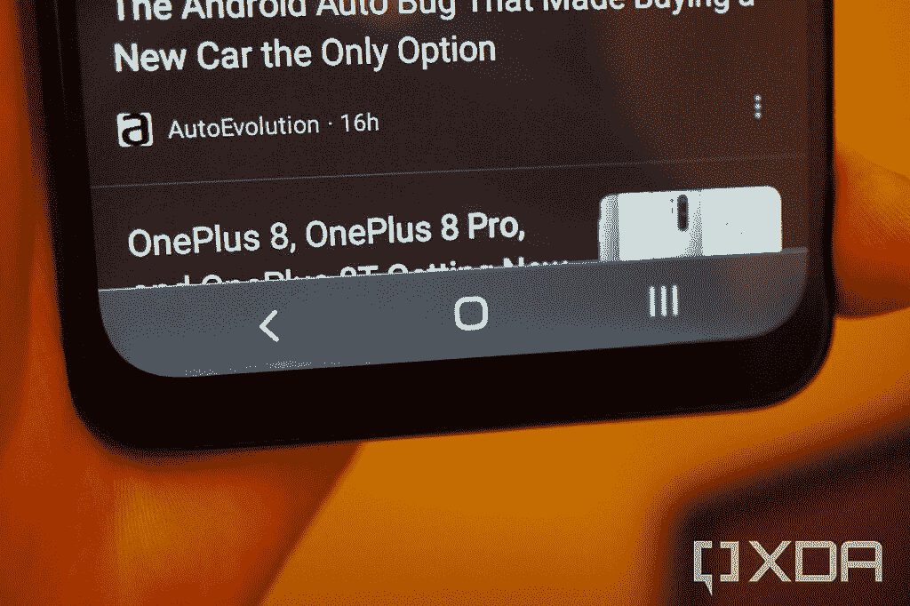
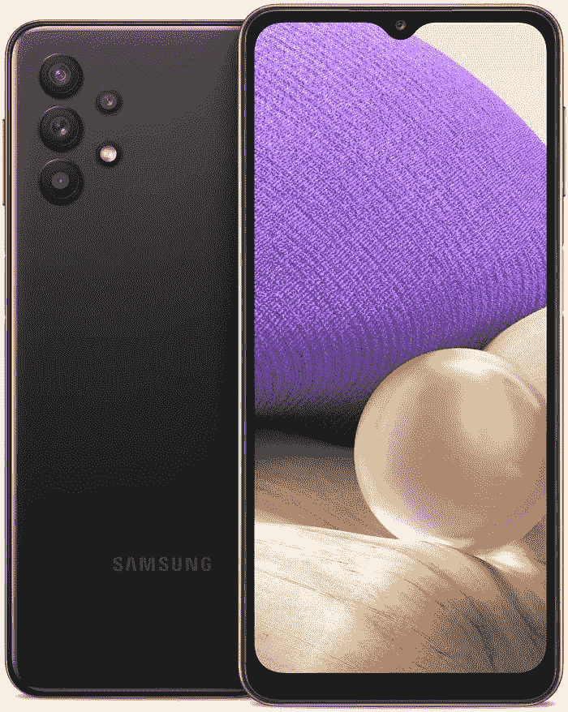

# 三星 Galaxy A32 5G 评论:美国最好的 300 美元以下手机

> 原文：<https://www.xda-developers.com/samsung-galaxy-a32-5g-review/>

三星销售了太多的手机，无法跟踪，但该公司最近发布的更有趣的产品之一是 Galaxy A32 5G。经过几周的猜测和泄露，官方于 1 月正式公布了这款手机,[于 4 月到达美国。它的建议零售价为 279.99 美元，是三星最便宜的支持 5G 网络的手机(除了尚未在美国上市的](https://www.xda-developers.com/samsung-galaxy-a52-5g-a42-a32-a12-a02s-smartphone-usa-launch/) [Galaxy A22 5G](https://www.xda-developers.com/samsung-galaxy-a22-5g-series/) )。然而，与我们见过的许多其他支持 5G 的廉价手机不同，其余的体验没有太多缺点。性能依然优秀，电池续航一整天，软件类似其他三星手机等等。

在检查完 [Galaxy A52 5G](https://www.xda-developers.com/samsung-galaxy-a52-5g-review/) 和 [Galaxy A42 5G](https://www.xda-developers.com/?p=447529) 之后，我开始测试 Galaxy A32 5G。这不是一部完美的手机，但我认为在这个价格范围内没有比这更好的手机了(至少在美国)。

## 三星 Galaxy A32 5G:规格

| 

规格

 | 

三星 Galaxy A32 5G

 |
| --- | --- |
| **构建** | 

*   塑料背板/框架
*   没有 IP 等级

 |
| **尺寸&重量** | 

*   76.1 x 164.1 x 9.1mm 毫米
*   205 克

 |
| **显示** | 

*   6.5 英寸液晶显示器 720 x 1600
*   90Hz 刷新率
*   水滴凹口

 |
| **SoC** | 

*   联发科天玑 720
    *   2x ARM Cortex-A76(最高 2.0GHz)
    *   6x ARM Cortex-A55(最高 2.0GHz)
*   马里-G57 MC3

 |
| **闸板&存放** | 

*   64GB 存储
*   4GB 内存
*   microSD 卡插槽(最高 1TB)

 |
| **电池&充电** | 

*   5000 毫安时电池
*   15W 有线充电
*   没有无线充电

 |
| **安全** | 侧装式指纹读取器 |
| **后置摄像头** | 

*   **初级** : 48MP f/1.8
*   **二级** : 8MP f/2.2，超宽
*   **第三级** : 5MP f/2.4 宏观传感器
*   **四元:** 2MP f/2.4 深度传感器

 |
| **前置摄像头** | 1300 万像素 f/2.2 |
| **端口** | 

*   USB 2.0 类端口
*   3.5 毫米耳机插孔

 |
| **音频** | 单个底部发射扬声器 |
| **连通性** | 

*   5G(低于 6Hz)
*   蓝牙 5.0
*   WiFi 802.11 . b/g/n/AC(2.4 GHz+5 GHz)

 |
| **软件** | 一个 UI 3.1 的 Android 11 |

*关于本次评测:我收到了三星美国公司的 Galaxy A32 5G，已经使用手机一周左右。三星没有参与此次审查的任何部分。扎卡里·旺达对这篇评论有贡献。*

## 设计和建造

Galaxy A32 不太符合三星最近其他设备的设计。这是目前最厚的廉价手机之一，厚度为 9.1 毫米。相比之下， [Galaxy S21](https://www.xda-developers.com/samsung-galaxy-s21/) 的厚度为 7.9 毫米，甚至 Galaxy Note 20 Ultra 也只有 8.1 毫米。额外的一块有助于为 5000 毫安时的大电池腾出空间，并且没有摄像头凸起——摄像头几乎与后壳的其余部分齐平。这使得 Galaxy A32 成为最近发布的少数几款可以(几乎)平放在桌子上的手机之一。

显示屏几乎覆盖了手机的整个正面，除了底部的一个相当大的下巴和顶部的一个水滴形缺口。它支持 90Hz 的刷新率，因此大多数动画就像在现代旗舰手机上一样流畅。然而，关于屏幕的其他一切都令人失望。

三星使用了 LCD 屏幕，而不是该公司大多数其他手机使用的 AMOLED 面板，720p 分辨率延伸到 6.5 英寸时看起来并不*好。我的 Galaxy A32 在屏幕边缘也有相当多的漏光，尽管这可能会因生产批次而异——XDA 作家扎卡里·旺德也有一台 Galaxy A32 5G，他的屏幕也很好。去年的 [Galaxy A31](https://www.xda-developers.com/samsung-galaxy-a31-48mp-quad-camera-5000mah-battery-mediatek-helio-p65/) 价格差不多，但是有一个 60Hz 的 AMOLED 屏幕，所以这里的显示屏有点落后。*

 <picture></picture> 

The navigation bar here should be solid gray.

手机底部有一个 USB Type-C 端口和 3.5mm 耳机插孔，左侧有一个 SIM/microSD 卡托盘。与其他三星手机一样，Galaxy A32 [不支持 Android 的可采用存储](https://www.xda-developers.com/adoptable-storage-samsung-android-pie/)，因此 microSD 卡只能用于存储明确支持外部存储的应用程序的数据。

有趣的是，美国运营商解锁的型号似乎是双 SIM 卡的变体(SM-1326U1/DS)，因此 Galaxy A32 是少数几款完全支持美国 LTE/5G 网络的手机之一，拥有两张物理 SIM 卡。不过，我无法测试这个功能。最后，手机的右侧有音量摇杆和电源按钮，后者兼作指纹传感器。

## 软件

Galaxy A32 的软件与三星最近推出的所有其他 Android 手机大致相同——Android 11，顶部是三星 One UI。然而，这款手机目前并不包括在为数不多的承诺更新三“代”的三星设备中，所以还不清楚这款手机会有多少次升级。去年的 Galaxy A31 [在今年 4 月](https://www.xda-developers.com/samsung-galaxy-m40-tab-active-3-a31-moto-g-stylus-2020-android-11/)获得了 Android 11，2019 年的 Galaxy A30[也开始获得相同的更新](https://www.sammobile.com/news/galaxy-a30-android-11-one-ui-3-1-update-out-now)(至少在印度)，因此两年的更新在印度似乎是可能的。

由于这是运行 Android 11，你可以获得更新的媒体控制，临时权限，*许多*安全改进，Unicode 表情 13.0 集，以及其他保护你手机安全的变化。三星的 One UI 3.1 软件位于顶部，改变了 Android 的大部分界面，[甚至增加了*更多的*功能](https://www.xda-developers.com/samsung-one-ui-3-1-features-changes/)。三星有自己的主屏幕启动器、相机应用、电子邮件客户端、画廊/文件管理器、网络浏览器等等——如果你不想使用它们，这些都可以用第三方替代品(或常用的谷歌版本)来替换。

三星对 Android 做出的大多数改变都是为了更好，但单一用户界面也有一些缺点。三星的任何一款手机都不支持[无缝更新](https://www.xda-developers.com/google-virtual-ab-seamless-updates-android-11/)，所以在安装系统更新(比如每月一次的安全补丁)时，你不能使用手机。在系统应用程序中也有同样多的广告，这在其他三星手机上很常见，至少在美国是这样。

与三星的旗舰手机相比，Galaxy A32 5G 还缺少一些软件功能。Bixby 不可用，三星 DeX 环境也不可用，当连接到电视或显示器时，三星 DeX 环境可以将手机变成桌面 PC。

## 性能和电池寿命

电池寿命通常不是任何廉价手机的问题，因为大多数廉价手机都配有更节能的芯片和大电池。5000 毫安时的电池通常可以支持我正常使用一整天(流媒体、短信等)，如果你不经常使用手机，一次充电甚至可以达到两天。

出色的电池续航时间并不令人惊讶，但 Galaxy A32 采用联发科天玑 720 芯片组的表现给我留下了深刻的印象。应用程序打开速度很快，网页浏览速度很快，在应用程序之间切换时也不会变慢。Dimensity 720 中的图形绝对超过 Galaxy A32 的零售价格——动画可以保持默认的 90Hz 刷新率，大多数游戏运行起来没有任何问题。

## 照相机

Galaxy A32 5G 有四个摄像头，但其中只有三个可以拍摄照片:一个 48MP 主镜头，一个 8MP 超宽摄像头和一个 5MP 微距。第四个摄像头是深度传感器。主相机上的照片在户外看起来很好，但室内照片比较粗糙。

超宽镜头的照片质量继续大幅下降，微距相机(像大多数智能手机微距相机一样)是定焦的，分辨率太低。在光线充足的情况下，你肯定可以用主相机拍出好照片，但仅此而已。

## 结论

Galaxy A32 5G 是目前最令人印象深刻的廉价手机之一。它肯定有一些痛点，如低显示分辨率和低质量的辅助摄像头，三星应该承诺至少三年的主要 Android 更新(如 Galaxy S21、Galaxy A52 等。).然而，套餐的其余部分令人印象深刻，不到 300 美元。电池寿命非常出色，性能比我预期的要快，90Hz 的刷新率使手机保持超级流畅。

这款手机在美国的主要竞争对手是 [2021 Moto G Power](https://www.amazon.com/Power-battery-Unlocked-Motorola-Camera/dp/B08NWBY8YJ?tag=xda-1g2f129-20&ascsubtag=UUxdaUeUpU2702&asc_refurl=https%3A%2F%2Fwww.xda-developers.com%2Fsamsung-galaxy-a32-5g-review%2F&asc_campaign=Short-Term) ，其零售价为 230 美元——比 Galaxy A32 5G 低 50 美元。这款手机的性能与骁龙 665 和 4GB 内存类似，外加更高分辨率(仅 60Hz)的屏幕。然而，它搭载的是旧版本的 Android，摩托罗拉只承诺对 Android 11 进行一次更新。[诺基亚 5.4](https://www.amazon.com/Nokia-Android-Unlocked-Smartphone-6-39-Inch/dp/B08STXNT4K?tag=xda-1g2f129-20&ascsubtag=UUxdaUeUpU2702&asc_refurl=https%3A%2F%2Fwww.xda-developers.com%2Fsamsung-galaxy-a32-5g-review%2F&asc_campaign=Short-Term) 也在这个价格区间，250 美元。

我不认为在这个价格范围内有更好的预算手机，特别是考虑到 Galaxy A32 5G 已经跌至 205 美元，而且很可能再次下跌。不过，如果三星正在读这篇文章，*请明年将屏幕做成 1080p。*

 <picture></picture> 

Samsung Galaxy A32 5G

##### 三星 Galaxy A32 5G

三星 2021 年推出的低于 300 美元的智能手机是一个令人印象深刻的套餐，具有出色的性能和电池寿命，尽管低分辨率屏幕令人失望。