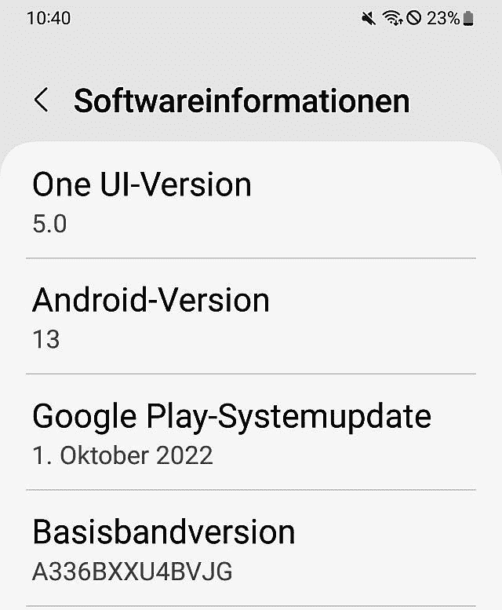

# 稳定的 One UI 5 更新为三星 Galaxy A33 5G 带来了 Android 13

> 原文：<https://www.xda-developers.com/samsung-galaxy-a33-5g-android-13-one-ui-5/>

三星这几年一直在用及时的 OS 更新秒杀它，和 Android 13 没什么区别。为了向尽可能多的手机提供 One UI 5 软件，更新列车现已抵达 Galaxy A33 5G。这发生在韩国 OEM 厂商开始将 Galaxy A53 5G 升级到最新版本的 Android 之后。

稳定的 One UI 5.0 更新目前正在向多个欧洲国家的 Galaxy A33 用户推出，其固件版本为 **A336BXXU4BVJG** 。该版本将于 2022 年 10 月发布安全补丁，并提供所有 Android 13 产品。假设没有问题，我们可以期待更新推广到其他国家。

 <picture></picture> 

Screenshot courtesy: AndroMe 

本月晚些时候或 12 月初应该会有更大范围的推出，尽管[的发布时间表](https://www.xda-developers.com/samsung-one-ui-5-android-13-release-timeline/)会根据您的地区和设备状态而有所不同——解锁或运营商品牌。目前，Android 13 版本仅适用于 SM-A336B 版本，但其他型号应该也不会太久。

**[三星 Galaxy A33 5G XDA 论坛](https://forum.xda-developers.com/f/samsung-galaxy-a33-5g.12571/)**

如果你拥有一部 Galaxy A33 5G，并且居住在欧洲，请留意 OTA 通知。然而，正如分阶段软件推广的通常情况一样，可能需要几天时间才能将更新推广到所有人，因此如果您的设备上还没有看到任何更新通知，也不必担心。

如果你对基于 PC 的闪存并不陌生，你可以跳过等待队列。为此，直接从该公司的固件更新服务器(FUS)获取最新软件，并在你的 Galaxy 设备上手动刷新。值得注意的是，One UI 5 版本中的引导程序版本没有变化，这意味着高级用户仍然可以在需要时恢复到基于 Android 12 的固件。