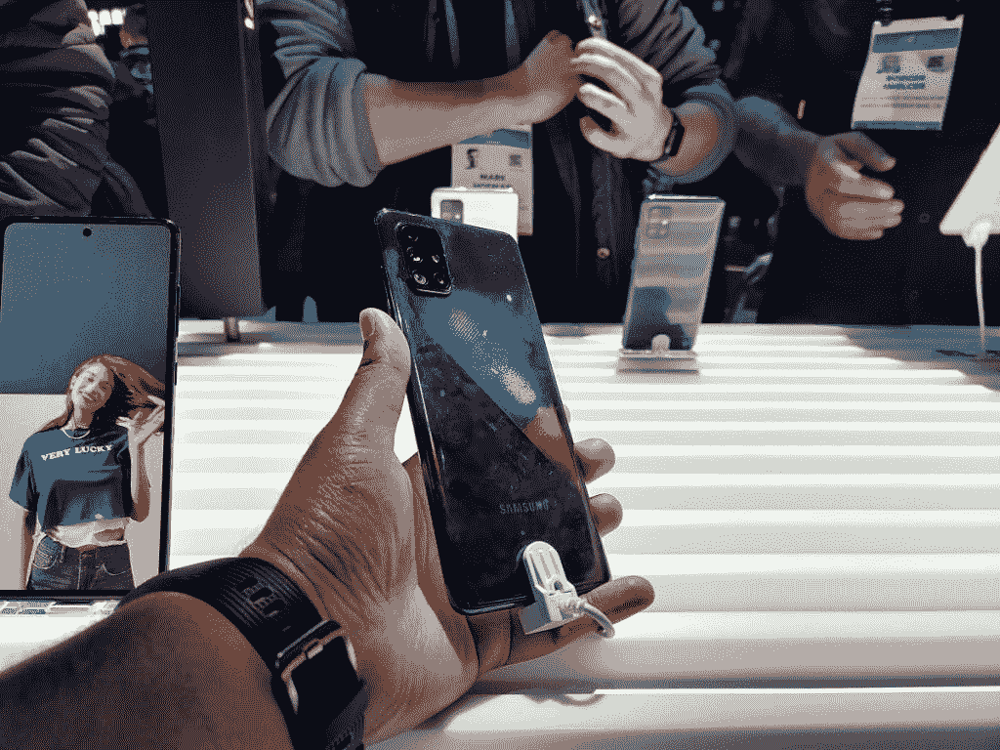

# 三星 Galaxy A51 和 A71 动手:中端智能手机赢家

> 原文：<https://www.xda-developers.com/samsung-galaxy-a51-and-a71-hands-on-mid-range-smartphone-winners/>

去年，三星设法推出了一些令人惊叹的旗舰智能手机。但是经常被忽略的一点是，他们也在中低端市场加倍努力。三星的中端战略，包括不同的智能手机系列，如 Galaxy J 和 Galaxy A 系列智能手机，已经不再适用。随着 Galaxy A51 和 Galaxy A71 的改款，这种情况发生了变化。

在拉斯维加斯的 CES 2020 上，我们设法近距离观看了 Galaxy A51 和 Galaxy A71，它们是 mid-rangers Galaxy A50 和 Galaxy A70 的新一代继任者。一个月前,[A51](https://www.xda-developers.com/samsung-galaxy-a51-official-punch-hole-display-quad-rear-cameras/)和[A71](https://www.xda-developers.com/samsung-galaxy-a71-punch-hole-display-64mp-quad-rear-camera/)就已经发布，然而现在国际发布迫在眉睫。尽管它们的低价位可能意味着一切，包括更低的规格和制造质量，但它们通过各种方式散发着三星的 DNA，具有打孔 AMOLED 显示屏，多摄像头设置，以及与我们期待在即将到来的 Galaxy S20 旗舰机上看到的非常相似的设计语言。

## 三星银河 A51

| 

规格

 | 

三星银河 A51

 |
| --- | --- |
| **尺寸和重量** | 158.5 x 73.6 x 7.9 毫米；172 克 |
| **显示** | 6.5 寸 FHD+(1080 x 2400)Super AMOLED；无限显示 |
| **SoC** | Exynos 9611 片上系统，八核处理器(四核 2.3GHz +四核 1.7 GHz) |
| **RAM 和存储器** | 6GB+128 GB 可通过专用 microSD 卡插槽扩展 |
| **电池** | 4000 毫安时；15W 快速充电 |
| **USB** | USB 类型-C |
| **后置摄像头** | 48MP，f/2.0 初级+ 5MP，f/2.2 深度传感器+ 5MP，f/2.4 微距+ 12MP，f/2.2 超宽 |
| **前置摄像头** | 32MP，f/2.2 |

**[银河 A51 XDA 论坛](https://forum.xda-developers.com/galaxy-a51)**

显然，Galaxy A51 是两者中较低端的一个，但拿在手里，感觉就像 Galaxy A71 一样高端。正如其前身 Galaxy A50 和 Galaxy A50s 一样，Galaxy A51 采用塑料机身，塑料框架和闪亮的塑料背面。而说到背面，可能是该设备最值得注意的设计特点了。它有一个渐变的表面(特别是白色变体，这是我们处理的一种，很容易让人想起 Galaxy Note 10 的 Aura Glow 颜色选项，带有彩虹般的反射和阴影)，背面有一个 X 形的多边形效果，这真的有助于进一步突出这种彩虹效果。三星将这种效果称为“棱镜粉碎”，这也是该设备销售的所有颜色选项中的一个口号。

Galaxy A50s 是 Galaxy A50 的修订版，也采用了类似的多边形效果，这真的很吸引人的眼球，尤其是在真人身上。这款手机拿在手中感觉相当轻，这可能是因为它的塑料结构，尽管它有 6.5 英寸的显示屏，但它也不会感觉很大。

右上角是后置四摄像头设置，与三星 2020 年的新设计语言相呼应，位于一个方形模块中，让人想起谷歌 Pixel 4 和 iPhone 11/11 Pro/11 Pro Max 等其他智能手机。最近推出的三星设备，如 Galaxy S10 Lite 和 Galaxy Note 10 Lite 也采用了这样的方形模块，Galaxy S20 系列预计也将采用类似的功能。特别是，这种相机设置具有 48MP 主传感器，加上 5MP 深度传感器，5MP 宏观传感器和 12MP 超宽相机，因此它是一个非常通用的相机模块。

这款手机底部还有一个耳机插孔，不幸的是，三星在 Galaxy Note 10 上开始取消这一功能。我们很高兴看到他们保留它，即使只是在他们的中端手机中。手机的左侧装有 SIM 卡/SD 卡托盘，而右侧装有电源按钮和音量摇杆。

走到前面，它由一个 6.5 英寸的 Super AMOLED 显示屏和一个打孔摄像头主导，看起来比 Note 10 系列更小，具有 2400x1080 的分辨率和 20:9 的纵横比。打孔相机位于中央，就像 Galaxy Note 10 中的相机一样，而不是在角落里，它是一个 32MP 的相机传感器，应该能够为你提供非常体面的自拍，显示器本身绝对是你最近一段时间对三星面板所期望的质量。指纹传感器，就像它的前身一样，嵌入到显示器中。

至于其他功能，还有一个 4000 毫安时的电池，应该可以为您提供可用的电池寿命，以度过一天。还有高达 6 GB 的内存和高达 128 GB 的存储扩展，以防这还不够。该设备运行的是开箱即用的 Android 10，上面有一个 UI 2.0，再次显示了三星对软件的重新承诺。

## 三星 Galaxy A71

| 

规格

 | 

三星 Galaxy A71

 |
| --- | --- |
| **尺寸和重量** | 163.6 x 76.0 x 7.7 毫米；179 克 |
| **显示** | 6.7 寸 FHD+(1080 x 2400)Super AMOLED；无限显示 |
| **SoC** | 高通骁龙 730 片上系统，八核处理器(双核 2.2GHz +六核 1.8 GHz) |
| **RAM 和存储器** | 6GB/8GB+128 GB 可通过专用 microSD 卡插槽扩展 |
| **电池** | 4500 毫安时；25W 快速充电 |
| **USB** | USB 类型-C |
| **后置摄像头** | 64MP，f/1.8 初级+ 5MP，f/2.2 深度传感器+ 5MP，f/2.4 微距+ 12MP，f/2.2 超宽 |
| **前置摄像头** | 32MP，f/2.2 |

**[银河 A71 XDA 论坛](https://forum.xda-developers.com/galaxy-a71)** 

Galaxy A71 在很大程度上与 Galaxy A51 非常相似。显然，它应该是更高端的，尽管，至少在我看来，相似之处多于不同之处。是的，它更大了——它采用了 6.7 英寸的面板，而不是 Galaxy A51 那样的 6.5 英寸面板，正因为如此，它的占地面积更大，尽管它最初看起来可能并没有那么大。更大的是显示器顶部的打孔。就像 A51 一样，它位于市中心，但是它稍微大一点。它有同样的 32MP 前置摄像头，所以没有理由为什么它应该更大，但它确实如此。不过，它看起来绝对不坏。

回到后面，同样的“棱镜挤压”多色效果出现在这个单元中，尽管多边形效果肯定没有那么明显。左上角的相机驼峰看起来和银河 A51 中的一模一样，相机设置本身也非常相似——事实上几乎完全相同。两者之间唯一的区别是 Galaxy A71 携带了一个 64MP 的主传感器——就像 Galaxy A70s 一样——而不是 Galaxy A51 的 48MP 主传感器。这两款设备看起来都和渲染图中的一样出色。

再来看前面，它几乎完全被显示屏所占据，只有非常非常小的挡板可以看到。穿孔再次比我们在低端型号中看到的更突出，但它的大小与 Note 10 相似，所以再次不用担心。指纹传感器嵌入在显示屏下方，与更高端的三星 Galaxy S10/Note 10 手机不同，它们采用了光学指纹扫描仪，而不是超声波扫描仪。光学和超声波传感器各有利弊，我不会说哪一个优于另一个，所以这实际上是一个品味问题。不过，光学传感器通常与更便宜的手机配套。

在内部，这款手机配备了 4500 毫安时的电池(高于 Galaxy A51 的 4000 毫安时电池)，并搭载了高通骁龙 730 处理器，高达 8 GB 的内存和高达 128 GB 的内部存储，是的，你可以通过 microSD 卡进行扩展以满足你的需求。该设备运行的是开箱即用的 Android 10，顶部有一个 UI 2.0，就像 A51 一样，这很好，因为这意味着这两款设备都将至少在未来获得 Android 11 和 Android 12 的更新。