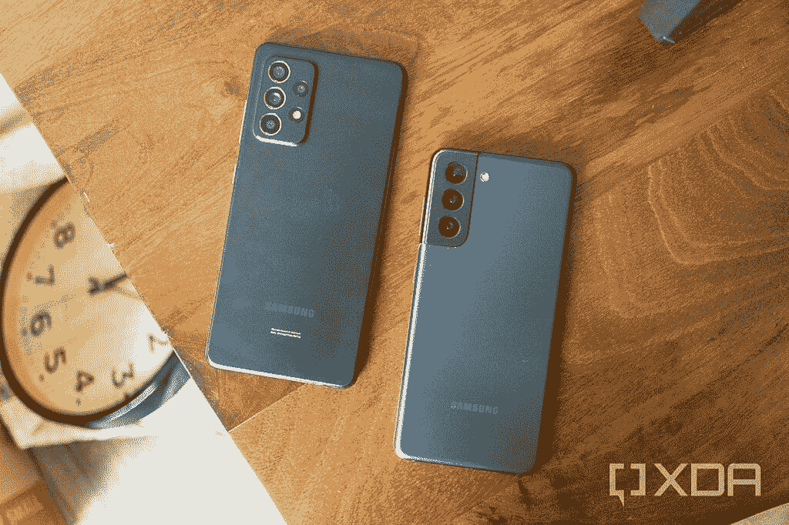
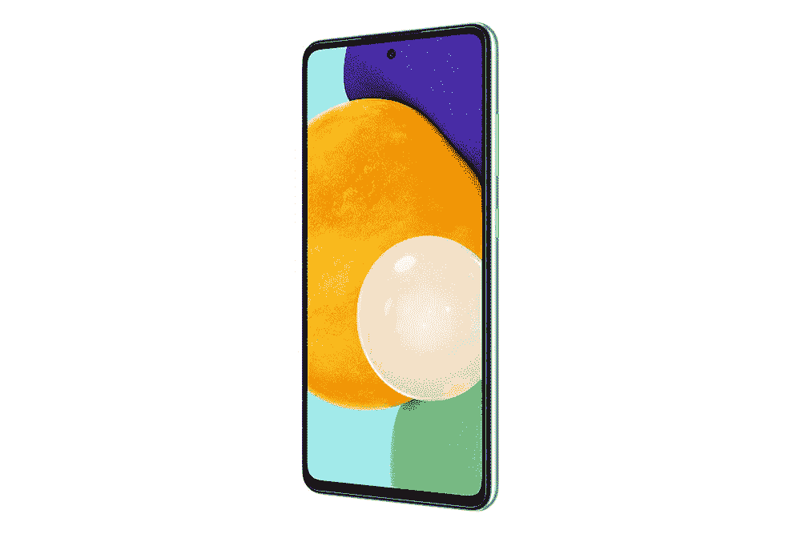

# 三星 Galaxy A52 5G 回顾:2021 年廉价 5G 手机之王

> 原文：<https://www.xda-developers.com/samsung-galaxy-a52-5g-review/>

Galaxy A50 系列是过去几年三星最畅销的产品之一。定价在 400-500 美元之间，是超级便宜的手机和昂贵的旗舰产品之间的完美中间地带。虽然 Galaxy Note 20 Ultra 和 Galaxy Z Flip 等设备在 2020 年成为头条新闻，但去年的 [Galaxy A51](https://www.xda-developers.com/samsung-galaxy-a51-and-a71-hands-on-mid-range-smartphone-winners/) 的销量几乎超过了三星的所有其他产品。毫无疑问，三星今年将继续保持这种兴奋，果然， [Galaxy A52](https://www.xda-developers.com/samsung-galaxy-a52/) 于 3 月在[正式发布(旁边是价格更高的 A72)。](https://www.xda-developers.com/samsung-galaxy-a52-galaxy-a72-launch/)

。bestawarddiv {

浮动:对；

宽度:20%；

边距:0.75em

边距-顶部:0；

}

Galaxy A52 从显示器到内部硬件的一切都得到了升级，这次有两个截然不同的版本。Galaxy A52 5G 是为美国和欧洲等 5G 市场设计的，而 4G 型号正在世界其他地区销售。如果 Galaxy A52 4G 型号是您所在地区的版本，请查看我们的单独评测。

我已经使用 Galaxy A52 5G 有一段时间了，除非谷歌或一加在今年晚些时候给我们带来惊喜，否则我认为*这款*是我们将在 2021 年获得的最佳预算 5G 手机。

| 

规格

 | 

三星 Galaxy A52 5G

 |
| --- | --- |
| **构建** | 

*   塑料背板/框架
*   IP 67 防水防尘

 |
| **尺寸&重量** | 

*   75.1 x 159.9 x 8.4mm 毫米
*   189 克

 |
| **显示** | 

*   6.5 英寸 FHD+ SuperAMOLED (1080 x 2400)
*   407PPI
*   120 赫兹刷新率
*   Infinity-O 显示器(居中打孔切口)
*   800 尼特峰值亮度
*   眼部护理显示器低蓝光认证

 |
| **SoC** | 

*   高通骁龙 750 克
    *   2 个内核@ 2.2 GHz+6 个内核@1.8GHz
*   肾上腺素 619

 |
| **闸板&存放** |  |
| **电池&充电** | 

*   4500 毫安时
*   25W 快速有线充电
*   含 15W 充电器

 |
| **安全** | 显示指纹扫描仪 |
| **后置摄像头** | 

*   主要:64MP IMX686 f/1.8，OIS，自动对焦，tetra-宁滨
*   次要:12MP f/2.2，超宽，FF
*   第三级:5MP f/2.4，微距，FF
*   四元:5MP f/2.4，深度传感器，FF

 |
| **前置摄像头** | 32MP f/2.2，FF |
| **端口** | 

*   USB 类型-C
*   3.5 毫米耳机插孔

 |
| **音频** | 带杜比 Atmos 的立体声扬声器 |
| **连通性** | 

*   5G
*   蓝牙 5.0
*   802.11 a/b/g/n/ac 双频 WiFi
*   国家足球联盟
*   MST(仅在部分地区，美国除外)
*   GPS，GLONASS，北斗，伽利略

 |
| **软件** | Android 11，One UI 3.1 |

*关于本次评测*:我收到了三星美国借出的 Galaxy A52 5G 进行评测。我已经使用这个设备两个多星期了。三星没有参与此次审查的任何部分。

**三星 Galaxy A52 5G 论坛 **

**浏览此评论:**

## 设计和建造

Galaxy A52 5G 反映了最近许多其他三星手机的硬件设计，其中心打孔前置摄像头，最小化的屏幕边框和塑料外壳。我很高兴看到 Galaxy A51 的光滑塑料涂层不见了，取而代之的是类似于 Galaxy Note 20 和 [Galaxy S21](https://www.xda-developers.com/samsung-galaxy-s21/) 的哑光塑料外壳。有些人可能更喜欢看起来像玻璃的玻璃或塑料，但哑光表面可以将指纹和污迹降至最低。

与 Galaxy S21 和 Note 20 不同，Galaxy A52 5G 也将塑料用于设备框架和硬件按钮(音量和电源)。这是手机中最便宜的感觉部分，至少在我的单元上，将边框固定在一起的胶水似乎不太牢固。如果你买了一个好的外壳，这并不重要，但全塑料设计不断提醒你 Galaxy A52 是旗舰智能手机。

Galaxy A52 的正面有一个 6.5 英寸的 AMOLED 屏幕，比基本 Galaxy S21 上的显示屏大，但比 S21+、S21+ Ultra、Note 20 和 Note 20 Ultra 上的显示屏小。它的尺寸非常适合观看视频，而且有足够的空间舒适地输入信息。120Hz 的刷新率也有助于应用程序和游戏感觉超级流畅。然而，像所有更大的手机一样，用一只手够到显示屏的角落几乎是不可能的。

音量和电源按钮位于右侧，感觉有点糊，但并不可怕。底部有一个单扬声器格栅，一个用于充电和数据传输的 USB Type-C 端口，一个 3.5mm 耳机插孔。Galaxy A52 5G 附带了一个 15W 的壁式充电器，该手机使用标准的高通快速充电和 USB 电力传输(USB-PD)充电器可以达到同样的 15W 速度。Galaxy A52 被宣传为支持高达 25W 的充电速度，但我只能用我的[三星快速充电墙上插头](https://shop-links.co/1741517159614943978?u1=93e8a98f-e621-47a0-a683-3bdbf1079a8c)达到这个速度。

 <picture></picture> 

Galaxy A52 5G (left) next to Galaxy S21 (right)

最后，Galaxy A52 的顶部有一个用于 SIM 和 microSD 卡的托盘。[与其他三星手机](https://www.xda-developers.com/adoptable-storage-samsung-android-pie/)一样，Galaxy A52 5G 不支持 Android 的可采用存储，因此 microSD 卡只能用于存储明确支持外部存储的应用程序的数据。例如，你可以在 microSD 卡上保存音乐文件或离线网飞内容，但不能将应用程序移动到其中。

120 赫兹的屏幕对于一部 500 美元的手机来说太棒了

Galaxy A52 的硬件和制造质量可能比 T2 好一点，但这些小问题很容易被机箱忽略。在 500 美元的手机上安装 120 赫兹的屏幕非常好，因为它是平板显示器，所以安装屏幕保护器不会有任何问题。我也很高兴看到三星尚未将耳机插孔从 A 系列手机中剥离出来——有线音频在许多场景下仍然有用，从插入旧汽车到在长途航班上播放播客。

## 软件

如果你在过去几年中使用过任何三星手机，你不会发现 Galaxy A52 有任何惊喜。它搭载了 Android 11 和三星的 One UI 3.1 软件。这款手机还将获得[三个“代”的 Android 升级](https://www.xda-developers.com/samsung-galaxy-devices-3-generations-android-updates/)，这应该意味着 [Android 12](https://www.xda-developers.com/android-12/) 、13 和 14(假设谷歌的更新时间表大致保持不变)。这比这个价格范围内的任何其他手机都要长，除了最新的 iPhone SE。

Galaxy A52 还将获得三代 Android 升级，应该是指 Android 12、13 和 14

Android 11 是谷歌移动操作系统的最新稳定版本，具有更新的媒体控制、Unicode 表情符号 13.0 集的所有内容、临时权限和许多保护手机安全的底层更改。三星的 One UI 3.1 软件位于顶部，改变了 Android 的大部分界面，[甚至增加了*更多的*功能](https://www.xda-developers.com/samsung-one-ui-3-1-features-changes/)。三星有自己的主屏幕启动器、相机应用、电子邮件客户端、画廊/文件管理器、网络浏览器等等——如果你不想使用它们，这些都可以用第三方替代品(或常用的谷歌版本)来替换。

Galaxy A52 上的软件体验与三星的高端手机(如 Galaxy Note 20 或 Galaxy S21 系列)上的软件体验完全相同，只有少数例外。三星 DeX 是 Galaxy A52 上没有的功能，当连接到显示器(或电视或 PC)时，它可以将你的手机变成桌面环境。这可能是由于与旗舰手机相比，硬件速度较慢，但骁龙 720G 芯片组与 Galaxy Tab S6 Lite 中的 Exynos 9611 一样快，并且该设备[支持 DeX](https://www.xda-developers.com/samsung-dex-arrives-on-the-galaxy-tab-s6-lite-with-one-ui-3-1/) 。

三星对 Android 做出的大多数改变都是改进，但一个用户界面也有一些缺点。三星的任何一款手机都不支持[无缝更新](https://www.xda-developers.com/google-virtual-ab-seamless-updates-android-11/)，所以在安装系统更新(比如每月一次的安全补丁)时，你不能使用你的手机。在其他三星手机上，尤其是在美国，也有同样的[系统应用](https://www.xda-developers.com/samsung-one-ui-2-5-add-lockscreen-ads-problem/)广告超载的现象。

如果你喜欢三星通常的软件体验，你会喜欢 Galaxy A52 5G。如果你喜欢更普通的 Android 版本，谷歌 Pixel 4a 5G 或 ZenFone 7 可能是更好的选择。

## 性能和电池寿命

Galaxy A52 5G 的性能给我留下了深刻的印象。几个月来，我一直将(高通)Galaxy S21 作为我的主要手机，我没有注意到 Galaxy A52 在速度和响应能力上有太大的差异。由于骁龙 750G 芯片组和 6-8GB 内存(取决于你得到的型号)，打开应用程序时几乎没有延迟，从键入电子邮件到观看 YouTube 的一切都运行良好。

骁龙 750G 芯片组的主要缺点是游戏性能——像*堡垒之夜*和 *Genshin Impact* 这样的游戏将会工作，但它们不会像旗舰 Android 手机那样流畅。如果你预算紧张，游戏是你的优先选择，那么 [iPhone SE 2020](https://shop-links.co/1741710895071978153?u1=f2519fbd-6600-4b46-8e2a-ae8a11abd79f) 价格差不多，GPU 速度*快得多*。我还注意到 Galaxy A52 上的 Android Auto 比旗舰 Android 手机慢。

如果你对基准测试感兴趣，Galaxy A52 5G 在[速度计 2.0](https://browserbench.org/Speedometer2.0) 网络基准测试(使用 Chrome 90)中获得 47.3 分，在 3DMark 的 Sling Shot Extreme 测试中获得 2740 分。在 [Geekbench 5](https://www.geekbench.com/) 中，这款手机在多核测试中分别获得了 643 和 1777 的单核评分([完整结果在此](https://browser.geekbench.com/v5/cpu/8119120))。 [AndroBench](https://play.google.com/store/apps/details?id=com.andromeda.androbench2&hl=en_US&gl=US) 报告顺序存储读取速度为 956 MB/s，及以下。504 MB/s 的写入速度。在所有基准测试中，这个数字越大越好。

在我的测试中，Galaxy A52 5G 的网络性能非常出色

在我的测试中，Galaxy A52 5G 的网络性能非常出色。该手机的骁龙 X52 调制解调器支持美国所有主要运营商的 5G 网络，尽管该手机只能连接到低于 6GHz 的网络。我在 T-Mobile 的网络上使用了 Galaxy A52 5G(通过 Ting，一个 MVNO)，无论我去哪里，我都有稳定的 LTE 或 5G 连接。我在罗利市中心的 5G 上看到的最快速度约为 214 MB/s 和 14 MB/s。

像大多数骁龙 700 系列智能手机一样，电池寿命是 Galaxy A52 5G 的另一个亮点。这款手机在正常使用情况下，一次充电可以轻松持续两天，这要归功于高能效的芯片组和 4500 毫安时的大电池。我不认为任何人会有理由抱怨这款手机的电池寿命。

## 照相机

自从谷歌在 2019 年发布第一款 Pixel“a”手机以来，这个价格段的相机质量竞争一直很激烈。Galaxy A52 5G 有一个 64MP f/1.8 主摄像头，但它结合了像素，有效分辨率为 16MP。还有一个 12MP f/2.2 超宽镜头，一个 5MP f/2.4 微距相机和一个 5MP 深度传感器来辅助其他镜头。

**[来自三星 Galaxy A52 5G 的未压缩照片样本](https://photos.google.com/u/1/share/AF1QipPBOck69UoRKwUQHtqqYjnhrFaJYssatgcSXWQEh2-wimTNkVahSEyX3eebH0JUwg)**

Galaxy A52 的照片质量给我留下了深刻的印象。它的图像处理与其他三星手机相同，有时会使颜色过饱和，提高对比度，但大多数照片都非常出色。广角镜头的图像看起来明显比主摄像头的图像差，但这是廉价手机(甚至许多旗舰手机)的标准。

然而，Galaxy A52 5G 没有长焦镜头，所以如果你放大超过 3 倍左右，图像质量就不是很好。比起 500 万像素的微距相机，我更喜欢变焦镜头——尽管我喜欢拍摄微距照片，但分辨率对于高质量的照片来说不够高。

## 结论

不久前，美国唯一值得购买的廉价手机是 100-200 美元的摩托罗拉设备或旧 iPhones。随着 Pixel“a”系列、最新的 iPhone SE 和三星最近的 A50 手机等手机的出现，这种情况终于开始发生变化。去年的 Galaxy A51 是一款很棒的手机，Galaxy A52 5G 几乎在所有方面都有所改进。这款手机速度更快，屏幕现在以超平滑的 120Hz 刷新率运行，5G 支持已经到来。三星承诺的三大操作系统更新也比这个价格范围内的任何其他 Android 手机都好(与谷歌的 Pixel 设备并列)。

这款手机的主要卖点是 5G 连接，因为 Galaxy A52 是美国最便宜的可以连接 5G 网络的设备之一。Moto One 5G Ace 价格较低，约为 380 美元，但由于摩托罗拉在软件支持方面的不良记录，我不会以任何价格推荐这款手机。谷歌的 [Pixel 4a 5G](https://www.amazon.com/Google-Pixel-4a-Smartphone-Ultrawide/dp/B08H8VZ6PV?tag=xda-2r8vb0p-20&ascsubtag=UUxdaUeUpU3004&asc_refurl=https%3A%2F%2Fwww.xda-developers.com%2Fsamsung-galaxy-a52-5g-review%2F&asc_campaign=Short-Term) 是 Android 的主要竞争对手，比 Galaxy A52 5G 高出 50 美元。摩托罗拉和谷歌的手机只支持低于 6GHz 的 5G，这比毫米波 5G 更广泛地应用于*(更多细节请参见我们的 [5G 解释者](https://www.xda-developers.com/5g/))，但 Galaxy A52 5G 支持两种网络类型。*

对于 Galaxy A52 5G，我没有发现太多抱怨。构建质量可以更好，我更喜欢长焦镜头，而不是几乎无用的 5MP 微距镜头。三星的软件也一如既往地两极分化——虽然有些人(比如我)通常更喜欢单一用户界面而不是传统的安卓系统，但这绝对不是完美的体验。功能的丰富可以感觉到铺天盖地，而像 Samsung Pay 和 Weather 这样的系统应用中的广告仍然是不可原谅的。

总的来说，Galaxy A52 5G 是我们见过的三星以外最强的廉价手机之一，尤其是在美国。对于 500 美元的典型价格来说，这是一个非常棒的包，如果你能在打折时买到它，那就更好了。

 <picture></picture> 

Samsung Galaxy A52 5G

##### 三星 Galaxy A52 5G

Galaxy A52 5G 是目前你可以买到的最便宜的安卓手机之一，拥有 120Hz 的屏幕，5G 连接和安卓 11。