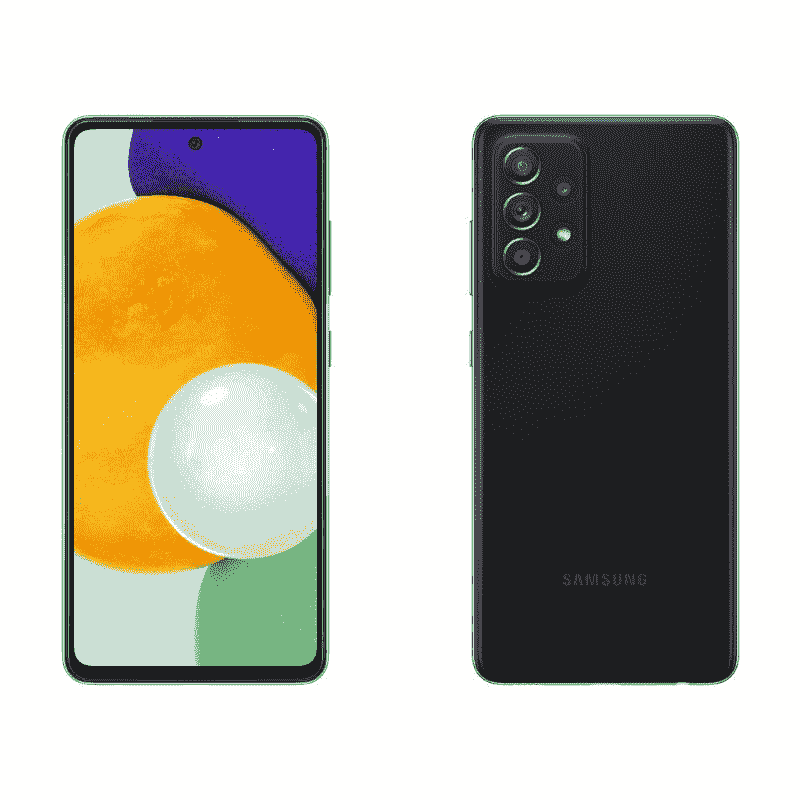
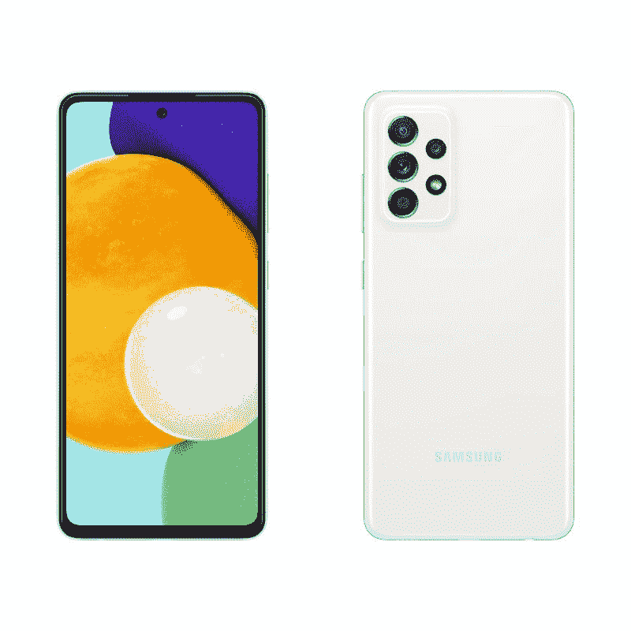
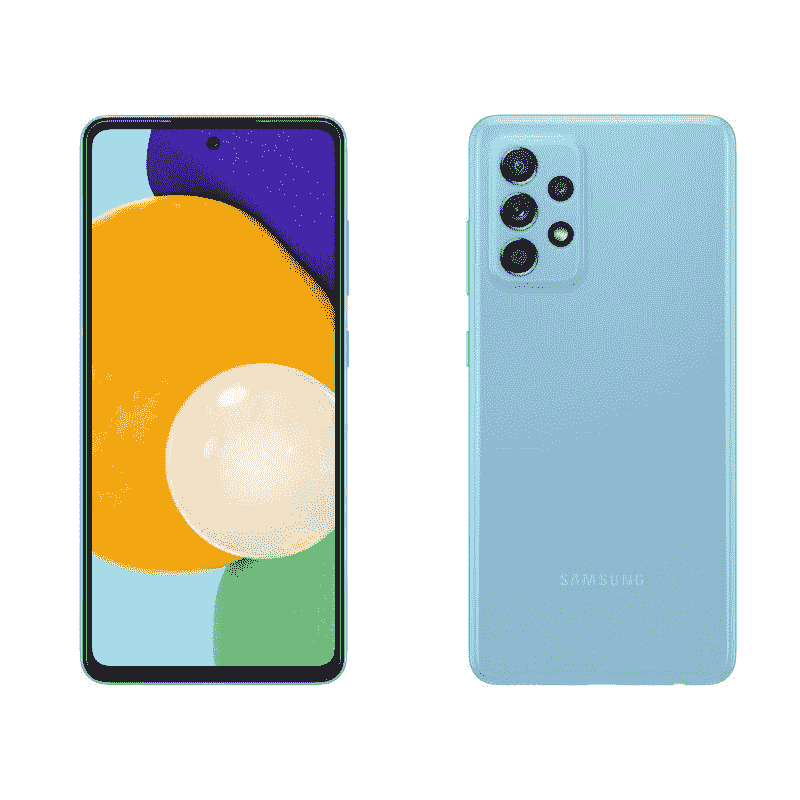
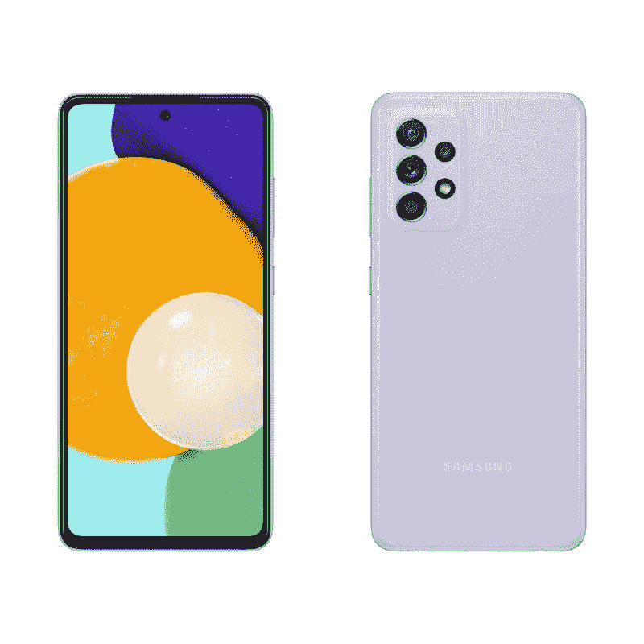
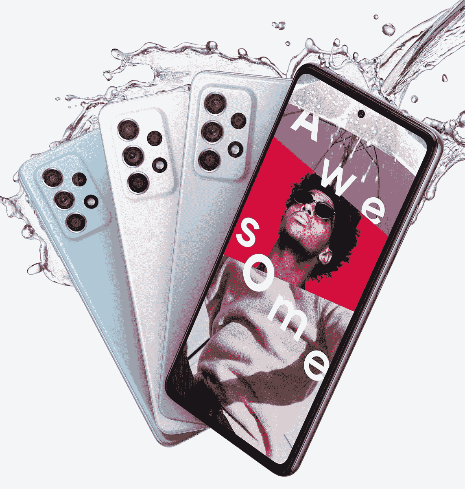
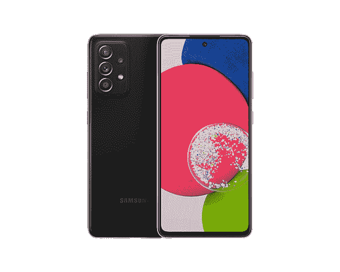
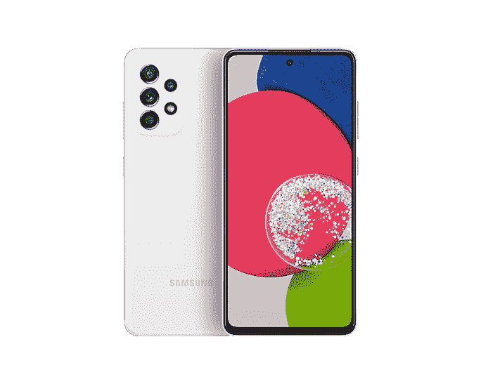
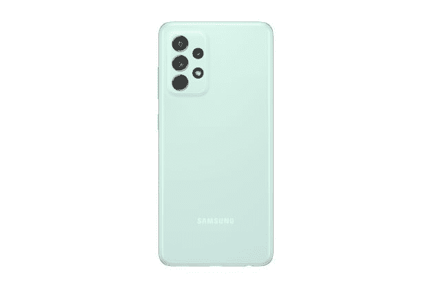

# 三星 Galaxy A52、A52 5G、A52s 都有什么颜色？

> 原文：<https://www.xda-developers.com/samsung-galaxy-a52-colors/>

三星 Galaxy A52 T1 是一款在 2021 年购买的 T2 低价手机 T3。它提供了超级平滑的 120Hz 刷新率，可选的 5G 连接，以及良好的性能。现在，这款手机还有一个更新版本——Galaxy A52s——在一些市场有售。如果你打算购买 Galaxy A52，你可能会想知道它有哪些颜色可供选择。嗯，三星为 Galaxy A52 提供了四种令人惊叹的颜色:炫白、炫黑、炫紫和炫蓝。但并非所有市场都有所有颜色。

在北美，三星只销售 Galaxy A52 的一种变体——令人敬畏的黑色的 [5G](https://www.xda-developers.com/5g/) 型号。该公司没有在中国正式上市这款手机的其他版本。然而，你会在亚马逊上找到三星手机 4G 和 5G 版本的几个列表，但这些都是进口产品，你不会得到任何保修，并且可能只有有限的网络支持。

同样，在英国，三星只提供这款手机的 [5G 版本](https://shop-links.co/1742862463751379522?u1=5f56eee0-f50e-45e1-8844-5292c760ff3b)，但你可以选择所有颜色。其他欧洲市场有各种颜色的 4G 和 5G 型号。一些地区如印度获得 Galaxy A52s 5G，这是其他地区所没有的。

三星 Galaxy A52 的四种颜色看起来都挺好看的。你可以选择酷炫的白色或酷炫的黑色打造经典造型，也可以选择酷炫的紫色或酷炫的蓝色打造个性和活力。至于 Galaxy A52s，它有三种不同的颜色可供选择——黑色、浅紫色和白色。

## 三星 Galaxy A52 5G:颜色

 <picture></picture> 

Awesome Black

##### 三星 Galaxy A52

三星 Galaxy A52 令人敬畏的黑色给你一个全黑的外观，因为手机的正面也包括黑色边框。

 <picture></picture> 

Awesome White

##### 三星 Galaxy A52

令人惊叹的白色提供了一个干净的外观，这是由相机设置和手机正面的黑色增强的。

 <picture></picture> 

Awesome Blue

##### 三星 Galaxy A52

三星 Galaxy A52 令人敬畏的蓝色版本看起来很新鲜。如果你想脱颖而出，它会让你脱颖而出。

 <picture></picture> 

Awesome Violet

##### 三星 Galaxy A52

三星 Galaxy A52 令人敬畏的紫罗兰色看起来非常有趣，肯定会受到很多人的喜爱。

## 三星 Galaxy A52 4G:颜色

 <picture></picture> 

Samsung Galaxy A52 4G

##### 三星 Galaxy A52 4G

三星 Galaxy A52 的 4G 型号与 5G 型号的颜色完全相同。

如果我们谈论手机的规格，4G 和 5G 版本之间有许多相似之处。这款手机配备了 6.5 英寸全高清+ (1080 x 2400 像素)Super AMOLED 显示屏和 4,500mAh 电池，支持 25W 快速充电。手机运行在 Android 11 上，只有一个 UI。为了满足成像需求，它背面包括四个摄像头，由一个 6400 万像素的传感器和一个 f/1.8 镜头组成。正面还有一个 3200 万像素的定焦自拍相机，配有 f/2.2 镜头。

## 三星 Galaxy A52s:颜色

 <picture></picture> 

Black

##### 三星 Galaxy A52

三星 Galaxy A52s 的黑色给你一个全黑的外观，因为手机的正面也包括黑色边框，就像 A52 一样。

 <picture></picture> 

Samsung Galaxy A52s

##### 三星 Galaxy A52

三星 Galaxy A52s 的浅紫色非常显眼，肯定会受到很多人的喜爱。看起来相当含蓄优雅。

 <picture></picture> 

Samsung Galaxy A52

##### 三星 Galaxy A52

白色提供了一个干净的外观，这是由摄像头设置和手机正面的黑色增强的。

 <picture></picture> 

Awesome Mint

##### 三星 Galaxy A52

令人敬畏的薄荷色有一个浅绿色的色调，看起来很悦目。不过它只有 8GB 的版本。

A52 的 4G 和 5G 型号仅在处理器和 RAM 方面有所不同。你可以在 5G 型号上使用高通骁龙 750G 处理器，而在 4G 型号上，有一个骁龙 720G 处理器。5G 买家将可以选择 6GB 或 8GB 内存，而 4G 买家将可以选择 4GB 内存版本。Galaxy A52s 配备了更快的骁龙 778G 芯片组，并配备了更快的 25W 充电，而其他两款机型的充电速度较慢，为 15W。

那么你打算买三星 Galaxy A52 还是 A52 的哪种颜色呢？请在评论区告诉我们。此外，如果你买的是 Galaxy A52，一定要准备一个保护它的箱子。我们为您挑选了一些[最佳 Galaxy A52 案例](https://www.xda-developers.com/best-galaxy-a52-cases/)。