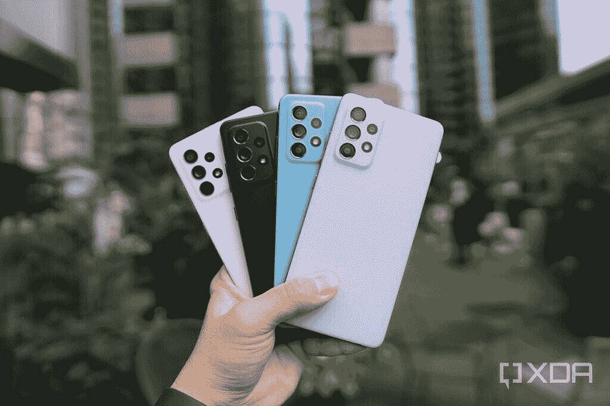
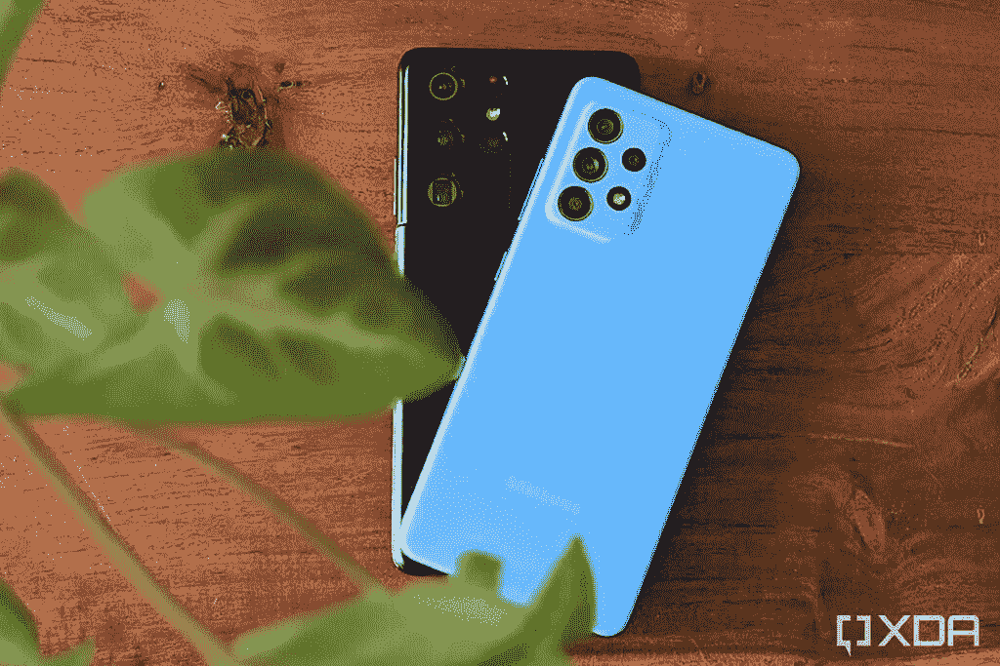
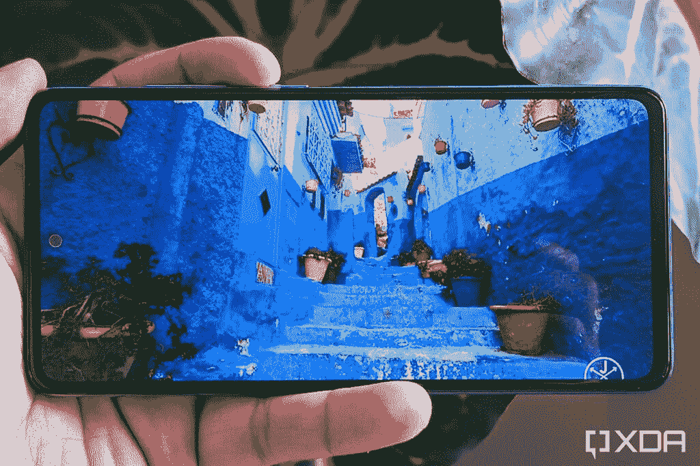
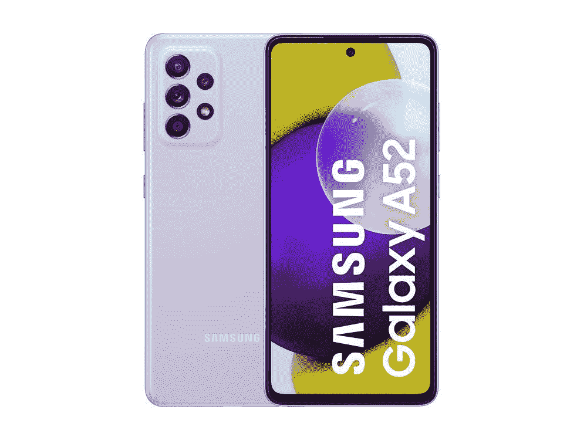

# 三星 Galaxy A52 评测:激动人心但远非完美

> 原文：<https://www.xda-developers.com/samsung-galaxy-a52-review/>

三星的 [Galaxy A51](https://www.xda-developers.com/samsung-galaxy-a51-and-a71-hands-on-mid-range-smartphone-winners/) 是 2020 年最畅销的安卓手机，全球出货量超过 2300 万部。它的成功证明了大多数用户都相信一个品牌的可靠性，正面和背面都有好的摄像头，其他方面都比不太知名的品牌的炒作规格要好。新的[三星 Galaxy A52](https://www.xda-developers.com/samsung-galaxy-a52/) 将填补这些大鞋。与 Galaxy A51 相比，Galaxy A50 和 [Galaxy A50s](https://www.xda-developers.com/samsung-galaxy-m30s-galaxy-a50s-review-comparison/) 主要进行了软件改进，Galaxy A52 则不同，它对硬件进行了重大改进，包括新的显示屏、更好的摄像头、更快的充电速度，以及针对特定市场的单独 5G 版本。

除了改进硬件，三星还承诺为 Galaxy A52 提供三个增量 Android 更新，使其成为少数几个获得这种扩展软件支持的中端智能手机之一。它与谷歌 Pixel 4a 和一加诺德竞争，但它能成为另一批数百万用户的可行选择吗？虽然我们的初步印象是好的，但我们努力在 Galaxy A52 的这篇评论中回答这个问题。

在我们开始之前，这里有一个快速浏览三星 Galaxy A52 的规格:

* * *

## 三星 Galaxy A52 规格

### 三星 Galaxy A52 规格。单击或点击 o 展开

| 

规格

 | 

三星 Galaxy A52 4G

 |
| --- | --- |
| **构建** | 

*   塑料背面
*   塑料框架

 |
| **尺寸&重量** | 

*   75.1 x 159.9 x 8.4mm 毫米
*   189 克

 |
| **显示** | 

*   6.5 英寸 FHD+ SuperAMOLED (1080 x 2400)
*   407PPI
*   90Hz 刷新率
*   Infinity-O 显示器(居中打孔切口)
*   800 尼特峰值亮度
*   眼部护理显示器低蓝光认证

 |
| **SoC** | 

*   高通骁龙 720G
    *   2 个内核@ 2.3 GHz+6 个内核@1.8GHz
*   Adreno 618 GPU

 |
| **闸板&存放** | 

*   4GB + 128GB
*   6GB + 128GB
*   8GB + 256GB

 |
| **电池&充电** | 

*   4500 毫安时
*   25W 快速有线充电
*   含 15W 充电器

 |
| **安全** | 

*   显示指纹扫描仪
*   2D 脸解锁

 |
| **后置摄像头** | 

*   主要:64MP 索尼 IMX686 f/1.8，OIS，自动对焦，四宁滨
*   次要:12MP f/2.2，超宽，FF
*   第三级:5MP f/2.4，微距，FF
*   四元:5MP f/2.4，深度传感器，FF

 |
| **前置摄像头** | 32MP f/2.2，FF |
| **端口** | 

*   USB 类型-C
*   3.5 毫米耳机插孔

 |
| **音频** | 带杜比 Atmos 的立体声扬声器 |
| **连通性** | 

*   长期演进
*   蓝牙 5.0
*   802.11 a/b/g/n/ac 双频 WiFi
*   国家足球联盟
*   MST(在印度不可用)
*   GPS，GLONASS，北斗，伽利略

 |
| **软件** | 一个基于 Android 11 的 UI 3.1 |
| **其他特征** | 

*   IP 67 防水防尘
*   三星 SmartThings 查找

 |

***关于这篇评论:**三星印度给我发了一个 6GB + 128GB 的 Galaxy A52 4G 的变种。这篇简短的评论是在使用三天后。三星印度公司在此次审查中没有任何意见。*

* * *

## 设计和建造

三星 Galaxy A52 与 [Galaxy S21 Ultra](https://www.xda-developers.com/samsung-galaxy-s21/) 有着相同或者非常相似的设计蓝图。它偏离了以前 A 系列智能手机上闪亮的塑料背面和全息设计。相比之下，Galaxy A52 采用了非玻璃缎饰面的普通塑料背面，三星将销售这种饰面的三星 Galaxy A52、 [Galaxy A52 5G](https://www.xda-developers.com/samsung-galaxy-a52-5g-hands-on/) 和 Galaxy A72。

 <picture></picture> 

Samsung Galaxy A52 5G; Courtesy: [Ben Sin](https://www.xda-developers.com/author/bensin/)

颜色变体的官方名称是*炫黑*、*炫蓝*、*炫紫*和*炫白*，但你可以给我涂上不感兴趣的颜色。背板看起来平淡无奇，手感轻薄；你可以很容易地感觉到身体向内弯曲。表面非常容易吸收汗水污迹，而平坦的背部使手机难以抓握，容易从出汗的手掌中滑出。这需要购买和使用 Galaxy A52 的后壳，因为与以前的智能手机不同，它没有包装盒。

 <picture></picture> 

Samsung Galaxy A51 and Galaxy S21 Ultra

相机凸起比智能手机的其他部分略厚。虽然背板已经成型为包裹摄像头凸起，但落在它周围的阴影使它看起来像一个单独的凸起平台。同时，侧框也由塑料制成，并具有金属表面，与前几代产品一样，采用相同颜色的柔和色调。边框也很容易吸引指纹，这也是你一买智能手机就买手机套的另一个原因。

谈到端口和按钮，Galaxy A52 上的放置与其他三星手机类似。音量摇杆和电源键放在右边，左边完全空白。底部有一个 3.5 毫米耳机插孔、主麦克风、USB Type-C 端口和主扬声器。同时，顶部有一个用于消除噪音的辅助麦克风，旁边有一个用于混合 SIM 卡托盘的插槽。同时，Galaxy A52 上的薄耳机也可以作为立体声方向的辅助扬声器。

尽管在构建材料上存在这些缺点，Galaxy A52 的防水和防尘等级仍为 IP67。这意味着这款手机可以安全防尘，可以在 1 米深的水中浸泡最长 30 分钟。值得注意的是，这些条件仅适用于淡水水体，不会保护智能手机免受海水甚至游泳池水的影响。

[sc name = " pull-quote " quote = " Galaxy A52 的设计并不高端，但 IP67 等级有助于保护其外壳。"]

就像我上面提到的，虽然三星试图复制 Galaxy S21 Ultra 的设计，但 Galaxy A52 从任何角度来看都不能被指定为一款高端手机。耳机插孔、立体声扬声器和可扩展存储等功能很有优势，但在这个价格上并不是唯一的选择。Galaxy A52 的制造质量可能会让各种用户感到不安。尽管如此，几个功能可以掩盖对设计的任何遗憾，并让你相信 Galaxy A52 实际上可能是一项出色的投资。

* * *

## 喜欢三星 Galaxy A52 的理由(但不是无条件的)

三星 Galaxy A52 为 Galaxy A51 带来了许多新功能。除了开箱即可运行最新的 One UI 3.1 之外，Galaxy A52 还配备了更强大的处理器、改进的 Super AMOLED 显示屏、更好的摄像头以及对快速充电的支持。以下是您会喜欢的三星 Galaxy A52 的一切:

### 显示器和指纹扫描仪

Galaxy A5x 智能手机从该系列的第一款设备开始就配备了 Super AMOLED 显示屏。Galaxy A52 延续了这一趋势，它配备了 6.5 英寸全高清+ Super AMOLED 显示屏，并在中央打孔，用于自拍相机。打孔机明显很小，你看不到任何盲点或切口周围变暗。三星声称这种显示器的峰值亮度可以达到 800 尼特。

此外，该显示器支持 HDR10+和 HLG 在 YouTube 上播放 HDR 内容——但将仅限于在网飞和亚马逊 Prime Video 等 OTT 平台上播放非 HDR 内容(因为它尚未获得这些平台对 HDR 内容的认证)。正如三星 Super AMOLED 面板所预期的那样，这种显示器非常明亮，并提供丰富的对比度和颜色。由于这是一款中端 AMOLED 显示器，彩虹效应是不可避免的。但除此之外，显示器的清晰度和色彩相当可观。

 <picture></picture> 

Content on the display: [Morocco 8K HDR](https://www.youtube.com/watch?v=hVvEISFw9w0) by Jacob + Katie Schwarz on Youtube

随着这次发布，三星在中端智能手机上转向了更高的[刷新率](https://www.xda-developers.com/smartphone-display-refresh-rates-explained/)显示屏。Galaxy A52 显示屏的 LTE 版本具有 90Hz 的刷新率，这意味着显示屏的刷新速度比标准的 60Hz 显示屏快 1.5 倍，正如在 Galaxy A51 和其他类似价格的三星设备上看到的那样。这意味着你可以在用户界面和大多数应用程序中体验更流畅的滚动。

由于为智能手机供电的[高通骁龙 720G](https://www.xda-developers.com/qualcomm-snapdragon-720g-662-460-navic/) ，当有太多后台任务同时运行时，你有时可能会体验到口吃。尽管如此，通常情况下，这不太可能损害您的体验。然而，与支持动态刷新率切换的三星旗舰不同，Galaxy A52 的显示器可以根据您选择的设置工作在 90 赫兹或 60 赫兹。

[sc name="pull-quote" quote= "显示屏是 Galaxy A52 的主要亮点之一。"]

该显示器还具有与前代产品类似的光学显示指纹扫描仪。指纹扫描仪感觉比前几代更快更准。

总的来说，Galaxy A52 的显示屏比该系列中的前几款手机有了显著的升级，让智能手机至少在未来几年内做好了准备。另一个为其长寿做准备的功能是三星承诺四年的软件更新。

### 一个 UI 3.1，承诺四年更新

尽管三星在软件升级方面一度落后，但自从转向单一用户界面以来，它的更新交付已经有了巨大的改善。现在，在软件更新的[及时交付](https://www.xda-developers.com/discussion-samsung-good-software-updates-one-ui/)方面，三星可以被誉为领导者之一，Galaxy A52 注定会从这一演变中受益。三星承诺为 Galaxy A52、Galaxy A52 5G 和 Galaxy A72 提供至少三次平台升级和四年的安全更新。这意味着预装 Android 11 的 Galaxy A52 将至少更新到 Android 14。

谈到其当前的软件，One UI 3.1 是 Android 用户可以使用的功能最丰富的第三方皮肤之一。与 UI 3.0 相比，它还进行了大量改进，并与谷歌服务进行了更好的集成。您可以在我们关于同一主题的文章中查看 [One UI 3.1 与 One UI 3.0](https://www.xda-developers.com/samsung-one-ui-3-1-features-changes/) 的所有新功能。除了改进之外，一个用户界面还支持直接在三星 Home launcher 中的[谷歌发现提要](https://www.xda-developers.com/samsung-galaxy-s21-google-discover-homescreen/)。此外，你可以将 Google Messages 作为默认的消息应用程序，也可以安装 Google 的电话应用程序来取代股票拨号器。

[sc name = " pull-quote " quote = " One UI 3.1 既强大又臃肿。"]

然而，在中端三星手机的用户体验方面，还是有一些抱怨。其中包括作为内容合作伙伴关系一部分的大量膨胀软件或预装应用程序，以及不断强迫你安装更多应用程序的 Galaxy Store。Galaxy A52 还配备了许多预装的应用程序，包括 *Candy Crush Saga* 、 *ShareChat* 、 *PhonePe* 、 *DailyHunt* 、*脸书*、*亚马逊 Prime Video* 、*亚马逊购物*、*网飞*、 *MX Takatak* 、 *Moj* 、 *LinkedIn 【T】这些应用程序中有许多会发送不想要的通知，这可能会妨碍三星一直承诺的所谓的“*棒极了的*”体验。除此之外，三星还预装了一些比较非必要的应用，比如 *SmartThings* 、*三星互联网*、 *Galaxy 可穿戴设备*、 *Samsung Pay* 、 *Bixby* 、 *AR 专区*。有趣的是，这款智能手机目前还不支持谷歌的 ARCore。*

Galaxy A52 预装了一款名为“AppCloud”的应用，由 ironSource 和三星的 Galaxy Store 提供支持。它在设置手机时运行，并建议用户安装某些第三方应用程序。虽然这个概念并不新鲜，但 AppCloud 会阻止用户在不同意其条款和条件的情况下继续操作。不仅如此，噩梦般的用户界面是有目的地强迫用户安装某些应用程序，即使他们不希望如此。更糟糕的是，你无法卸载它，每次手机有新的 OTA 更新时，它都会出现。

除了臃肿的软件，Galaxy A52 上的软件体验没有太多需要担心的。幸运的是，你可以安装大多数预装的应用程序，并使用自定义启动器来绕过这些限制。

### 相机、OIS、Snapchat 滤镜

相机是 Galaxy A52 升级的另一个领域。这款智能手机背面设有四摄像头，包括 64MP 主摄像头，12MP 超广角摄像头，5MP 微距摄像头和 5MP 深度传感器。同时，这款手机还配有一个 32MP 的前置摄像头，用于自拍。此外，Galaxy A52 还配备了 OIS，可以进行无抖动视频录制。

主摄像头配有 f/1.8 镜头，默认情况下借助 4 合 1 像素宁滨拍摄 1600 万像素的图像。相机应用程序与其他高端手机相当一致，包括 Galaxy Note 20 Ultra 或 Galaxy S21 系列。以下是用 Galaxy A52 上的主摄像头拍摄的一些相机样本:

除了 16MP 图像，Galaxy A52 还可以利用传感器的全分辨率(即 64MP)捕捉图像。Galaxy A52 中使用 64MP 模式拍摄的图像看起来没有在白天使用 16MP 模式拍摄的图像饱和。事实上，6400 万像素的图像有更多的自然色调，而 1600 万像素的图像看起来是人工增强的。然而，智能手机需要 3-5 秒来处理 64MP 图像，快门时间通常很长，如果你把手机拿在手中，可能会导致图像模糊。

在夜间或光线较暗的情况下，像素宁滨功能可以增加图像的曝光度。令人惊讶的是，Galaxy A52 的相机即使没有夜间模式也能延长曝光时间，拍摄光线良好的夜间照片。这里是 16MP 和 64MP 模式在夜间拍摄的图像之间的比较。

12MP 超广角相机采用 f/2.2 定焦设置，提供 123°宽视野。以下是 Galaxy A52 相机的标准和超宽视野的几组对比:

除了在 16MP 模式下捕捉更多的光线，Galaxy A52 上的夜间模式还加强了弱光摄影。夜间模式提高了主摄像机的色彩准确度，并显著增强了超宽摄像机的曝光度。以下是一些使用主相机和超宽相机在没有和有夜间模式下拍摄的图像示例:

除了上面提到的两个摄像头，Galaxy A52 还配备了一个 5MP 定焦微距摄像头，允许您拍摄距离手机摄像头模块 3 厘米至 5 厘米的物体图像，即当手机和物体之间的距离小于主摄像头支持的最小焦距时。用这种相机拍摄的图像质量充其量也就一般，颜色看起来模糊不清，就像智能手机上大多数专用微距相机一样。这里有几个例子:

对于自拍，你会得到一个 32MP 的相机，它似乎可以提供与我们在 [Galaxy A50s 评测](https://www.xda-developers.com/samsung-galaxy-m30s-galaxy-a50s-review-comparison/)中看到的相同的令人印象深刻的质量。下面是几张在 Galaxy A52 上拍摄的没有人像效果和有人像效果的自拍照:

至于视频，Galaxy A52 可以捕捉高达 30fps 的 4K 视频或 60fps 的 1080p 视频。OIS(光学防抖)仅在使用主摄像头以 1080p@30fps 或更低的速度拍摄视频时有效。与此同时，这款手机还带有一个独立的“超级稳定”模式，即 EIS(电子图像稳定)，它可以在使用超广角拍摄的全高清视频@30fps 上使用。正如你所料，超稳定模式不如智能手机上的 OIS 有效，但它会在很大程度上平滑抖动的视频。

Galaxy A52 拥有专业视频模式，用户可以在该模式下修改基本设置，如 ISO、焦距、曝光、光圈和白平衡。你不能像我们在高端三星设备上看到的那样改变麦克风的方向。

除了股票功能，Galaxy A52 还获得了 Galaxy S21 系列的单次拍摄功能。此外，内置的有趣模式让你可以在相机应用程序中使用来自 *Snapchat* 的一些滤镜。

[sc name = " pull-quote-left " quote = " Galaxy A52 为千禧一代和 Z 世代提供完整的相机套装"]

总体而言，Galaxy A52 的相机几乎拥有普通千禧一代或 Z 世代用户希望从智能手机中获得的所有功能。正如我们上面看到的，相机质量在大多数情况下都足够好。不仅如此，Galaxy A52 上骁龙芯片组的使用最终将允许开发者社区移植适用于智能手机的谷歌相机模块。目前，如果你希望在 Galaxy A52 上使用 GCam，可以使用[这个](https://www.celsoazevedo.com/files/android/google-camera/f/changelog1460/)版本，但结果可能不是很令人满意。

### 快速充电

Galaxy A52 配备了 4500 毫安时电池，并支持高达 25W 的[快速充电](https://www.xda-developers.com/how-does-fast-charging-work/)。虽然 Galaxy A52 在包装盒内配备了充电器，但与它的优质兄弟姐妹不同，它的额定功率为 15W。使用这个 15W 的充电器，Galaxy A52 从 10%到 80%大约需要一个小时。此外，达到 90%还需要 15 分钟，充满电总共需要 1.5 小时。

相比之下，三星的 25W 充电器可以增加大约 30%的电流，应该可以在一小时内将手机充满电。唯一的缺点是你必须单独购买这个[快速充电器](https://www.xda-developers.com/best-galaxy-s21-fast-chargers/)。此外，Galaxy A52 还支持 USB-PD，但充电速率被限制在 15W。

当谈到电池输出时，Galaxy A52 的电池在中等工作负载下使用约 10 小时后从 100%变为 50%，在自适应亮度打开的情况下，屏幕打开时间(SOT)约为 4 小时。虽然三星声称你可以从智能手机获得两天的电池寿命，但它确实根据我的短期使用预测了 1 天 10 小时，这对于 4500mAh 的电池来说也不坏。

* * *

## Galaxy A52 让我对这些东西有着复杂的感觉

除了令人喜爱的东西之外，Galaxy A52 确实有一些地方会让你做出购买这款智能手机的艰难决定。我希望下面的部分能帮助你做出更明智的决定。

### 盒子里没有快速充电器、盒子或耳机

Galaxy A52 在几个方面进行了改进，包括性能、摄像头、充电、显示和软件体验。但为了弥补这些进步，三星在其他方面采取了削减成本的措施。正如我上面提到的，你将不再得到一个手机套或一副有线耳机。最重要的是，Galaxy A52 配备了相对较慢的 15W 充电器。你必须购买一个三星 25W 快速充电器来利用它的快速充电功能，或者三星称之为“超级快速充电”功能。

### 表演

高通骁龙 720g T1 芯片组为三星 Galaxy A52 提供动力。虽然这是对 Exynos 9611 芯片组的重大改进，但我们在 Galaxy A51 和前辈上看到，高通 mid-ranger 在某些情况下确实感觉有些不足。用户界面有明显的口吃，特别是当手机正在充电或在谷歌 Play 商店更新应用程序时。

为了量化 Galaxy A52 的性能，并将其与价格类似的智能手机进行比较，我在该设备上运行了 Geekbench 5 和 3DMark。结果与由[骁龙 750G](https://www.xda-developers.com/qualcomm-snapdragon-750g-processor-specifications-features/) 、由[骁龙 765G](https://www.xda-developers.com/qualcomm-snapdragon-765-processor-specifications-features/) 驱动的[一加诺德](https://www.xda-developers.com/oneplus-nord-phones-are-reportedly-doing-quite-well-in-the-u-s/)和由 [Exynos 980](https://www.xda-developers.com/samsung-exynos-980-5g-modem/) 驱动的[三星 Galaxy F62](https://www.xda-developers.com/samsung-galaxy-f62-india-launch/) 进行了比较。

#### 三星 Galaxy A52 vs 小米 Mi 10T Lite vs 一加诺德 vs 三星 Galaxy F62:合成基准

从下表可以看出，Galaxy A52 在 Geekbench 上与同行的竞争中得分最低。此外，较慢的 Adreno 618 GPU 导致图形测试分数较低。

| 

基准测试

 | 

三星 Galaxy A52

 | 

小米米 10i/10T Lite

 | 

北一加

 | 

三星 Galaxy F62

 |
| --- | --- | --- | --- | --- |
| Geekbench 5 单核 | 526 | 619 | 581 | 809 |
| Geekbench 5 多核 | 1531 | 1964 | 1794 | 2044 |
| 3DMark 吊索镜头 OpenGL ES 3.1 | 2525 | 2710 | 3147 | 5130 |
| 3DMark 吊索拍摄 Vulkan | 2419 | 2504 | 2986 | 4588 |
| 3DMark 野生动物 | 1036 | 1087 | 1635 | 3387 |

就游戏而言，Galaxy A52 非常适合中度和/或偶尔玩玩游戏。虽然你也可以运行像 *COD Mobile* 这样的重度游戏，但你会很容易注意到游戏过程中的主要触摸滞后和延迟响应，这些打嗝会损害你的游戏体验。

#### CPU 节流

为了测试持续的工作负载如何影响 Galaxy A52 的性能，我运行了 CPU 节流测试。基准测试在两种不同的场景下运行——a)手机在标准操作模式下使用，b)手机正在充电。两种情况下的测试各运行 30 分钟。

Galaxy A52 的性能在这两种情况下都受到了影响，但充电似乎并没有妨碍测试的输出。

有趣的是，Galaxy A52 在充电时不会发热太多，电池百分比几乎随时间线性增加。虽然当你在智能手机上玩游戏时会有一些明显的发热，但塑料背和框架在绝缘方面做得很好。然而，这样做的一个缺点是内部可能会被迫承受更多的热量。正如你在上面的右图中看到的，最高温度达到了 50°C，虽然这对于手机硬件来说并不令人担忧，但它可能会影响性能，图中的下降就是很好的例子。

* * *

## A52 星系上需要担心的事情

唉，Galaxy A52 并不全是华而不实的东西，它的一些特点可能会让买家感到不安。我已经在上面的章节中讨论了这两个特征——构建质量和预装应用的状态。

### 关于建造质量

回到构建上来，塑料结构与其说是一个大问题，不如说是这个背板感觉不可靠和不坚固。不要误会我的意思，该系列中以前的型号也有类似的“玻璃”背板，但时髦的设计确实有助于它的可取之处。最重要的是，Galaxy A52 更方正的设计和 0.5 毫米的厚度使这款手机拿在手中有点不舒服。如果你打算长时间使用手机，使用外壳是必须的。

### 广告软件和膨胀软件

Galaxy A52 的另一个令人担忧的方面是印度单位上的大量臃肿软件。这可能仅限于某些缺乏严格法律的地区。然而，三星仍试图采取与小米、OPPO、Vivo 或 Realme 相同的策略来收回部分成本——尽管 Galaxy A52 的价格已经高于这些品牌的可比智能手机。

* * *

## 结论-一个伟大的购买与一些微妙的权衡

三星 Galaxy A52 对老一代产品进行了许多改进。虽然硬件得到了重大升级，但智能手机的软件体验可能会促使许多用户寻找一款耐用的手机，以取代他们的旧 iPhone SE 和 XR。改进的体验包括更好的显示屏、更好的摄像头和快速充电。与此同时，与 Exynos 系列中的同行相比，骁龙 720G 芯片组带来了更高的性能、更好的热稳定性和对谷歌相机模块的支持。

有趣的是，当其他品牌旨在将旗舰级性能引入廉价市场时，三星却采取了完全不同的路线来达到相同的目的，选择了高级摄像头、Super AMOLED、IP67 等级以及长达四年的软件支持等功能来替代旗舰设备。

**[三星 Galaxy A52 论坛](https://forum.xda-developers.com/f/samsung-galaxy-a52-4g.12131/)**

然而，在这个过程中，你不得不做出一些妥协，其中之一就是手机的质量平平，没有耳机，没有保护套，或者盒子里没有快速充电器，还有一些臃肿的软件。如果这些没有让你厌烦，那么 Galaxy A52 是一款很棒的手机。

如果你想要稍微好一点的性能、更好的显示屏和 5G 连接，名为 [Galaxy A52 5G](https://www.xda-developers.com/samsung-galaxy-a52-5g-hands-on/) 的 5G 产品是显而易见的选择。在这个价格范围内的其他选择有[谷歌 Pixel 4a LTE](https://www.xda-developers.com/google-pixel-4a-limited-edition-barely-blue/) 、 [Moto G 5G(评测)](https://www.xda-developers.com/moto-g-5g-review-a-5g-phone-goes-back-to-the-basics/)、即将推出的 [Moto G50](https://www.xda-developers.com/motorola-moto-g50-tenaa-launch-nears/) 和[一加诺德(评测)](https://www.xda-developers.com/oneplus-nord-review/)。如果你愿意探索其他途径，最近推出的 POCO F3 似乎是一个诱人的选择。

三星 Galaxy A52 4G 版在欧洲和印度的起价分别为€349 英镑和₹26,499 365 美元。这款手机的 5G 版本也将于 2021 年 4 月开始在美国销售。

 <picture></picture> 

Samsung Galaxy A52 4G

##### 三星 Galaxy A52 4G

作为 2020 年最畅销产品的继任者，Galaxy A52 (4G)在许多领域都有所改进，承诺四年软件更新，设计灵感来自 Galaxy S21 Ultra。