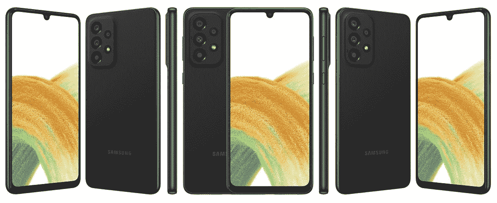

# 三星 Galaxy A53 5G 和 Galaxy A33 5G 终于揭晓

> 原文：<https://www.xda-developers.com/samsung-galaxy-a53-5g-galaxy-a33-5g-launch/>

三星本月早些时候宣布，将于 3 月 17 日举行“Galaxy A 活动”。尽管该公司当时没有说具体会透露什么，但 Galaxy A53 和 Galaxy A33 似乎很有可能，因为这两款手机已经在多个场合被泄露。现在这一天终于到来了，果然 Galaxy A53 5G 和 Galaxy A33 5G 正式上市了。

三星 Galaxy A53 5G 和 Galaxy A33 5G 几乎是同一款手机。这两款设备都具有 IP67 防水/防尘性能(因此可以处理飞溅的水)，Exynos 1280 芯片组，5,000mAh 电池，25W 有线充电，以及一个基于 Android 12 的 UI 4.1。三星似乎在所有型号中使用 Exynos 1280，而不是美国版 Galaxy A52 5G 中的骁龙芯片组，以及 Galaxy A32 5G 中的联发科天玑 720 芯片组。

| 

规格

 | 

三星 Galaxy A53 5G

 | 

三星 Galaxy A33 5G

 |
| --- | --- | --- |
| **建造** | IP67 防水/防尘 | IP67 防水/防尘 |
| **尺寸&重量** | 

*   74.8 x 159.6 x 8.1mm 毫米
*   189 克

 |  |
| **显示** | 

*   6.5 英寸 Super AMOLED
*   120 赫兹刷新率
*   康宁大猩猩玻璃 5

 | 

*   6.4 英寸 Super AMOLED
*   90Hz 刷新率
*   康宁大猩猩玻璃 5

 |
| **SoC** | 三星 Exynos 1280 | 三星 Exynos 1280 |
| **内存&存储** | 

*   6GB/8GB 内存
*   128GB/256GB 内部存储
*   microSD 卡插槽(最高 1TB)

 | 

*   6GB/8GB 内存
*   128GB/256GB 内部存储
*   microSD 卡插槽(最高 1TB)

 |
| **电池&充电** | 

*   5000 毫安时电池
*   25W 超级快充
*   盒子里没有充电器

 | 

*   5000 毫安时电池
*   25W 超级快充
*   盒子里没有充电器

 |
| **安全** | 指纹传感器 | 指纹传感器 |
| **后置摄像头** | 

*   64MP f/1.8 Main(带 OIS)
*   12MP f/2.2 超宽
*   5MP f/2.4 深度传感器
*   5MP f/2.4 微距

 | 

*   48MP f/1.8 Main(带 OIS)
*   12MP f/2.2 超宽
*   5MP f/2.4 深度传感器
*   5MP f/2.4 微距传感器

 |
| **前置摄像头** | 32MP f/2.2 | 32MP f/2.2 |
| **端口** | 

*   USB 类型-C
*   **没有耳机插孔**

 | 

*   USB 类型-C
*   **没有耳机插孔**

 |
| **音频** | 立体声扬声器 | 立体声扬声器 |
| **连通性** | 

*   5G
*   长期演进
*   wi-Fi 802.11 a/b/g/n/AC(2.4G+5 GHz)
*   蓝牙 5.1

 | 

*   5G
*   长期演进
*   wi-Fi 802.11 a/b/g/n/AC(2.4G+5 GHz)
*   蓝牙 5.1

 |
| **软件** | One UI 4.1(安卓 12) | One UI 4.1(安卓 12) |
| **其他特性** | 

*   四年的重大操作系统升级
*   五年的安全更新

 | 

*   四年的重大操作系统升级
*   五年的安全更新

 |

主要区别在于相机的设置和显示。Galaxy A53 5G 的主摄像头为 64MP，而 A33 5G 的主摄像头则降至 48MP。Galaxy A33 5G 的显示屏也是降级的，刷新率略低，为 90Hz。这两款手机都没有耳机接口，肯定不怎么样。

从好的方面来看，这两款设备都有与三星旗舰手机相同的更新承诺，四年的主要操作系统升级和五年的安全更新。除了 iPhone SE 系列，美国没有任何其他中端手机具有如此长的支持寿命。

 <picture></picture> 

Galaxy A33 (Source: [Evleaks](https://twitter.com/evleaks/status/1503595528168353793))

三星表示，Galaxy A53 5G 在美国的起价为 449.99 美元，最早将于 3 月 31 日在 T-Mobile 和威瑞森买到。这款手机将在一天后的 4 月 1 日出现在 Samsung.com 和其他零售商处——美国电话电报公司将以 449.99 美元的价格出售，板球将以 409.99 美元出售。与此同时，Galaxy A33 5G 已经可以在 Samsung.com 预订。与此相关的是，本月早些时候官方确认的 Galaxy A13 LTE 将于 4 月 8 日在 Samsung.com 上市。

在欧洲，Galaxy A53 5G 的 6GB + 128GB 版本将在€售价 449 英镑，8GB + 256GB 版本在€售价 509 英镑。Galaxy A33 5G 的 6g b+ 128g 版本售价为€369 英镑。这两款设备都有蓝色、桃红色、白色和黑色可供选择。

 <picture></picture> 

Samsung Galaxy A53 5G

##### 三星 Galaxy A53 5G

Galaxy A53 5G 已经可以在 Samsung.com 预购，但你必须等到 4 月 1 日才能买到 A53 5G。