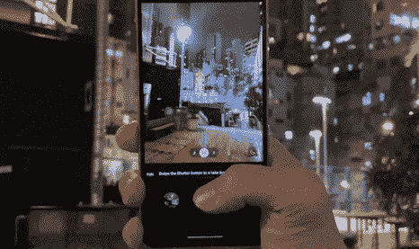

# 三星 Galaxy A53 5G 手把手:颠覆 iPhone SE 3 的做法

> 原文：<https://www.xda-developers.com/samsung-galaxy-a53-5g-hands-on/>

三星最近发布了两款中端手机 Galaxy A53 5G 和 Galaxy A33 5G。这两款设备中较好的一款，Galaxy A53 似乎定位于与刚刚发布的 [iPhone SE 3 (2022)](https://www.xda-developers.com/apple-iphone-se-3-review/) 竞争。虽然苹果的 mid-ranger 优先考虑为消费者提供旗舰级芯片，同时在显示技术和现代外观等方面做出妥协，但三星采取了相反的方法:Galaxy A53 的外观基本上是现代的，有沉浸式屏幕，巨大的电池，令人惊讶的好主摄像头，但 SoC 未经验证，坦率地说，并没有最好的声誉。

在亚洲和欧洲，对 Galaxy A53 5G 的竞争将非常激烈。但在三星的两个关键市场(北美和韩国)，它真的只需要担心 iPhone SE 3，三星的手机有一些明显的优势，应该会吸引市场上更实惠的手机。

## 三星 Galaxy A53 5G:价格和可用性

Galaxy A53 现在可以预订，并将于 3 月 31 日在三星网站以及 T-Mobile 和威瑞森网站上销售。包括亚马逊在内的其他零售商将于 4 月 1 日开始销售。Galaxy A53 的美国型号有 6GB 内存和 128GB 内部存储，售价为 449 美元。在欧洲和亚洲发布的国际型号(包括我正在测试的香港型号)有 6GB 或 8GB 内存版本。

 <picture></picture> 

Samsung Galaxy A53 5G

## 三星 Galaxy A53 和 Galaxy A33:规格

| 

规范

 | 

三星 Galaxy A53 5G

 | 

三星 Galaxy A33 5G

 |
| --- | --- | --- |
| **建造** | IP67 防水/防尘 | IP67 防水/防尘 |
| **尺寸&重量** | 

*   74.8 x 159.6 x 8.1mm 毫米
*   189 克

 |  |
| **显示** | 

*   6.5 英寸 Super AMOLED
*   120 赫兹刷新率
*   康宁大猩猩玻璃 5

 | 

*   6.4 英寸 Super AMOLED
*   90Hz 刷新率
*   康宁大猩猩玻璃 5

 |
| **SoC** | 三星 Exynos 1280 | 三星 Exynos 1280 |
| **内存&存储** | 

*   6GB/8GB 内存
*   128GB/256GB 内部存储
*   microSD 卡插槽(最高 1TB)

 | 

*   6GB/8GB 内存
*   128GB/256GB 内部存储
*   microSD 卡插槽(最高 1TB)

 |
| **电池&充电** | 

*   5000 毫安时电池
*   25W 超级快充
*   盒子里没有充电器

 | 

*   5000 毫安时电池
*   25W 超级快充
*   盒子里没有充电器

 |
| **安全** | 指纹传感器 | 指纹传感器 |
| **后置摄像头** | 

*   64MP f/1.8 Main(带 OIS)
*   12MP f/2.2 超宽
*   5MP f/2.4 深度传感器
*   5MP f/2.4 微距

 | 

*   48MP f/1.8 Main(带 OIS)
*   12MP f/2.2 超宽
*   5MP f/2.4 深度传感器
*   5MP f/2.4 微距传感器

 |
| **前置摄像头** | 32MP f/2.2 | 32MP f/2.2 |
| **港口** | 

*   USB 类型-C
*   **没有耳机插孔**

 | 

*   USB 类型-C
*   **没有耳机插孔**

 |
| **音频** | 立体声扬声器 | 立体声扬声器 |
| **连通性** | 

*   5G
*   长期演进
*   wi-Fi 802.11 a/b/g/n/AC(2.4G+5 GHz)
*   蓝牙 5.1

 | 

*   5G
*   长期演进
*   wi-Fi 802.11 a/b/g/n/AC(2.4G+5 GHz)
*   蓝牙 5.1

 |
| **软件** | One UI 4.1(安卓 12) | One UI 4.1(安卓 12) |
| **其他特征** | 

*   四年的重大操作系统升级
*   五年的安全更新

 | 

*   四年的重大操作系统升级
*   五年的安全更新

 |

***关于这篇评测:**三星港行借给我一台 Galaxy A53 5G 进行测试。该公司没有参与此次审查。*

* * *

## 三星 Galaxy A53 5G:设计和硬件

Galaxy A53 采用了与去年的 Galaxy A52 类似的设计语言，配有平板屏幕和彩色塑料背板，覆盖了设备的整个后部，包括略微突出的摄像头模块。这使得相机凸起变得容易并融入手机背面的其余部分——看起来类似于 [OPPO Find X5 Pro](https://www.xda-developers.com/oppo-find-x5-pro-review/) 。

去年的设计有一些微妙的变化:机箱(手机的顶部、底部和侧面)现在更平了，同时仍然是塑料，经过涂层看起来像金属。它不完全是 iPhone 13 级别的平板，但它明显比 Galaxy A52 或大多数其他 Android 旗舰产品更扁平，更有棱角。请注意，我说的是“旗舰”，因为 Android 品牌似乎都同意，在 2022 年，他们的顶级手机将保持同样的弯曲外观，但等级较低的设备将使用这种平板屏幕，更平的侧面，更方正的美学。我们已经在三星的非 Ultra S22 手机，以及最近的 Redmi 和 OPPO 中端设备中看到了这一点。

尽管 Galaxy A53 的背面和侧面明显是塑料的，但这款手机拿在手中感觉很好。我喜欢背面的磨砂质感，因为屏幕“只有”6.5 英寸，所以握在手中感觉非常舒适。我一直觉得，现代 Android 手机，由于其细长的长宽比，在屏幕达到 6.7 英寸或更大之前，不会感到笨重；任何小一点的东西都很容易拿。

这里的显示器是一个 120 赫兹 6.5 英寸，1080 x 2400 三星 AMOLED 面板，它在大多数情况下看起来很棒。这种显示器色彩鲜艳。显示屏周围的边框虽然没有旗舰 Android 手机薄，但也足够薄，使手机看起来非常现代。

尽管 Galaxy A53 的尺寸与 Galaxy A52 大致相同——这两款设备的重量实际上都是 189 克——但三星设法在 Galaxy A53 中塞进了一个大得多的 5000 毫安时电池(而去年的手机有 4500 毫安时电池)。

还有一个显示指纹扫描仪，立体声扬声器，IP67 防水防尘等级，以及最大 1TB 的 microSD 卡支持——不过，没有耳机插孔或无线充电。缺少耳机插孔是 Galaxy A52 的一个退步，这个范围内的用户可能会错过。总的来说，仅从外观来看，Galaxy A53 至少看起来像一款现代旗舰产品，不像 iPhone SE，其边框属于 2016 年。

* * *

## 摄像机

光学方面，Galaxy A52 在主系统中打包了 64MP 主摄像头、12MP 超宽和一对 5MP 传感器，用于微距和深度；正面周围是一个 32MP 自拍相机。

主 64MP 主摄像头有一个非常小的 1/1.7 英寸图像传感器，但必须归功于三星的软件实力，因为这个主摄像头拍摄的照片非常好。事实上，在许多情况下，Galaxy A53 主摄像头拍摄的照片在未经训练的人看来几乎与 Galaxy S22 超主摄像头拍摄的照片一样好。

当然，对于那些知道如何吹毛求疵的人来说，我们可以看到有大量的处理在进行，所以如果你放大到像素窥视，夜间拍摄看起来就不那么清晰了。由于传感器较小，Galaxy A53 的照片中自然散景较少。

事实上，Galaxy A53 不得不依赖夜间模式，这往往意味着相机相对较慢。即使在光线较弱的情况下，也要等待一秒钟(如下图所示)来完成拍摄。默认情况下，夜间模式会自动启动，你可以关闭它，但这样照片看起来就不会那么好了。

 <picture></picture> 

After hitting the shutter button, you will need to wait for up to a second for the shot to finish.

三星的照片通常看起来更有力，更适合 Instagram，但这种过度加工的外观

当将 Galaxy A53 的主摄像头与其最符合逻辑的竞争对手 2022 版 iPhone SE 3 进行比较时，这主要归结为偏好。Galaxy A53 经常采用夜间模式，而 iPhone SE 根本没有夜间模式，所以三星的照片通常看起来更有力，更适合 Instagram，但与更有机的 iPhone 照片相比，这种过度处理的外观。三星在 S22 系列中修复的照片中添加过度冷(蓝色)色调的旧习惯在这里也回归了(在下面的最后两组样本中最值得注意)。它让香港的霓虹灯看起来更像赛博朋克，但这只是现实生活场景的夸张版本。

Galaxy A53 的超宽摄像头刚刚好。即使在良好的照明条件下，图像也非常柔和；晚上，镜头很吵，更不详细。但考虑到 iPhone SE 甚至没有超宽，Galaxy A53 有一个超宽是一个主要优势(至少在美国市场，Galaxy A53 不必与 Redmi 和 Realme 等中国中端游侠竞争)。

自拍还好，除了三星过分激进的美白滤镜还在。在我人生的这个阶段，当我有皱纹和瑕疵以及黑眼圈时，我有点不介意三星稍微修饰一下我的脸，但这款手机不让我们关闭这一功能仍然很荒谬。

在视频方面，Galaxy A53 可以拍摄高达 4k/30 的视频，但没有任何稳定性，除非你将手机放在三脚架上，在我看来，以这种分辨率拍摄的镜头是不可用的。然而，把分辨率降低到 1080/30，你会得到稳定的图像。但这是不可避免的 iPhone SE 3 是一款更好的摄像机，拍摄的画面不太容易出现微抖动，iPhone 仍然可以在 4k/30 下提供稳定。

* * *

## 三星 Galaxy A53 5G:软件和整体性能

Galaxy A53 运行三星新的 5 纳米 Exynos 1280 芯片，在美国只有 6GB 的内存和 128GB 的存储空间(国际型号——这是我正在测试的——可以高达 8GB 的内存和 256GB 的存储空间)。在撰写本文时，我使用这款设备才一天左右，但性能一直很好。基准数据相当可观，我可以毫无问题地使用社交媒体、观看视频和玩游戏。有些人可能会认为，Galaxy A52 5G 上的骁龙 750G 是一个更好的 SoC，但我们将保留对此的判断，直到我们花更多的时间与该设备打交道。

Galaxy A53 运行 Android 12 和 OneUI 4.1，如果我们只是专注于使用手机，软件体验与 Galaxy S22 系列的软件相同。因此，这是一个令人愉快的软件，有许多定制选项，有用的第一部分应用程序部件，最重要的是，保证四年的 Android 更新。

然而，Galaxy A53 缺少三星 DeX，这意味着它无法将类似桌面计算机的用户界面输出到外部屏幕。

我只测试了这款手机一天左右，所以这绝不是一个评论，但到目前为止，总体表现还不错。我确实注意到显示器的刷新率，即使设置为 120Hz，也不像 Galaxy S22 Ultra 那样流畅——这里和那里都有帧速率下降或断断续续，但在大多数情况下，Galaxy A53 感觉像一部现代三星手机。

Exynos 1280 芯片对我扔给它的任何智能手机任务都表现良好，它甚至可以体面地处理图形密集型游戏*使命召唤移动*。游戏默认将我的图形设置为“低”，但我可以设置为“中”图形，仍然可以玩而不会注意到速度变慢或丢帧。但是，在“高”播放的选项不可用。

基准数据在这个价格范围内也很稳定。至于电池寿命，我还没有对这款手机进行足够长时间的测试，以给出一个明确的分析，但我很确定这款手机可以续航一整天，因为它有 5000 毫安时的电池，更节能的 5 纳米 SoC，以及与 Galaxy S22 Ultra 相比更低分辨率、更耗电的显示器。

* * *

## 谁应该购买三星 Galaxy A53 5G？

与 iPhone SE 3 相比，Galaxy A53 看起来更现代

正如我之前所说，Galaxy A53 5G 在亚洲和欧洲的大部分地区面临激烈竞争，Realme 或 Redmi 等中国品牌通常会推出非常精致的中端设备。但是在美国，Galaxy A53 真的只需要担心 iPhone SE 3 (2022)。虽然 iPhone SE 3 的 A15 Bionic 明显比 Galaxy A53 的 Exynos 1280 更强大，但 Galaxy A53 看起来更现代。

对于那些想要大屏幕、全天电池续航时间以及足够好的摄像头和处理器的美国人来说，Galaxy A53 看起来非常有吸引力。你应该在 Galaxy A53 5G 上查看一下[最划算的交易，并挑选一个](https://www.xda-developers.com/best-samsung-galaxy-a53-deals/)[充电器](https://www.xda-developers.com/best-samsung-galaxy-a53-chargers/)和[外壳](https://www.xda-developers.com/best-samsung-galaxy-a53-cases/)。

 <picture></picture> 

Samsung Galaxy A53 5G

##### 三星 Galaxy A53 5G

Galaxy A53 以实惠的价格提供了现代设计、大屏幕和电池