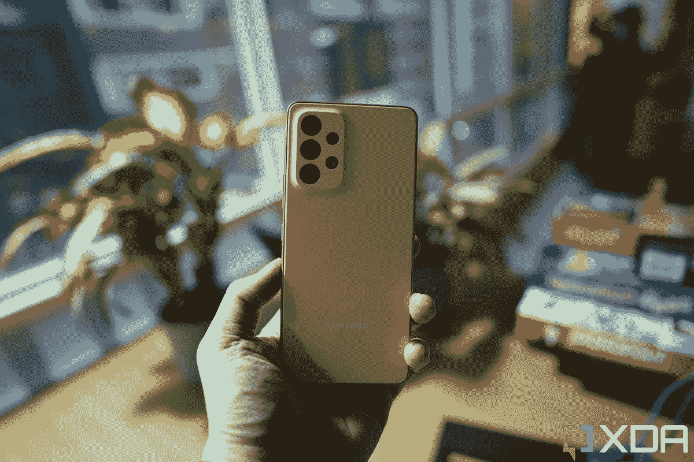
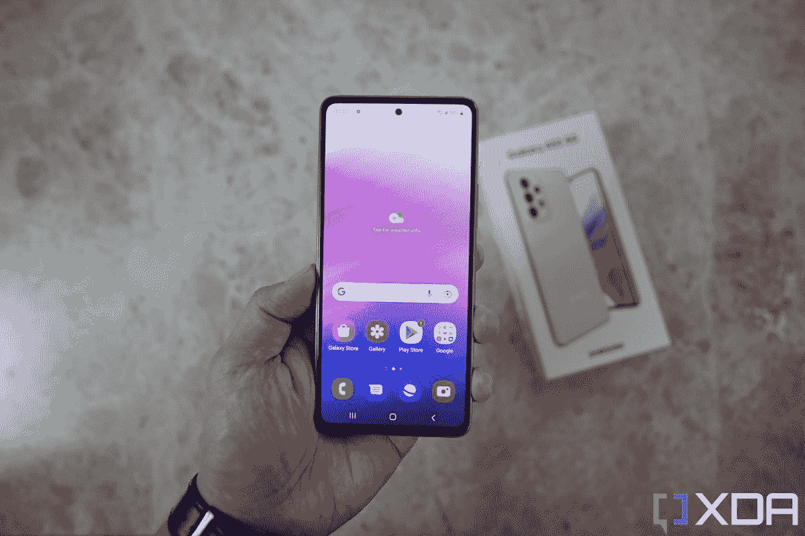
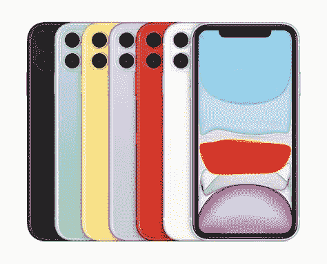

# 三星 Galaxy A53 5G vs 苹果 iPhone 11:该买哪款智能手机？

> 原文：<https://www.xda-developers.com/samsung-galaxy-a53-5g-vs-apple-iphone-11/>

尽管智能手机市场已经被几十个品牌饱和，但每年仍有两个品牌持续占据主导地位——苹果和三星。虽然两者都是世界公认的，但它们都迎合了不同的受众。无论你追求的是 iOS 还是[安卓智能手机](https://www.xda-developers.com/best-android-phones/)，[三星 Galaxy A53 5G](https://www.xda-developers.com/samsung-galaxy-a53-5g-hands-on/) 和苹果 iPhone 11 都是完美的选择，尤其是当你考虑它们的价格和功能时。那么哪款手机适合你呢？我们可以帮助您做出决定，分解每部手机的整体细节，这应该会让您更好地了解您可能感兴趣的手机。所以系好安全带，这是三星 Galaxy A53 5G 对苹果 iPhone 11。

**浏览本文:**

## 三星 Galaxy A53 5G vs 苹果 iPhone 11:规格

|  | 

三星 Galaxy A53 5G

 | 

苹果 iPhone 11

 |
| --- | --- | --- |
| 建设 | 

*   塑性体
*   大猩猩玻璃 5 前面板
*   IP67 防水/防尘

 | 

*   金属/玻璃体
*   大猩猩玻璃前面板
*   IP67 防水/防尘

 |
| 尺寸和重量 | 

*   159.6 x 74.8 x 8.1mm 毫米
*   189 克

 | 

*   150.9 x 75.7 x 8.3mm 毫米
*   194 克

 |
| 显示 | 

*   6.5 英寸 Super AMOLED
*   120 赫兹刷新率
*   1080 x 2400 像素

 | 

*   6.1 英寸液晶显示器
*   60Hz 刷新率
*   828 x 1792 像素分辨率

 |
| 社会学 | 三星 Exynos 1280 | A13 仿生芯片 |
| RAM 和存储 | 

*   6GB/8GB 内存
*   128GB/256GB 内部存储
*   microSD 卡插槽(最高 1TB)

 | 

*   4GB 内存
*   64GB/128GB 内部存储
*   没有 microSD 卡插槽

 |
| 电池和充电 | 

*   5000 毫安时电池
*   25W 超级快充
*   盒子里没有充电器
*   没有无线充电

 | 

*   3，110 毫安时电池
*   18W 快速充电
*   盒子里没有充电器
*   Qi 无线充电

 |
| 安全性 | 指纹传感器 | Face ID |
| 后置摄像头 | 

*   64MP/1.8 主屏幕(带 OIS)
*   12MP/2.2 超宽
*   5 百万像素/2.4 英寸深度传感器
*   5MP/2.4 宏

 | 

*   12MP/1.8 Main(带 OIS)
*   12MP/2.4 超宽

 |
| 前置摄像头 | 32MP/2.2 | 1200 万像素摄像头/2.2 |
| 港口 | 

*   USB 类型-C
*   没有耳机插孔

 | 

*   闪电
*   没有耳机插孔

 |
| 连通性 | 

*   5G
*   长期演进
*   wi-Fi 802.11 a/b/g/n/AC(2.4G+5 GHz)
*   蓝牙 5.1

 | 

*   5G
*   长期演进
*   Wi-Fi 802.11 a/b/g/n/ac/6
*   (2.4G+5GHz)
*   蓝牙 5.0

 |
| 软件 | One UI 4.1(安卓 12) | iOS 15 |
| 价格 | $349.99 | $499 |

## 建造和设计

三星 Galaxy A53 5G 和苹果 iPhone 11 在构造和设计上完全不同。Galaxy A53 5G 外观时尚，主要由塑料制成。两侧是人造金属，后部提供了令人满意的抓握感。苹果 iPhone 11 建立在铝金属框架上，有一个玻璃后面板。结果是一部感觉相当高端的手机。正如你所料，这两款手机都有玻璃显示屏。对于 iPhone 11 来说，这是一个完整的循环。前后都是玻璃，中间夹着铝框。Galaxy A53 5G 的对比度更高。玻璃正面，人造金属侧面，哑光塑料背面。

 <picture></picture> 

The matte plastic back of the Samsung A53 5G

三星 Galaxy A53 5G 的背面采用哑光塑料背面，具有齐平和平坦的外观。虽然它看起来并不高档，但它确实提供了更耐刮擦和指纹的功能优势，并且在使用时也提供了更多的抓握力。iPhone 11 有一个光滑的玻璃背板，看起来很优雅，也可以有更耐刮擦的物理好处。但玻璃背板的显著缺点是其耐用性，尤其是在处理跌落时。还有一种说法是，玻璃背面由于其光滑的表面，可能有点难以把持。

说到设计，这两款手机都有一个驼峰，可以容纳背面的多个摄像头。三星 Galaxy A53 5G 采用矩形设计，内置四个摄像头和一个闪光灯。苹果 iPhone 11 是方形的，内置两个摄像头和一个闪光灯。虽然两个驼峰都存在，但 Galaxy A53 5G 由于从驼峰到后板的无缝过渡而更加精致。iPhone 11 的背面非常明显，似乎苹果正在接受这种外观。当然，两者都不坏，但这将是个人层面上需要主观思考的事情。

## 显示

三星 Galaxy A53 5G 拥有 6.5 英寸 Super AMOLED 显示屏，分辨率为 1080 x 2400 像素。由于这是一个 AMOLED 显示器，你可以期待深黑色和流行的颜色。最重要的是，它有一个显示指纹读取器，并提供 120 赫兹的刷新率，这曾经是高端智能手机的专利。至于外观，显示器周围有薄薄的边框，让它看起来很现代。

 <picture></picture> 

Samsung Galaxy A53

苹果 iPhone 11 采用 IPS LCD 显示屏，苹果称之为“液态视网膜高清”显示屏。6.1 英寸显示屏由 led 背光照明，分辨率为 1792 x 828。由于这是苹果公司的液晶显示器，你可以期待色彩相当平衡。至于它的刷新率，你看到的是 60Hz，与三星 Galaxy A53 5G 相比并不算高。但 60Hz 的刷新率是所有苹果 iPhone 的标准，直到 2021 年发布的 [iPhone 13 Pro](https://www.xda-developers.com/apple-iphone-13-pro-review/) 和 [iPhone 13 Pro Max](https://www.xda-developers.com/apple-iphone-13-pro-max-review/) 。

就外观而言，Galaxy A53 5G 通过其打孔设计提供了一些更时尚和现代的东西。自 2017 年 iPhone X 发布以来，苹果公司的大部分手机都保持了相同的设计。这主要是由于苹果的面部识别系统 Face ID，它提供了行业领先的安全技术，但需要大量的传感器才能工作。这些传感器安装在著名的“凹槽”中。虽然它第一次亮相时很不和谐，但五年过去了，随着 Android 制造商的大量模仿设计，2022 年的 notch 真的没什么大不了的。

尽管如此，外观是主观的，但选择是明确的，三星 Galaxy A53 5G 的显示屏分辨率更高，显示屏中间有一个小孔，而 iPhone 11 的显示屏分辨率较低，缺口较大。

## 表演

在考察智能手机的性能时，有很多不同的方面需要考虑。尽管 iPhone 11 在两年前首次亮相，但当时它拥有顶级处理器 A13 Bionic。相比之下，三星 Galaxy A53 5G 采用的是 2022 年生产的 Exynos 1280 SoC。虽然您可能认为新的处理器显然更好，但您可能需要再考虑一下。

由于其新的 5 纳米架构，三星 Exynos 1280 确实提供了一些好处，但就性能而言，在大多数基准类别中，苹果 A13 Bionic 是明显的赢家。A13 Bionic 在单更多和多核测试中都优于 Exynos 1280。苹果 SoC 也有更好的 GPU 性能。

但正如之前所说，三星 Exynos 1280 也有好处。虽然它的性能不如苹果的 A13 Bionic，但它仍然可以很好地完成大多数日常任务。它不会是最快的，因为它是一个中端 SoC，但由于它的 5 纳米芯片组，它应该可以更高效地运行。公平地说，如果你想获得更大的功率，苹果 A13 Bionic 显然是赢家，但三星 Exynos 1280 也不逊色。

## 摄像机

除了外观，摄像头可能是大多数人在考虑新智能手机时第二重要的东西。公平地说，三星正在用 Galaxy A53 5G 包装一个相当大的军火库，主摄像头传感器为 64MP，12MP 超宽传感器和 5MP 微距。在拍摄模式方面，三个镜头为您提供了最大的多功能性，并在拍照时提供了最佳的整体体验。三星一直以其后期处理效果而闻名，这里也不例外。虽然图像清晰，色彩强烈，但有时看起来有点过度处理。当然，这是一个偏好，但有些人可能会发现更自然的外观更令人愉快。

这就是苹果 iPhone 11 的优势所在，通过其 12MP 主拍摄器和匹配的 12MP 超宽相机，获得色彩准确的照片和视频。尽管与三星相比分辨率较低，但 iPhone 总能捕捉到可靠而准确的颜色。当然，为了做到这一点，你需要光线，那时候一切看起来都很棒。但在黑暗的场景中，Galaxy A53 5G 轻松获胜，凭借其先进的算法提供了出色的夜间图像。iPhone 稍微领先的地方是它的视频功能。iPhone 略胜三星一筹，因为它可以提供稳定的视频，即使在最高分辨率的 4K 拍摄时也是如此。Galaxy A53 无法做到这一点，只能提供 1080p 的视频稳定。

## 电池寿命和充电

三星 Galaxy A53 5G 配备了一个巨大的 5000 毫安时电池。这种电池搭配中端高效 SoC，可以轻松提供全天电池续航时间。三星表示，这款手机应该可以使用两天，最多可以播放 18 小时的视频和 60 小时的音频。最终，这将取决于你如何使用你的手机，但对大多数人来说，这应该足够了。令人惊讶的是，这款手机不提供无线充电，你将不得不依靠 USB-C 的 25W 快速充电。

iPhone 配备了小得多的 3，110 毫安时电池，充电速度较慢，只有 18W。但它提供无线充电功能。苹果表示，这款手机一次充电可以提供长达 17 小时的视频播放，长达 10 小时的流媒体视频，或长达 65 小时的音乐播放。使用 20W 充电器，手机可以充电 50%。遗憾的是，苹果在包装盒中只包含了一个 5W 的充电器。也就是说，iPhone 也应该为大多数人提供全天的电池寿命。两款手机的结果非常接近，但如果你正在寻找一个电池怪物，我认为三星将是一个更安全的赌注。

## 三星 Galaxy A53 5G vs 苹果 iPhone 11:该买哪个？

三星 Galaxy A53 5G 与苹果 iPhone 11。这两款手机在世界各地都有售，而且仍然可以从运营商和零售商那里买到全新的手机。虽然这是一个苹果和桔子的情况，但当每个设备与另一个设备相比较时，有明显的差异。当然，什么设备适合你，完全取决于你如何使用手机。如果你想要一部拥有令人印象深刻的电池续航时间的全能手机，你可能会考虑 Galaxy A53 5G。如果你想要一部通过软件支持更长时间的全能手机，请选择 iPhone 11。此外，如果你以前使用过智能手机，你可能会想坚持使用你所知道的 Android vs iOS 阵营。如果这是你的第一部智能手机，你可能会考虑去你当地的商店测试每一部手机。iPhone 11 的起价为 499 美元，而 Galaxy A53 5G 的价格要低得多，为 349 美元。如果价格是一个问题，答案很明显。

 <picture></picture> 

Apple iPhone 11

##### 苹果 iPhone 11

由 A13 仿生芯片驱动的苹果 iPhone 11 仍然是一个有效的选择，这要归功于它仍然强大的 SoC 和硬件，以及苹果的软件支持

 <picture></picture> 

Samsung Galaxy A53

##### 三星 Galaxy A53 5G

三星 Galaxy A53 5G 是三星最新的 mid rangers 之一，提供了一款适合更多人的手机。