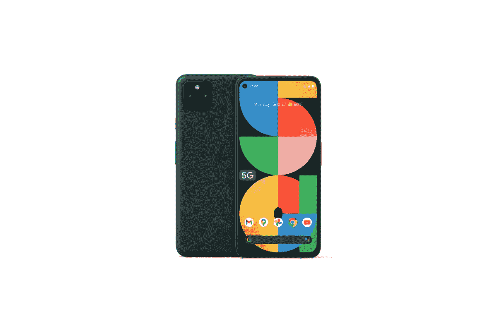

# 三星 Galaxy A53 5G 与谷歌 Pixel 5a 5G:哪个更好？

> 原文：<https://www.xda-developers.com/samsung-galaxy-a53-5g-vs-google-pixel-5a-5g/>

Galaxy A53 5G T1 和 T2 谷歌 Pixel 5a 5G T3 是 500 美元以下最好的中端手机。这两款手机价格相似，物超所值。Galaxy A53 具有强大的冲击力，具有 120Hz AMOLED 显示屏，一套功能强大的摄像头，快速芯片组和大电池。Pixel 5a 5G 不像 Galaxy A53 那样功能齐全，但它在摄影方面有很多优势，你更有可能以很大的折扣找到它。但是哪个值得你花钱呢？我们在这种面对面的比较中找到答案。

**浏览文章:**

## 三星 Galaxy A53 5G 与谷歌 Pixel 5a 5G:规格

|  | 

三星 Galaxy A53 5G

 | 

谷歌 Pixel 5a 5G

 |
| --- | --- | --- |
| 建设 | 

*   塑性体
*   大猩猩玻璃 5 前面板
*   IP67 防水/防尘

 | 

*   金属单体
*   IP67 防尘防水等级

 |
| 尺寸和重量 | 

*   159.6 x 74.8 x 8.1mm 毫米
*   189 克

 | 

*   156.2 x 73.2 x 8.8mm 毫米
*   183g

 |
| 显示 | 

*   6.5 英寸 Super AMOLED
*   120 赫兹刷新率
*   1080 x 2400 像素

 | 

*   6.34 英寸有机发光二极管
*   2400 x 1080 分辨率
*   直接热轧制
*   60Hz 刷新率
*   穿孔显示器
*   高达 700 尼特
*   大猩猩玻璃 3

 |
| 社会学 | 三星 Exynos 1280 | 高通骁龙 765 克 |
| RAM 和存储 | 

*   6GB/8GB 内存
*   128GB/256GB 内部存储
*   microSD 卡插槽(最高 1TB)

 | 

*   6GB 内存
*   128GB 内部存储

 |
| 电池和充电 | 

*   5000 毫安时电池
*   25W 超级快充
*   盒子里没有充电器
*   没有无线充电

 | 

*   4680 毫安时
*   18W 快速充电
*   没有无线充电

 |
| 安全性 | 光学显示器内指纹传感器 | 光学显示器内指纹传感器 |
| 后置摄像头 | 

*   64MP/1.8 主屏幕(带 OIS)
*   12MP/2.2 超宽
*   5 百万像素/2.4 英寸深度传感器
*   5MP/2.4 宏

 | 

*   1220 万像素索尼 IMX363，f/1.7，1.4 m 像素大小，双像素自动对焦
*   16MP 超宽，索尼 IMX481，f/2.2，1.0 m 像素尺寸，107 FoV

 |
| 前置摄像头 |  | 

*   800 万像素，f/2.0，1.12 米像素尺寸

 |
| 港口 | 

*   USB 类型-C
*   没有耳机插孔

 | 

*   USB-C
*   3.5 毫米耳机插孔

 |
| 连通性 | 

*   5G
*   长期演进
*   wi-Fi 802.11 a/b/g/n/AC(2.4G+5 GHz)
*   蓝牙 5.1

 | 

*   低于 6GHz 和毫米波 5G
*   单个 nanoSIM 卡插槽+集成 eSIM，支持 5G + 4G 或 4G + 4G DSDS(双 SIM 卡，双待机)
*   Wi-Fi:2.4 GHz/5 GHz 802.11 AC(Wi-Fi 5)
*   蓝牙 5.0
*   国家足球联盟

 |
| 软件 | 

*   One UI 4.1(安卓 12)
    *   4 年的 Android 操作系统更新
    *   5 年的安全更新

 | 

*   安卓 11
    *   3 年的 Android 操作系统升级
    *   3 年每月 Android 安全补丁更新

 |
| 价格 | $349 | $449 |

## 设计与展示

Galaxy A53 和 Pixel 5a 5G 都采用了带有柔软涂层的塑料外壳，但从视觉上看，它们是非常不同的手机。Galaxy A53 大胆而漂亮，有多种颜色可供选择。Galaxy A53 的整体美学与去年的 Galaxy A52 相似。它有一个扁平的底盘和一个略突出于机身的大相机模块。尽管背面和侧面都是塑料的，Galaxy A53 的手感还是不错的。

Pixel 5a 5G 的设计是功能优于美学的一个明显例子。与 Galaxy A53 相比，Pixel 5a 5G 看起来相当无聊。但这是一款制作精良的手机，采用金属和塑料一体式机身(金属覆盖塑料外壳)，拿在手中感觉很结实。Pixel 5a 5G 只有一种颜色:大部分是黑色。

在保护和耐用性方面，两款手机的防水和防尘等级均为 IP67。Galaxy A53 有一个显示屏下指纹扫描仪，而 Pixel 5a 使用的是好的、旧的后置指纹扫描仪。这两款手机的一个主要区别是，Pixel 5a 5G 有 3.5 毫米插孔，而 Galaxy A53 没有。

Galaxy A53 5G 6.5 英寸全高清+ Super AMOLED 显示屏，刷新率为 120Hz，提供鲜明的色彩和流畅的滚动体验。谷歌 Pixel 5a 5G 的 6.43 英寸有机发光二极管显示屏略小，具有全高清分辨率。它也不支持高刷新率，也没有 Galaxy A53 那么亮。简单来说，Galaxy A53 的面板远远好于 Pixel 5a。

## 摄像机

Galaxy A53 配备了一个四摄像头设置，包括一个 6400 万像素的 OIS 主摄像头，一个 1200 万像素的超宽摄像头，以及两个 500 万像素的微距和深度镜头。Pixel 5a 背面采用了双摄像头设置，由一个 12MP 主摄像头和 OIS 以及 16MP 超广角摄像头组成。理论上，Galaxy A53 拥有更强大的相机系统，但更多的百万像素和更多的相机传感器并不一定意味着出色的相机性能。现代智能手机摄影严重依赖软件图像处理和机器学习/人工智能魔法，这也是 Pixel 5a 相对于 Galaxy A53 的优势所在。

两款手机都能在大白天产生高动态范围的清晰图像。然而，Galaxy A53 往往会使颜色有点过饱和，同时也会使阴影变平，以获得更明亮、更有活力的外观。Pixel 5a 的拍摄看起来更自然，有更多的阴影细节和对比度。

这两款手机都提供了专用的夜间模式，用于夜间摄影和主相机上的光学图像稳定。在视频录制方面，Pixel 5a 5G 比 Galaxy A53 有优势，因为它支持 60fps 的 4K 拍摄。Galaxy A53 的最高速度为 4K 30fps。然而，当谈到人像和超级特写镜头时，Galaxy A53 表现得更好，因为它有专用的深度和微距拍摄器。

总的来说，如果你想要一台在所有照明条件下都能拍摄出逼真照片的相机，Pixel 5a 5G 是一个更安全的选择。如果想要更多功能的相机系统，Galaxy A53 是更好的选择。

查看这两款手机的主摄像头、超宽摄像头和自拍摄像头的图像样本。

### 像素 5a:相机样本

### Galaxy A53:相机样品

## 表演

Galaxy A53 由三星内部的 Exynos 1280 SoC 提供支持，具有两个主频为 2.4GHz 的 Arm Cortex-A78 性能核心和六个主频为 2.0GHz 的 Cortex-A55 效率核心。与此同时，Pixel 5a 5G 封装了高通的骁龙 765G 芯片组，该芯片组有一个 2.4GHz 的 Cortex-A76 内核，一个 2.2GHz 的 Cortex-A76 内核，以及四个 1.8GHz 的 Cortex-A55 内核

Galaxy A53 在原始性能方面胜过 Pixel 5a。它拥有更强大的 CPU 内核和更快的 GPU。在现实世界的性能中，Galaxy A53 应该比 Pixel 5a 感觉更灵敏和流畅，因为它有更高的刷新率显示(120Hz 对 60Hz)。也就是说，不要指望在这些手机上玩像 Genshin Impact 或 Call of Duty 这样的高端游戏。

Galaxy A53 从 4GB 内存开始，一直到 8GB 内存。Pixel 5a 5G 只配有 6GB 内存。存储选项也是如此:Pixel 5a 5G 只有 128GB 的版本，而 A53 则提供 128GB 和 256GB 的选项。A53 也有一个 MicroSD 卡插槽，所以如果你用完了存储空间，你可以随时插入存储卡来扩展存储空间。

## 软件和电池寿命

Galaxy A53 运行 Android 12，开箱即用一个 UI 4.1。Pixel 5a 搭载的是 Android 11 的库存版本，但可以升级到 Android 12。在软件支持方面，挑选一个明显的赢家有点棘手。如果你想尽快获得新的 Android 版本，Pixel 5a 是你最好的选择。事实上，这是为数不多的可以运行 Android 13 测试版的手机之一。但在长期软件支持方面，Galaxy A53 通过承诺 4 年的操作系统更新和 5 年的安全补丁，将 Pixel 5a 5G 打得落花流水。Pixel 5a 承诺获得三年的操作系统更新，由于它与 Android 11 一起发货，Android 14 很可能是它的最后一次重大更新。与此同时，Galaxy A53 应该会在 Android 16 之前获得更新。

## 三星 Galaxy A53 5G vs 谷歌 Pixel 5a:该买哪个？

Galaxy A53 拥有比 Pixel 5a 的 4,680mAh 电池更大的 5,000mAh 电池。虽然这不是一个巨大的差距，但如果电池寿命是你的首要任务，这是要记住的事情。充电速度方面，A53 支持 25W 快充，Pixel 5a 最高 18W。然而，请注意，Pixel 5a 5G 在盒子里装有充电器，而 Galaxy A53 则需要单独购买一个。

 <picture></picture> 

Samsung Galaxy A53

##### 三星 Galaxy A53 5G

Galaxy A53 提供了 120Hz AMOLED 显示屏、Exynos 1280 SoC 和一组功能强大的摄像头。

Galaxy A53 和谷歌 Pixel 5 都是有能力的中游侠，以合理的价格提供了很好的硬件。虽然这两款手机的售价相似，但 Galaxy A53 已经降至 349 美元，比 Pixel 5a 更有优势。

 <picture></picture> 

Google Pixel 5a 5G

##### 谷歌 Pixel 5a

Pixel 5a 5G 集成了强大的摄像头和骁龙 765G 芯片组。

Galaxy A53 在大多数部门击败了 Pixel 5a 5G。它有更好的显示屏、更快的芯片组、更长的电池寿命和更长的软件支持。诚然，Pixel 5a 5G 拥有比 A53 更好的相机系统，但它也要多花 100 美元。随着 Pixel 6a 即将以更好的相机和更快的芯片组以同样的价格上市，Pixel 5a 5G 看起来不是现在购买的最佳手机。