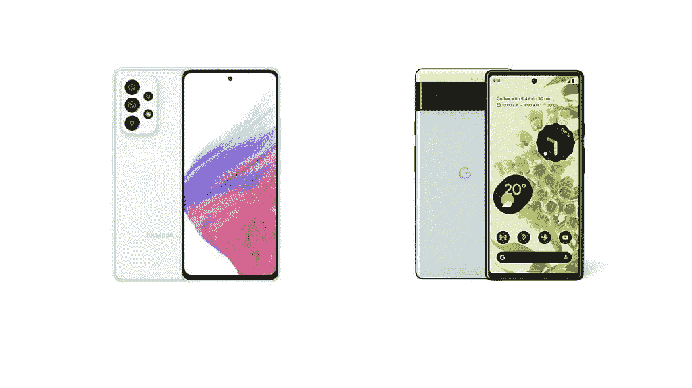
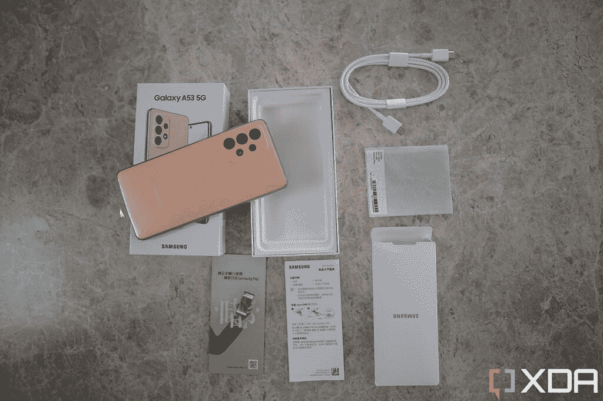

# 三星 Galaxy A53 vs 谷歌 Pixel 6:应该买哪款实惠的安卓？

> 原文：<https://www.xda-developers.com/samsung-galaxy-a53-5g-vs-google-pixel-6/>

在 XDA，我们通常会比较同一级别的智能手机——旗舰与旗舰，预算与预算——但值得探索的是，旧的基本型号旗舰手机与新的中端手机相比，因为两者都比标准的顶级旗舰手机更实惠，而且这是一个很好的衡量标准，可以看出旗舰手机是否能在一年后保持其地位。今天我们来看看三星 Galaxy A53，一款 2022 年的中端手机，与谷歌 2021 年的基本型号旗舰 Pixel 6 进行对比。

我们必须注意到两者之间有 250 美元的价格差距——Galaxy A53 的零售价格为 350 美元，而且可以找到[不断的交易，而 Pixel 6 的价格为 600 美元，尽管你可以在销售季节以更低的价格买到它。因此，对于一些预算紧张的人来说，这可能已经消除了 Pixel 6 的竞争。但是如果你不介意潜在支付 600 美元，那么我们希望这个指南可以帮助你决定下一次购买智能手机。](https://www.xda-developers.com/best-samsung-galaxy-a53-deals/)

 <picture></picture> 

Samsung Galaxy A53 5G

##### 三星 Galaxy A53 5G

Galaxy A53 是三星最新的中端产品，它以低廉的价格提供了出色的屏幕和坚固的主摄像头。

 <picture></picture> 

Google Pixel 6

谷歌 Pixel 6 是一款旗舰手机，拥有出色的摄像头和独特的设计，加上谷歌有史以来第一款 SoC - Tensor。

 <picture></picture> 

Galaxy A53 and Pixel 6

**浏览这篇文章:**

## 三星 Galaxy A53 5G vs 苹果 iPhone 11:规格

|  | 

三星 Galaxy A53 5G

 | 

谷歌像素 6

 |
| --- | --- | --- |
| 建设 | 

*   塑性体
*   大猩猩玻璃 5 前面板
*   IP67 防水/防尘

 | 

*   大猩猩玻璃 5 前面板
*   标准玻璃背面
*   铝制底盘
*   IP68 防水/防尘等级

 |
| 尺寸和重量 | 

*   159.6 x 74.8 x 8.1mm 毫米
*   189 克

 | 

*   158.6 x 74.8 x 8.9 毫米
*   207 克

 |
| 显示 | 

*   6.5 英寸 Super AMOLED
*   120 赫兹刷新率
*   1080 x 2400 像素

 | 

*   6.4 英寸有机发光二极管
*   90Hz 刷新率
*   1080 x 2400 像素分辨率

 |
| 社会学 |  |  |
| RAM 和存储 | 

*   6GB/8GB 内存
*   128GB/256GB 内部存储
*   microSD 卡插槽(最高 1TB)

 | 

*   8GB
*   128GB/256GB 内部存储
*   没有 microSD 卡插槽

 |
| 电池和充电 | 

*   5000 毫安时电池
*   25W 超级快充
*   盒子里没有充电器
*   没有无线充电

 | 

*   4，614 毫安时电池
*   30W 快速充电
*   盒子里的充电器
*   Qi 无线充电

 |
| 安全性 | 

*   光学显示器内指纹传感器

 | 

*   光学显示器内指纹传感器

 |
| 后置摄像头 | 

*   64MP/1.8 主屏幕(带 OIS)
*   12MP/2.2 超宽
*   5 百万像素/2.4 英寸深度传感器
*   5MP/2.4 宏

 | 

*   50MP，直径 1.8 毫米(带 OIS)
*   12MP/2.4 超宽

 |
| 前置摄像头 |  |  |
| 港口 | 

*   USB 类型-C
*   没有耳机插孔

 |  |
| 连通性 | 

*   5G
*   长期演进
*   wi-Fi 802.11 a/b/g/n/AC(2.4G+5 GHz)
*   蓝牙 5.1

 | 

*   5G
*   长期演进
*   Wi-Fi 802.11 a/b/g/n/ac/6
*   (2.4G+5GHz)
*   蓝牙 5.1

 |
| 软件 |  |  |
| 价格 |  |  |

## 三星 Galaxy A53 5G 与谷歌 Pixel 6:设计和硬件

设计美学是主观的，但我个人认为谷歌 Pixel 6 是一款外观明显更好、更独特的手机，它有一个看起来像遮阳板的不同外观的相机带，在某些配色中，还有一种双色饰面。Galaxy A53 在我看来并不坏，但它看起来有点无聊，有点像三星为了安全起见——试图不冒犯或过于突出。

两款手机的尺寸大致相同，Galaxy A53 的屏幕为 6.5 英寸，Pixel 6 的屏幕为 6.4 英寸。Pixel 6 稍微重了一点，也厚了一点，但老实说，我拿这两款手机时都感觉不到它的存在。在构造方面，Galaxy A53 是一款中档产品，所以它的四周都非常柔软，而 Pixel 6 则是玻璃和铝的三明治。后者更高档，手感更好，但前者更有可能经受住跌落。尽管如此，如果你想买一个 Galaxy A53 或 T2 谷歌 Pixel 6 的箱子，还是有选择的。

### 显示

Galaxy A53 配备了 6.5 英寸 120 赫兹的三星 AMOLED 面板，比 Pixel 6 中使用的 90 赫兹有机发光二极管略胜一筹，后者来自一家未知的供应商。三星的面板不仅更新速度更快，而且亮度也明显提高。

 <picture></picture> 

Galaxy A53 display.

两个屏幕下面都是光学显示扫描仪，老实说，这两个屏幕都低于标准，因为它们需要比平常多一拍的时间来解锁。价格更高、更高端的设备拥有明显更好的显示扫描仪是一回事，但许多中国品牌，如 OPPO 或小米，也在其中端设备中提供高级扫描仪。

 <picture></picture> 

Pixel 6 display.

### 处理器

定制芯片为每个设备提供动力 Galaxy A53 中的三星自己的 Exynos 1280，以及 Pixel 6 Pro 中的谷歌张量。让我们不要拐弯抹角-张量只是一个更好的 SoC。它明显更智能(在机器学习和图像处理方面)，并且通常也比 Exynos 1280 移动得更快。但同样，考虑到 250 美元的差价，这是可以接受的。Exynos 1280 是一款非常体面的芯片——你在上面运行 Instagram 或 Gmail 或大多数 Android 游戏不会有任何问题 Tensor 只是一款技术上更先进的芯片。

### 摄像机

这个区域也是 Pixel 6 的另一个压倒性胜利。谷歌手机基本上有一个顶级旗舰级别的主摄像头，能够与最高端的 iPhone 或三星 Galaxy 针锋相对。因此，Galaxy A53 非常明显的中端相机很难跟上。

这并不是说 Galaxy A53 的相机不好。它们很好——尤其是主摄像头，一个 64MP f/1.8 的拍摄器，可以在白天捕捉生动的像素装箱图像。在晚上，传感器将不得不在很大程度上依赖于夜间模式来产生无噪声的图像，并且结果可能是偶然的。

与此同时，Pixel 6 使用 GN1 传感器(讽刺的是由三星制造)，图像传感器更大。再加上谷歌一流的数字图像处理技术，Pixel 6 主摄像头无论白天黑夜都能拍摄出完美平衡、细节清晰、无噪点的照片。我们尤其喜欢 Pixel 的色彩再现，这有点像现实生活，但仍然保持了场景的原始完整性。下面这些像素 6 的照片几乎是目前智能手机摄影所能达到的最好水平 Galaxy A53 无法达到这种水平的动态范围、细节和平衡。

### 内存、电池和其他组件

Galaxy A53 的内存只有 4GB(记住，这是一款中端手机)，但可以达到 8GB，而 Pixel 6 只有 8GB 内存。128GB 或 256GB 的存储选项完全相同。但三星的一个优势是 A53 支持 SD 卡以增加内存，而 Pixel 不支持。

 <picture></picture> 

Pixel 6

虽然这两款手机都有立体声扬声器，声音均匀，防水防尘等级为 IP68，但 Pixel 6 的触感要好得多，其 4，614 mAh 的电池可以无线充电。Galaxy A53 的触觉是糊状的，5000 毫安时的电池只能用常规方法充电。顺便说一下，这两款手机都没有充电器。

 <picture></picture> 

The Galaxy A53 does not come with a charger -- neither does the Pixel 6.

## 三星 Galaxy A53 5G vs 谷歌 Pixel 6:软件

Galaxy A53 在 Android 12 上运行三星的 OneUI Android 皮肤，而 Pixel 6 运行 Android 12，具有明显的 Pixel 风格，充满了异想天开的风格和生动的动画。谷歌为 Pixel 6 重新设计了 Pixel 软件，它比以前更具可定制性，配色方案可以自动适应你选择的壁纸，以及其他个性化的功能，如手机能够识别你附近播放的歌曲并保存曲目列表(如果觉得毛骨悚然，你可以关闭它)。

Galaxy A53 中运行的 OneUI 有点过于简单。三星 DeX 是三星旗舰手机的一大特色，这里没有。浮动窗口功能也不像其他价格更高的三星手机那样流畅。并且 OneUI 也容易出现偶尔的动画口吃。

Galaxy A53 对大多数人来说仍然非常有用，但 Pixel 6 的软件更加周到，在 Pixel 6 与 Galaxy A53 的这一特定情况下，移动速度更快，也更流畅。

## 三星 Galaxy A53 5G vs 谷歌 Pixel 6:性能

我之前已经提到过这一点，但谷歌 Pixel 6 表现更好——它在智能手机任务上速度更快，相机也更好。Pixel 6 也更加智能，由于 Tensor 是为 Pixel 6 定制的，可以处理机器学习任务，因此具有出色的语音听写能力。

电池寿命是 Galaxy A53 获胜的一个方面，因为它的电池更大，一次充电可以使用一整天，而 Pixel 6 可能需要在晚上结束之前充满电，如果你真的在推动它的话。

作为一台媒体消费机器，两款手机都很棒，都有大屏幕和立体声扬声器，但 Galaxy A53 更宽、更平的侧面使手机在躺在沙发上时更容易单手握持。

## 三星 Galaxy A53 5G vs 谷歌 Pixel 6:你该拿哪个？

正如开始提到的，两者之间有不小的 250 美元的价格差异，所以这个决定归结为你对节省 250 美元有多重视？如果你预算紧张，Galaxy A53 仍然是一款功能非常强大、价格合理的手机。但如果你能稍微挥霍一下，支付 600 美元的 Pixel 6 价格，换一部谷歌旗舰手机是值得的，因为它只是一部更好的手机。如果差异甚至更小，我们会更喜欢 Pixel 6 而不是 Galaxy A53，因为它是一款旗舰设备，可以比三星 mid-ranger 完成的事情多得多。

 <picture></picture> 

Samsung Galaxy A53 5G

##### 三星 Galaxy A53 5G

Galaxy A53 是三星最新的中端产品，它以低廉的价格提供了出色的屏幕和坚固的主摄像头。

 <picture></picture> 

Google Pixel 6

谷歌 Pixel 6 是一款旗舰手机，拥有出色的摄像头和独特的设计，加上谷歌有史以来第一款 SoC - Tensor。