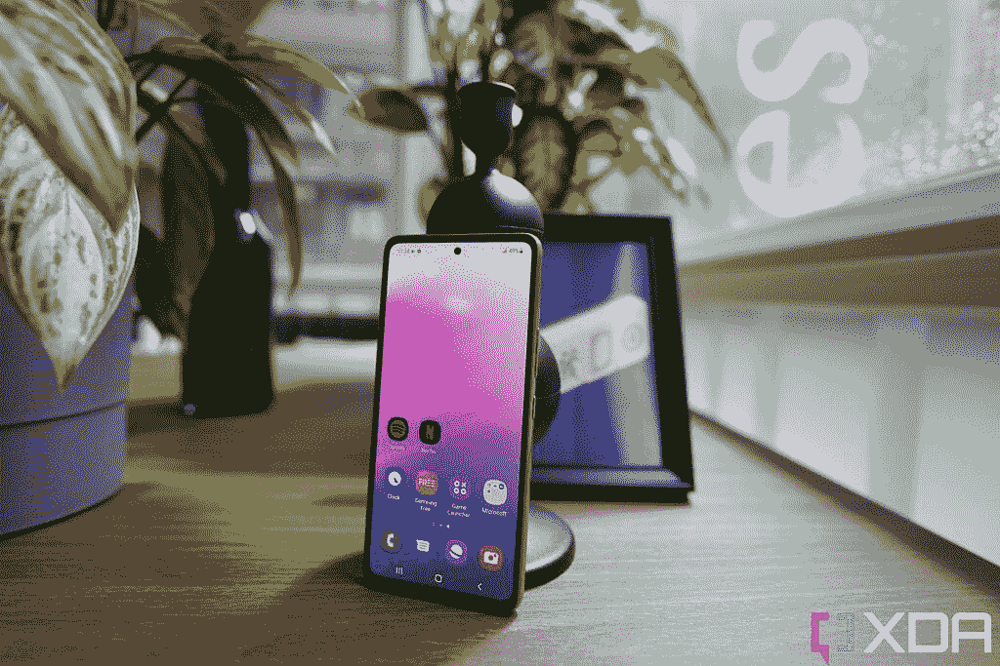
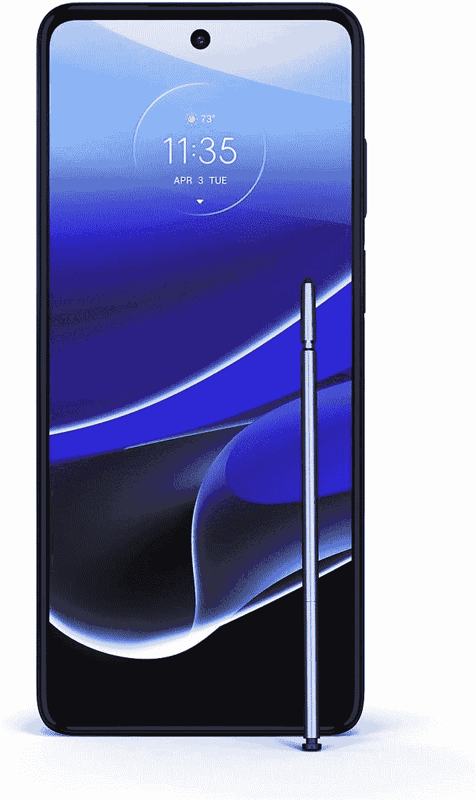

# 三星 Galaxy A53 5G vs 摩托罗拉 Moto G Stylus 5G (2022):美国中游侠之战

> 原文：<https://www.xda-developers.com/samsung-galaxy-a53-5g-vs-motorola-moto-g-stylus-5g/>

一段时间以来，[三星 Galaxy A53 5G](https://www.xda-developers.com/samsung-galaxy-a53-5g-hands-on/) 一直很容易被推荐给任何想在美国购买一款出色的中端智能手机的人。但是摩托罗拉配备手写笔的 [Moto G Stylus 5G (2022)](https://www.xda-developers.com/motorola-moto-g-stylus-5g-2022-review/) 的到来撼动了低于 500 美元的智能手机市场。两款手机价格相似，并提供诱人的硬件套装。Galaxy A53 拥有漂亮的设计、高刷新率 AMOLED 显示屏和功能强大的摄像头。Moto G Stylus 5G 拥有大显示屏，内置触控笔，三摄像头设置，以及干净的软件体验。但是哪一个是最好的中队长呢？我们在这款 Galaxy A53 与 Moto G Stylus 5G 的对决中找到答案。

**浏览这篇文章:**

## 三星 Galaxy A53 5G Vs 摩托罗拉 Moto G Stylus 5G:规格

|  | 

三星 Galaxy A53 5G

 | 

摩托罗拉 Moto G 手写笔 5G

 |
| --- | --- | --- |
| 建设 | 

*   塑性体
*   大猩猩玻璃 5 前面板
*   IP67 防水/防尘

 | 

*   塑性体
*   玻璃前面板
*   防水涂层

 |
| 尺寸和重量 | 

*   159.6 x 74.8 x 8.1mm 毫米
*   189 克

 | 

*   168.9 x 75.8 x 9.3 毫米
*   215 克

 |
| 显示 | 

*   6.5 英寸 Super AMOLED
*   120 赫兹刷新率
*   1080 x 2400 像素

 | 

*   6.8 英寸液晶显示器
*   120 赫兹刷新率
*   FHD+ (1080 x 2460)
*   最大亮度为 450 尼特(典型值)

 |
| 社会学 | 三星 Exynos 1280 | 高通骁龙 695 5G |
| RAM 和存储 | 

*   6GB/8GB 内存
*   128GB/256GB 内部存储
*   microSD 卡插槽(最高 1TB)

 | 

*   8GB 内存
*   256GB 内部存储

 |
| 电池和充电 | 

*   5000 毫安时电池
*   25W 超级快充
*   盒子里没有充电器
*   没有无线充电

 | 

*   5000 毫安时
*   盒子里的 10W 有线充电器
*   最大充电量:
    *   解锁型号:15W
    *   威瑞森型号:18W

 |
| 安全性 | 光学显示器内指纹传感器 | 侧装式指纹扫描仪 |
| 后置摄像头 | 

*   64MP/1.8 主摄像头(带 OIS)
*   12MP/2.2 超宽
*   5 百万像素/2.4 英寸深度传感器
*   5MP/2.4 宏

 | 

*   带 OIS 的 5000 万像素主摄像头
*   800 万像素超宽 118°视野
*   2MP 深度传感器

 |
| 前置摄像头 |  | 

*   800 万像素，f/2.0，1.12 米像素尺寸

 |
| 港口 | 

*   USB 类型-C
*   没有耳机插孔

 | 

*   USB-C
*   3.5 毫米耳机插孔

 |
| 连通性 | 

*   5G
*   长期演进
*   wi-Fi 802.11 a/b/g/n/AC(2.4G+5 GHz)
*   蓝牙 5.1
*   NFC(取决于市场)

 | 

*   5G
*   长期演进
*   wi-Fi 802.11 a/b/g/n/AC(2.4G+5 GHz)
*   蓝牙 5.1
*   国家足球联盟

 |
| 软件 | 

*   One UI 4.1(安卓 12)
    *   4 年的 Android 操作系统更新
    *   5 年的安全更新

 | 

*   安卓 12
    *   一次重大操作系统更新
    *   3 年的双月 Android 安全补丁更新

 |
| 价格 | $449.99 | $449.99 |

## 设计与展示

Galaxy A53 和 Moto G Stylus 5G 在设计上有一些相似之处。这两款手机都有一个塑料框架和塑料背面，塑料背面有涂层，看起来像玻璃。他们也有一个打孔显示器。说到 Galaxy A53，它选择了扁平底盘和扁平背部的方形设计。它有一个大的摄像头模块，从后面稍微突出来，虽然没有它的前辈那么多。

相比之下，Moto G Stylus 5G 更具曲线感，更圆润。它的摄像头也比 Galaxy A53 更低调。

Galaxy A53 标榜 6.5 英寸 FHD+ AMOLED 显示屏，刷新率为 120Hz。与此同时，Moto G Stylus 5G 拥有 6.8 英寸 IPS LCD，分辨率为 FHD+级，刷新率为 120Hz。虽然两种面板都提供相似的分辨率和刷新率，但 Galaxy A53 的面板更胜一筹。作为 AMOLED 面板，它提供了比 Moto G Stylus 5G 的 LCD 面板更鲜艳的颜色和更好的对比度。它在阳光直射下的表现也更好，因为它可以达到 800 尼特的亮度，而 Moto G Stylus 5G 的亮度为 562 尼特。

## 摄像机

说到相机，Galaxy A53 配备了一个四摄像头设置，这是一个 64MP 的 OIS 主摄像头。其他三个拍摄者包括一个 12MP 超宽摄像头和两个 2MP 微距和深度传感器。Moto G Stylus 有一个三摄像头系统，包括一个 50MP 主摄像头，一个 8MP 超宽摄像头和一个 2MP 深度传感器。至于自拍和视频通话，Galaxy A53 有 32MP 摄像头，而 Moto G Stylus 5G 有 16MP 摄像头。论技术优势，Galaxy A53 拥有更好的相机系统。在良好的光线下，这两款手机都能够从主摄像头拍摄出色彩丰富、细节丰富的照片。然而，在弱光和黑暗的条件下，Galaxy A53 的效果更好。它还有一个专用的夜间模式，用于在拍摄黑暗场景时引入更多光线。

正如我们在评论中提到的，Moto G Stylus 的超宽相机有点失手。在许多情况下，它会比主摄像头暗很多。Galaxy A53 上的超宽摄像头充其量也还可以。它在白天产生柔和的图像，在晚上表现出相当多的噪声。

在视频录制方面，Moto G Stylus 5G 落后于竞争对手，超过了 st 1080p 60fps。Galaxy A53 可以拍摄 4K 30fps 的视频，但你需要一个三脚架来获得可用的镜头，因为在这个分辨率下拍摄时没有任何稳定性。

Galaxy A53 赢得了相机比赛，因为它拥有更多功能的相机系统和更好的弱光性能。

### Galaxy A53:相机样品

### Moto G Stylus 5G (2022)相机样品

## 表演

Galaxy A53 封装了自制的 Exynos 1280 芯片组，具有两个主频为 2.4GHz 的 Cortex-A78 性能内核和六个运行速度为 2.0GHz 的 Cortex-A55 效率内核。Moto G Stylus 5G 由高通的中端骁龙 695 5G SoC 提供支持，采用了两个主频为 2.2GHz 的 Cortex-A78 衍生物核心和六个主频为 1.7GHz 的 Kryo 660 银核心(Cortex-A55)。从表面上看，Exynos 1280 更好，因为它的时钟速度更快，尽管这种差异很小，不太可能对现实世界的性能产生巨大影响。

在日常任务中，两款手机都表现不错，尽管它们明显不如昂贵的旗舰手机那样快或流畅。

两款手机都不是游戏冠军。图形密集型游戏，如使命召唤:移动和 Genshin Impact 在低设置下运行良好，但当你推到中或高设置时会变得断断续续。

Moto G Stylus 5G 有一个单独的版本，内存为 8GB，存储空间为 256GB。Galaxy A53 提供多种配置供您选择:6GB/8GB 内存和 128GB/256GB 存储空间。

## 电池、软件和其他

Galaxy A53 和 Moto G Stylus 5G 都装有 5000 毫安时的电池，使用一个充电器应该可以轻松维持一整天。然而，这两款手机在充电速度上有所不同。Galaxy A53 支持 25W 快速充电，但盒子里没有充电器。Moto G Stylus 5G 的充电速度最高为 15W。但出于某种奇怪的原因，摩托罗拉在盒子里捆绑了一个超慢的 10W 充电器。我们只能想象用 10W 的充电器给 5,000mAh 的电池充电需要多少时间。

 <picture></picture> 

Galaxy A53 display

软件方面，Galaxy A53 和 Moto G Stylus 5G 都运行 Android 12。但是，两款手机上的软件体验都是不分昼夜的。Galaxy A53 运行该公司高度定制的 One UI 4 皮肤，而 Moto G Stylus 5G 提供了一个接近库存的 Android 版本，仅在顶部进行了少量调整。

在软件支持方面，Galaxy A53 领先于 Moto G Stylus 5G。它保证在四年内获得主要的操作系统更新，并在五年内获得每月安全更新。这甚至超过了谷歌承诺获得三年操作系统更新的顶级旗舰。另一方面，Moto G Stylus 5G 只承诺 1 次重大操作系统更新和三年的双月安全更新。换句话说，它不会获得任何超过 Android 13 的新 OS 更新。不过 Galaxy A53 应该会在 Android 16 之前更新操作系统。

与 Galaxy A53 相比，Moto G Stylus 5G 的一个主要优势是触控笔支持。它配有一个内置的无源手写笔，可以用来画画、做笔记、给截图添加注释或打开应用程序。然而，它并不像 S-Pen 那样令人印象深刻，功能齐全，正如 Adam Doud 在他的评论中指出的那样，“感觉不那么刻意和优雅。”但是，如果你想要一部支持手写笔的手机，而不必花费 1200 美元，Moto G Stylus 5G 是市场上为数不多的选择之一。

## Galaxy A53 5G vs Moto G 手写笔 5G:该买哪个？

Galaxy A53 5G 和摩托罗拉 Moto G Stylus 5G 是目前美国最好的两款中端智能手机。Galaxy A53 的上市价格为 499 美元，但现在已经降到了 449 美元。你还可以利用[交易](https://www.xda-developers.com/best-samsung-galaxy-a53-deals/)进一步降低价格。Moto G Stylus 5G 的最高零售价也是 499 美元，但截至撰写本文时，它目前在亚马逊上的售价为 349 美元。

 <picture></picture> 

Samsung Galaxy A53

##### 三星 Galaxy A53 5G

Galaxy A53 提供了漂亮的 120Hz AMOLED 显示屏、Exynos 1280 SoC 和 5,000mAh 大电池。

 <picture></picture> 

Moto G Stylus 5G (2022)

##### 摩托罗拉 Moto G 手写笔 5G (2022)

Moto G Stylus 5G 配有内置无源触控笔、三摄像头系统和 5,000mAh 大电池。

虽然两者都是出色的中端智能手机，但我们认为 Galaxy A53 5G 是一款更好的智能手机。它有一个卓越的显示器，一个更多功能的相机和更好的低光相机性能，以及明显更好的软件支持。如果你有预算，Galaxy A53 是你最理想的选择。

然而，如果你能以 349 美元的价格买到 Moto G Stylus 5G，并且不介意 1 年的操作系统更新，那么它比 Galaxy A53 划算得多。如果你特别想买一部 500 美元以下的支持手写笔的手机，这也是显而易见的。更不用说 Moto G Stylus 提供 8GB 内存和 256GB 存储空间，而 Galaxy A53 的基本型号提供 6GB 内存和 128GB 存储空间，这使得这笔交易更加诱人。