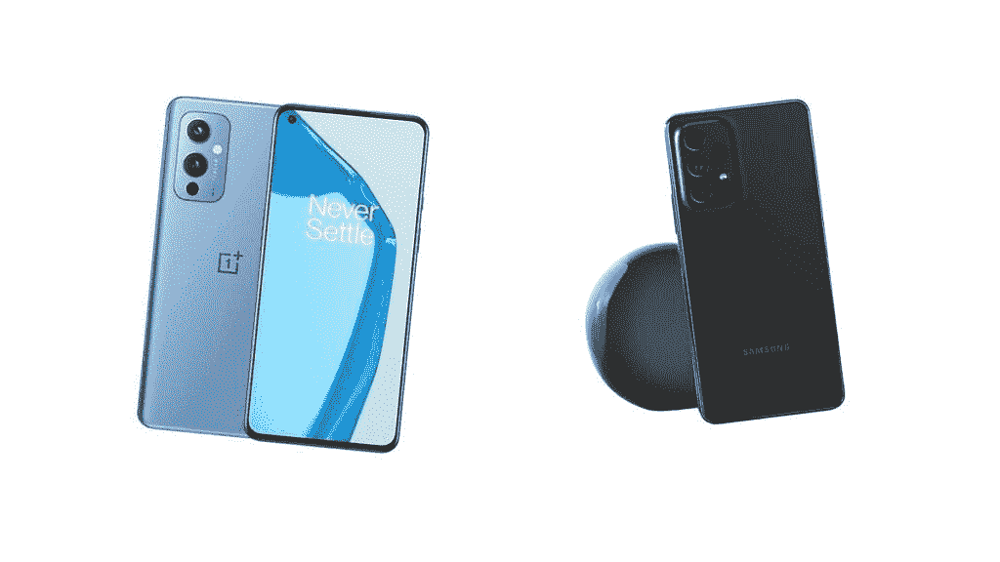
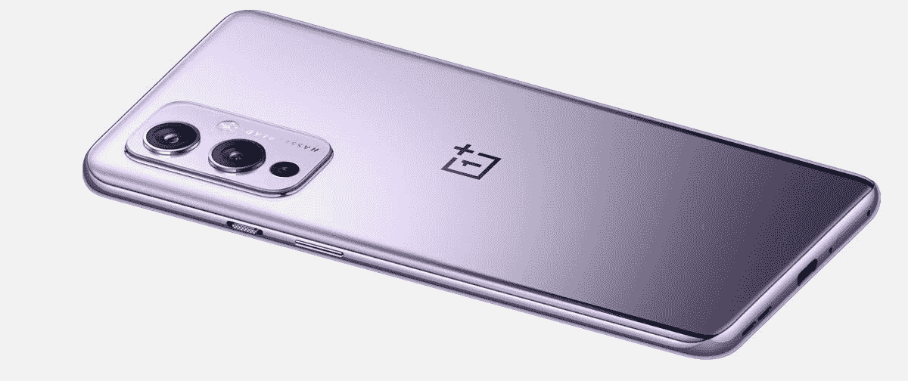
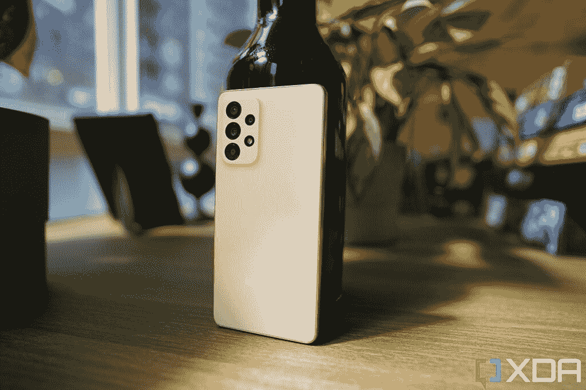
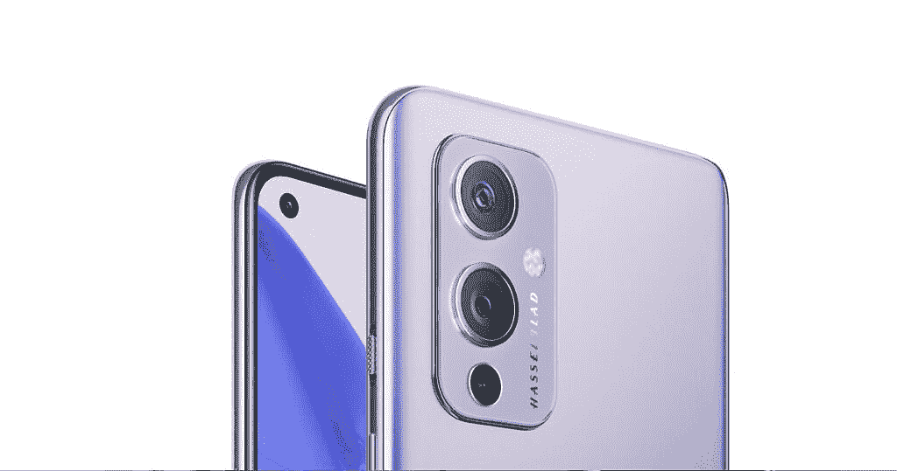

# Galaxy A53 5G vs 一加 9:2022 年的中端安卓能打败 2021 年的旗舰安卓吗？

> 原文：<https://www.xda-developers.com/samsung-galaxy-a53-5g-vs-oneplus-9/>

在市场上寻找一款具有沉浸式屏幕的强大 Android 手机，但不想支付 2022 年的旗舰价格？购买一代旧旗舰或当前的中端设备是一种选择，可以节省一些钱，同时仍然可以获得一部好手机。今天，我们来看看三星 2022 年的中端产品 [Galaxy A53 5G](https://www.xda-developers.com/samsung-galaxy-a53-5g-hands-on/) ，看看它与[一加 9](https://www.xda-developers.com/oneplus-9-camera-review/) 相比如何，后者是一款 2021 年的旗舰产品，今天仍然非常强大。

 <picture></picture> 

OnePlus 9 (left) and Samsung Galaxy A53 (right).

 <picture></picture> 

Samsung Galaxy A53

##### 三星 Galaxy A53 5G

三星的 Galaxy A53 5G 是一款非常不错的中端智能手机，屏幕很棒，主摄像头也很扎实。

 <picture></picture> 

OnePlus 9

##### 一加 9

一加 9 是一款速度很快的 2021 旗舰产品，今天仍然表现很好。

**浏览这篇文章:**

## 三星 Galaxy A53 5G vs 苹果 iPhone 11:规格

|  | 

三星 Galaxy A53 5G

 | 

一加 9

 |
| --- | --- | --- |
| 建设 | 

*   塑性体
*   大猩猩玻璃 5 前面板
*   IP67 防水/防尘

 | 

*   塑性体
*   大猩猩玻璃 5 前面板
*   IP68 防水/防尘等级

 |
| 尺寸和重量 | 

*   159.6 x 74.8 x 8.1mm 毫米
*   189 克

 | 

*   160 x 74.2 x 8.7 毫米
*   192 克

 |
| 显示 | 

*   6.5 英寸 Super AMOLED
*   120 赫兹刷新率
*   1080 x 2400 像素

 | 

*   6.55 英寸有机发光二极管
*   120 赫兹刷新率
*   1080 x 2400 像素分辨率

 |
| 社会学 |  |  |
| RAM 和存储 | 

*   6GB/8GB 内存
*   128GB/256GB 内部存储
*   microSD 卡插槽(最高 1TB)

 | 

*   8GB/12GB 内存
*   128GB/256GB 内部存储
*   没有 microSD 卡插槽

 |
| 电池和充电 | 

*   5000 毫安时电池
*   25W 超级快充
*   盒子里没有充电器
*   没有无线充电

 | 

*   4，500 毫安时电池
*   65W 快速充电
*   盒子里的充电器
*   Qi 无线充电

 |
| 安全性 | 

*   光学显示器内指纹传感器

 | 

*   光学显示器内指纹传感器

 |
| 后置摄像头 | 

*   64MP/1.8 主屏幕(带 OIS)
*   12MP/2.2 超宽
*   5 百万像素/2.4 英寸深度传感器
*   5MP/2.4 宏

 | 

*   48MP，1.8 英寸(带 OIS)
*   50MP/2.4 超宽
*   2MP，f/24 单色

 |
| 前置摄像头 |  |  |
| 港口 | 

*   USB 类型-C
*   没有耳机插孔

 | 

*   闪电
*   没有耳机插孔

 |
| 连通性 | 

*   5G
*   长期演进
*   wi-Fi 802.11 a/b/g/n/AC(2.4G+5 GHz)
*   蓝牙 5.1

 | 

*   5G
*   长期演进
*   Wi-Fi 802.11 a/b/g/n/ac/6
*   (2.4G+5GHz)
*   蓝牙 5.0

 |
| 软件 |  |  |
| 价格 |  |  |

## 三星 Galaxy A53 5G vs 一加 9:设计和硬件

一加 9 和 Galaxy A53 5G 都提供 120Hz，2400 x 1080 有机发光二极管显示屏，由最小的边框包裹，只有一个自拍相机的打孔。至于背面设计，两款手机都使用塑料背面，但 Galaxy A53 有一种独特的涂层，使其感觉握持感和哑光感，而不是一加 9 的轻微粘性塑料感。尽管如此，你可能还是想在 Galaxy A53 和[一加 9](https://www.xda-developers.com/best-oneplus-9-cases/) 上放一个[保护套。](https://www.xda-developers.com/best-samsung-galaxy-a53-cases/)

两款手机的尺寸和重量相似，但 Galaxy A53 的机箱更平，没有一加 9 中背板的微妙弯曲，因此感觉更像盒子。

这两款手机的屏幕看起来一样好，而且这两款手机都有立体声扬声器，它们是很好的媒体消费机器。

### 处理器

Galaxy A53 5G 采用三星的 5 纳米 Exynos 1280，而一加 9 则采用骁龙 888。前者是 2022 年的中端芯片，而后者是 2021 年的旗舰芯片，尽管已经有一年的历史，骁龙 888 仍然是一个更好的表现者。它在基准测试中得分更高，但更重要的是，一加 9 在现实世界的使用场景中感觉更快。Galaxy A53 5G 并不慢，但它不能像一加 9 那样快速移动。例如，在一加 9 上打开相机应用程序是即时的，而在 Galaxy A53 上要等一会儿。如果我们必须选择，我们肯定更喜欢骁龙 888 而不是 Exynos 1280。

### 摄像机

 <picture></picture> 

The Galaxy A53's camera system is solid but unspectacular.

两款手机都有非常好的主摄像头，但也觉得有必要在摄像头总数上增加无意义的传感器。Galaxy A53 的主 6400 万像素摄像头具有快速光圈，并使用像素宁滨技术来进一步提高图像保真度。同时，一加 9 有一个 4800 万像素的摄像头，有一个更大的 1/1.43 英寸的图像传感器(同时也使用像素宁滨技术)。结果是两个相机都拍出了不错的照片，但一加 9 在光线很暗的情况下更好一些。

转到超宽射手，Galaxy A53 使用 12MP f/2.2 传感器，具有 123 度的扫描视野，相比之下，一加 9 的超宽为 48MP。对于一加来说，这是一场明显的胜利，因为 Galaxy A53 的超宽在细节上非常柔软，在晚上很挣扎。

最后，Galaxy A53 有一对用于微距和深度的 5MP 传感器，两者都没有太大作用。一加也好不到哪里去，因为它的第三个摄像头也是一个几乎无用的单色传感器。

 <picture></picture> 

The OnePlus 9 has a very good main camera and a solid ultra-wide camera. The monochrome sensor is a bit pointless, however.

### **电池和其他部件**

尽管厚度为 8.1 毫米，Galaxy A53 5G 仍设法在内部塞进了 5000 毫安时的电池，这对这种类型的设备来说足够大了。相比之下，一加 9 的 4500 毫安时电池要小得多，我们绝对可以看到电池寿命的差异。虽然这两款手机在轻度使用的日子里都很好，但在周末，Galaxy A53 仍然可以坚持整整 12 个小时，而一加 9 则无法到达终点。

但是一加 9 可以在 65W 的速度下非常快地充电(29 分钟内 0-100%)，并且包括充电砖。Galaxy A53 根本不包括充电器，而且它的最大充电功率仅为 25W，需要一个多小时才能充满手机。

两款设备都有立体声扬声器；Galaxy A53 的防水防尘等级为 IP67，而一加 9 的防水防尘等级为 IP68。数量上的差异只意味着一加 9 号可以在水中浸得更久一点。

## 三星 Galaxy A53 5G 与一加 9:软件和性能

Galaxy A53 5G 运行 Android 12，顶部是三星的 OneUI 皮肤。一加 9 是在一年前发布的，运行的是现成的 Android 11，覆盖了一加的 OxygenOS。然而，这款手机已经在许多地区更新到了 Android 12，包括 [T-Mobile 版本](https://www.xda-developers.com/tmobile-oneplus-9-oneplus-9-pro-android-12-oxygenos-12/)，但如果你购买的是解锁手机，则没有保证。此外，一加设备的 Android 12 更新有太多的问题，对许多用户来说，体验随着更新而下降。所以在比较这两款手机的时候也要记住这一点。

正如我在处理器部分已经提到的，一加 9 明显比 Galaxy A53“快”。这种快速既是真实的，也是有形的(一加 9 可以更快地切换相机镜头和模式)和幻觉(OxygenOS 的动画速度更快，似乎比 OneUI 的大多数微妙的动画更快)。Galaxy A53 也容易出现偶尔的动画口吃——这不是一个主要问题，但很明显，这从来没有打算成为旗舰级手机，而一加 9 只是大约 12 个月前的旗舰手机。

骁龙 888 是比 Exynos 1280 更好的硅。对于基本的智能手机使用，如滚动 Instagram 或发送推文，这不是问题。但如果你试图编辑视频，甚至是直接在手机的相机应用程序中修剪长度这样简单的事情，一加 9 会更快地完成这项工作。

同样值得注意的是，Galaxy A53 不能运行三星 DeX，这是三星更高端手机的一个功能，如 [Galaxy S22](https://www.xda-developers.com/samsung-galaxy-s22-review/) 或 [Galaxy Z Flip 3](https://www.xda-developers.com/samsung-galaxy-z-flip-3-review/) 。总的来说，三星的中端手机是一款完美的中端手机，但一加 9 只是稍微好一点。但是有一个主要的警告我们还没有触及...

## 三星 Galaxy A53 5G vs 一加 9:哪个适合你？

那就是价格！Galaxy A53 5G 现在的价格约为 450 美元(有免费的 Galaxy Buds Live，Galaxy A53 的一些交易甚至可以更低)，而一加 9 的价格徘徊在 530 美元左右。这使得在这两款手机之间做出选择变得相当困难，因为这两款手机在各自的方面都非常好。如果你预算有限，也想在预算范围内买一副耳机，那么 Galaxy A53 是物有所值的。您还可以获得三星的可靠性和软件支持，这是一个非常平衡的选择。

另一方面，售价 530 美元的一加 9 也非常不错，尤其是如果你打算在智能手机上玩游戏的话。一加的 Android 更新情况有点问题，但除此之外，它仍然是更好的手机，你必须为这一点支付比 Galaxy A53 5G 略高的费用。

 <picture></picture> 

Samsung Galaxy A53

##### 三星 Galaxy A53 5G

三星的 Galaxy A53 5G 是一款非常不错的中端智能手机，屏幕很棒，主摄像头也很扎实。

 <picture></picture> 

OnePlus 9

##### 一加 9

一加 9 是一款速度很快的 2021 旗舰产品，今天仍然表现很好。