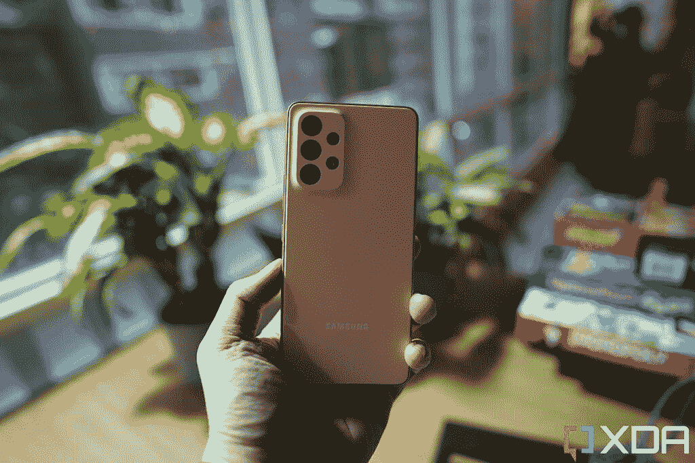
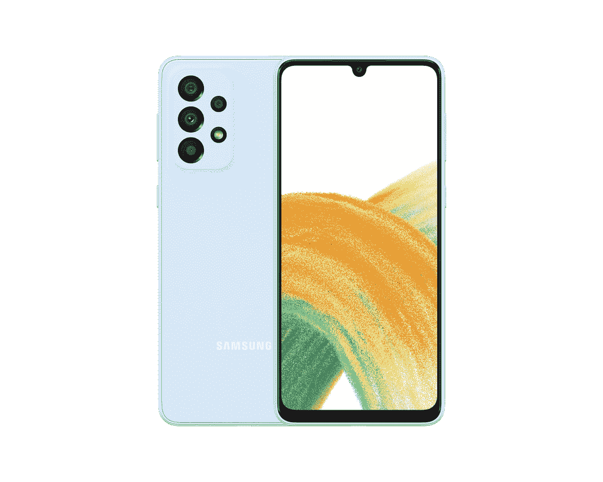

# 三星 Galaxy A53 5G vs 三星 Galaxy A33 5G:买哪个？

> 原文：<https://www.xda-developers.com/samsung-galaxy-a53-5g-vs-samsung-galaxy-a33-5g/>

三星 Galaxy A 系列的最新产品 Galaxy A53 5G 和 Galaxy A33 5G 使其成为中端市场的有力竞争者。Galaxy A53 5G 是两款设备中较好的一款，它的售价为 450 美元，看起来是一个非常好的整体包装。正如我们在 [Galaxy A53 5G 实践](https://www.xda-developers.com/samsung-galaxy-a53-5g-hands-on/)中提到的，它在美国是一个很好的中端选择，并与[苹果 2022 年的 iPhone SE 型号](https://www.xda-developers.com/apple-iphone-se-3-review/)相抗衡。另一方面，Galaxy A33 5G 是一个稍微精简的版本，在纸面上仍然很有吸引力，尤其是其要价。

Galaxy A33 5G 没有进入美国，这意味着如果你在美国购买这些手机，你只能购买 Galaxy A53 5G。但对于那些在美国以外购物的人，或者那些只是对这两款手机之间的差异感到好奇的人，这里有一个快速的比较，以找出它们之间的差异。

**浏览这篇文章:**

## 三星 Galaxy A53 5G 与三星 Galaxy A33 5G:规格

在我们开始比较之前，让我们快速浏览一下规格表，看看这些手机在纸面上是什么样的:

| 

**规格**

 | 

**三星 Galaxy A53 5G**

 | 

**三星 Galaxy A33 5G**

 |
| --- | --- | --- |
| **构建** | 

*   塑性体
*   大猩猩玻璃 5 前面板
*   IP67 防水/防尘

 | 

*   塑性体
*   大猩猩玻璃 5 前面板
*   IP67 防水/防尘

 |
| **尺寸&重量** | 

*   159.6 x 74.8 x 8.1mm 毫米
*   189 克

 |  |
| **显示** | 

*   6.5 英寸 Super AMOLED
*   120 赫兹刷新率
*   康宁大猩猩玻璃 5

 | 

*   6.4 英寸 Super AMOLED
*   90Hz 刷新率
*   康宁大猩猩玻璃 5

 |
| **SoC** |  |  |
| **风筒&储存** | 

*   6GB/8GB 内存
*   128GB/256GB 内部存储
*   microSD 卡插槽(最高 1TB)

 | 

*   6GB/8GB 内存
*   128GB/256GB 内部存储
*   microSD 卡插槽(最高 1TB)

 |
| **电池&充电** | 

*   5000 毫安时电池
*   25W 超级快充
*   不含充电器

 | 

*   5000 毫安时电池
*   25W 超级快充
*   不含充电器

 |
| **安全** |  | 指纹传感器 |
| **后置摄像头** | 

*   64MP f/1.8 Main(带 OIS)
*   12MP f/2.2 超宽
*   5MP f/2.4 深度传感器
*   5MP f/2.4 微距

 | 

*   48MP f/1.8 Main(带 OIS)
*   800 万像素 f/2.2 超宽
*   5MP f/2.4 深度传感器
*   2MP f/2.4 微距传感器

 |
| **前置摄像头** | 32MP f/2.2 | 1300 万像素 f/2.2 |
| **端口** | 

*   USB 类型-C
*   没有耳机插孔

 | 

*   USB 类型-C
*   没有耳机插孔

 |
| **音频** |  |  |
| **连通性** | 

*   5G
*   长期演进
*   wi-Fi 802.11 a/b/g/n/AC(2.4G+5 GHz)
*   蓝牙 5.1

 | 

*   5G
*   长期演进
*   wi-Fi 802.11 a/b/g/n/AC(2.4G+5 GHz)
*   蓝牙 5.1

 |
| **软件** | One UI 4.1(安卓 12) | One UI 4.1(安卓 12) |
| **其他特性** | 

*   四年的重大操作系统升级
*   五年的安全更新

 | 

*   四年的重大操作系统升级
*   五年的安全更新

 |

从规格来看，可以肯定地说，它们在整体封装方面非常相似。唯一的区别在于显示和相机部门，我们将在下面的章节中详细讨论。

## 设计和制造质量

Galaxy A53 5G 和 Galaxy A33 5G 在设计和制造质量方面有很多共同点。它们都有塑料机身，正面有大猩猩玻璃 5 以保护显示屏。背部设计也非常相似，两者都有相同的纹理背板。整体外形相同，差异可以忽略不计。两款手机的厚度都是 8.1 毫米，但 Galaxy A53 5G 比 Galaxy A33 5G 的 186 克轻了几克，只有 189 克。

 <picture></picture> 

Samsung Galaxy A53 5G

如果从正面看，两者略有不同。Galaxy A33 5G 的正面挡板略大，显示屏底部的下巴明显更大。A33 5G 也有一个自拍相机的泪珠凹口，而不是 A53 5G 上看到的打孔切口。这不一定是一个交易破坏者，因为你最终会很快习惯前面的设计。但如果我们要选择一个，那么我们会选择 Galaxy A53 5G，主要是因为它从正面看起来更干净、更现代。

在耐用性方面，Galaxy A53 5G 和 Galaxy A33 5G 都具有 IP67 等级的防尘防水性能，这意味着它们可以同样地防止偶尔溅出的水和灰尘。它们都在底部有一个 USB Type-C 端口，但遗憾的是，这两款手机都没有耳机插孔。当谈到旗舰机时，缺少耳机插孔可能不是一个交易破坏者，但它肯定是这个细分市场中许多用户错过的东西。在我们的书中，这两款设备在比较中倒退了一步，因为它们的前辈都有 3.5 毫米耳机插孔。

不过总的来说，我们认为 Galaxy A53 5G 和 A33 5G 的设计和制造质量都非常好。A53 5G 看起来更现代，但它们都是这一细分市场中最好看和最好造的手机。

## 显示

Galaxy A53 5G 在两个关键领域优于 Galaxy A33 5G，其中之一是显示屏。首先，Galaxy A53 5G 的显示屏略大，为 6.5 英寸。Galaxy A33 5G 配备了 6.4 英寸的面板。这不是一个巨大的差异，但绝对值得一提。它们都采用了超级 AMOLED 显示屏，所以你可以期待它们在整体质量上不相上下。我们还希望两款手机的分辨率都是 2400 x 1080 像素。这意味着 Galaxy A33 5G 由于尺寸略小，每英寸像素更多，但在清晰度方面，它们实际上是相同的。

Galaxy A53 5G 拥有更高的刷新率面板，最高支持 120Hz。相比之下，A33 5G 的最高频率为 90Hz。这是一个显著的差异吗？不完全是。如果你把它们放在一起比较，你会注意到不同之处，否则就不会了。此外，90Hz 和 120Hz 之间的差异不会像 60Hz 和 120Hz 那样明显。两款手机的显示屏都受到 Gorilla Glass 5 的保护，因此在耐用性方面它们不相上下。A33 5G 的表圈略大，有一个泪珠凹口，而 A53 5G 与相对较薄的表圈和打孔切口相比，看起来更现代。

## 内部硬件

三星在 Galaxy A53 5G 和 Galaxy A33 5G 中都使用了自己的 Exynos 1280 处理器。这是一款在 5 纳米节点上制造的中档八核芯片组。Exynos 1280 具有两个以性能为导向的 Cortex-A78 内核，主频为 2.4GHz，以及高能效的 Cortex-A55 内核，主频为 2GHz。它还与 Mali-G68 GPU 配对来处理图形负载。虽然与 Galaxy A52s 5G 内部的骁龙 778G 相比，这是一个明显的下降，但它对电池寿命来说非常好。由于采用了 5 纳米工艺节点，Exynos 1280 是一款高能效芯片。但由于在这次比较中，两款手机都是由芯片在幕后操控，所以你真的不应该指望会有什么性能差异。

Galaxy A53 5G 和 A33 5G 的基本型号都有 6GB 的内存和 128GB 的内部存储空间。当然，你也可以花更多的钱为这两款手机选择 8GB + 256GB 的配置。我们还想指出的是，即使是 A33 5G 也支持通过 MicroSD 卡进行存储扩展。如果您用完了内部存储空间，您可以在两部手机上添加高达 1TB 的存储空间。

这两款手机都有一个 5000 毫安的电池，支持高达 25W 的快速充电。也就是说，我们预计电池部门会有所不同，因为 Galaxy A33 5G 可能会因其 90Hz 面板而有一点优势。与 A53 5G 的 120Hz 面板相比，它肯定会给电池带来略少的负载。长话短说，5000 毫安时的电池可能会在 Galaxy A33 5G 中持续更长时间。电池寿命将更多地取决于您的日常使用，而不是刷新率。两款手机都不支持无线充电，而且盒子里都没有充电器。

## 摄像机

Galaxy A53 5G 和 Galaxy A33 5G 使用不同的光学系统，因此我们终于有更多的差异可以指出。我们正在查看 A53 5G 的四摄像头设置，其中包括 6400 万像素的主摄像头，12MP 超宽，以及一对 5MP 传感器，用于主系统中的微距和深度。另一方面，A33 5G 装有一个 48MP 主摄像头，一个 8MP 超宽摄像头，一个 5MP 深度传感器，最后是一个 2MP 微距镜头。从表面上看，这两款手机的相机设置都一样通用。A53 5G 只是碰巧在规格表上有稍微好一点的光学元件。在正面，Galaxy A53 5G 配备了 32MP 镜头，而 A33 5G 配备了 1300 万像素的自拍相机。

我们还没有机会对 Galaxy A33 5G 的相机进行测试，但我们有一些使用 Galaxy A53 5G 拍摄的样本。正如我们在[动手片段](https://www.xda-developers.com/samsung-galaxy-a53-5g-hands-on/)中提到的，Galaxy A53 5G 是一个可靠的拍摄者，可以为 Instagram 拍摄一些不错的照片。主摄像头非常好，它还配有一个不错的超宽摄像头。夜间照片不是最好的，但仍是有用的样本。鉴于三星使用了不同的光学系统，很难判断 Galaxy A33 5G 相机设置是否会产生类似的结果。更高的百万像素并不总是意味着更好的图像，但它描绘了一幅美丽的画面，特别是在来自同一制造商的两款手机可能具有相同的相机处理能力的情况下。在视频方面，两款手机都可以以高达 30fps 的速度录制 4K 视频。

一旦我们有机会在一次可靠的相机对决中并排使用它们，我们将尝试在未来重新进行这种比较。不过，就目前而言，在相机部门，我们会选择 Galaxy A53 5G，而不是 A33 5G。

**三星 Galaxy A53 相机样品**

## 三星 Galaxy A53 5G vs 三星 Galaxy A33 5G:你该买哪个？

如果你通读了整个对比，那么你可能已经知道这是一场非常接近的比赛。这两款手机在这次对比中并没有太大的区别。事实上，这场比赛的结果与我们比较 Galaxy A53 5G 和 [Galaxy A52](https://www.xda-developers.com/samsung-galaxy-a52-review/) 机型后得到的结果非常相似。这表明三星在中端市场有大量选择，它们都非常好，并提供非常相似的整体包装，以在各自的地区与任何设备竞争。

三星还承诺为 Galaxy A53 5G 和 Galaxy A33 5G 提供相同水平的软件支持。他们都将收到多达四个主要的 Android 更新和五年的安全更新。事实上，这两款设备都运行三星的 One UI 4.1，这意味着它们在软件方面也有平等的立足点。因此，这一切都归结于价格和可用性的比较结果。

三星 Galaxy A53 5G 的售价为 450 美元，目前在美国已经可以买到。Galaxy A33 5G 尚未在美国正式发布，但在包括英国在内的其他市场上可以买到，价格为 329 英镑，在撰写本文时大约相当于 400 美元。如果你想在美国买一辆中型车，那么 A33 5G 就出局了。你可以选择 Galaxy A53 5G，也可以选择 Galaxy A52 中的一款，这款手机现在仍有售。例如，Galaxy A52s 在美国的价格与 A33 5G 大致相同，但你会得到更好的处理器、显示屏、摄像头等。

这也是那些在美国境外购物的人的普遍结论。三星 Galaxy A53 5G 在几个关键领域击败了 A33 5G，但如果你不需要所有的花哨功能，尤其是如果你发现这些手机很划算，不要回避 A33 5G，甚至是 Galaxy A52 中的一款。

 <picture></picture> 

Samsung Galaxy A53

##### 三星 Galaxy A53 5G

Galaxy A53 以实惠的价格提供了现代设计、大屏幕和电池

 <picture></picture> 

Samsung Galaxy A33 5G

##### 三星 Galaxy A33 5G

三星 Galaxy A33 5G 提供了几乎所有与 A53 5G 相同的功能。在这两款产品中，它也更实惠，但在美国没有。

如果你已经决定购买 Galaxy A53 5G，那么不要忘记访问我们的[最佳 Galaxy A53 5G 交易页面](https://www.xda-developers.com/best-samsung-galaxy-a53-deals/)，看看你是否能在购买上节省一些钱。此外，不要忘记访问我们收集的[最佳 Galaxy A53 5G 保护套](https://www.xda-developers.com/best-samsung-galaxy-a53-cases/)，并获得一个优质保护套来保护您的手机。